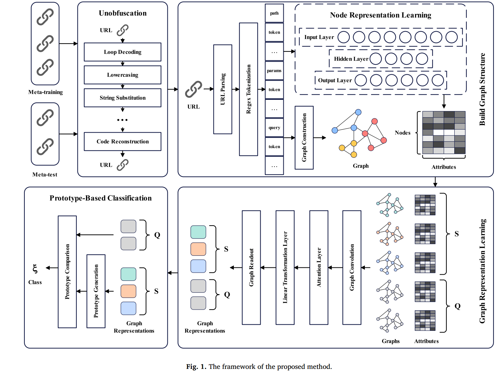
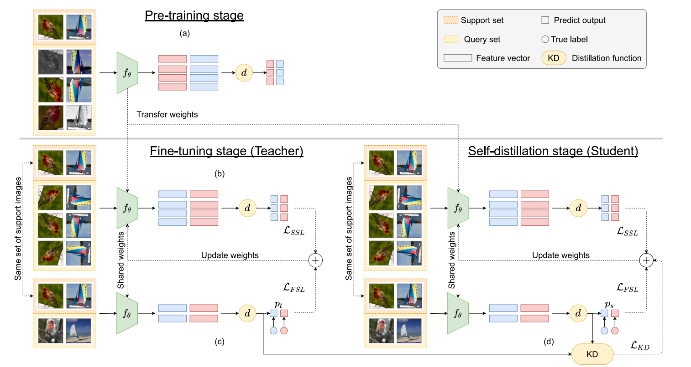
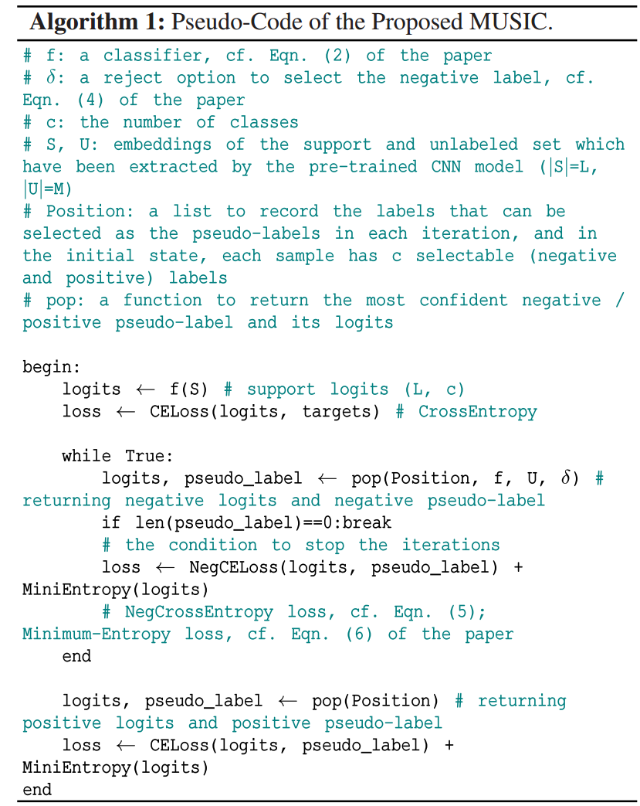
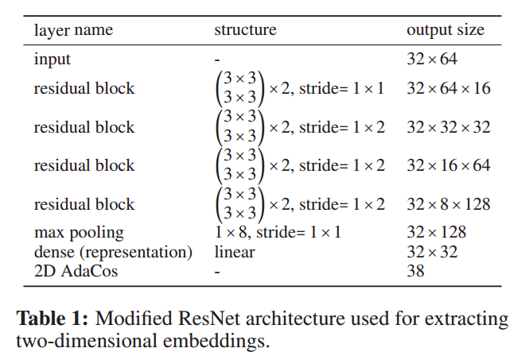

动机，抽象出来的创新点，具体实验做法与细节。汇报可以有重点，但是笔记要全面，从细节处学习自己以前不会的东西。

## A Comprehensive Survey of Few-shot Learning: Evolution, Applications, Challenges, and Opportunities  
>Song Y, Wang T, Cai P, et al. A comprehensive survey of few-shot learning: Evolution, applications, challenges, and opportunities[J]. ACM Computing Surveys, 2023, 55(13s): 1-40.（中科院一区）华师

### Abstract  
FSL作为一种有效的学习方法已经出现并显示出巨大的潜力。尽管最近在处理FSL任务方面有了创造性的工作，但从几个甚至零样本中快速学习有效信息仍然是一个严峻的挑战。在此背景下，我们广泛调查了过去三年中发表在顶级期刊和会议上的200多篇FSL论文，旨在以全新的视角及时全面地概述FSL的最新进展，并对现有工作的优势和劣势进行公正的比较。为了避免概念上的混淆，我们首先阐述并对比了一组相关概念，包括少量学习、迁移学习和元学习。然后，我们创造性地以金字塔的形式提取与few-shot学习相关的先验知识，从挑战的角度对前人的工作进行了详细的总结和分类。此外，为了丰富本调查，我们对每个小节的最新进展进行了深入的分析和有见地的讨论。并以计算机视觉为例，重点介绍了FSL的重要应用，涵盖了各种研究热点。最后，我们总结了对技术趋势和潜在未来研究机会的独特见解，以指导FSL的后续研究。（*笔记：很好，我正需要这样的文章。*）
### Introduction  
- few shot learning 应用场景与挑战  
    
- 在我们的调查中，从先验知识的抽象层面，我们将FSL的工作分为数据层、特征层、任务层和多模态层。与之前关于如何最小化经验风险的讨论不同，我们的调查侧重于先验知识本身，并试图从挑战的角度提炼先验知识的抽象层次。数据层是最底层，主要目的是通过转换度量函数或直接生成新数据来尽可能地增加数据的多样性。特征层是第二层，可以作为数据与相应标签之间的一个领域的基本统计知识。任务层是第三层，它独立于特定的数据和领域，通过定制学习范式来完成从可见任务到不可见任务的映射。最后，多模态层次是FSL中先验知识的最高层次。它可以以一种通用的方式使用多个数据源(包括图像、文本和音频)来解决特定类型的挑战。多式联运有望成为解决FSL问题的最终途径。    
- 相应的，不同层次的先验知识面临多重挑战。在数据层面，数据量过于稀缺，模型仅依靠一个或几个镜头样本无法准确评估真实的数据分布。在特征层面上，使用大规模的基础数据集训练模型。如果基本数据集和支持数据集存在明显的域间隙，则特征层可能学习到不一致的表示空间，从而误导参数更新。在任务层面，元学习高度依赖于网络结构。如果任务分布跨越不同的领域，那么需要关注如何从可见领域的类似任务中获取元知识，以应用于其他领域的不可见任务。多模态层次对FSL具有独特的优势，但如何将多模态知识有效地嵌入到同一空间中仍处于探索阶段。  
- 表2总结了本文中使用的关键缩写词列表。
    
- 我们从边缘计算场景开始，其中出现了FSL挑战，解释和澄清了几个容易混淆的类似概念。这将有助于读者建立少次学习、迁移学习和元学习之间的关系。
- 通过知识图谱，从先验知识本身的角度对外语相关工作进行全面考察。根据先验知识的抽象，我们将FSL工作分为四个层次，其中最高层次为多模态，第一、二、三层分别为数据层、特征层和任务层。
- 我们调查了近三年来足够数量的论文，并总结了涉及广泛基准数据集和任务的FSL的主要成就。值得注意的是，我们还在每个部分的末尾提供了一个前沿的有见地的讨论。
- 最后，针对这些挑战，根据分类，我们讨论了当前FSL发展的热点方向，并在每个潜在领域提出了建议。我们的目的是启发读者如何在现有工作的基础上找到突破，共同推动FSL向更实用的方向发展。

### CONCEPTS AND PRELIMINARIES  
（*笔记：这章是我当前需要的*）
#### what is few shot learning?  
2020年，Wang等人通过机器学习的经验(E)、任务(T)和性能(P)给出了一个标准的定义:**如果计算机程序的性能可以随着P对T的测量而提高，那么它就可以从经验E中学习某些类别的任务T和性能度量P**。值得一提的是，在FSL中，E是非常稀缺的。
>PAC（机器学习概念，大概知道一下就行？）  

参数映射空间受限、优化路径不确定、初始化状态不佳都会导致模型性能不佳。FSL任务通常用N-way-K-shot表示。每个类的样本数量对模型性能有显著影响。随着样本量的增加，模型性能的提高会降低，估计误差对类内方差偏差的敏感性会降低，对类间方差偏差的近似误差会增加。  

**FSL仍然存在许多挑战：**
- 不准确的数据分布评估:在FSL中，由于成本、道德、法律或其他原因，很难标记大量的半监督数据集。仅依靠少数样本可能会在估计真实数据分布时产生偏差，这对某些任务是有害的。在数据层，最大限度地探索具有稀缺信息的数据分布是最大的挑战。
- 特征重用敏感性:迁移学习通过积累大规模的数据标签领域知识，通过预训练模型轻松获得特征级先验知识。然而，就跨域FSL而言，预训练的特征提取器没有足够的泛化能力，导致对看不见的任务产生误导。
- 未来任务的通用性:以元学习和情景训练为代表，任务级方法可以实现数据和任务的双重采样，并尽可能快地从可见任务映射到未见任务。然而，元学习最近被证明只有在训练和测试任务足够相似的情况下才有效。此外，元学习高度依赖于现实世界中各个领域的网络结构。
- 多模态信息融合的有效性:多模态学习可以与图像、文本和音频等环境进行交互。将图像嵌入与文本向量相结合，显示出较强的通用性。参数化多模态预训练模型可以很容易地处理各种下游任务。然而，如何以最小的损失将文本、图像和其他信息嵌入到同一空间中仍然是多模态FSL的核心挑战。
#### How Does Few-shot Learning Relate to Traditional Machine Learning?  
近年来，FSL的研究得到了广泛开展，并取得了重大进展。图3显示了与FSL相关的论文发表和引用统计。2014 - 2017年，每年发表数不超过50篇。在此期间，几乎所有的工作仍然集中在预训练和微调上。自2018年以来，随着度量学习和元学习情景训练的出现，基于**度量学习**和**元学习**的各种基线完成了大量工作，并在FSL中取得了具有竞争力的表现。截至目前，5-way-1-shot任务在mini-ImageNet少射分类任务中准确率达到95.3%，5-way-5-shot任务准确率达到98.4%。图5提供了一幅涵盖FSL领域热点研究课题和前沿发展的知识图谱，包括但不限于**零次学习、一次学习、迁移学习、元学习、多任务学习**等。请注意，以绿色为主色的计算机视觉是最活跃的研究领域。  
  
  
#### How Does Few-shot Learning Relate to Transfer Learning?  
迁移学习模仿人类大脑的思维过程;这样，在解决了一个问题之后，当新的相关问题出现时，就会生成一个更好、更快的解决方案。与迁移学习相比，有限的训练数据、领域变化和任务修改使FSL更具挑战性。FSL有很多变体，包括单次学习(OSL)、零次学习(ZSL)和跨域少次学习。这些变体在样本大小和领域学习方面被认为是迁移学习的特殊情况。  
#### How Does Few-shot Learning Relate to Meta Learning?  
元学习是一种提供情景训练的通用范例。图6展示了元学习中涉及的三步训练。它的重点是在先验知识的帮助下提高对未知任务的泛化。如果使用先验知识来帮助模型学习特定的任务，那么元学习可以被视为FSL的一种变体。元学习并不等同于FSL。FSL更多的是一个最终目标，旨在实现健壮的表示，而不依赖于大规模数据集。通过对数据和任务空间的双重采样，元学习可以构建大量与未见任务相关的辅助任务。即使有些工作不涉及元学习，如果可以考虑情景训练，如元强化学习、元视频检测等，也有可能提高性能。  
然而，元学习也有其局限性:当训练任务和测试任务存在明显的领域差距时，元学习很少初始化参数权值。此外，元学习高度依赖于网络的结构，需要重新设计以适应各种不同的任务。尽管如此，元学习仍然是解决FSL问题最有效的方法之一。
#### Dataset  
主要是视觉和NLP的，不记录了。  

#### Taxonomy  
根据先验知识的模态，FSL工作可以明确地分为单模态学习阶段和多模态学习阶段。在单模态学习阶段，我们的调查进一步抽象了数据、特征和任务级别的先验知识。图7以金字塔的形式生动地展示了先验知识抽象下的FSL分类。  
  
- 数据级:数据级主要是通过增加特征或样本的数量来评估真实的数据分布。最直接的方法是基于语义空间生成附加数据，或者对相似的辅助标注数据集进行标注。对于半监督数据集，对比学习和潜在增强是有效的表征框架。
- 特征级:特征级主要用于构建从支持集到查询集的数据到标签的映射。良好的特征嵌入是提取判别表示的关键。大多数的预训练和微调工作都需要有效的规范化。此外，如果最大化预训练模型的保留参数，那么提示调优通过向模型提供一些手动提示，在很大程度上打破了数据的约束。
- 任务级:任务级主要用于细化任务空间中的参数，包括模型参数和元学习参数。与多任务学习不同，元学习试图在不扩展学习参数或牺牲推理效率的情况下从相关任务中学习先验知识。元学习、度量学习和图神经网络是这一过程中的主要方法。
- 多模态级:多模态级使文本、视觉和其他信息能够以最小的损失嵌入到同一空间。在语言模型的帮助下，图像也可以以补丁的形式嵌入。多模态学习包含了丰富的知识，使得FSL进入了多模态大模型+小样本的领域。

### DATA LEVEL: EVALUATE THE TRUE DATA DISTRIBUTION WITH MAXIMUM PROBABILITY  
为了解决数据稀缺的问题，一个直接的方法是增加可用样本的数量。在我们的调查中，我们继续遵循先验知识水平的抽象，并将数据增强细分为Data Expansion和Feature Augmentation。

为了最大限度地评估FSL设置的真实数据分布，出现了几个假设。当训练域和测试域相似时，利用训练域的均值和方差在测试域中生成一个合理的数据范围。当训练域和测试域不够相似时，一种方法是从测试域引入未标记的数据集，另一种方法是学习训练域的类内或类间方差，以原始数据为基础生成或变换新样本。表4总结了不同维度上的方法，包括是否使用了查询集，以及是否使用了额外的标记或未标记数据。表5在数据级别上提供了代表性方法的公平性能比较，其中基于主干将方法分为两组，并根据5-way-1-shot任务的正确率从高到低进行排名。从表4和表5可以看出，使用辅助数据集比不使用辅助数据集更有效，特征增强通常比数据扩展更有效。在未来，FSL数据增强将继续朝着更一般化和更有效的方向发展。
#### Data Expansion  
伪标签等，我觉得我应该做的不是这方面？  
#### Feature Augmentation  
看不懂  

### FEATURE LEVEL: BUILDS DATA-TO-LABEL MAPPINGS FOR SPECIFIC PROBLEMS  
深度学习模型表示特征的能力远远超出了拥有大规模数据集和强大计算能力的人类。FSL利用特征知识在不同程度上共享预训练参数，并重新定义下游任务。在本节中，按照先验知识的方向，我们总结了迁移学习和多任务学习的相关工作。图10显示了FSL中迁移学习的范例，包括微调和提示学习。  
基于特征层次的FSL是一个广泛的研究方向。事实上，特征提取器的选择是特别重要的。一个好的特征提取器可以从少量样本中提取判别信息。在此基础上，在现实中存在多个相似任务的情况下，多任务学习可以更好地指导模型参数的更新。当然，如果相关任务很难收集，那么微调也是一个不错的选择。总之，有两种主要的微调范式:预训练和提示学习。其中，快速学习比微调保留了预训练模型对每个任务更好的能力。

在这个过程中，对比学习摆脱了标签，从数据本身学习到更丰富的知识。注意，对比学习需要足够的计算资源。表8以一种公平的方式比较了特征级代表性方法。由于提示学习实验不涉及mini-ImageNet，所以这里不包括比较。对于小容量网络，多任务学习比微调有一定的优势，对于大容量网络，微调有一定的优势。许多工作表明，即使只使用微调，大多数FSL任务也可以很好地解决。在未来，对比学习与多任务学习和微调相结合将是一个热门的探索方向。  
#### transfer learning  

#### Multitask Learning  

### TASK LEVEL: DERIVE META-KNOWLEDGE TO TARGET TASK MAPPINGS INDEPENDENT OF SPECIFIC PROBLEMS  
任务级不同于数据级和特征级，它对数据和任务进行双重采样，提取元知识。元知识独立于具体问题，在任务空间中寻找最优参数。从广义上讲，任务层学习优化参数，生成度量函数，总结知识转移。其中，学习优化参数还包括元学习参数的优化和现有模型参数的优化;生成度量算法包括特征嵌入、基于外部记忆、度量学习、图神经网络和其他基于相似性的算法。  
任务级先验知识涵盖了所有学习到学习的方法，包括学习优化参数和学习度量函数。具体来说，这项工作涉及度量学习、迁移学习、元学习、基于模型的记忆、嵌入学习、图神经网络等等。学习元学习参数可以在很大程度上为未见任务获得良好的初始化。当然，一些算法通过细粒度的域转移规则获得更好的结果。

然而，就计算资源而言，这是一个相当大的挑战。表10比较了具有代表性的元学习方法，其中基于maml的方法[133,146]进一步优化了内环和外环，在少拍分类任务上取得了新的结果，基于新指标的方法[186,188]与基于余弦相似度[204]和欧氏距离[174]的方法相比有了很大的改进
  

#### Learning Optimization Meta-learned Parameters  
  

#### Learning Metric Algorithm  
学习度量算法的目的是学习一种映射，计算支持查询对之间的抽象距离。在参考文献[168,169]中，度量学习作为元学习的一个单独章节提出。一般来说，度量学习也可以被看作是一种相似性度量的学习，它整合了学习如何学习的思想。表9总结了关于FSL度量学习的大量工作。  
  

## Improving Small Footprint Few-shot Keyword Spotting with Supervision on Auxiliary Data  
>InterSpeech 2023 高通  

### 创新点   
构建数据集，使用辅助数据进行多任务监督学习，来提高模型性能。

### Abstract  
Few-Shot KWS(FS-KWS)模型通常需要大规模的标注数据集来泛化到未知的目标关键字。然而，现有的KWS数据集规模有限，收集类似关键字的标记数据是一项昂贵的工作。为了缓解这个问题，我们提出了一个框架，该框架使用易于收集的、未标记的读语音数据作为辅助源。自监督学习已被广泛用于从未标记数据中学习表征;但是，已知它适用于具有足够容量的大型模型，而不适用于训练占地面积小的FS-KWS模型。相反，我们自动注释和过滤数据，以构建一个类似关键字的数据集LibriWord，从而对辅助数据进行监督。然后，我们采用多任务学习，帮助模型增强域外辅助数据的表示能力。在FS-KWS基准测试中，我们的方法显著提高了竞争方法的性能。  

### Motivation  
当前few-shot KWS主要使用大规模带注释的训练数据集来利用相关任务或类似数据分布中的先验知识，但是，开源的KWS数据集数据量小，类别少。希望可以通过使用量更大的ASR数据集，或者大规模未标记数据集，帮助模型学习更健壮的嵌入空间。但是自监督训练对大模型效果较好，对于小模型效果较差。文章使用单词提取技术自动标注阅读语音数据，并通过过滤和平衡数据构建一个组织良好的类似关键字的数据集LibriWord，有效地实现了辅助数据在轻量级模型上的监督使用。  
  

### few-shot KWS  
少射关键字定位(FS-KWS)旨在支持需要用户定义关键字的系统。与传统的关键字识别不同，FS-KWS涉及一个场景，在这个场景中，在训练期间没有看到的新关键字被注册并在设备上进行测试。为了实现FS-KWS，在预训练阶段使用大规模数据集学习鲁棒表示是至关重要的。我们提出利用阅读语音域的辅助数据以及有监督的多任务学习策略，目的是训练轻量级模型。最近，D-ProtoNets[15]被提出用于少量的开集关键字识别，这涉及到测试时间的开集类。我们提出的方法除了提高闭集性能外，还有望提高开集性能，因为它有助于创建鲁棒表示。  

### Method  
为了有效地利用域内命令类数据和域外辅助数据，我们提出了一个简单但有效的多任务学习(MTL)框架，称为AuxSL，它为域外数据合并了一个带有监督损失函数的附加分类器。AuxSL使模型能够增强域外辅助数据的表示能力，同时主要学习域内数据的关键字表示。如图(c)所示，结合两个数据集并对整个数据集应用单个损失函数的朴素方法导致性能提高有限。我们提出的框架通过在FS-KWS基准上的大量实验进行了评估，证明了其优越的判别能力。在图(d)中，结果显示，与基线相比，使用5次样本时，在封闭和开放设置下，相对改善了16%。

#### problem definition  
在few-shot KWS领域，基于度量学习的技术主要用于构建鲁棒嵌入空间，使模型能够提取未见关键字的判别嵌入，并使用距离度量执行关键字检测。最流行的基于度量学习的方法之一是ProtoNets。  
尽管少数镜头学习取得了成功，但需要大规模的数据集来学习鲁棒的嵌入空间。对于关键字识别，数据集通常具有有限的大小，因此很难学习通用的关键字表示。虽然收集域内命令类数据是创建鲁棒嵌入空间的有效方法，但获取此类数据集具有挑战性。为了解决这个问题，我们建议使用易于获取的辅助数据，特别是读语音数据。  

#### LibriWord  
我们没有收集人工标记的关键字识别数据，而是创建了一个名为LibriWord的数据集，其中包含分段的话语和相应的词级标签。样本来自librisspeech语料库[16]，该语料库包含大约1000小时的16kHz阅读英语语音。它包含许多单词，但缺乏单词级别的对齐，只提供话语级别的转录。为了获得词级分割样本，我们使用了Montreal Forced Aligner[32,26]，这是一种之前在[7,33]中使用的词提取技术。然后，我们通过基于样本数量组织提取的单词并消除相似的关键字来形成一个平衡的数据集。具体来说，**当一个词与另一个词部分重叠时，比如过去式、复数形式或否定形式，我们随机保留其中一个，以简化小模型的表示学习过程。**结果，LibriWord为每1000个出现频率最高的关键词包含了300个样本。表1分别给出了细化过程之前和之后的元数据。libword是一个比librisspeech更小的数据集，使用它学习可以减少收集辅助数据的负担，节省存储空间，同时获得更好的性能。  
  

#### FS-KWS with Auxiliary Supervision on LibriWord  
我们提出了一个简单但有效的多任务学习框架，称为AuxSL，它为域外辅助数据使用了一个额外的分类器和监督损失函数，以减轻在域内和域外数据之间直接共享特征提取器时可能出现的潜在表示偏差，我们的多任务学习目标计算为$L_{AuxSL} = L_{FSL} + \lambda L_{SL}$  
$L_{FSL}$表示域内训练数据上的任意少次学习损失函数，$L_{SL}$表示域外辅助数据上的监督损失函数。λ是辅助损耗的平衡参数。在这里，我们在域内数据上保持度量学习损失，并使用传统的交叉熵损失。这种方法在推理过程中不会产生额外的成本，因为没有使用分类器。  

  

在我们的实验中，我们为$L_{FSL}$使用了D-ProtoNets的虚拟原型损失函数，以有效地处理闭集和开集查询样本。d - protonet使用虚拟原型损失进行训练，虚拟原型损失包含一个专门设计用于表示开放集类的可学习的开放集原型。在N+1分类任务中，将开集原型与类智能原型联合训练，使闭集和开集的查询样本与其对应的原型紧密关联。在推理过程中，如果查询测试样本$x_t^q$属于开集类N+1，即$p_θ(y=N+1|x_t^q)$的概率超过预定义的阈值，则验证其为开集类。

### Experiment  
#### experimental set  
- 数据集:
    我们在Google Speech Commands (GSC)数据集上使用标准基准splitGSC来完成关键字识别任务。splitGSC包含训练、验证和测试分割，设计用于少量的闭集和开集关键字识别。分割包括15、10和10个关键字，分别用于训练、验证和测试，分别有24,400、4,007和4,482个样本。请注意，静默类别包含在所有集合中。使用GSC提供的官方背景噪声，其概率为0.8。参见[ProtoNets](https://www.isca-archive.org/interspeech_2022/kim22h_interspeech.html)了解更多细节。  
- 实现：
  我们使用了三种不同的小足迹骨干模型，BC-ResNet8和Res12，它们都以40维对数梅尔谱图作为输入，窗长为30 ms，帧移为10 ms，而DS-ResNet18则以40维梅尔频率倒谱系数特征作为输入。BCResNet8、Res12和DS-ResNet18的网络大小分别为321k、8M和72k。每个模型都使用Adam优化器训练100个epoch，初始学习率为0.001，每20个epoch逐步衰减0.5倍。每个epoch由500个集组成，每个集包含5个封闭类和5个开放类，每个类有5个支持样本和5个查询样本。对于多任务学习，我们在情景迭代中使用64个并行采样的批处理大小，并将λ设置为1.0。作为一个附加模块，我们使用1-FC层作为分类器。为了评估训练好的模型，我们在测试时使用了1000集，每个类(包括开放集类)有1或5个支持样本和15个查询样本。我们报告了在3种不同种子的封闭和开放设置性能下，接收器操作特性(AUROC)下的平均1发和5发精度和无阈值面积。  
#### Analysis of LibriWord Dataset
在下图中，我们给出了从不平衡的librisspeech语料库中提取单词后，使用不同数据集结构进行训练得到的结果，该语料库的样本在单词之间的分布高度偏倚。值得注意的是，在这个实验中，我们只使用最终的MTL架构来研究LibriWord数据集配置的影响。我们的研究结果表明，与使用同样不平衡的数据集或整个librisspeech数据集(大约是libword的16倍)相比，**构建一个每个关键字样本数量平衡的数据集可以获得更好的性能**。在训练过程中，每个关键字使用平衡数量的数据有助于构建稳健的特征嵌入。  
  

#### SSL和SL辅助数据处理方法的比较（等下细说）  
在表2中，我们比较了使用自监督学习(SSL)和监督学习(SL)在辅助数据上训练的少量关键字识别模型的性能。基线模型D-Proto在splitGSC上使用SL进行训练，不使用辅助数据。我们评估了三种SSL方法:(1)PreT- big，它使用来自LibriSpeech的大规模预训练特征提取器，只对分类器进行关键字定位微调;(2)PreT，它使用SimCLR和BYOL在LibriSpeech上预训练一个关键字定位模型;(3)MTL with SSL，它在LibriSpeech上使用SSL，在splitGSC上使用SL; (4) MTL with知识蒸馏(KD)，它使用来自大规模预训练特征提取器和splitGSC上的SL的特征蒸馏。我们还评估了三种SL方法:(1)PreT，它使用交叉熵损失(CE)预训练关键字定位模型;(2)ALL，它使用所有数据一起训练模型;(3)AuxSL，我们提出的方法，为每个数据集使用不同的路径。将MTL方法的平衡参数设置为1，并根据验证性能选择所有超参数。  
  
PreT-Big使用torchaudio提供的librisspeech预训练大型特征提取器。相比之下，其他方法使用BC-ResNet8作为特征提取器。 
对于上图：
- 基线是在splitGSC上做D_proto(backbone是BC-RESNET)
- SSL_PreT-big是预训练好的Wav2vec和Hubert模型在splitGSC上做D_proto微调(backbone是预训练大模型)
- SSL_PreT是用SIMCLR或者BYOL做自监督预训练，然后在在splitGSC上做D_proto微调(backbone是BC-RESNET)
  [SIMCLR](https://www.cnblogs.com/BlairGrowing/p/14852361.html)
  [BYOL](http://t.csdnimg.cn/ouCLv)
- SSL_MTL指多任务，在Librispeech上用SIMCLR或者BYOL做自监督，在splitGSC上做D_proto监督训练，损失加在一起，一起反向传播。或者只是蒸馏。（backbone是BC-RESNET）
- SL_PreT用CE在LibriWord上做预训练(几分类啊？)，然后在splitGSC上做D_proto微调。（backbone是BC-RESNET）
- SL_ALL 用LibriWord和splitGSC做D_proto监督训练（backbone是BC-RESNET）
- AuxSL CE在LibriWord上，在splitGSC上做D_proto。多任务训练。

**与使用SSL的PreT不同，使用SL进行预训练可以提高基线的性能，这有助于学习关键字表示。我们观察到，将两个数据集一起用于FS-KWS的ALL方法比SSL更有利于小模型的表示学习，即使在两个数据集之间存在域间隙的情况下也是如此。这种朴素的方法受益于组织良好的类词语音数据，用于关键字表示学习。我们的AuxSL通过MTL框架为辅助数据采用了不同的路径，这使得模型从辅助数据中学习到目标任务的有用信息，从而显著提高了性能。**
#### Self-supervised learning on auxiliary data  
众所周知，自监督学习对于小型模型来说是具有挑战性的，并且我们通过经验证明SSL对于轻量级关键字发现模型也是无效的。尽管有大量的数据增强和超参数调优，但使用SSL和KD的MTL实现的性能改进有限。此外，与基线相比，PreT降低了性能，后者在随机初始化参数上训练模型。在小占用的关键字发现模型中，使用基于ssl的预训练学习不变信息会阻碍关键字表示的创建。在SSL方法中，PreT-Big的性能明显优于基线。然而，PreT-Big使用的是300M大小的大型特征提取器，而其他模型使用的是大约300K大小的BC-ResNet8。  

#### Supervised learning on auxiliary data  
辅助数据的监督学习。与使用SSL的PreT不同，使用SL进行预训练可以提高基线的性能，这有助于学习关键字表示。我们观察到，将两个数据集一起用于FS-KWS的ALL方法比SSL更有利于小模型的表示学习，即使在两个数据集之间存在域间隙的情况下也是如此。这种朴素的方法受益于组织良好的类词语音数据，用于关键字表示学习。我们的AuxSL通过MTL框架为辅助数据采用了不同的路径，这使得模型从辅助数据中学习到目标任务的有用信息，从而显著提高了性能。  

#### Evaluation on Various Architecture and Model Size  
为了评估我们提出的方法在不同架构和模型尺寸上的有效性，我们使用三种不同的骨干架构:BC-ResNet、Res12和DS-ResNet18进行了实验。除了改变主干架构外，我们应用了与第一小节相同的训练和评估设置。如表3所示，我们将竞争方法应用于其他骨干网Res12和DS-ResNet18，但性能改进是微不足道的，与BC-ResNet8获得的结果相似。我们提出的MTL方法优于其他训练策略。

在图4中，我们观察到所有方法的性能，包括基线、SSL和SL，随着特征提取器大小的增加而提高。然而，与基线相比，SSL会降低小型模型(如BC-ResNet1 (9.2K))的性能。值得注意的是，我们提出的应用于最小模型(BC-ResNet1)的AuxSL方法优于其他方法，包括最大模型(BC-ResNet8)。这个结果证明了我们的方法在学习判别表征方面的有效性，即使在资源极低的情况下也是如此。  
  
  

### Discussion and Conclusion  
在本文中，我们通过提出一个利用常用的阅读语音数据作为辅助数据的框架来解决少射关键字识别(FS-KWS)的挑战。我们的方法有两个主要贡献:(1)创建一个组织良好且平衡的关键字数据集LibriWord，以及(2)AuxSL:多任务学习(MTL)，带有额外的分类器，以最小化域内数据和辅助数据之间的域差距。我们的结果表明，创建关键字平衡数据集是训练轻量级关键字识别模型的实用方法。此外，我们通过大量的实验证明了所提出的学习方法的优越性，FS-KWS基准测试的性能得到了提高。虽然我们的方法取得了令人鼓舞的结果，但我们认识到可能存在其他技术来缓解数据集之间的域差异，例如RFN和DSBN。我们把探索和分析这些方法在域内数据和辅助数据之间存在较大域差距的情况下的有效性留给未来的工作。

## Dummy Prototypical Networks for Few-Shot Open-Set Keyword Spotting  
> InterSpeech 2022 高通
### 创新点  
元学习，GSC数据集分割，阈值判断是否为开集。
### Abstract  
关键字定位是在流音频中检测关键字的任务。传统的关键字识别目标是预定义的关键字分类，但越来越多的人关注少数几个关键字识别(按例查询)，例如，给定m个支持样本的n向分类。此外，在现实场景中，可能存在来自意外类别(开放集)的话语，这些话语需要被拒绝，而不是被分类为N个类别之一。结合这两种需求，我们使用一个名为splitGSC的新基准设置来解决少数几个开放集关键字定位问题。我们提出了基于度量学习的情景已知虚拟原型来更好地检测开集，并引入了一种简单而强大的方法，虚拟原型网络(D-ProtoNets)。在建议的splitGSC中，我们的D-ProtoNets与最近的几次开放集识别(FSOSR)方法相比显示出明显的优势。我们还在标准基准测试miniImageNet上验证了我们的方法，DProtoNets显示了FSOSR中最先进的开集检测率。  

### 原型网络(Prototypical Networks)  
[元学习——原型网络(Prototypical Networks)](http://t.csdnimg.cn/LDR1s)

### Motivation  
某些情况下，我们需要进行few-shot open-set recognition (FSOSR) 。FSOSR需要在执行FSL的同时将未知开集与已知类区分开来。

### Introduction  
图1显示了使用FSL方法Prototypical Networks (ProtoNets)时的FSL和FSOSR示例集。在N-way M-shot集中，FSL的目标是正确分类N个在训练期间未见但已知的类，每个类使用M个支持样本。FSL不考虑N类中的开集类。另一方面，FSOSR需要在执行FSL的同时将未知开集与已知类区分开来。FSOSR比传统的OSR更具挑战性，因为基于N个类别的选择，开放集随着剧集的变化而变化(图1底部)。  
  
对于少射开集关键字识别(FSOS-KWS)，我们引入了一个名为splitGSC的基准设置，它是GSC ver2的一个子集。我们的D-ProtoNets在splitGSC中实现了最先进的(SOTA)性能。我们还在广泛使用的FSL基准miniImageNet上验证了D-ProtoNets, DProtoNets在检测开集方面优于其他基准。  

### few-shot learning  
短时学习有三个流行的分支，即适应、幻觉和度量学习方法。自适应方法使模型易于在few-shot状态下进行微调，幻觉方法为数据匮乏的类增加了训练样例。我们的方法与最后一种基于度量的学习方法一致，该方法学习一个度量空间，其中距离度量可以对样本进行分类。特别是我们的方法是在原型网络(Prototypical Networks, ProtoNets)之上设计的。最近，FEAT表明，在FSL中使用set-to-set函数Transformer使支持样本特定于任务是有帮助的。此外，一些方法已经解决了few-shot KWS，但据我们所知，这是第一次介绍了few-shot开放集关键字识别(FSOS-KWS)。

### Method  
#### Notations  
  
$D_{eval}$包含support-set和query-set，这两部分都是训练集中没有的。

#### splitGSC  
这些固定的关键字分割可以防止在试验中由于分割变化而可能出现的性能差异。在分割的顶部，我们添加了特定的类“Silence”，它只能作为背景噪声类包含在开放集中。例如，在一个5-way 5-shot的情节中，我们随机选择5个没有“Silence”的已知职业，**然后从剩下的职业中选择相同数量的开放职业**，包括“Silence”。我们将这个特定的设置命名为拆分谷歌语音命令数据集(splitGSC)。更多细节请参见4.1节。
  

#### Dummy Prototypical Network  
虚拟原型，用来分类未知关键词  
输出为一个原型，输入为其他所有原型。  
  
  
  
  
  

  

#### Multiple Dummies  
  
多个虚拟原型，还是有一点点不理解，并且代码不太清楚怎么弄

### Experiment  
#### dataset  
我们使用谷歌语音命令(GSC)数据集ver2[5]，包含来自2,618个说话者的105,829个话语。首先，使用官方分割(对每个话语文件的名称使用哈希函数)，将数据集拆分为分别具有84,843、9,981和11,005个话语的训练、验证和测试集[5]。然后，我们根据我们的splitGSC分割选择样本，分别得到22,916,3,643和4,074个样本用于训练，验证和测试。然后按照[5]的设置，我们将“Silence”样本按每个分裂类的平均话语数添加到每个分裂中，最后，splitGSC分别有24,444,4,007和4,482个话语用于训练，验证和测试。特别是，我们使用[5]提供的官方测试集并对其应用我们的分割。在训练过程中，我们使用了最小数据增强，这是GSC任务中常用的方法[1,4,5]:以0.8的概率添加GSC提供的官方背景噪声。  

#### backbone  
我们在以前的FSL基准测试中使用了两个广泛使用的主干网，Conv4-64和ResNet12，以及为KWS设计的一个主干网BCResNet8。每个对应于编码器，fϕ，它们的输出尺寸分别为768,512和256，分别适用于Conv4-64, ResNet12和BCResNet-8。Conv4-64最后没有全局平均池化，因此我们得到768维，比它的通道数64大。  

#### Implementation Details  
GSC中的每个话语长度为1秒，采样率为16 kHz。我们使用移码和窗长分别为10和30 ms的40维对数mel谱图的输入特征，如下[4]。我们使用初始学习率为0.001的Adam优化器[28]训练了100个epoch的模型。学习率每20次乘以0.5阶衰减。每个时代包含100个情节，每个情节有5个已知(5-way)和5个开放集类。我们使用5个支持示例(5-shot)，所有类在训练和测试期间分别有5个和15个查询。我们使用少量镜头验证精度的早期停止，并评估具有1000集的训练模型。

我们尽可能简单地设计了虚拟发生器g。

我们使用FC-ReLU-FC的g1，隐藏D = 32。我们对d使用欧几里得距离，并设置超参数λ = 0.1作为默认设置。在训练过程中，对于LCE，最大软温度τn ε =N+1固定为1，γ = 3，即τn +1 = 3。Gumbel softmax中的τ是Eq. 6中从2到0.5退火后的余弦[26]。我们默认使用L = 3个假人。  
#### Baselines  
我们将我们的方法与其他著名的方法进行了比较:ProtoNet [13]， FEAT [17]， PEELER[12]和SOTA FSOSR方法，SnaTCHer[24]基于它们可用的官方实现。为了更好地适应我们的splitGSC，我们做了以下更改。我们在FEAT和SnaTCHer-F中为变形金刚设置了16的隐藏维度。
此外，我们将变压器的辍学率设置为Conv4-64的0.5和0,ResNet-12实验的0.6和0.1。  
### Result  
  
  
#### ablation study  
  

#### Erase undesirable instance discrepancy
最近，[34]显示了将少量镜头模型集中在前景对象而不是图像背景上的重要性。受[34]的启发，我们沿着频率轴使用了一种显式归一化，称为放松实例频率明智归一化(RFN)[35,36]，以减少音频特征中不受欢迎的实例差异。RFN模块操作其输入x和输出λ·LN(x) +(1−λ)·IFN(x)，其中IFN为沿频率轴的实例归一化[37]，LN为放松IFN效应的层归一化[38]。这里我们使用松弛λ = 0.5，并在编码器fφ的输入处应用RFN。我们希望RFN能使模型更专注于关键词，而不是其他差异，比如说话人的身份。表4显示了RFN对不同骨干网的ProtoNet和D-ProtoNet的持续改进。结果表明，消除不期望的实例差异在FSOS-KWS中是非常重要的。

## Mitigating Catastrophic Forgetting for Few-Shot Spoken Word Classification Through Meta-Learning  
> interspeech 2023  

### 创新点  
每batch在所有support set中更新完参数之后，再从所有类别中取一个样本在进行一次更新。以此达到连续学习的效果。  
### Abstract  
我们考虑了在一个模型被逐步引入到新词类的情况下的少量口语单词分类问题。这将发生在用户定义的关键字系统中，其中可以在使用系统时添加新词。在这样一个持续学习的场景中，随着新类别的加入，模型可能会开始错误地分类早期的单词，即灾难性遗忘。为了解决这个问题，我们提出了对模型不可知元学习(MAML)的扩展。在我们的新方法中，每个内部学习循环-模型“学习如何学习”新类-以使用模型已经看到的所有类的存储模板(每个类一个模板)的单个梯度更新结束（***笔记：这段说的是啥，完全看不懂。***）。我们将这种方法与OML (MAML的另一个扩展)在Google Commands和FACC上进行了几次孤立词分类实验。在射击次数和最终类别数量变化的实验中，我们的方法始终优于**OML**。（***笔记：文章仅与OML方法做了对比***）  

### Motivation  
随着添加的单词越来越多，系统可能会开始错误地分类它之前学过的单词——灾难性遗忘的问题。虽然其他研究关注的是少射问题，但所提出的方法并未处理持续学习问题。有应用场景吗，感觉像硬搞出来的动机。（**侧重few-shot持续学习**）  

### Intorduction  
在本文中，我们特别关注通过利用元学习技术来解决少数连续学习问题，其中算法自动学习如何解决连续学习任务。我们特别扩展了与模型无关的元学习(MAML)，这是一种元学习技术，可以优化初始模型权重集，以便它们可以快速更新到新任务。在语音研究中，MAML已经被用于说话人自适应训练和数据高效ASR，但没有用于少量连续单词学习。  
我们提出了一种新的方法:MAML持续学习(MAMLCon)。这种基于MAML的扩展非常简单，但它在少量单词分类方面带来了一致的改进。MAMLCon通过显式地在算法的内循环中对越来越多的新类进行元学习，专门扩展了MAML。在内部循环结束时，MAMLCon还使用为到那时为止看到的所有类存储的模板执行一次更新。由于MAMLCon已经学会了如何持续学习，它能够在测试时有效地完成在元学习中完全看不见的类。  
我们将MAMLCon与MAML的另一个持续学习扩展OML进行比较[13]。在实验中，我们改变射击次数、添加类的步数和最终的单词类数。在所有情况下，简单的MAMLCon扩展在孤立的单词- few-shot分类方面都优于OML

### model agnostic meta learning(MAML, )
[Model-Agnostic Meta-Learning （MAML）模型介绍及算法详解](http://t.csdnimg.cn/zMzlv)  
[狗都能看懂的MAML原理讲解和代码实现](http://t.csdnimg.cn/Kbwg6)  
[狗都能看懂的Pytorch MAML代码详解](http://t.csdnimg.cn/NQ6Wy)  
### online aware meta-learning(OML, 在线感知元学习)
对比方法，不太想看了。  

### MAMLCon  
  
MAMLCon以两种方式扩展了MAML。首先，它将持续学习问题本身表述为元学习任务。其次，它利用先前获得的知识的单个更新步骤。这一步的动机是优化模型，这样就可以使用尽可能小的数据集(每个类一个示例)来保持先前学习过的单词的性能。  

MAMLCon的训练过程如图2所示。举个例子，假设在训练过程中，我们对一个元支持集进行采样，每个元支持集由“hello”、“drop”、“greetings”的五个示例组成。在MAML中，我们将对所有示例进行微调。相反，在MAMLCon的内循环训练阶段，模型首先在“hello”样例上训练T步，然后在“drop”样例上训练T步，然后在“greetings”样例上训练T步。一旦模型在元支持集中的所有示例上进行了训练，就会对每个“hello”、“drop”、“greetings”类使用单个存储的示例执行单个批量权重更新步骤。在外部循环中，元测试集(包含元支持集中所有单词的样本)用于评估模型的性能，并更新原始权重以获得最优权重θ∗。因为在MAMLCon中，模型在训练过程中已经看到了增量学习，所以这些权重被优化以促进少量连续学习。这意味着我们可以在“turn”和“give”上进一步更新模型，而模型在“hello”、“drop”和“greetings”上仍然表现良好。  
**个人理解是每batch在所有support set中更新完参数之后，再从所有类别中取一个样本在进行一次更新。以此达到连续学习的效果。**  
  
### Experiment  
#### Data  
我们使用Flickr 8k音频标题语料库(**FACC**)和**Google Commands v2**数据集进行词分类实验。在FACC的实验中，使用强制对齐将话语分割成孤立的单词，并将具有相同词干的单词分组为单个类。FACC和Google Commands数据集都是分开的，因此具有相同词干的单词不会出现在训练集和测试集中。对于FACC，这导致大约100个唯一的词干可以采样用于持续学习，而对于Google命令有10个唯一的词干。我们将这些茎随机分为测试和训练两部分。在元学习的不同时期，同一个词类将被分配一个不同的整数标签，这样模型就不能在元学习的权重中记忆特定的单词。  
（**如果我在ATC数据上做的话，将语句切分成带标签的单个单词是必不可少的步骤。**）  
#### Model
使用基础模型来进行对比和提升。  
所有单词都参数化为具有delta和delta-delta特征的mel-frequency倒谱系数(MFCCs)。输入项被补零到一致的长度。一个简单的3层二维卷积神经网络被应用于从mfc中提取特征，然后将其输入到一个完全连接的层中，该层被训练以对给定的单词进行分类。我们对OML使用相同的体系结构。Adam优化器用于内环和外环的更新，内环的学习率为0.001，外环的学习率为0.0001。
>Delta特征是基于MFCC特征的一阶差分，表示相邻帧之间的变化率。它可以捕捉到语音信号的瞬时变化，对于声音的快速变化或转折点具有较好的敏感性。而Delta-delta特征则是对Delta特征再进行一次差分，计算相邻帧之间的变化率的变化率。通过计算Delta-delta特征，可以捕捉到语音信号的加速度或二阶变化，更加细致地描述语音信号的动态特性。  

在下面的所有实验中，我们从一组初始单词开始，然后逐渐添加更多的单词类。对于模型学习的初始单词集，我们执行T = 30权重更新，以确保模型的饱和度，以模拟现实世界中拥有训练良好的模型并随后更新它的场景。之后，对于添加到模型中的每一组新类，执行T = 5个更新步骤。在内部循环结束时模板的快速适应步骤中，从支持集中对每个类采样一个示例，并执行一次更新。我们使用一阶MAML算法，该算法忽略了元学习过程的二阶导数;这不会影响性能，同时加快计算速度并降低内存需求。我们采用Learn2Learn软件包来训练OML和MAMLCon.  
#### Evaluation  
我们考虑不同的持续学习场景。所有这些都是从一组初始的少量学习过的单词类开始的:这个初始类的数量被记为CS。然后，我们在每个更新步骤中逐步引入一些额外的单词类型(CA)。一个实验可以用一个简洁的符号来总结:例如N50:CS5:CA5将代表一个场景，在这个场景中，模型结束时总共有50个词类，每次迭代在最初的5个词训练后加入5个新词。   

### Result  
#### Frequent vs Infrequent Updates  
一个好的持续学习算法应该在每次更新步骤添加许多单词(因此需要更少的更新来达到最终类型数N)以及每次更新添加少量单词(需要更频繁的更新来达到N)的场景中表现良好。我们将MAMLCon与OML在这两种场景中进行比较，分别称为不频繁更新和频繁更新。对于不频繁的更新，我们考虑以下设置:N5:CS1:CA3, N10:CS2:CA5和N50:CS5:CA20。对于频繁更新，我们考虑N5:CS1:CA1, N10:CS2:CA1和N50:CS5:CA5。这里的所有设置都使用K = 5镜头(我们在下面的部分中改变它)。  
  
#### Few-shot Capabilities  
一个模型可以用来学习一个新单词的支持示例的数量取决于具体的实际设置:在某些情况下，我们每个类只有一个示例，而在其他情况下，我们可以得到更多。在这里，我们评估MAMLCon的性能，因为支持示例的数量K(“镜头”的数量)是不同的。我们研究了MAMLCon在这些不同条件下的运行情况，以更好地了解其功能。

具体来说，我们展示了N50:CS5:CA5在FACC数据集上评估时的性能，以及N10:CS2:CA1在不同k值上对Google Commands数据集进行评估时的性能。选择这些设置是因为它们代表了最具挑战性的场景，需要在初始和最终类别之间进行多次权重更新。

如图3所示，当只关注FACC数据集的结果时，当K从1增加到20时，整体性能如预期的那样有所提高，在K = 5和K = 20之间，性能只有很小的提高。然而，随着K继续增加，性能下降。这种模式在Google Commands结果中也很明显。  

令人鼓舞的是，MAMLCon在few shot下仍然表现良好，但也有些令人惊讶和担忧的是，随着K的增加，性能开始恶化。图3中准确度和训练样本数量之间的关系可以通过样本复杂性和灾难性遗忘之间的权衡来解释。我们推测，K的适中值，在20的范围内，足以获得手头任务的鲁棒表示，即学习一个新单词。然而，当K超过这个点时，新类的权重更新可能会变得过多，导致模型忘记先前学习的信息。  
  

#### Retention of Knowledge
表2显示了MAMLCon, OML和未在FACC数据集上预训练的模型的结果。我们使用N50:CS5:CA5设置，K = 20。这意味着将有10个更新步骤，每次添加5个单词类。在第1组中学习到的单词的表现在标有1-5标签的行中，而在最后一次更新中学习到的单词在第46-50行中给出。

显示每个标签组初始训练后的准确率(S)和最终训练后的准确率(E)，以及这两个准确率分数之间的差值(∆)。

MAMLCon在总体准确率方面再次优于OML，达到77.0%的准确率，而OML的准确率为64.5%。

从单个单词来看，MAMLCon在保留其早期标签组(1-30)的知识方面是有效的，而在保持其对后期标签组的准确性方面则更加困难。相反，OML在保留知识方面比后期的标签组表现得更好，但在早期的标签组中显示出较低的准确性。  

  

## Graph-based few-shot incremental learning algorithm for unknown class detection（有点难啃的样子，先往后放一放）  
>Liu Z, Wang Y, Luo Y, et al. Graph-based few-shot incremental learning algorithm for unknown class detection[J]. Applied Soft Computing, 2024: 111363.(中科院升级版计算机1区，中科院基础版工程2区)电子科技大学  

### 创新点  
基于图
### Abstract  
Few-shot学习是一种很有前途的从有限数据中获取新概念的技术，它假设测试样本属于“未知类”，并被视为新知识。然而，现实世界的场景引入了测试样本的类成员的不确定性。为了解决这种不确定性，我们提出了一种新的挑战，即少量增量未知类检测，更贴近实际情况。开放集识别可以对已知类样本进行分类，并拒绝未知类样本以减轻不确定性，但它难以解决可用样本较少的关键限制。为了解决不确定性和局限性，我们提出了一种基于图的少量增量学习算法用于未知类检测，该算法包括四个部分。首先，特征提取器在训练期间从基础数据集中学习，然后在推理期间固定从新数据集中嵌入节点特征。然后，嵌入的节点特征及其相应的原型有助于图的生成和边缘构造。第三，提出了一种混合拒绝策略来确定测试样本的类隶属度。最后，将一个新的类作为一个新的已知类，利用嵌入的节点特征进行图更新和边缘重建。对不同结构的基准数据集(包括USTC-TFC2016和miniImageNet数据集)的评估表明，我们提出的算法在未知类检测的少量增量学习中优于经典的开放集识别算法，具有良好的性能和在现实场景中的实际应用潜力。  
### Motivation  
小样本，增量。  
### Method  
基于图  

## TRANSPEECH: SPEECH-TO-SPEECH TRANSLATION WITH BILATERAL PERTURBATION  
>Huang R, Liu J, Liu H, et al. Transpeech: Speech-to-speech translation with bilateral perturbation[J]. arXiv preprint arXiv:2205.12523, 2022.  

### Abstract  
离散单元的直接语音到语音翻译(S2ST)利用了语音表示学习的最新进展。具体来说，从模型中预测出一系列以自监督方式导出的离散表示，并将其传递给声码器进行语音重建，但仍然面临以下挑战:1)声学多模性:由于声学特性(如节奏、音高和能量)的影响，具有相同内容的语音派生的离散单元可能具有不确定性，导致翻译精度下降;2)高延迟:当前的S2ST系统使用自回归模型，该模型根据先前生成的序列预测每个单元，未能充分利用并行性。在这项工作中，我们提出了TranSpeech，一个具有双边扰动的语音到语音翻译模型。为了缓解声学多模态问题，我们提出了双边摄动(BiP)方法，该方法由风格归一化和信息增强阶段组成，仅从语音样本中学习语言信息，并产生更多的确定性表征。通过减少多模态，我们向前迈进并成为第一个建立非自回归S2ST技术的人，该技术可以在几个周期内重复掩盖和预测单元选择，并产生高精度的结果。在三种语言对上的实验结果表明，与基线无文本的S2ST模型相比，BiP模型平均提高了2.9 BLEU。此外，我们的并行解码显示出推理延迟的显著降低，使速度比自回归技术提高了21.4倍

### motivation
在语音翻译任务中，想要去除语音中的与语义无关的声学信息(音高，节奏，能量)。提出了双边扰动。  

### SPEECH ANALYSIS
- Linguistic Content（语言信息）  
- Speaker Identity（说话人身份）
- Rhythm（节奏）  
- Pitch（音高）
- Energy（能量）  

### BILATERAL PERTURBATION(语音分析与双侧摄动)  
将语音样本的域用S∧R表示，将风格归一化和信息增强的扰动语音分别用S，∧S表示。因此，源语言是一个语音样本序列X = {x1，…， xN '}，其中N '为源语音的帧数。SSL模型由多层卷积特征编码器f组成，该编码器以原始音频S为输入，输出离散的潜在语音表示。最后，将目标语言的音频表示为离散单元Y = {y1，…。， N}，其中N为单元数。信息流的概述如图2(a)所示，我们考虑解决CTC微调的双边多模态，包括1)风格规范化阶段，以消除CTC目标中的声学信息，并创建与声学无关的“伪文本”;2)信息增强阶段，在保留语言内容信息的同时，利用声学特征的瓶颈来创建在声学条件下(如节奏、音高和能量)变化的语音样本。最后，我们使用受干扰的语音S作为输入，“伪文本”作为目标来训练ASR模型。因此，根据具有声学变异的语音，鼓励具有CTC解码的ASR模型学习涉及语言内容的“平均”信息并生成确定性表示，显著减少了多模态，促进了语音到单元的翻译。在下面的小节中，我们详细介绍了双边摄动技术。（**感觉对我的多特征融合用处不大**）
#### 消除和解除声学风格信息  
- 我们首先计算原始数据S的平均基音频率p和能量e值  
- 对于S中的每个样本，我们将基音移到p，并将其能量归一化为e，得到一个具有平均声学条件的新数据集S，其中消除了风格特定信息  
- 自监督学习(self-supervised learning, SSL)模型对S进行编码，并创建用于CTC微调的归一化目标。

生成带有声学信息的语音：  
根据不同声学条件下的语音样本，ASR模型学习与语言内容相关的确定性表征。因此，我们将以下函数作为声学特征(如节奏、音高和能量)的信息瓶颈，以创建高度声学变异的语音样本(S)，而语言内容保持不变，包括1)形成峰移位fs, 2)音高随机化pr, 3)使用参数均衡器peq的随机频率整形，以及4)随机重采样RR。

•对于节奏信息，随机重采样RR将输入分成随机长度的片段，我们沿着时间维度随机拉伸或挤压每个片段。

•对于音高信息，我们应用链函数F = fs(pr(peq(S)))来随机移动原始语音S的音高值。

•对于能量信息，我们在波形域中扰动音频。

扰动波形δ S在保留语言信息的同时，在声学特征(即节奏、音高和能量)上变化很大。它保证了语音编码器能够学习到与语言内容相关的“声学平均”信息，并生成确定性表征。微扰函数的超参数已包含在附录E中。

## Re-scoring using image-language similarity for few-shot object detection  
>Jung M J, Han S D, Kim J. Re-scoring using image-language similarity for few-shot object detection[J]. Computer Vision and Image Understanding, 2024: 103956.  

### Abstract  
少镜头目标检测是一种新的目标检测方法，它关注的是用很少的标签来检测新的目标。最近的研究表明，采用预训练模型或修改损失函数可以提高性能。在本文中，我们探讨了在低数据设置下利用对比语言图像预训练(CLIP)和硬负分类损失的力量。具体来说，我们提出了使用图像语言相似度进行少镜头目标检测(RISF)的重新评分，该方法通过引入使用CLIP (CM-CLIP)和背景负重新缩放损失(BNRL)的校准模块扩展了Faster R-CNN。前者采用执行零镜头分类的CLIP，利用图像类相似性对检测器的分类分数进行重新评分;后者在广义的少镜头目标检测数据集上，考虑对虚假背景和混淆类别的惩罚，修正分类损失。在MS-COCO和PASCAL VOC上进行的大量实验表明，所提出的RISF实质上优于最先进的方法。[代码](https://github.com/INFINIQ-AI1/RISF)  

## Few-shot graph classification on cross-site scripting attacks detection
>Pan H, Fang Y, Guo W, et al. Few-shot graph classification on cross-site scripting attacks detection[J]. Computers & Security, 2024: 103749.
### Abstract  
跨站点脚本(XSS)有效负载是XSS攻击的重要组成部分，它包含恶意代码并注入到Web页面中。基于机器学习和深度学习的跨站攻击检测已经有了很多研究成果。然而，目前广泛使用的数据集在跨站攻击检测领域存在严重的数据不平衡问题，大多数跨站攻击有效载荷类别的样本数量非常有限。不幸的是，这个问题在现有的研究中被忽视了。虽然现有的方法普遍具有较高的检测性能，但实验证明它们对某些XSS有效载荷类别的检测和泛化性能较差。然而，由于这些样本的数量稀疏，它们的分类误差不会显著影响整体性能。针对这一问题，提出了一种适用于跨站攻击检测的少射图分类方法FSXSS。FSXSS通过循环解码和代码拼接等反混淆手段减少混淆的恶意代码，然后利用上下文关系和外部词嵌入将样本数据转换为同态图。将这些同态图作为输入，通过图表示学习得到图的向量表示，然后分类器通过计算样本与原型的相似度对样本进行分类。此外，由于没有针对少量XSS攻击检测问题的公开可用数据集，我们处理并标记了来自xsed项目的数据，以创建数据集fsxsed。实验证明，FSXSS对于少射XSS攻击检测问题具有出色的能力。  

### Method  
  
混淆技术增加了恶意代码的复杂性和隐蔽性，给XSS攻击检测带来了挑战。所以首先的操作是对样本代码进行反混淆操作，使用循环解码，代码重构等技术。  
XSS攻击通常出现在URL链接的路径、参数和查询三部分，不同位置的攻击载荷具有一定的特征差异。通过URL解析，将URL拆分为路径、参数和查询三个部分，保留了数据的结构信息，使进一步的分析和处理更加可行和有效。另一方面，拆分操作允许提取XSS有效负载的组成元素，例如闭包符号、事件、属性和HTML标记，然后深入挖掘它们之间的相关性，这有助于构建更准确和全面的图形表示。   
在数据处理完成后，本文提出了将数据转化为同态图的解决方案。该方案基于路径、参数和查询三部分的分区操作，将分区的结果作为节点，从URL解析结果和上下文关系中构造边缘关系，形成图。具体来说，首先建立路径、参数和查询这三个部分与每个令牌之间的关系。然后，根据每个部分的上下文关系，在相邻标记之间构建边缘。  
  

#### graph representation learning
图表示学习是一种将图中的节点或边映射到低维向量表示以提取图结构数据中的特征和关系的技术。目标是将图中的节点抽象为连续向量，用于各种机器学习任务。图表示学习通过学习节点的表示，可以捕获节点本身的语义信息以及节点之间的结构信息，从而获得高质量的节点特征表示。此外，图表示学习可以有效地降低数据的维数，降低计算复杂度。因此，图表示学习为图数据的分类任务提供了强大的工具和方法，使分类模型能够更好地理解图的结构和关系，从而提高全图分类任务的性能和泛化能力  
Word2Vec基于领域知识进行训练，得到词向量模型，其中词向量包含丰富的语义信息和领域知识。这些词向量能够捕获词与词之间的关联关系和语义相似性。将Word2Vec中的词向量引入图表示学习中，可以充分利用这一丰富的语义信息，从而提高节点的表示能力。

##  Few-Shot Open-Set Learning for On-Device Customization of KeyWord Spotting Systems  
>interspeech 2023
### Abstract  
个性化关键字识别(KWS)管道通常需要在大量用户自定义语音上训练深度学习模型，从而阻止直接在设备上进行快速定制。为了填补这一空白，本文将深度特征编码器与基于原型的分类器相结合，研究了开集KWS分类的少镜头学习方法。使用来自Google Speech Command数据集的10个类别的用户定义关键字，我们的研究报告在10次射击场景中准确率高达76%，而未知数据的错误接受率保持在5%。在分析的设置中，使用三重损失来训练具有归一化输出特征的编码器比使用虚拟未知类原型生成器联合训练的原型网络表现更好。这种设计也比在分类问题上训练的编码器更有效，并且比其他等精度方法具有更少的参数。  

### Instraction  
本文为FSL体系结构提供了一个评估框架，该框架由一个特征编码器和一个基于原型的开集分类器组成，该分类器由少量样本初始化。更详细地说，我们利用最近的多语言口语语料库(MSWC)数据集来训练一个特征提取器，使用原型损失，它的角度变体或三重损失。评估是在Google Speech Command (GSC)数据集上进行的，该数据集被划分为目标关键字集合(即正集)和未知关键字的负集。在我们的分析中，我们将具有虚拟原型生成器的开集分类器与使用少量随机单词计算未知类原型的简单变体或基于OpenMAX的替代分类器进行比较，OpenMAX对数据样本与类原型的距离进行统计建模，以估计测试样本是否可以拟合任何已知类。当考虑为低功耗嵌入式系统定制的深度可分离卷积神经网络(DSCNN)编码器时，我们表明，在固定的训练epoch预算下，使用三元组损失和归一化特征的训练过程比基于protonet的开集FSL分类方法具有更高的精度。  

### Method  
这是一篇啥？综述？  
把当前比较合适的开集小样本语音关键字识别方法复现并且做了对比。
其中，训练方法包括，prototypical network, angular prototypical, triplet loss, 开集分类器包括open nearest class mean, openmax, dummyproto
  
  
  

## METRIC LEARNING FOR USER-DEFINED KEYWORD SPOTTING  
>Jung J, Kim Y, Park J, et al. Metric learning for user-defined keyword spotting[C]//ICASSP 2023-2023 IEEE International Conference on Acoustics, Speech and Signal Processing (ICASSP). IEEE, 2023: 1-5.  
原型损失角度变体  
### Abstract  
这项工作的目标是检测用户定义的新口语术语。虽然大多数先前的工作将关键字定位(KWS)作为一个闭集分类问题，但这限制了它们对未见术语的可转移性。定义自定义关键字的能力在用户体验方面具有优势。在本文中，我们提出了一种基于度量学习的自定义关键字识别训练策略。具体而言，我们做出了以下贡献:(1)利用现有的语音语料库构建了一个大规模的关键字数据集，并提出了一种过滤方法来去除降低模型训练的数据;(2)提出了一种基于度量学习的两阶段训练策略，并证明了该方法通过丰富用户自定义关键字的表示，提高了用户自定义关键字识别任务的性能;(3)为了便于用户自定义KWS领域的公平比较，我们提出了统一的评价方案和指标。

我们提出的系统不需要对用户定义的关键字进行增量训练，并且在使用提议和现有指标的Google Speech Commands数据集上大大优于以前的工作  

### Introduction  
训练课程的数量与下游任务的表现密切相关。然而，流行的Google Speech Commands (GSC)数据集只包含35个类，这不足以促进良好的泛化。为了生成额外的训练数据，以前的作品使用强制对齐器从自动语音识别(ASR)数据集中提取关键字，然后将其用作训练数据。但是，这种方法不能保证提取的关键字数据的质量。为了解决这个问题，我们提出了一种新的基于字符错误率(CER)的过滤方法，使用预训练的语音识别模型来验证提取的关键字是否被正确分割。    
我们提出了一个两阶段的训练策略，我们首先在大规模的域外语料库上预训练模型，然后在较小的域内数据上微调模型。  
我们列出了一些适合用户定义的关键字定位作为检测任务的指标。虽然大多数现有工作使用分类准确性来评估他们的系统，但KWS应用程序开发人员感兴趣的指标是给定工作点的误报警率(FAR)和误拒率(FRR)，以检测错误权衡(DET)曲线表示。此外，该领域没有标准的评估方案，可以对不同的作品进行公平的比较。为此，我们提出了一个与检测任务相关的评估协议。    
为了验证对齐的关键字数据，我们使用预训练的语音识别模型评估每个关键字实例的CER，并决定是否将每个数据包含到最终的训练集中。此外，我们确保预训练或微调中使用的关键字不会出现在用户定义的测试数据中。

### Method  
#### Large-scale Keyword Dataset  
我们构建了一个新的大规模关键字数据集，名为LibriSpeech Keywords (LSK)，由从LibriSpeech语料库中提取的1000个关键字类组成[21]。我们使用预训练的wav2vec 2.0模型[23]从话语级标签中强制对齐单个单词。wav2vec 2.0模型对来自LibriSpeech数据集的960小时未标记音频进行了预训练，并对具有相应转录本的相同音频进行了微调。提取的关键字被截断1秒，以包括在现实场景中关键字之前或之后可能出现的噪音或话语。
与之前的工作[14,15]不同的是，他们只是简单地使用强制对准器的输出作为训练数据集，我们还验证了收集数据的质量。首先，我们使用预训练的wav2vec 2.0模型计算数据集中每个关键字的CER分数，以过滤不应在训练步骤中使用的不一致示例。其次，13个最常见的单词和单字母单词被删除，因为它们主要由冠词和介词组成，很难识别。最后，将GSC数据集中10个被用作用户自定义关键字的关键字去除。从这个过滤过程中，我们选择了1000个最频繁的关键字作为我们的训练数据，然后对每个关键字随机抽样1000个实例。请注意，我们的LSK数据集仅用于预训练阶段。  

#### Training Strategy  
我们的训练策略分为预训练和微调阶段。在预训练阶段，我们的模型在包含域外数据的LSK数据集上进行训练，以在判别嵌入空间中表示口语。在微调阶段，我们的模型仅使用域内GSC数据集的25个关键词进行微调。在推理过程中，我们将GSC数据集的剩余10个关键字视为用户自定义关键字，模拟真实世界的部署场景。请注意，GSC和LSK数据集在声学和单词隔离方面表现出不同的特征，因此需要进行微调。  

#### objective functions  
**此处重要**  
- softmax 不说了  
- AM-softmax
    
    
    
- Angular Prototypica  
  原型损失的目标是通过显式优化查询和原型(支持集)之间的距离来学习有效的表示。特别地，我们使用了角原型(Angular Prototypical, AP)损失，它将正则原型损失函数中的平方欧几里德距离度量替换为余弦距离。
    

#### Batch Configuration
在每个小批量中，只有一对是正的，其余的都被认为是负的。如图1所示，正对由相同的关键字但不同的音频数据组成，而负对由不同的关键字组成。对于基于原型的网络，每个类每个小批至少需要2个样本。  

### experiments  
#### 评价指标  
- Equal Error Rate (EER)  
- False Rejection Rate (FRR) at given False Alarm Rate (FAR)
- F1-score  
- Accuracy

#### Result  
在不进行预训练的单阶段训练中，softmax和AM-Softmax表现出合理的性能。AP损失表现出较弱的性能，因为损失需要足够数量的类来学习不同的嵌入，但是GSC数据集中有限数量的类阻碍了模型的泛化。另一方面，当执行预训练和微调时，在两个阶段都使用AP损失训练的模型在大多数指标上显示出最佳性能。将该模型与仅在GSC数据集上使用softmax损失训练的基线模型进行比较，它们之间的性能差距突出。  
没有微调阶段的预训练模型表现不佳，因为LSK数据集在声学和单词隔离方面与GSC数据集的特征不同。当使用softmax loss对模型进行微调时，与仅使用GSC数据集训练的模型相比，模型的性能会下降。另一方面，利用基于度量学习的目标函数对模型进行微调，提高了模型的性能。特别是，经过AP损失预训练和微调的模型优于其他模型。  
  

## ONLINE CONTINUAL LEARNING FOR EMBEDDED DEVICES  
>T. L. Hayes and C. Kanan, “Online continual learning for embedded devices,” in Conference on Lifelong Learning Agents.PMLR, 2022, pp. 744–766.
大概看，主要是openNCM
### Abstract  
诸如家用机器人、智能手机用户个性化和增强/虚拟现实耳机等新应用需要设备上的实时持续学习。然而，这种设置带来了独特的挑战:嵌入式设备的内存和计算能力有限，传统的机器学习模型在更新非平稳数据流时遭受灾难性的遗忘。虽然已经开发了几种在线持续学习模型，但它们在嵌入式应用中的有效性尚未得到严格研究。在本文中，我们首先确定了在线持续学习者必须满足的标准，以有效地进行实时设备上的学习。然后，我们研究了几种在线持续学习方法在与移动神经网络一起使用时的效果。我们测量它们的性能、内存使用、计算需求以及泛化到域外输入的能力1。  

### Nearest Class Mean  
每个类维护一个运行的均值向量(即，wk是第k个类的均值)，每个类都有一个相关的计数器，表示每个均值(ck)中表示的样本数量。给定一个新的数据向量xt，在时间t有相关的标签yt，类均值和相关的计数器被更新为:  
   
在推理过程中，它将最接近类均值的标签分配给新示例。这是持续学习的常见基线(Rebuffi et al, 2017)。根据之前的工作，我们用欧几里德距离来表示度规。  

## SSL-ProtoNet: Self-supervised Learning Prototypical Networks for few-shot learning  
>Lim J Y, Lim K M, Lee C P, et al. SSL-ProtoNet: Self-supervised Learning Prototypical Networks for few-shot learning[J]. Expert Systems with Applications, 2024, 238: 122173.中科院1区  

### Abstract  
小样本学习是寻求泛化到没有足够标记样本的未知任务。现有的作品通过对阶级间歧视的探讨，实现了归纳。然而，由于忽略了样本判别，它们的性能受到限制。在这项工作中，我们提出了一种基于度量的少射方法，该方法利用自监督学习、原型网络和知识蒸馏(称为SSLProtoNet)来利用样本判别。提出的SSL-ProtoNet包括三个阶段:预训练阶段、微调阶段和自蒸馏阶段。在预训练阶段，利用自监督学习对样本及其增广变体进行聚类，增强样本判别能力。然后，学习到的表示作为下一阶段的初始点。在微调阶段，将从预训练阶段转移过来的模型权值微调到目标少弹任务。将自监督损失和小样本损失相结合，防止了小样本任务自适应过程中的过拟合，保持了嵌入的多样性。在自蒸馏阶段，模型被安排在师生架构中。教师模型将在学生模型训练中起到指导作用，减少过拟合，进一步提高性能。实验结果表明，该算法在miniImageNet、tieredImageNet和CIFAR-FS 3个基准少拍数据集上优于目前最先进的少拍图像分类方法。建议的方法的源代码可在https://github.com/ Jityan/sslprotonet上获得  

### motivation  
利用自监督学习(self-supervised learning, SSL)增强样本判别，而不是只关注类间判别，从而获得广义表示  
本文提出了一种新的基于度量的少量图像分类方法，称为自监督学习原型网络(self - supervised Learning Prototypical Networks, SSL-ProtoNet)。SSL-ProtoNet分为3个阶段:预训练、微调和自蒸馏。所提出的SSL-ProtoNet的整体架构如图1所示。  
   
在图1(a)中，预训练阶段表明𝑓在大量未标记的图像上训练了该算法。每个图像被增强为另外三个图像，作为查询样本。在完成预训练阶段后，将学习到的权重转移到微调阶段。微调阶段包括自监督过程(图1(b))和少量镜头过程(图1(c))。自监督过程的目标是产生自监督损失信号L𝑆𝑆𝐿，而少射过程的目标是产生少射损失L𝑆𝐿。自监督过程与少射过程使用相同的支持样本。

旋转支持样本以生成仅在自监督过程中使用的查询样本。他们通过最小化原始样本和旋转样本之间的距离来计算L𝑆𝑆𝐿。few-shot过程的目的是最小化来自同一类的支持样本和查询样本之间的距离，从而产生L . edu .𝑆𝐿损失。

最后，将这两种损失结合起来，用于微调𝑓pe。

图1(d)说明了所提出的SSLProtoNet的自蒸馏阶段。在自蒸馏阶段，根据预训练阶段学习到的权重初始化学生模型，从而使学生模型能够包含初步的知识水平，而不是从头开始训练(Tian et al .， 2020)。之后，在微调阶段的模型作为教师模型，通过提供预测输出作为软目标，指导学生模型的训练。学生模型在训练过程中利用软目标计算L𝐾𝐷并更新𝑓系统。软目标就像一种黑魔法（什么玩意），进一步提高学生模型的表现，而不是仅仅依靠硬目标(真值标签)。自蒸馏过程通过减少模型过拟合和增加任务泛化，为模型提供了额外的性能提升(Lim等人，2021;田等人，2020)。  

直接对预训练的权值进行微调会导致过拟合，降低表示多样性，从而导致性能下降。为了保证预训练模型能够很好地适应少镜头任务，在模型权值更新的自监督过程中，提出了一个自监督损失信号  

- 在预训练阶段引入SSL，通过噪声变换增强样本判别，获得初步的广义权值。
- 在微调阶段提出自监督损失信号，以保持嵌入表示的多样性和泛化，稳定自适应过程。
- 在模型中引入自蒸馏过程，以减少过拟合，提高模型性能。
- 拟议的SSL- protonet利用SSL策略，与最先进的方法相比，在三个基准的少量图像分类数据集上获得更好的性能。

### SSL-ProtoNet  
#### 自监督阶段
相当于Mway1shot,一个support样本为原型，生成的所有增强样本为query。  
随机变换集𝑇(裁剪、翻转和着色)和旋转𝑅(90°、180°、270°)的组合中生成查询样本。  

#### 微调阶段  
由自监督和fewshot学习两部分组成  
自监督阶段，在自监督过程中，𝑁-way𝐾-shot任务被转换成一个一元任务，其中每个支持样本(一元)被视为一个类(单向)。
所提出的SSL-ProtoNet还能够保持模型表示的多样性。生成的原型向量更接近目标查询样本，从而提高了所提出的SSL-ProtoNet的性能。  

#### 自蒸馏阶段  
在自蒸馏阶段，从微调阶段得到的模型作为教师模型。生成的学生模型具有与教师模型相同的体系结构。与教师模型类似，学生模型使用预训练阶段的预训练权值进行初始化，以便更快地适应。学生模型内部的过程与教师模型相同，但增加了一个额外的提炼过程。  

## Bi-channel attention meta learning for few-shot fine-grained image recognition  
>Wang Y, Ji Y, Wang W, et al. Bi-channel attention meta learning for few-shot fine-grained image recognition[J]. Expert Systems with Applications, 2024, 242: 122741. 中科院1区  

### Abstract  
少量细粒度识别是一个很有吸引力的研究课题，旨在使用有限数量的标记示例来区分子类别。由于细粒度图像的特点，使用有限的样本捕捉类别之间的细微差异是非常具有挑战性的。判别信息对于细粒度图像识别至关重要，但现有的few-shot学习方法通常不加区别地从每个部分提取特征，导致性能不佳。为了解决这个问题，本工作提出了一个紧凑的双通道注意力元学习模型，该模型具有嵌入模块和特征校准模块。嵌入模块可以有效防止关键空间信息的丢失，从而更好地学习深度描述符。特征校准模块由两个顺序排列的通道注意块组成，允许网络选择性地增强判别特征，并利用全局信息压缩不太有用的特征。在三个常用的细粒度基准数据集上的实验表明了该模型的有效性和优越性。  

### Introduction  
细粒度图像识别(FGIR)的目标是将图像分类为特定的类别，例如鸟类或车辆模型(Lin, RoyChowdhury， & Maji, 2015)。由于子类别之间的类间差异较小，类内差异相当大，因此FGIR比传统的图像识别任务更具挑战性。  
该模型由三个部分组成:特征嵌入模块、特征校准模块和分类器。  

- 本文提出了一种用于FSFG识别的高效端到端元学习方法。
- 我们开发了一种新颖的特征校准模块，包括两个特别设计的通道注意块，可以有效地强调信息特征，同时削弱其他不太有价值的特征。
- 进行了广泛的实验分析，以证明我们提出的方法的有效性。结果表明，我们的模型优于现有的少镜头学习算法和大多数最先进的FSFG方法。

我们提出了一种特征过滤机制，称为特征校准模块，可以通过融合注意权值来选择性地增强判别区域，从而提高元学习模型区分细粒度图像的能力。  

### Method
图2展示了提出的双通道注意元学习模型的框架。它由三个部分组成:嵌入模块、特征校准模块和分类器  
  
特征嵌入模块接收支持集和查询图像，生成粗特征。然后，利用特征校准模块对粗特征进行滤波。该模块旨在根据信息特征的相关性建立权重参数，并将这些权重与原始特征融合，从而选择性地强调信息区域，抑制不太有用的区域。最后，将校准模块输出的精细化特征传递给分类器，并计算属于每个类别的概率。  

特征提取器用卷积替换全连接，保留空间特征信息。  
人类在进行细粒度识别时，通常首先观察图像的全局信息，以获得样本的整体感知。然后关注对象的关键信息;例如，为了识别鸟类，人们会把重点放在喙、颜色和尾巴等判别信息上，而不是天空或草。然而，目前的小样本学习模型通常在特征嵌入过程中不加区分地从输入样本的每个区域提取局部信息(例如用3 × 3的卷积核扫描整个图像)，这导致了两个问题，一是模型过于局部化，缺乏全局信息，二是没有关注细粒度样本的显著特征    

特征校准模块包含两个顺序排列的注意力块。第一个关注点是获取全局上下文信息，弥补过度局部化的问题。为了实现这一点，我们对输入特征𝑈执行全局平均池(global average pool, GAP)   
两层全连接融合通道特征。  

全局平均池化后接全连接层代表全局注意力  
全局最大池化后接全连接层代表细节注意力  

优化用maml

## Few-shot learning based on prototype rectification with a self-attention mechanism  
>Zhao P, Wang L, Zhao X, et al. Few-shot learning based on prototype rectification with a self-attention mechanism[J]. Expert Systems with Applications, 2024, 249: 123586.中科院1区，CCF-C安徽大学  

### Abstract  
少次学习(FSL)是一个具有挑战性的问题。基于原型的方法是解决少量学习的简单而有效的方法。由于缺乏标记样本，现有的基于原型的小样本学习方法中学习到的类原型存在较大偏差，不能很好地表达对应类的代表性和判别性特征。为了解决这一问题，本文提出了一种基于自注意机制的原型纠正的少镜头学习(FSL-PRS)。为了学习更多无偏和判别的类原型，FSL-PRS将支持集和查询集作为一个整体，利用自关注机制从预训练的骨干网络中提取的特征中学习任务相关的特征。然后，利用学习到的任务相关特征计算原始类原型，并预测每个查询样本的伪标签和置信度。将具有高置信度的查询样本合并到支持集中，以校正类原型。我们希望所学到的课堂原型能够更好地突出课堂意义。因此，设计了类意义学习模块，使学习到的类原型更具辨别性。与以往不同的是，我们将支持集和查询集作为一个整体，利用自注意机制学习任务相关特征，既缓解了支持集和查询集分布差异的负面影响，又融合了全局上下文信息，增强了FSL的特征。我们在少射学习中广泛采用的四个基准数据集上进行了综合实验。实验结果表明，FSL-PRS达到了最先进的性能，验证了其有效性。  

### Introduction  
大多数现有的FSL方法都假设支持集和查询集具有相同的分布。然而，支持集和查询集是由随机选择的样本组成的。当支持集很小时，上述假设不一定成立。也就是说，支持集和查询集不一定遵循相同的分布。  
为了克服基于原型的FSL方法中样本太少而无法获得判别性和代表性原型的问题，我们提出了基于自注意机制的基于原型纠正的少镜头学习(FSL- prs)，该模型由任务相关特征转换模块和类显著性学习模块组成。图1说明了我们的动机。箭头的左框显示支持集和查询集不遵循相同的分布。由于缺乏标记样本，学习到的类原型存在较大偏差，无法更好地表达对应类的丰富和判别性信息。为了学习更多的无偏和有区别的类原型，我们考虑如何充分利用未标记的查询样本来辅助标记的支持样本来学习更多的有区别和有代表性的类原型。最近，变压器在各种视觉任务中取得了巨大的成功(Dosovitskiy等，2020)。
自关注机制可以捕获全局关系并融合全局信息。受transformer自关注的启发，我们将支持集和查询集作为一个整体，利用全局上下文通过自关注机制来学习任务相关的特征。然后，我们利用学习到的任务相关特征来计算类原型，并预测每个查询样本的伪标签和置信度。我们用高置信度的查询样本扩大支持集，并对类原型进行校正，希望学习到的类原型能够更好地突出类的意义。因此，设计了类意义学习模块，使学习到的类原型更具辨别性。箭头右框显示，经过特征变换和原型整改后，支持集和查询集的分布在一定程度上对齐，类原型更具代表性和判别性。  
  

综上所述，为了学习更具代表性和判别性的类原型，本文提出了一种基于自注意机制的原型校正的少镜头学习(FSL-PRS)。与前人相比，本研究的主要贡献如下:
- FSL- prs通过注意机制和端到端训练联合优化，将任务相关特征转换和类显著性学习融入到FSL原型矫正中，提高了原型的表征和辨别能力。
- 任务相关特征转换模块将支持集和查询集的所有样本作为一个整体，利用全局上下文通过自关注机制学习任务相关特征。此外，与任务相关的特征转换模块将高置信度的伪标记查询样本合并到支持集中，以纠正原型。（难道这种不是拿你的8shaot和人家的5shot比吗？）
- 类意义学习模块通过注意机制学习不同渠道原型的重要性，并通过增强或抑制不同渠道对学习到的原型进行进一步矫正

### Related work  
FSL旨在解决有限数量标记样本的学习问题，包括以下四个主要研究路线:  
- Data augmentation-based FSL:   
  为了解决缺乏标记训练样本的问题，基于数据增强的FSL方法通常通过添加噪声、旋转和裁剪等操作来扩大训练集(Chen, Fu et al .， 2019)。此外，生成式对抗网络(GANs) (Goodfellow et al .， 2014)经常用于生成新样本以扩大训练集。Wang et al(2018)训练一个幻觉者为支持集中的每个样本生成一个不现实的幻觉，生成的不现实幻觉与支持集中的样本组成一个增强训练集。𝛥-encoder (Schwartz et al .， 2018)首先训练一个自编码器，从具有大量标记样本的基类中学习同一类的不同样本之间的变形，并利用获得的自编码器和来自具有有限标记样本的新类的样本为这些新类生成新样本。突出网络(SalNet) (Zhang et al .， 2019)首先利用预训练的显著性网络对图像的前景和背景进行分割，然后生成具有不同前景和背景组合的新样本  
- Transfer learning-based FSL:  
  从具有大量标记样本的基类中获取知识，并将所学知识迁移到具有有限标记样本的新类中，以提高FSL的性能。为了解决新类缺乏视觉样本的问题，知识转移网络(KTN) (Peng et al .， 2019)采用类的词嵌入和知识图作为辅助信息，学习基类与新类之间的相关性，并将相关性转移到视觉空间，以微调新类的视觉分类器。元迁移学习(MTL) (Sun等人，2019)在元学习框架中将深度神经网络(DNN)权重转移到FSL任务。图少射学习(Graph few-shot learning, GFL) (Yao et al .， 2020)从辅助图中学习知识，并将结构知识传递给目标进行少射学习。Li et al .(2021)将视觉和语义信息相结合，将从基类中获得的知识转移到新类中，以提高FSL的性能。  
- Meta-learning-based FSL:  
  基于元学习的FSL方法通常首先训练具有大量不同任务的模型，然后将训练好的模型推广到具有少量标记样本的新任务。Ravi和Larochelle(2016)提出了一种元学习者LSTM模型，该模型训练基于LSTM的元学习者学习长期知识和短期知识。由于LSTM模型训练需要的参数规模很大，元学习者LSTM模型在few-shot学习中的表现不是很好。模型不可知元学习(Model agnostic meta learning, MAML) (Finn et al .， 2017)通过优化方法获得初始任务不可知参数，使模块能够快速收敛于新任务。任务不可知的元学习(TAML) (Jamal & Qi, 2019)首先训练元学习者在各种任务上不偏倚，然后将其推广到新任务  
- Metric learning-based FSL:  
  基于度量学习的FSL方法试图找到一个嵌入空间，在该嵌入空间中，不同样本之间的距离可以更有效地测量，未标记的样本可以使用非参数分类器(如最近邻分类器)进行分类。siamese network (Koch et al .， 2015)以成对样本作为输入，训练分类器来判断输入样本是否属于同一类。Vinyals等(2016)采用双向长短期记忆(LSTM)网络，通过余弦距离上的softmax函数嵌入样本和分类查询样本。RelationNet (Sung et al .， 2018)通过端到端训练学习深度距离度量。为了解决由于缺乏标记训练样本而导致的过拟合问题，原型网络(ProtoNet) (Snell et al .， 2017)将每个类的所有标记样本的平均值作为该类的原型。Chi等人(2021)，Li, Eigen等人(2019)和Liu等人(2020)使用不同的技术扩展了ProtoNet。Wang et al .(2022)利用注意机制提取更多具有代表性的特征  

### Method  
#### main idea  
为了缓解训练样本缺乏标记的问题，学习更具代表性和判别性的类原型，我们提出了一种基于自注意机制的基于原型纠正的少镜头学习方法(FSL-PRS)。基于原型的学习方法是一种简单有效的处理少镜头学习的方法。现有的基于原型的FSL方法大多独立考虑每个类，并利用预训练的骨干提取特征。然而，骨干网并没有针对特定的任务进行预训练，提取的特征对特定的任务也没有区别性。此外，支持集中的样本数量非常少。一般每个类只有1 - 5个有标签的样品。在样本不足的情况下，很难保证样本能够表达相应类的丰富信息，而且学习到的原型也不属于特定的少数次学习任务的度量比较。此外，大多数现有的FSL方法都假设支持集和查询集具有相同的分布。然而，支持集和查询集是由随机选择的样本组成的。当支持集很小时，上述假设不一定成立。也就是说，支持集和查询集不一定遵循相同的分布。因此，我们提出了一个任务相关的特征转换模块，对预训练骨干网提取的特征进行转换，并用高置信度的查询样本扩大支持集，对原型进行校正。我们将支持集和查询集作为一个整体，对所有样本(包括支持样本和查询样本)的特征进行变换，得到增强支持集的原型。将支持集和查询集作为一个整体，不仅增加了学习更多无偏和判别类原型所需的训练样本，而且缓解了支持集和查询集的分布差异所带来的负面影响。此外，我们设计了一个类显著性学习模块，以便更好地捕捉类显著性，获得更多的判别原型。具体而言，本文提出的FSL-PRS包括两个模块:与任务相关的特征转换模块和类重要性学习模块。图2显示了FSL-PRS的概述。  
  

#### Task-related feature transformation module  
>这种烂逼创新点，我也要往我的论文里面加
受半监督学习的启发，我们以一定的置信度为每个查询样本分配一个伪标签。当训练样本数量较少时，模型容易受到噪声或非典型样本的影响，容易产生偏差。低置信度的查询样本通常是非典型的。为了扩大支持集，避免低置信度伪标记查询样本的影响，我们取每个类的r-置信度最高的查询样本组成一个增强支持集。我们使用增强支持集的样本来校正类原型。  
  
支持集中的标记样本非常有限;这些样本不能涵盖每个类的所有特征，并且学习到的原型偏离了真实的原型。为了充分利用未标记的样本来减轻偏差，我们以一定的置信度为每个查询样本分配一个伪类标签。我们计算每个查询样本与每个类原型的相似度，取最相似的类原型的标签作为每个查询样本的伪标签，如下所示:   
  

#### Class significance learning module  
此外，为了提高学习到的类原型的判别能力，我们提出了一个类意义学习模块。例如，海豹和海狮都生活在海洋中，外表相似，这使得它们很容易被误解或混淆。但是，不同的阶级在某些方面仍然存在着显著的差异，我们称之为阶级显著性。例如，海狮的前爪相对较短，而海豹的前爪相对较长。如果我们能多注意这些类的意义，我们就能准确、快速地识别它们。因此，我们希望更多地关注不同类之间信息的差异。类原型是类的典型特征表示。因此，我们提出通过注意机制，基于不同类的类原型之间的差异来学习类意义。  
  
#### 整体算法  
  

### PS  
和这篇有点像啊

## Advancing Airport Tower Command Recognition: Integrating Squeeze-and-Excitation and Broadcasted Residual Learning  
>Lin Y, Zhou T, Xiao Y. Advancing Airport Tower Command Recognition: Integrating Squeeze-and-Excitation and Broadcasted Residual Learning[J]. arXiv preprint arXiv:2406.18313, 2024.(武汉理工大学)(IALP2024)  

>多做实验是关键啊朋友！

### Abstract  
准确识别航空指令对飞行安全和效率至关重要，因为飞行员必须准确地遵循空中交通管制指令。本文通过推进关键字识别技术，解决了语音命令识别中的挑战，如嘈杂的环境和有限的计算资源。我们创建了一个标准化机场塔台指令的数据集，包括日常和紧急指令。我们通过挤压激励和时间框架频率方向的挤压激励技术增强广播残差学习，从而得到BC-SENet模型。该模型以较少的参数关注关键信息。我们对BC-SENet等5种关键字识别模型进行了测试，结果显示了较高的准确率和效率。这些发现突出了我们的模型在改进语音命令识别方面的有效性，以提高嘈杂、高风险环境下的航空安全和效率。此外，BC-SENet在通用的谷歌语音命令数据集上显示出相当的性能。  

### 主要贡献  
- 我们首先创建标准化机场塔台命令的数据集，包括常规和紧急指令。通过编译这个多样化的数据集，我们为训练和评估口语关键字发现模型提供了坚实的基础。
- 然后，我们用压缩激励(SE)和时间帧压缩激励(tfwSE)作为有效的注意力技术来增强广播残差学习网络，从而得到BC-SENet模型。该模型以较少的参数关注关键信息。
- 测试五种关键字识别模型，包括BC-SENet，显示出卓越的准确性和效率。我们的研究结果表明，BC-SENet提高了噪声环境下的命令识别，强调了我们的模型对航空安全和效率的价值。此外，BC-SENet在谷歌语音命令数据集上也表现良好。

### BC-SENet  
  
已经很熟了  

### SE and tfwSE block  
我们的设计将BC-ResNet与squeeze -and - dexcitation方法(包括tfwSE)结合在一起，创建了一个强大的框架，最大限度地发挥了残余学习和基于注意的学习的优势。该框架集成了1D和2D卷积特征，通过捕获时间动态和频率细节有效地管理音频信号。它在不需要大量计算资源的情况下实现了高精度，使其适用于处理能力有限的设备。注意机制通过关注声音信号中最相关的特征和重新加权输入特征来强调重要信息，同时淡化不相关的数据，从而提高准确性并减少错误。  

#### SE  
很熟了  
  
#### tfwSE  
时间框架频率方向挤压和引用(time-frame frequency-wise squeeze and extendion, tfwSE)，是一种专门设计的注意力机制，用于处理音频信号中的时间和频率信息。这种方法强调在每个时间框架上独立地应用注意力权重，而不是在整个信号上均匀地应用。  
一目了然，不言而喻。  
**值得注意的是，不是在所有时间步上做平均池化，而是在一个时间框架下做平均池化（这个需要看代码才清楚时间框架到底指什么，现在猜测指的就是一个时间步）**
  
>这种创新，能理解，也不难，但是感觉没什么动机啊，就是试然后看效果吗？  

### Experiment  
#### Dataset  
中文塔台命令数据集:收集到的塔台控制命令关键字数据集包含17,783个音频文件，跨越15个关键字。每个文件都是WAV格式，大约1.1秒长，16位单声道PCM格式。音频文件具有16KHz采样率，确保高质量和精确的音频数据。该数据集包括60名志愿者的录音，他们都说普通话，男女比例为7:3，南方和北方口音均衡。这些录音是在不同的时间、与麦克风的距离、不同的音调和口音录制的，这增加了数据集的多样性。这种多样性有助于训练模型更好地处理不同的语音信息。

中文塔台命令(CTC)数据集涵盖12个常用塔台控制命令和3个特殊塔台控制命令，提供了一套全面的塔台控制命令特征。这使得它适用于塔台控制命令关键字识别任务。数据集中15个关键词的详细数据量如表所示，中文命令以拼音表示。  
  

还有就是google speech command  

#### result  
  
加噪声后效果更好。    
>为什么，不太理解，也没觉得结构会更适应噪声啊，
  
>破防了，多做实验，朋友，真的，多做实验，哎，每天要写点实验代码，每天要做实验。

## Low-resolution few-shot learning via multi-space knowledge distillation  
>Liu K, Ye X, Sun B, et al. Low-resolution few-shot learning via multi-space knowledge distillation[J]. Information Sciences, 2024: 120968.(大连理工)(CCF-B,中科院1区)  

### Abstract  
现有的few-shot分类模型通常依靠有限的已知支持图像来形成类中心，并根据其嵌入与类中心之间的距离对查询图像进行分类。然而，这些模型假设查询图像是高分辨率的(HR)，因此当应用于低分辨率(LR)图像时，性能会明显下降。由于LR图像中缺乏判别信息，因此LR查询图像的嵌入与HR支持图像形成的类中心之间存在明显差异。为了解决这个问题，我们首先提出了低分辨率少镜头学习(LRFSL)的问题，其中支持图像是HR，而查询图像仅在LR中可用。然后，我们提出了一个端到端管道，利用超分辨率(SR)网络和少量分类网络之间的相互学习。为了进一步减少SR图像嵌入与HR类中心之间的域差异，我们引入了一种多空间知识蒸馏策略，旨在将HR领域的像素级、特征级和逻辑级知识转移到SR领域。我们在经典的少量数据集上进行了大量的实验:miniImageNet、tieredImageNet和细粒度的少量数据集CUB。实验结果表明，该方法可以处理LR输入的少镜头分类，并取得与HR图像输入几乎相当的性能。具体来说，与LR Query相比，我们的方法在所有数据集上使用Meta- baseline模型实现了26.47%的平均准确率提高，使用Meta DeepBDC模型实现了7.44%的平均准确率提高。  

### Introduction  
我们最初在Few-Shot分类场景下定义了Low-Resolution Few-Shot Learning (LRFSL)的真实设置，其中支持图像为HR，而查询图像仅在LR中可用。在此基础上，我们提供相应的解决方案。我们的框架由一个SR网络和一个FSL网络组成，其中SR网络用于恢复LR查询的像素信息，FSL网络对SR网络生成的超分辨率图像进行分类。整个网络端到端进行优化，使得两个网络之间相互学习，便于最终实现分类效果。  

为了进一步减少超分辨率图像嵌入与HR类中心之间的域差异，我们引入了一种多空间知识蒸馏策略，旨在将HR领域的像素级、特征级和逻辑级知识转移到SR领域。具体来说，在元训练阶段，我们首先学习一个教师网络，然后冻结它，接着训练一个学生网络。教师网络使用HR支持和HR查询图像进行网络训练，而学生网络使用LR查询图像作为输入。通过精馏，LR查询图像的特征可以更好地与HR域对齐，从而帮助LR图像获得更准确的嵌入，使得分类时的距离测量更加可靠。  

### Method  
  
三个尺度蒸馏：(三种loss)  
  
  
  
  

## Cross-domain few-shot learning via adaptive transformer networks  
>Paeedeh N, Pratama M, Ma’sum M A, et al. Cross-domain few-shot learning via adaptive transformer networks[J]. Knowledge-Based Systems, 2024, 288: 111458.(CCF-C,中科院1区)  

[自监督学习，就看这篇！详解DINO：视觉 Transformer 的自监督学习](https://hub.baai.ac.cn/view/33638)  
[自监督DINO论文笔记](http://t.csdnimg.cn/dXFPC)
### Abstract  
大多数的少量学习工作依赖于基础任务和目标任务之间相同的域假设，阻碍了它们的实际应用。本文提出了一种简单而有效的方法——自适应变压器网络(ADAPTER)，用于解决基本任务和目标任务之间存在较大域偏移的跨域少射学习问题。ADAPTER是建立在双向交叉注意的思想上，以学习两个领域之间可转移的特征。所提出的体系结构用DINO进行训练，产生多样化、偏倚较小的特征，以避免监督崩溃问题。此外，通过考虑嵌入空间中相近样本的预测标签，提出了标签平滑方法来提高预测的一致性和可靠性。适配器的性能在BSCD-FSL基准中得到严格评估，其中它以显著的利润率优于现有技术。  

### Introduction  
本文将弥补两个研究空白:(1)领域转移问题在文献中仍然是一个开放的问题;(2)现有的方法仍然是在卷积神经网络主干下精心设计的。  

本文提出了一种用于跨域少射学习问题的自适应变压器网络(ADAPTER)。它是建立在一个紧凑的变压器(CCT)骨干[15]。由于使用了卷积标记器，CCT比ViT更轻[16]。我们的模型是在双向交叉注意转换器[17]下构建的，利用交叉注意层[18]来匹配目标查询和基本任务键，以实现平滑的知识转移。这种策略模糊了任务界限，促进了无缝的知识转移。我们的实验遵循BSCD-FSL基准协议[1]，其中目标任务不仅具有基本任务的不同域，而且呈现不同的图像类型，例如互联网图像与x射线图像。为了使这个问题可行，模型可以访问目标任务的未标记样本。

ADAPTER简单但高效，其中第一阶段是使用DINO策略通过双向变压器结构执行基本任务的自监督训练步骤[19]。选择DINO策略是因为它是专门为变压器主干设计的。自监督学习策略提取一般特征来防止监督崩溃问题[4,14]，而双向特征作为隐式领域对齐步骤来抑制基本任务和目标任务之间的差距[17]。这种结构还可以在一个训练阶段同时使用基础样本和目标样本，从而减少了训练阶段的数量。我们没有应用任何监督训练步骤，因为这种方法会导致基类的过拟合问题[20]  
在双向变压器架构下使用DINO的自监督学习步骤之后，紧接着是包含极少数标记样本的支持集的监督学习步骤，以创建新的分类头。由于低样本数量会导致分类器响应有偏差，因此采用标签平滑机制来纠正分类器的逻辑，从而提高泛化程度。标签平滑机制是从标签传播的概念发展而来的[21]，在嵌入空间和原始预测中权衡图像的空间位置。它结合了距离度量和分类器的逻辑来推断类标签。与[2]不同的是，我们的框架中没有应用自训练机制，因为目标任务到基本标签空间的投影会导致次优解。  

1. 本文提出了一种简单而有效的方法来解决跨领域的小样本学习问题。

2. 本文提出了在双向变压器架构下通过DINO[19]的自监督学习步骤，使得基础特征和目标特征可以同时被利用。

3. 标签平滑机制是为了解决由于支持集的低样本量而导致的分类器的偏差响应而开发的。

4. 为了保证可重复性和便于进一步研究，提供了ADAPTER的[源代码]( https://github.com/Naeem-Paeedeh/ADAPTER)

### Problem formulation

### ADAPTER: Network structure  
ADAPTER是用双向交叉注意变压器[17]改造双向交叉注意层[18]的CCT主干[15]开发的。CCT骨干网与原始ViT[16]的不同之处在于它包含卷积层和池化层的卷积令牌器减小了补丁大小，从而提高了可扩展性。提出四联变压器块的ADAPTER网络结构如图1所示。即依赖于自注意层处理单域特征，即基础和目标，交叉注意层挖掘跨域特征，即基础→目标和目标→基础。它们都捕获了兴趣特征之间的长期依赖关系  
  
相当于对于每个输入B, U，都计算了四个注意力，分别是B自注意力、U自注意力、B→U交叉注意力、U→B交叉注意力。  

### ADAPTER: Learning policy  
B和U自监督训练用于领域对齐，S监督训练用于训练头分类，Q用于测试。
#### Representation learning phase  
使用外部数据集的预训练阶段显着提高了few-shot学习器的性能，并且与现有的跨域few-shot学习方法[2,3]不同，这些方法应用于目标域。这是在双向架构下应用的，同时利用基础和目标特征，从而作为隐式的领域适应阶段。此外，没有在基本任务上应用监督步骤，因为这会导致基类的过拟合问题[20]。自监督学习步骤产生一般特征，可以很容易地适应到另一个领域，防止监督崩溃问题。我们在这里利用DINO方法[19]，因为它是专门为变压器主干设计的。  
**DINO后面单独看**

#### Few-shot learning phase  
这个步骤除了正常的监督学习，还是用了标签平滑，因为带标签数据实在太少了。  

### 伪代码  
  

## Emerging Properties in Self-Supervised Vision Transformers  
>Caron M, Touvron H, Misra I, et al. Emerging properties in self-supervised vision transformers[C]//Proceedings of the IEEE/CVF international conference on computer vision. 2021: 9650-9660.(Mate)

### Abstract  
在本文中，我们质疑自监督学习是否为视觉变压器(ViT)[16]提供了与卷积网络(convnets)相比突出的新特性。除了将自监督方法适应于这种架构特别有效的事实之外，我们还进行了以下观察:首先，自监督ViT特征包含关于图像语义分割的明确信息，这在监督ViT和convnets中都没有清晰地出现。其次，这些特征也是优秀的k-NN分类器，在较小的ViT下，在ImageNet上达到78.3%的top-1。我们的研究还强调了动量编码器[26]、多作物训练[9]以及使用小块vit的重要性。我们将我们的发现应用到一种简单的自我监督方法中，称为DINO，我们将其解释为一种没有标签的自蒸馏形式。通过使用ViT-Base进行线性评估，在ImageNet上获得80.1%的top-1，我们展示了DINO和vit之间的协同作用。  

### Introduction  
ViT需要大量数据才能发挥比较好的效果，监督学习中提供大量的数据是昂贵的，所以引入自监督训练，vit的自监督训练观察到了一些此前没出现的特性。
- 自监督ViT功能明确包含场景布局，特别是对象边界，如图1所示。这些信息可以在最后一个块的自关注模块中直接访问。
- 自监督ViT特征在基本近邻分类器(k-NN)下表现特别好，无需任何微调，线性分类器或数据增强，在ImageNet上达到78.3%的top-1准确率。  

文章设计了一种自监督训练方法，DINO。简单来说是一种没有标签的自蒸馏。

### Approach  
#### SSL with Knowledge Distillation  
  
  
我们遵循多重裁剪的标准设置，使用2个分辨率为2242的全局视图，覆盖原始图像的大部分区域(例如大于50%)，以及几个分辨率为962的局部视图，仅覆盖原始图像的一小部分区域(例如小于50%)。除非另有说明，否则我们将此设置称为DINO的基本参数化。(**这样就做到了一个图片扩展成多个样本，进行自监督训练，但是你要想想语音要怎么做呢？**)  
#### Teacher network  
教师网络结构和学生网络一致，并且也没经过预训练，但是它接受的输入是全局视图，教师网络的更新不是反向梯度传播，而是使用exponential moving average (EMA)从学生网络的参数中更新。  
#### Network architecture  
讨论的基础backbone是ViT加三层MLP组成的分类头，分类头中无BN。
#### Avoiding collapse  
centering and sharpening用来防止模型坍塌。  

## Few-shot class incremental learning via robust transformer approach  
>Paeedeh N, Pratama M, Wibirama S, et al. Few-shot class incremental learning via robust transformer approach[J]. Information Sciences, 2024, 675: 120751.(南澳大利亚大学)(CCF-B,中科院1区)  

### Abstract  

## Negatives Make a Positive: An Embarrassingly Simple Approach to Semi-Supervised Few-Shot Learning  
>Wei X S, Xu H Y, Yang Z, et al. Negatives make a positive: An embarrassingly simple approach to semi-supervised few-shot learning[J]. IEEE Transactions on Pattern Analysis and Machine Intelligence, 2023.(CCF-A)(东南大学，北京大学)  

### Abstract  
半监督少次学习(SSFSL)旨在训练一个分类器，它可以使用有限的标记数据和固定数量的未标记数据来适应新的任务。已经提出了各种复杂的方法来解决与这个问题有关的挑战。本文从间接学习的角度提出了一种简单而有效的方法来准确预测未标记数据的负伪标签。我们利用这些伪标签来增加支持集，这通常限制在几次任务中，例如，一次分类。在这种标签约束的情况下，我们的方法可以提供高度准确的负伪标签。通过逐个迭代地排除负伪标签，我们最终为我们的方法中每个未标记的样本导出一个正伪标签。负和正伪标签的集成补充了有限的支持集，从而显著提高了SSFSL的准确性。我们的方法只需要几行代码就可以实现，只需使用现成的操作，但它在四个基准数据集上的性能优于最先进的方法。此外，我们的方法在与现有的SSFSL方法一起使用即插即用时，以及扩展到广义线性模型时，显示出良好的适应性和泛化能力。  

### Introduction  
SSFSL的主要方法是利用伪标记技术来预测未标记数据的标签，然后在少量分类中增加小标记支持集。SSFSL的这种方式涉及设计定制策略，为未标记的数据生成准确的伪标签，从而扩展支持集，促进更有效和准确的少射分类。

在本文中，我们遵循这种方式，并提出了一种简单但非常有效的SSFSL方法，即连续排除法(MUSIC)，参见下图。  
  

可以想象，在标签约束的任务中，如1shot分类，学习一个好的分类器变得具有挑战性，导致难以获得足够准确的伪标签。因此，我们反过来思考这个问题，将SSFSL中的伪标注过程实现为一系列连续的排除操作。具体来说，由于很难标注未标记的数据属于哪个类，因此根据最低置信度预测分数预测它不属于哪个类应该相对容易1。因此，我们不是以传统方式将预测的伪标签视为正标签，而是通过排除操作将负伪标签分配给未标记的数据。随后，我们可以使用**负学习范式**[[22]](https://proceedings.neurips.cc/paper/2017/hash/1dba5eed8838571e1c80af145184e515-Abstract.html)来更新分类器的参数，并通过从之前的迭代中排除预测的负标签来迭代负伪标记过程。这个过程一直持续到获得所有负面伪标签为止。此外，很明显，当对未标记数据的所有负标签进行顺序排除和标记时，将自动获得其对应的正伪标签。因此，我们可以用正伪标签有效地扩大小支持集，从而充分利用SSFSL背景下标记的基本类数据和未标记的新类数据的辅助信息。此外，我们通过将**最小熵损失**纳入我们的MUSIC方法来提高少量射击分类的准确性。这个额外的损失函数旨在提高正标签和负标签的预测置信度，进一步提高MUSIC的整体准确性。
我们的MUSIC方法不仅在SSFSL任务上表现良好，而且表现出良好的适应性和泛化能力。更具体地说，与以前的SSFSL方法不同，例如[16]，[18]，[21]，这些方法主要侧重于对阳性样本进行伪标记，MUSIC能够生成负伪标记，当与这些正伪标记方法作为即插即用相结合时，提供了一个互补的方面，增强了SSFSL。  

### Negative learning
负向学习(Negative learning, NL)[22]作为训练cnn的一种间接学习方法，被提出作为一种新的学习范式，而不是典型的监督学习(Positive learning, PL)。更具体地说，PL表示“输入图像属于特定标签”，而NL表示“输入图像不属于互补标签”。与在PL中收集普通标签相比，在NL中收集补充标签被认为不那么费力[22]。因此，自然语言可以很容易地与普通的分类任务相结合[22]，[32]，也可以辅助各种计算机视觉应用。例如，在[33]中，自然语言被用于处理有噪声的标签，在[34]中，将不可靠的像素纳入语义分割。在本文中，我们的目标是利用自然语言来通过预测来自未标记数据的负伪标签来增加少量标记集。这种方法允许我们获得更准确的伪标签，这反过来又有助于改进分类器的建模，特别是在标签约束的场景中。

### MUSIC: A Simple Method of sUccesSIve exClusions for SSFSL    
#### 负学习：  
对于一个传统的分类任务，基真值yk = 1表示其数据x属于k类，这也可以称为正学习。与此相反，我们在此表示另一个单热向量y∈Rc作为对应的互补标签[22]，[33]，其中yk = 1表示x不属于k类，即负学习。由于在几次学习场景中标记数据非常有限，分类器f(·;θ)为Iu分配正确阳性标签是不准确的。然而，相反，通过赋值k = 1，给出这样一个负伪标签来描述Iu不是来自k类，可能会相对容易和准确。因此，我们通过基于概率得分最低的类获得最自信的负伪标签来实现这种“排除”思想。这个过程被表述为  
  
损失：  
  
在下一次迭代中，我们从剩余的候选类中排除第k个类，即前一次迭代中的负伪标签。之后，使用更新后的分类器给出Iu的概率scorepu \k∈Rc−1，不考虑类别k。类似的伪标记过程以连续排除的方式进行，直到根据(4)预测出所有的负伪标签，或者没有能够强置信度预测出负伪标签  
最后，在最后一次迭代中，对于U中负标签全部被标记的样本，它们的正伪标签自然是可用的。基于最终的正标签，我们可以按照(3)进一步更新分类器。然后，更新后的分类器f(·;θ)准备预测Q作为评价。  
此外，为了进一步提高概率置信度，进而促进伪标注，我们提出通过优化以下目标，在pu上配置最小熵损失(minimumentropy loss，简称:最小熵损失)  
  
它可以使pu的分布更加清晰，并区分正面和负面标签的信心。算法1提供了我们MUSIC的伪代码  
  

我们还在图2的推理片段中显示了定性结果。从图中可以看出，我们的方法在负伪标注过程中，在最初的几次迭代中，将标签分配给最不相似的类。随着迭代的进行，负面的伪标签逐渐被分配，最终形成正面的标签。同时，模型的平均精度，在每次迭代的基础上更新，稳步提高  
  

## Development of Few-Shot Learning Capabilities in Artificial Neural Networks When Learning Through Self-Supervised Interaction  
>Clay V, Pipa G, Kühnberger K U, et al. Development of Few-Shot Learning Capabilities in Artificial Neural Networks When Learning Through Self-Supervised Interaction[J]. IEEE Transactions on Pattern Analysis and Machine Intelligence, 2023.(CCF-A)   

### Abstract  
大多数用于对象识别的人工神经网络都是在完全监督的设置中训练的。这不仅消耗资源，因为它需要大量标记示例的数据集，而且与人类的学习方式也大不相同。我们使用了一种设置，其中人工代理首先通过自我监督，好奇心驱动的探索在模拟世界中学习。在这个初始学习阶段之后，可以使用学习到的表示来快速关联语义概念，例如使用一个或多个标记示例来关联不同类型的门。为了做到这一点，我们使用了一种称为快速概念映射的方法，该方法使用神经元的相关放电模式来定义和检测语义概念。很少有标记的例子，这种关联就会立即起作用，类似于我们在人类身上观察到的一种被称为快速映射的现象。引人注目的是，我们已经可以通过一个标记的例子来识别物体，这突出了编码的质量，通过与世界的互动来学习自我监督。因此，它提出了一种可行的策略，可以在没有太多监督的情况下学习概念，并表明通过纯交互可以学习环境的有意义的表示，这比非交互方法更适合小样本的学习。

### Introduction  
在这里，我们研究了训练一个更类似于婴儿学习方式的人工神经网络是否会导致与人类相似的现象。我们专注于自我监督，互动学习，并关注快速映射现象。我们建议纯粹通过在模拟世界中的自监督交互来学习有意义的视觉观察嵌入。在这个交互式学习阶段之后，可以使用很少的标记示例进行有监督的快速映射，例如表示和概念之间的关联。总的来说，这种学习设置(如图2所示)似乎更类似于我们的学习方式，并且不需要大量标记的训练数据。  

### Method  
#### Network Structure and Training  
为了展示交互式、自监督学习的优势，我们对四个深度神经网络进行了对比。这四种网络在输入和编码状态之间具有相同的网络结构。他们的产出不同，他们试图优化的目标不同，他们优化的方式也不同。我们来看看三个网络，其中一个是在没有任何人工监督的情况下训练的，另一个是在完全监督下训练的。这三个自监督条件包括一个使用深度强化学习训练的智能体、一个自动编码器和一种称为BYOL的对比学习方法[27]。当然，还有许多其他的自监督学习方法[28]，[29]，[30]，但我们选择了这些方法，因为它们产生了最先进的结果(在撰写本文时)，而不需要负例或与交互代理不匹配的网络结构和学习参数。

智能体通过与外界互动、输出动作和优化好奇目标来学习[31]。自动编码器学习将输入压缩为编码状态，并将此表示再次解码为图像，优化输入和输出之间的重构误差。对比学习网络被优化为表示具有相似编码的同一图像的两种增强(如随机裁剪、水平翻转、颜色失真和高斯模糊)。  

这是通过使用第一个增强的编码来预测第二个增强的编码来实现的，第二个增强是由第一个网络的副本产生的，其权重为滚动平均[27]。全监督网络在一个对象分类任务上进行训练，该任务是输出输入图像中8个不同概念的存在，这些概念与上述相同，并有额外的选项将图像分类为包含“no door”和“puzzle piece”所有四个网络接收大小为168 × 168 × 3的视觉输入，将其编码为大小为256的编码状态，然后使用此编码状态来解决各自的任务。所有网络在输入层和编码层之间都有完全相同的层和结构(详见A.2)，可以在线获取。在接下来的实验中，我们将研究四种编码状态(在任务特定输出之前的最后一个密集层的激活)，它们之间的区别，以及我们如何从它们中提取语义概念。  

这四个网络是用在障碍塔环境中收集的观测数据进行训练的[32]。我们没有以任何方式改变这个环境来进行实验。环境是一个模拟的3D迷宫，有时间限制和几个障碍。它由随机生成的关卡组成，这些关卡由门连接的几个房间组成。门具有视觉标记的属性，例如通往下一个房间，下一个级别，或者只有用钥匙或解决空间谜题才能打开。时间限制可以通过进入新关卡和捡起蓝色时间球来延长。视觉主题可以在不同的层次上变化，不同房间的照明是随机选择的。在这种环境中，代理接收到在其当前位置拍摄的可视摄像机输入，以及一个大小为8的矢量，其中包含辅助信息，如剩余时间、当前楼层编号和持有的钥匙数量。在本文中，我们只关注视觉输入的编码。请注意，辅助信息的8个值是原始基准环境的一部分，但不包含任何奖励信息，不用作监督信号，也不有助于视觉输入的嵌入。自动编码器、BYOL学习器和分类器以随机顺序接收由经过训练的智能体在障碍塔环境中收集的相机图像作为输入。因此，所有四个网络都是在来自障碍物塔环境的168 × 168 × 3 RGB图像上进行训练的  

>任务不相关，抛弃了，不看。

## Interpretable Compositional Representations for Robust Few-Shot Generalization
>Mishra S, Zhu P, Saligrama V. Interpretable Compositional Representations for Robust Few-Shot Generalization[J]. IEEE Transactions on Pattern Analysis and Machine Intelligence, 2022, 46(3): 1496-1512.(CCF-A)(波士顿大学)

### Abstract  
本文提出了一种受人类认知启发的图像编码方法——部分合成识别(RPC)。它基于认知理论，即人类通过组件识别复杂对象，并构建一个小而紧凑的概念词汇表来表示每个实例。RPC对图像进行编码，首先将其分解为显著部分，然后将每个部分编码为少量原型的混合物，每个原型代表一个特定的概念。我们发现这种受人类认知启发的学习可以克服深度卷积网络在低概率泛化任务中面临的障碍，如零概率学习、少概率学习和无监督域自适应。此外，我们发现使用RPC图像编码器的分类器对对抗性攻击具有相当的鲁棒性，而深度神经网络很容易受到对抗性攻击。考虑到我们的图像编码原理是基于人类的认知，人们会期望编码是人类可以解释的，我们通过众包实验发现了这种情况。最后，我们提出了这些可解释编码的应用，以生成综合属性注释的形式来评估新数据集上的零射击学习方法。  

### Introduvtion  
当前深度做的图像分类在域变动等情况下效果不好，并且容易受到对抗样本的影响，但是对于人类来说，即使小孩子，也可以通过几个样本来学习新的域的图像分类，因为人是通过将图像分成几个部分来学习和识别图像的。  
受此理论的启发，我们提出了**部分合成识别(RPC, Recognition of Part Composition)**，这是一种通过首先将图像分解为几个语义上具有代表性的部分来学习图像表示的方法，然后根据少量原型学习每个部分的编码。为了发现图像的不同部分，我们使用了多注意卷积神经网络(MACNN)(类似于[11]使用的模型)，与Lake等人[9]使用笔画形式的额外注释进行字符识别的方法不同，我们的模型自动识别图像的代表性部分。我们需要在模型中使用的唯一注释是图像的classlabel。  
为了说明由RPC生成的编码，我们在图1中展示了一个示例。我们的模型学习识别鸟的关键部位，如头部(第0部分)，乳房(第1部分)等。此外，它还学习每个部件的某些原型类型，我们通过图1中最接近该类型的4个部件图像来表示这些原型类型。我们的模型生成了一个零件类型的分布，表示给定零件来自特定零件类型的可能性，对于图像中识别的每个零件。RPC编码是我们的模型识别的每个部分的这些分布的集合。这种图像编码具有令人惊讶的低采样泛化特性，我们将在我们对少采样学习、零采样学习和域自适应图像识别任务的评估中看到。这表明我们的方法使用图像训练集学习的概念可以很好地推广到未知集。我们还发现这些表征可以被人类解释，并且可以对对抗性图像扰动具有鲁棒性  
  

**贡献：**
- 概念的组合性。我们提出了一种基于人类认知的通用图像编码器，它将图像分解成部分，然后用几个概念的紧凑词汇表表示每个部分，从而产生图像编码。
- 低度概括。我们表明RPC编码在低样本泛化任务中很有用，如少样本学习，零样本学习和视觉域适应，并且使用RPC编码器的简单模型与这些任务中的最先进方法相比表现良好。
- 对抗性攻击的稳健性。与标准的DCN相比，带有RPC编码器的分类器对对抗性攻击更加健壮。这是因为RPC编码器将输入嵌入到离散概念的空间中，因此为了使攻击成功，攻击者必须显著修改输入以修改概念。
- 可解释性。我们还通过关于模型编码的众包问题展示了RPC编码也是人类可以解释的。
- 综合数据集。最后，考虑到RPC编码是人类可解释的，我们提出了另一种可能的应用，即我们的模型作为综合属性生成器，用于评估新数据集上的零射击学习方法。

在提到我们的贡献时，我们注意到本文的目标是阐述我们的RPC编码具有的某些良好属性。虽然在不同的低概率泛化任务中，我们将看到使用这些图像表示的模型与最近专门为这些任务开发的方法相比具有竞争力，但我们的目标不是显示RPC实现的性能优于那些特定于任务的方法。相反，我们的框架应该被视为揭示了类人学习对有限学习问题的好处。

### RECOGNITION AS PART COMPOSITION  
该模型的概述如图所示。给定图像x∈x，该模型首先识别图像中的M个零件，并使用“零件特征提取器”(part feature extractor)提取每个零件的特征z(第3.1节)。然后，它使用部件类型似然编码器(第3.2节)，它学习不同部件类型的某些原型表示，为每个部件生成编码，作为这些原型的凸组合。这些特征用π表示，是图像的RPC编码。最后，根据任务的不同，选择一个不同的任务特定的预测器V(第5节)，它为图像x输出一个类预测yb = V (π(x))，并且对模型进行端到端训练。  
  
#### Part Feature Extractor  
额，好难懂公式好抽象，好想看源码。
#### Part-type Likelihood Encoder  
啊，不看源码很困难啊

### EXPLAINABILITY AND EXPLAINABLE MODELS  
可解释的模型在许多实际场景中是首选的。在继续进行特定的低概率泛化任务之前，我们详细说明了可解释性是RPC编码器的结果，以及它的训练方式，甚至在此之前，我们尝试以模型应该具有的某些属性的形式定义模型中的可解释性  
可解释模型具有以下三个属性:

1)紧凑的词汇。它的预测可以与少数有限的离散概念联系起来。然而，有限性使得这些概念的实际数量是任意的，我们需要的是人类在多种选择中做出选择的动机。特别是，我们可以合理地假设，对于每个零件，我们有大约6个原型，每个原型有大约4-6个变体，最终有大约4-6个零件总数。

2)一致性。它为每一个概念分配了重要值，这样它的最终输出就与这些值直接相关;这些概念和重要值共同构成了一种解释。

3)有意义:这些概念必须在语义上有意义，或者在看到一些例子后就能被人识别出来。

根据上述属性，我们的RPC模型具有紧凑的词汇表，因为它将图像分解为部分，这样每个部分仅由少量原型/概念表示。有一致性，因为模型的输出是一个简单的函数(使用任务特定的预测器;参见RPC编码的第5节)，它只是一组重要值，表示每个部分来自某个概念/原型的可能性。剩下的唯一组成部分是有意义的，我们通过对我们的模型为不同图像产生的示例编码的某些问题的众包答案来证明这一点(参见第7节)。使用“任务”作为与分类任务相关的一些损失函数的代理(假设作用于RPC编码的额外可能参数函数生成类预测)，当RPC模型接受损失函数“part +”“ae +”任务的训练时，它获得了上面提到的属性，使得它是可以解释的。  

### RPC FOR LOW-SHOT GENERALIZATION  
可以将分类器定义为在RPC编码π上操作的简单多层感知器(甚至是线性分类器)。所有部分的编码πm在输入到分类器之前被串联起来。我们特别使用了一个2层MLP来简单地学习源/训练数据集分类器，我们用它来评估编码的可解释性和它的对抗鲁棒性(分别是第7节和6.4节)。此外，我们在3个不同的低概率泛化任务上评估RPC，每个任务都有其约束，因此需要一个单独的任务特定的预测器，我们接下来将描述。  
#### 无监督域自适应  
先在源于进行监督训练，然后在目标域给样本先生成伪标签，然后再训练一遍。（我训我自己？有用吗还是我没理解对？）  
#### few-shot  
实际上few-shot结果不是很好。  
  

>下午把公式和注意力卷积好好看看，体会下思路

## Bayesian Embeddings for Few-Shot Open World Recognition  
>Willes J, Harrison J, Harakeh A, et al. Bayesian embeddings for few-shot open world recognition[J]. IEEE Transactions on Pattern Analysis and Machine Intelligence, 2022, 46(3): 1513-1529.  

### Abstract  
随着自主决策代理从狭窄的操作环境转向非结构化世界，学习系统必须从封闭世界的公式转向开放世界和少镜头的设置，在这种设置中，代理不断地从少量信息中学习新课程。这与现代机器学习系统形成鲜明对比，现代机器学习系统通常是用一组已知的类和每个类的大量示例来设计的。在这项工作中，我们将基于嵌入的少量学习算法扩展到开放世界的识别设置。我们将贝叶斯非参数类先验与基于嵌入的预训练方案相结合，产生了一个高度灵活的框架，我们称之为开放世界识别的少镜头学习(FLOWR)。我们在MiniImageNet和TieredImageNet的少量学习数据集的开放世界扩展上对我们的框架进行基准测试。我们的研究结果表明，与之前的方法相比，我们的非参数开放世界少射学习方案具有很强的分类精度性能，并且H-measure(一种新型类检测的度量)提高了12%。

### Introduction  
我们提出了一个可微的端到端框架，能够在操作过程中不断检测和学习新的类。我们的方法将贝叶斯非参数[25]的思想与贝叶斯原型少次学习的公式[19][46]结合起来，产生了一个高度灵活和简单的非参数模型，能够反映类是否新颖的不确定性。特别地，我们利用了中国餐馆过程(CRP)类先验-无界数量的类先验[13]-以及基于贝叶斯嵌入的元学习算法[19]。为了提高该框架的性能，我们提出了一个基于嵌入的预训练阶段，在该阶段中，将标准的全连接分类头替换为特征空间中的高斯类分布进行预训练。  

#### Contribution  
本文有四个核心贡献。

我们提出了两种不同的少镜头开放世界识别设置的正式化，其中决策代理必须对已知类进行分类，检测新类，然后快速适应和概括给定的有限标记数据(图1)。这些设置-分别是小上下文和大上下文设置-提供了从更窄范围的少镜头学习到更现实的大规模连续开放世界学习设置的桥梁。针对这种情况，我们对少镜头学习、开放集识别和开放世界识别方法进行了调整和基准测试。

我们回顾了接收者工作特征下的面积(AUROC)作为开放世界学习算法的性能指标的使用。

我们证明AUROC不是模型独立的，不能用作可靠的度量，因为它隐式地为不同的分类器使用不同的误分类成本分布。

我们采用与模型无关的h测度[17]作为一种公正的替代方法。

我们引入了一种基于高斯嵌入的贝叶斯少射学习方案[30]，[46]。我们将这种方法与贝叶斯非参数类先验相结合，并表明该系统能够有效地将新类纳入两种少数镜头开放世界识别设置。此外，我们表明，当扩展到我们的问题域时，与各种现有方法相比，我们的方法在检测新类的H-measure方面提高了12%。

最后，我们引入了一个基于嵌入的预训练阶段，它可以更好地将预训练模型假设与元学习期间的假设保持一致。

这种新的预训练阶段有两个主要影响:跨训练阶段的统一假设使大上下文问题设置成为可能;预训练策略大大提高了跨问题设置的性能

  
几个镜头的开放世界识别。在FS-OWR设置中，学习代理在每个时间步t上观察一个查询数据点。代理必须将查询分类为一组已知类之一或新类(未知-未知)。一旦做出预测，代理将接收真实的查询类标签。新信息用于更新其对已知类的理解或实例化新的已知类。在这个例子中，在时间步t-2，智能体遇到了新的“鲨鱼”类，随后增加了已知类的集合。然后，智能体必须对未来的“鲨鱼”查询进行相应的分类，正如我们在时间步t中看到的那样。  

### Problem Statement  
在这项工作中，我们的目标是开发一种分类模型，能够在部署过程中持续检测新类，并结合这些新类的示例来快速提高预测性能。评估设置是连续的和在线的:我们的预测模型给出一个图像，进行(概率)标签预测，然后接收图像标签。

带着这个目标，我们建立了开放世界识别(OWR)设置[2]。开放世界识别是一个多任务问题，由3个关键部分组成:在之前的离线训练中看到的类必须成功分类，必须检测新类，必须学习在线阶段出现的反复出现的新类才能成功分类。为了形式化这些目标，我们采用[12]提出的类分类法如下:  
  

  

Small-Context FS-OWR指训练集很小或不存在，模型部署后一边用一边学，类似于n_way_k_shot
Large-Context FS-OWR指训练集很大，一个例子是，汽车自动驾驶在经过大量训练后，部署后可能仍然会遇到没见过的自行车或者行人，这时候再慢慢学。

### THE NON-PARAMETRIC GAUSSIAN-DIRICHLET MIXTURE MODEL(非参数高斯-狄利克雷混合模型)  

在本节中，我们描述了FLOWR框架核心的非参数高斯和狄利克雷混合模型(如图2所示)。我们首先在高水平上描述了我们在混合模型中作为贝叶斯推理的少镜头学习公式。接下来，我们将详细描述每个必要的子组件。最后，我们将更详细地讨论关于基于参数的几次学习的文献，以及我们在本节中的方法如何与之前的工作相关联

  
FLOWR决策边界和自适应的二维可视化。新类对应的共享先验及其决策边界用灰色表示。已知的类后验预测分布及其相关的决策边界分别用蓝色、绿色和红色表示。每个圆表示各向同性高斯函数的2s置信区间。黑色的“X”表示查询特征向量。在这种情况下(图2a)， FLOWR将查询分类为一个新类。然后FLOWR将收到真正的类标签。如果标签对应于一个新的类(图2b)， FLOWR将从查询特征(红色显示)的共享先验和条件实例化一个新的类分布。在标签对应于已知类的情况下(图2c)， FLOWR将更新已知类的后验预测，以扩展决策边界以包含查询。前面的决策边界用虚线表示。

关键的是，我们的方法必须能够处理越来越多的职业来处理开放世界的设置。我们转向一种基于狄利克雷过程高斯混合模型的非参数嵌入的少镜头学习框架[11]
们在该编码器的输出空间中执行基于高斯混合模型的生成建模。通过利用Dirichlet过程类先验结合嵌入方法的一般先验，该模型能够纳入新的类。(看不懂)、
我们不是为图像输入构建生成模型，而是为与分类相关的学习特征构建生成模型。

### FEW-SHOT LEARNING FOR OPEN WORLD RECOGNITION  
我们的培训管道依赖于两个主要阶段。我们首先对编码器进行预训练，这已经被证明可以大大提高元学习器在few-shot设置中的性能[6]，[47]。第二阶段包括元训练阶段，可以在小上下文设置中，也可以在大上下文设置中。我们的编码器的测试时微调也在小上下文设置中执行。在介绍开放世界识别(FLOWR)框架之前，我们将首先描述预训练方法。然后，我们将描述在小背景和大背景下的元训练过程，以及微调方法。  

#### pre-training  
大规模分类任务作为预训练
### Small and Large-Context FLOWR  
通过共享先验对所有类分布进行实例化

## HuBERT: Self-Supervised Speech Representation Learning by Masked Prediction of Hidden Units
>Hsu W N, Bolte B, Tsai Y H H, et al. Hubert: Self-supervised speech representation learning by masked prediction of hidden units[J]. IEEE/ACM transactions on audio, speech, and language processing, 2021, 29: 3451-3460.(Facebook AI)

### Abstract  
语音表征学习的自监督方法面临三个独特问题的挑战:(1)每个输入话语中有多个声音单元，(2)在预训练阶段没有输入声音单元的词典，(3)声音单元长度可变，没有明确的分割。为了解决这三个问题，我们提出了用于自监督语音表示学习的隐藏单元BERT (HuBERT)方法，该方法利用离线聚类步骤为类似BERT的预测损失提供对齐的目标标签。我们方法的一个关键组成部分是**仅在屏蔽区域上应用预测损失**，这迫使模型在连续输入上学习声学和语言的组合模型。HuBERT主要依赖于无监督聚类步骤的一致性，而不是分配的聚类标签的内在质量。从100个聚类的简单k-means教师开始，并使用两次聚类迭代，HuBERT模型在librisspeech(960小时)和lib -light(60000小时)基准测试上使用10分钟、1小时、10小时、100小时和960小时微调子集，匹配或改进了最先进的wav2vec 2.0性能。使用1B参数模型，HuBERT显示，在更具挑战性的开发-其他和测试-其他评估子集上，相对WER降低了19%和13%。  
### Introduction  
在本文中，我们引入了隐单元BERT (HuBERT)，它受益于离线聚类步骤来为类BERT的每次训练生成噪声标签。具体来说，BERT模型使用被屏蔽的连续语音特征来预测预定的聚类分配。预测损失仅应用于被屏蔽区域，迫使模型学习未被屏蔽输入的良好高级表示，以正确推断被屏蔽输入的目标。直观地说，HuBERT模型被迫从连续输入中学习声学和语言模型。首先，该模型需要将未屏蔽的输入建模为有意义的连续潜在表示，这映射到经典的声学建模问题。其次，为了减少预测误差，模型需要捕获学习表征之间的长期时间关系。激发这项工作的一个关键见解是目标一致性的重要性，而不仅仅是它们的正确性，这使得模型能够专注于对输入数据的顺序结构进行建模。我们的方法从用于自监督视觉学习的DeepCluster方法中获得灵感;然而，休伯特受益于对语音序列的掩码预测损失来表示其序列结构。  
### Method  
  
#### Learning the Hidden Units for HuBERT  
基于文本和语音对训练的声学模型在半监督学习中通过强制对齐为每帧提供伪语音标签。相反，自监督表示学习设置只能访问语音数据。然而，简单的离散潜在变量模型，如k-means和高斯混合模型(gmm)，可以推断出与底层声学单元具有非微不足道相关性的隐藏单元。更高级的系统可以使用更好的图形模型实现更好的声学单元发现性能，或者使用更强大的神经网络模型参数化分布。受此启发，我们提出使用声学单元发现模型来提供帧级目标。
  
#### Representation Learning via Masked Prediction  
  
对于第一个决策，我们采用与SpanBERT[35]和wav2vec 2.0[7]相同的策略来生成掩码，其中随机选择p%的时间步长作为起始索引，并对l步长的跨度进行掩码。为了解决第二个决策，我们将在屏蔽和未屏蔽时间步长上计算的交叉熵损失分别表示为Lm和Lu。  
  
最终损失计算为两项的加权和:L = α lm +(1−α)Lu。在极端情况下，当α = 0时，损失是在未掩码的时间步长上计算的，这类似于混合语音识别系统中的声学建模。在我们的设置中，这将学习过程限制为模仿聚类模型
在α = 1的另一种极端情况下，损失仅在被屏蔽的时间步长上计算，其中模型必须预测与上下文中未见帧对应的目标，类似于语言建模。它迫使模型学习未掩码片段的声学表示和语音数据的长期时间结构。我们假设α = 1的设置对集群目标的质量更有弹性，这在我们的实验中得到了证明。
#### Learning With Cluster Ensembles  
提高目标质量的一个简单思路是利用多个聚类模型。虽然单个聚类模型可能表现糟糕，但聚类集成可以提供补充信息，以促进表示学习。例如，具有不同码本大小的k-means模型的集合可以创建不同粒度的目标，从方式类(元音/辅音)到子电话状态(senones)。为了扩展所提出的框架，设Z(k)为第k个聚类模型生成的目标序列。我们现在可以把Lm重写为:为了扩展所提出的框架，设Z(k)为第k个聚类模型生成的目标序列。我们现在可以把Lm重写为:
  
lu也可以一样重写。  

此外，集成很有趣，因为它可以与积量化(PQ)一起使用[40]，其中特征空间被划分为多个子空间，每个子空间分别被量化。PQ允许有效的基于欧几里得距离的量化，例如k-means，用于高维特征和子空间之间尺度差异很大的异构特征。在这种情况下，目标空间的理论大小是所有码本大小的乘积。  
（上面这段没看懂）  

#### Iterative Refinement of Cluster Assignments  
除了使用聚类集成之外，改进表示的另一个方向是在整个学习过程中改进聚类分配。由于我们期望预训练模型能够提供比原始声学特征(如mfccc)更好的表征，因此我们可以通过在学习到的潜在表征上训练离散潜在模型来创建新一代聚类。然后，学习过程继续进行新发现的单元。  
#### Implementation  
我们的预训练模型遵循wav2vec 2.0架构[7]，具有卷积波形编码器，BERT编码器[20]，投影层和代码嵌入层。我们认为HuBERT有三种不同的配置:BASE、LARGE和X-LARGE。前两个紧跟wav2vec 2.0 BASE和LARGE的架构。X-LARGE架构将模型规模扩展到约10亿个参数，与[41]中的Conformer XXL模型的规模相似。波形编码器对于所有三种配置都是相同的，它由七个512通道层组成，步长[5,2,2,2,2,2]和内核宽度[10,3,3,3,3,2,2]。BERT编码器由许多相同的变压器块组成，其参数以及后续投影层的参数如表1所示。
  
卷积波形编码器以20毫秒帧率为16 kHz采样的音频生成特征序列(CNN编码器下采样因子为320倍)。音频编码特征然后被随机屏蔽，如第II-B节所述。BERT编码器以掩码序列为输入，输出特征序列[o1，… oT]。
  
每个聚类模型应用不同的$A^{(k)}$（看起来像是用线性层实现的）

（下游任务是ASR的话，使用如下方式微调）
在HuBERT预训练之后，我们使用连接时间分类(connectionist temporal classification, CTC)[42]损失对除保持冻结的卷积音频编码器外的整个模型权值进行ASR微调。投影层被移除并替换为一个随机初始化的softmax层。CTC目标词汇表包括26个英文字符、一个空格符号、一个撇号和一个特殊的CTC空白符号。

### others  
CNN的输出进行了离散化了?  
声学单元发现系统（例如对MFCC做KMeans，K自己设置，相当于细粒度），单元细粒度可以自定义  
$A^{(k)}$中的K代表多kmeans得到的矩阵
其实伪标签就是MFCC上做的多层次的kmeans的聚类组合  

 
## Masked Autoencoders Are Scalable Vision Learners  
>He K, Chen X, Xie S, et al. Masked autoencoders are scalable vision learners[C]//Proceedings of the IEEE/CVF conference on computer vision and pattern recognition. 2022: 16000-16009.(Facebook AI)

模型要够大才够好？和我的任务适配吗？
### Abstract  
本文证明了掩码自编码器(MAE)是一种可扩展的计算机视觉自监督学习算法。我们的MAE方法很简单:我们屏蔽输入图像的随机补丁并重建缺失的像素。它基于两个核心设计。首先，我们开发了一个非对称编码器-解码器架构，其中一个编码器仅对补丁的可见子集(没有掩码令牌)进行操作，以及一个轻量级解码器，该解码器从潜在表示和掩码令牌重建原始图像。其次，我们发现掩盖输入图像的高比例，例如75%，产生了一个重要的和有意义的自我监督任务。这两种设计的结合使我们能够高效地训练大型模型:我们加速了训练(3倍或更多)并提高了准确性。我们的可扩展方法允许学习泛化良好的大容量模型:例如，在仅使用ImageNet-1K数据的方法中，vanilla ViT-Huge模型达到了最好的准确率(87.8%)。下游任务的迁移性能优于监督预训练，并显示出有希望的缩放行为。

### Introduction  
#### 为什么masked autoencoder在NLP发展的比CV更快？
- CV中卷积占主流，而把token或者位置嵌入的概念集成到卷积中并不容易(VIT解决了这个问题)  
- 语言和视觉的信息密度不同。语言是人类产生的具有高度语义和信息密集的信号。当训练一个模型来预测每句话中只缺几个单词时，这项任务似乎可以诱导复杂的语言理解。相反，图像是具有大量空间冗余的自然信号。，一个缺失的补丁可以从邻近的补丁中恢复，而不需要对部件、对象和场景有高级的了解。为了克服这种差异并鼓励学习有用的特征，我们展示了一个简单的策略在计算机视觉中很有效:掩盖非常高比例的随机补丁。这种策略在很大程度上减少了冗余，并创建了一个具有挑战性的自我监督任务，该任务需要超越低级图像统计的整体理解。要对我们的重建任务有一个定性的认识，  
- 自动编码器的解码器，将潜在表示映射回输入，在重建文本和图像之间起着不同的作用。在视觉上，解码器重建像素，因此其输出的语义水平低于普通识别任务。这与语言相反，在语言中，解码器预测包含丰富语义信息的缺失单词。虽然在BERT中，解码器可能是微不足道的(一个MLP)，但我们发现，对于图像，解码器的设计在决定学习到的潜在表征的语义水平方面起着关键作用。  

在此分析的推动下，我们提出了一种简单、有效、可扩展的掩码自编码器(MAE)用于视觉表示学习。我们的MAE从输入图像中屏蔽随机补丁，并在像素空间中重建缺失的补丁。它具有非对称编解码器设计。我们的编码器仅对补丁的可见子集(没有掩码令牌)进行操作，我们的解码器是轻量级的，可以从潜在表示和掩码令牌一起重建输入(图1)。将掩码令牌转移到我们的非对称编码器-解码器中的小型解码器中，可以大大减少计算量。在这种设计下，非常高的掩蔽比(例如，75%)可以实现双赢:它优化了精度，同时允许编码器只处理一小部分(例如，25%)的patch。这可以将总体预训练时间减少3倍或更多，同样减少内存消耗，使我们能够轻松地将MAE扩展到大型模型。  

### Approach  
我们的掩码自编码器(MAE)是一种简单的自编码方法，可以在给定部分观测值的情况下重建原始信号。像所有的自编码器一样，我们的方法有一个编码器，将观察到的信号映射到潜在表示，以及一个解码器，从潜在表示重建原始信号。与经典的自编码器不同，我们采用非对称设计，允许编码器仅对部分观察到的信号(没有掩码令牌)进行操作，并采用轻量级解码器，从潜在表示和掩码令牌重建完整信号。图1说明了下面介绍的思想。  
  
>我们的MAE架构。在预训练过程中，图像补丁的一个大的随机子集(例如75%)被屏蔽掉。该编码器应用于可见补丁的小子集。在编码器之后引入掩码令牌，然后由一个小型解码器处理完整的编码补丁和掩码令牌，以像素为单位重建原始图像。预训练后，丢弃解码器，将编码器应用于未损坏的图像(完整的补丁集)进行识别任务。

#### Masked  
掩蔽。根据ViT[16]，我们将图像划分为规则的不重叠的小块。然后我们对patch的子集进行采样，并掩码(即删除)剩余的patch。我们的采样策略很简单:我们对随机斑块进行采样，不进行替换，遵循均匀分布。我们简单地称之为“随机抽样”。

具有高掩蔽比(即去除斑块的比例)的随机采样在很大程度上消除了冗余，从而创建了一个不能通过从可见的邻近斑块外推轻松解决的任务(见图2 - 4)。均匀分布防止了潜在的中心偏差(即在图像中心附近有更多的掩蔽斑块)。最后，高度稀疏的输入为设计高效的编码器创造了机会。  
#### MAE Encoder  
我们的编码器是一个ViT[16]，但只应用于可见的，未遮挡的补丁。就像在标准ViT中一样，我们的编码器通过添加位置嵌入的线性投影嵌入补丁，然后通过一系列Transformer块处理结果集。然而，我们的编码器只在完整集合的一小部分(例如，25%)上运行。遮罩补丁被移除;不使用掩码令牌。这允许我们只用一小部分的计算和内存训练非常大的编码器。完整的集合由一个轻量级解码器处理。
**（编码器很大）**  
#### MAE Decoder  
MAE解码器的输入是一整套令牌，由(i)编码的可见补丁和(ii)掩码令牌组成。参见图1。每个掩码令牌[14]是一个共享的学习向量，表示存在待预测的缺失补丁。我**们为这个完整集合中的所有标记添加位置嵌入**;如果没有这个，掩码令牌将没有关于它们在图像中的位置的信息。解码器有另一系列的Transformer块。

MAE解码器仅在预训练期间用于执行图像重建任务(仅编码器用于生成用于识别的图像表示)。因此，解码器架构可以以一种独立于编码器设计的方式灵活设计。我们用非常小的解码器做实验，比编码器更窄更浅。例如，与编码器相比，我们的默认解码器每个令牌的计算量<10%。通过这种不对称设计，整个标记集只由轻量级解码器处理，这大大减少了预训练时间。

#### Reconstruction target  
我们的MAE通过预测每个被屏蔽补丁的像素值来重建输入。解码器输出中的每个元素都是代表一个patch的像素值向量。解码器的最后一层是一个线性投影，其输出通道的数量等于一个patch中的像素值的数量。对解码器的输出进行重构以形成重构图像。我们的损失函数在像素空间中计算重建图像和原始图像之间的均方误差(MSE)。**我们只计算掩码补丁上的损失**，类似于BERT。我们还研究了一种变体，其重建目标是每个被屏蔽补丁的归一化像素值。具体来说，我们计算一个patch中所有像素的均值和标准差，并使用它们对该patch进行归一化。在我们的实验中，使用归一化像素作为重建目标提高了表示质量。
#### Simple implementation  
我们的MAE预训练可以有效地实现，重要的是，它不需要任何专门的稀疏操作。首先，我们为每个输入补丁生成一个标记(通过添加位置嵌入的线性投影)。接下来，我们随机打乱令牌列表，并根据屏蔽比率删除列表的最后一部分。这个过程为编码器生成一小部分标记，相当于采样补丁而不进行替换。编码后，我们将一个掩码令牌列表添加到编码补丁列表中，并取消这个完整列表(反转随机洗牌操作)，以使所有令牌与其目标对齐。解码器应用于这个完整的列表(添加了位置嵌入)。如前所述，不需要稀疏操作。这个简单的实现引入的开销可以忽略不计，因为变换和解变换操作非常快。

>以下两篇文章的问题是无标签数据必须是固定的几个分类之一
## Semi-Supervised Few-Shot Classification With Multitask Learning and Iterative Label Correction  
>Ji H, Gao Z, Lu Y, et al. Semi-supervised Few-shot Classification with Multi-task Learning and Iterative Label Correction[J]. IEEE Transactions on Geoscience and Remote Sensing, 2024.(地球科学一区，北京遥感研究所)
### Abstract  
Few-shot学习能够从极其有限的训练样本中快速泛化。虽然以前的努力利用元学习或数据增强方法来缓解数据稀缺的问题，但由于过度拟合和噪声敏感性，这些方法可能难以保持鲁棒性和有效泛化。在本文中，我们提出了一种新颖的方法，即半监督标记校正方法用于少射学习(SSLC-FSL)，它利用了现成的和容易获得的未标记数据的数据分布。SSLC-FSL采用伪标记和样本选择交替的方法对测试样本的标签进行迭代校正。伪标注的目标是将基于图的半监督学习重新用于整个测试集的联合预测。然后，我们引入调制选择网络(MSN)，通过带噪声标签的学习对测试样本进行排序。通过选取可信的伪标记样本对训练集进行扩展。在MSN中，设计了一个调制聚合层，将支持类信息编码到每个测试样本中，从而突出目标类别特征并减轻错误标签的负面影响。重复迭代标签校正过程，直到所有测试样本被召回到扩展的支持集。为了增强SSLC-FSL算法，我们预训练了一个特征提取器来生成通用表示。特别地，我们研究了两种类型的辅助任务及其通过端到端多任务学习模型获取可转移视觉信息的协同学习。我们的SSLC-FSL在任何镜头和所有数据设置中都优于当前最先进的方法，在标准遥感基准测试中高达+27.74%，在标准自然场景基准测试中高达+5.70%。  

### Introduction  
我们提出了一种针对few-shot学习的半监督标签校正方法(SSLC-FSL)，该方法采用半监督分类模型和样本选择网络对测试样本进行排序，从而扩大支持集。具体来说，我们最初重新启用了基于图的半监督学习(GSSL)[13]，对标记集和未标记集进行联合分类。通过引入包含未标记样本的正则化器，流形正则化使决策面根据不同类别的几何形状进行适当调整，更多的未标记数据可以帮助捕获改进的数据流形结构。为了从未标记的数据中获得最大的好处，我们随后提出了一种调制选择网络(MSN)，通过使用带噪声的伪标签学习来寻找干净的样本。网络通过计算和排序每个样本的归一化损失来识别干净标签。为了防止MSN记忆错误标记的样本，我们设计了一个调制聚合层(MAL)，该层通过支持类调制伪标记特征，突出显示目标类别特征。如图1所示，MAL集成了伪标记特征和支持类原型，以获得特定于任务的特征，然后将其传递给线性分类器。与之前的作品[17]、[18]为每个支持类生成独立的关注特征(即等于支持类的个数)不同，我们将所有支持类信息编码为一个训练特征，在考虑支持类之间的相关性的同时突出目标类别特征。在网络收敛后，我们根据每样本损失选择可信样本，并进行另一轮标签校正。  
在预训练阶段，我们通过检查两种辅助任务:旋转预测和对比预测之间的潜在协同作用来利用多任务学习的力量。这些任务都属于基于上下文的方法，分别利用空间上下文结构和上下文相似度。它们从输入数据本身生成监控信号，并增强了用于知识转移的特征提取能力。旋转预测和对比预测都是表征学习中广泛使用的借口任务。  

1)我们提出了一种半监督标签校正方法，即SSLC-FSL，以利用未标记样本的分布进行少射学习。具体来说，我们的模型通过训练提出的MSN对伪标记样本进行排序，迭代地扩展支持集来进行半监督分类。在MSN中，我们引入了一个MAL来突出目标类别的特征，从而在极端噪声的情况下稳定训练。

2)为了增强推理，我们在预训练阶段探索并验证了两个辅助任务的协同作用，以学习更多可转移的特征。通过这种方式，我们利用自然场景图像上的预训练模型来加快训练过程，并最大限度地减少对特定于遥感领域的大量标记样本的需求。

3)我们证实了我们方法的有效性，同时肯定了每个组成要素的独特贡献。我们的综合评估涵盖基准数据集，包括miniImageNet、tieredImageNet和CIFAR-FS。我们在NWPU-RESISC45、AID和WHU-RS-19三个强大的遥感数据集上严格评估了我们的方法，并提供了深刻的讨论来增强我们的发现。  

### Method  
  
多任务  
多任务学习是对多个相关任务进行联合操作，从而提高手边所有任务的泛化性能。在深度学习中，通常采用软参数共享或硬参数共享的方式进行。在软参数共享中，参数是特定于任务的，但受到正则化技术的约束。相比之下，硬参数共享更受欢迎，它在所有任务之间共享隐藏层的参数，但保留特定于任务的输出层。在这里，我们遵循硬参数共享范式进行少镜头学习，将朴素基线与旋转预测和对比预测相结合。我们将多任务学习模型的完整目标定义为

调制选择网络:这里的目标是召回基于y的可信伪标记样本，并将它们集成到训练集中。然后，我们可以通过上述伪标记步骤对剩余测试样本的标签进行校正。为此，我们通过在伪注释上训练MSN来计算每个查询样本的可信度。直觉是，那些干净标记的样本应该具有较低的损失值，而那些有噪声标签的样本则表现出较高的损失值。因此，我们可以根据损失统计量来选择高可信度的样本。  

## How to Trust Unlabeled Data? Instance Credibility Inference for Few-Shot Learning
>Y. Wang, L. Zhang, Y. Yao and Y. Fu, "How to Trust Unlabeled Data? Instance Credibility Inference for Few-Shot Learning," TPAMI2022(复旦)
通过严密的数学推导，提出了一种实例置信度推断方法，有代码，可直接用。

### Abstract  
基于深度学习的模型在许多计算机视觉任务中表现出色，似乎超过了人类的表现。然而，这些模型需要大量昂贵的人工标记训练数据和多次迭代来训练它们的大量参数。这严重限制了它们在现实世界的长尾分布式类别中的可伸缩性，其中一些具有大量实例，但只有少数手动注释。从这种极其有限的标记示例中学习被称为FSL (FewShot Learning)。与利用元学习或数据增强策略来缓解这种极端数据问题的现有技术不同，本文提出了一种统计方法，称为实例可信度推断(ICI)，以利用未标记实例的支持进行少量视觉识别。通常，我们重新利用自学学习范式来预测未标记实例的伪标签，并从少数几个射击中训练出初始分类器，然后选择最自信的那些来增加训练集以重新训练分类器。这是通过构造一个带有附带参数的(广义)线性模型(LM/GLM)来建模从(未)标记的特征到(伪)标记的映射来实现的，其中附带参数的稀疏度表示相应伪标记实例的可信度。我们沿着伪标记实例相应附带参数的正则化路径对其可信度进行排序，并将最可信的伪标记实例保留为增广标记实例。重复这个过程，直到所有未标记的样本都包含在扩展的训练集中。从理论上讲，在特征值受限、不可表示和误差较大的条件下，我们的方法可以保证从有噪声的伪标记集合中收集到所有正确预测的伪标记实例。在两种少镜头设置下的大量实验表明，我们的方法在miniImageNet、tieredImageNet、CIFAR-FS和CUB等四种广泛使用的少镜头视觉识别基准数据集上是有效的。代码和模型发布在https://github.com/Yikai-Wang/ICI-FSL。

### Introduction  
们的直觉是，可信度标准既不能仅仅依赖于特征空间的流形结构(例如，在一定距离度量下接近标记实例的实例)，也不能仅仅依赖于标签空间(例如，分类器提供的预测分数)。相反，我们建议通过逐步增加与数据相关的附带参数的稀疏性，直到它消失，来解决(广义)线性模型(即线性回归或逻辑回归)的假设。因此，我们可以通过相应附带参数的稀疏性来确定每个伪标记实例。我们证明了在特征值受限、不可表示和误差较大的条件下，我们提出的方法能够收集到所有正确预测的伪标记实例。  

(i)我们提出了一种统计方法，称为实例可信度推断(ICI)，利用未标记实例的分布支持进行少射学习。具体来说，我们的模型根据所提出的ICI测量的可信度迭代选择伪标记实例用于分类器训练。

(ii)我们通过我们提出的ICI重新定义了标准的自学算法[27]。为了测量每个伪标记实例的可信度，我们通过增加附带参数的稀疏度来解决LM/GLM假设[28]，并将稀疏度级别作为每个伪标记实例的可信度。

(iii)在特征值受限、不可表示和误差较大的条件下，我们可以证明我们的方法收集了所有正确预测的伪标记实例

(iv)在两个少镜头设置下的大量实验表明，我们的方法在四个广泛使用的少镜头学习基准数据集(包括miniImageNet, tieredImageNet, CIFAR-FS和CUB)上是有效的。

扩展。这项工作的初步版本发表于[29]。我们将会议版本扩展如下

(1)对ICI进行理论分析，回答ICI在什么条件下可以找到所有正确预测的实例的问题。

(ii)我们证明了我们的ICI可以扩展到广义线性模型，特别是具有稀疏附带参数的逻辑回归模型。特别是在我们的实验中，我们证明了这种具有稀疏性正则化的逻辑回归模型对ICI的有效性。  

### Related Work
#### 半监督学习(Semi-Supervised Learning, SSL)
旨在提高有标签和无标签实例的学习性能,半监督学习的基本假设包括连续性、聚类和流形假设。传统的方法侧重于寻找标记和未标记数据的决策边界[25]，[30]，[31]，并避免基于特定假设从未标记数据中学习“错误”知识[32]。最近，深度学习模型的半监督学习使用一致性正则化[33]、移动平均技术[34]和对抗摄动正则化[35]来训练具有大量未标记数据的模型。半监督少次学习任务是在少次学习设置中对SSL进行寻址的扩展，其中只有有限的标记目标实例可用。关键的是，如[23]中所解释的，香草SSL是在标准监督学习设置中解决的，而SSFSL的目标是解决迁移学习任务。  
#### 自我训练Self-Taught Learning  
自学学习[27]，也称为自我训练[36]，是一种利用未标记数据来提高分类器性能的传统半监督策略[37]，[38]。自学算法通常从训练初始识别模型开始，推断未标记实例的伪标签，然后利用伪标签实例以特定策略重新训练识别模型[39]。基于深度学习的自学策略包括(i)同时使用标记实例和伪标记实例直接训练神经网络[39]，(ii)利用标记实例和伪标记实例之间的混合图像合成噪声较小的训练实例[40]。(iii)利用间接方法推断未标记实例的伪标签(例如，使用在最近邻图上构造的标签传播，并根据熵选择可信子集[41]);(iv)引入归纳偏置的方法(如在特征空间上添加聚类假设，并基于此假设对伪标记实例重新加权[42])自学算法的关键之一是如何降低不完美识别模型引入的噪声。与以往的工作不同，我们通过统计算法来衡量每个伪标记实例的可信度。只使用最可信的子集与标记的实例联合重新训练识别模型。  
#### Learning With Noisy Labels  
有很多关于嘈杂标签学习的研究[43]。嘈杂的标签表明所提供的标签可能不是实例的真正类。这种噪声可能来自于标注错误、搜索引擎不匹配、自学过程中的伪标签。典型的带噪声标签学习方法[44]包括鲁棒损失函数[45]、鲁棒架构[46]、鲁棒正则化[47]、损失调整[48]、[49]和样本选择[50]。
样本选择旨在从有噪声的数据集中找到干净的子集，以防止噪声的负面影响。在基于深度学习的方法中，一个流行的假设是，当网络处于欠拟合状态时，噪声样本的损失大于干净样本。O2u-net[51]循环改变网络的学习率以满足欠拟合条件，测量每个样本的损失并排除有噪声的子集。ODD[50]采用大学习率排除损失较大的样本。
然而，几乎所有这些算法都是基于一个固有的假设，即大量的训练样本是可访问的。此外，他们主要关注标准监督学习设置。而SSFSL则侧重于迁移学习任务。  
#### Few-Shot Learning With Unlabeled Data  
最近的研究[53]，[54]，[55]，[56]，[57]，[58]开始使用额外的未标记实例来解决少射学习问题。用未标记的实例训练有机会处理更可信的经验分布。Ren等[23]利用未标记的数据来细化每个类的原型。

Liu等[22]利用标签传播策略，根据标记数据和未标记数据之间的相对距离来传递标签。DPGN[56]采用对比比较产生分布表示。

自主学习在SSFSL中也有运用。例如，LST[24]在转导推理设置中使用自学策略，并以元学习方式训练模型。CAN[53]利用自学在特定设计的网络内反复训练模型。TAFSSL[55]将样本特征降维，得到更简单的流形，并基于低维流形构建特定的自学算法。与这些算法相比，我们的方法更简单，理论上有保证。

之前的元学习算法通常有预训练、元训练和元测试过程[24]，而我们的方法只修改了推理过程。  

### Method  
#### Instance Credibility Inference  
  
在上一节中，我们用线性回归模型开发了ICI。但在线性回归模型中，将伪标记实例的可信度度量为相应附带参数沿正则化路径的稀疏度的基本思想是通用的，并不局限于此。为了说明这一点，在本节中，我们用广义线性模型，特别是逻辑回归模型来扩展ICI  
不太好理解

#### Self-Taught Learning With ICI  
所提出的ICI可以很容易地集成以改进自学算法。特别是，初始化的分类器可以预测未标记实例的伪标签;我们进一步使用ICI算法来选择最自信的未标记实例子集来更新分类器。整个算法可以迭代更新，如算法1所述。我们还在图3的推理片段中显示了定性结果。

## Blessing few-shot segmentation via semi-supervised learning with noisy support images  
>Zhang R, Zhu H, Zhang H, et al. Blessing few-shot segmentation via semi-supervised learning with noisy support images[J]. Pattern Recognition, 2024, 154: 110503.  

### Abstract  
主流的少镜头分割方法由于类内变化不足的新类数据稀缺而遇到性能瓶颈，导致模型偏向基类。幸运的是，由于Internet的发展，可以从搜索引擎和公开可用的数据集等不同来源访问大量未标记图像。然而，这些没有标签的图片并不是免费的午餐。类间和类内样本存在噪声，导致严重的特征偏差和性能下降。因此，我们提出了一种名为F4S的半监督少镜头分割框架，该框架结合了一种排序算法，旨在消除噪声样本并选择较优的伪标记图像，从而促进了半监督范式下少镜头分割的改进。本文提出的F4S框架不仅可以丰富测试阶段新类的类内变异，还可以增强训练阶段网络的元学习。此外，它可以很容易地实现任何现成的少镜头分割方法。此外，基于结构因果模型(SCM)，我们进一步从理论上解释了为什么所提出的方法可以解决噪声问题:通过因果干预切断伪标签和噪声支持图像之间的后门路径，从而消除了严重的噪声影响。在PASCAL-5和COCO-20数据集上，我们发现F4S可以将各种流行的小片段分割方法提升到新的水平。  

### Introduction  
∙我们将半监督学习融入到少镜头分割任务中，提出了F4S框架。它通过引入伪标记图像来解决数据稀缺性问题，从而使任何现成的少镜头分割模型受益，这方面的研究较少。
∙我们设计了包含类内置信度𝑅和类间置信度𝑇的排序算法，用于自动识别和消除伪标签中的噪声样本。𝑅和𝑇的设计基于FSS模型的底层机制。据我们所知，这是第一个定量评估半监督少镜头分割中伪标签质量的工作。
∙我们提供了基于结构因果模型(SCM)的排序算法的理论解释。分析结果表明，该方法能够通过因果干预来减轻噪声支持集中的混杂偏差。  

### Casual Inrerence  
因果推理[38,39]旨在从因果关系的角度制定任务，并通过消除混杂因素使网络从因果效应中受益。近年来，在计算机视觉领域提出了越来越多的与因果推理相结合的方法[40-44]。例如，[40]中的方法使用因果推理来解决半监督语义分割，其中共现上下文被认为是一个混杂因素，使得模型难以区分类别边界。为了消除混杂偏倚，提出了一种带有因果干预的情境调整方法。[41]中的方法将预训练知识作为少射学习中的混杂因素，通过因果干预去除预训练知识的负面影响。[42]中的方法解决了带有因果关系的out - of-distribution (OOD)泛化问题。提出了一种因果不变变换，将因果特征与非因果特征区分开来。同样，[43]中的方法设计了一个元因果学习器，从多个任务中捕获共同的因果特征，实现分布外泛化。在本文中，我们在5.1节中提出了一个结构性因果模型，以分析我们的F4S框架中支持样本、噪声支持集和查询标签之间的因果关系，旨在提高FSS性能。  

### Method  
  
  
#### Intra-class confidence term R  
  
  

## TACOS: LEARNING TEMPORALLY STRUCTURED EMBEDDINGS FOR FEW-SHOT KEYWORD SPOTTING WITH DYNAMIC TIME WARPING  
>Wilkinghoff K, Cornaggia-Urrigshardt A. TACos: Learning temporally structured embeddings for few-shot keyword spotting with dynamic time warping[C]//ICASSP 2024-2024 IEEE International Conference on Acoustics, Speech and Signal Processing (ICASSP). IEEE, 2024: 9941-9945.  

### Abstract  
为了将信号分割成待分析的块，少量关键字定位(KWS)系统通常使用固定大小的滑动窗口。由于不同关键字或其语音实例的长度不同，选择正确的窗口大小是一个问题:窗口应该足够长，以包含识别关键字所需的所有必要信息，但较长的窗口可能包含不相关的信息，如多个单词或噪声，从而使可靠地检测关键字的偏移量变得困难。我们提出了TACos，一种新的角度边缘损失，用于导出保留底层语音信号时间属性的二维嵌入。在KWS- dailytalk上进行的实验中，使用这些嵌入作为动态时间扭曲的模板显示优于使用其他表示或滑动窗口，并且在训练期间使用关键字的时间反转段可以提高性能。  

### Method  
#### Review of embeddings for KWS with DTW  
  
- pre-process waveform
  原始音频转化成单通道，归一化，重采样为16K，通过50Hz的高通滤波。
- divide into segments  
  训练时：切分成0.25ms，重叠0.05ms，的语音片段。  
  推理时：重叠片段为(250/16000)ms。
  片段两边都会填充长度为(0.25/2)ms的0
  短于0.25ms的音频使用0填充
- compute magnitude log-Mel spectrograms
  提取64维梅尔谱图，使用汉明窗，windows of size 1024 and a hop size of 256
- extract embeddings with neural network
  神经网络提取embedding,模型和损失在[前置论文](https://ieeexplore.ieee.org/abstract/document/9657497)里详细介绍
  大多数关键字具有不同的长度，由于每个关键字类的段总数不同，导致类不平衡。为了处理这个问题，应用了随机过采样。(不理解，这部分需要看代码)
- apply sub-sequence DTW
  所有属于同一音频信号的不同片段的嵌入都通过对时间-频率表示中在时间上重叠的所有单个帧的平均值进行组合，从而得到DTW模板。(详细研究)
  - compute cost matrices
  通过应用测试句子模板与从单个训练样本中提取的模板之间的成对余弦距离来计算代价矩阵。
  （我们还尝试使用DTW重心平均(DBA)算法计算属于同一关键字的所有模板的Frechet均值，但这导致性能比使用单个训练样本的模板更差。为了计算累积成本矩阵，使用DTW步长(2,1)、(1,1)和(1,2)。注意，计算累积的代价矩阵可以通过对角线扫过代价矩阵来并行化。总的来说，所提出的KWS方法比实时方法快得多。对于每个时间位置，计算一条翘曲路径，并根据路径长度对相应的累积代价进行归一化。负累积成本作为匹配分数，可以与预定义的阈值进行比较。超过阈值的分数被认为是对关键字的有效检测，相应路径的开始和结束位置分别作为on-和offset返回。如果多个检测在时间上重叠，则缩短所有检测，以便在每个时间位置只保留得分最高的单个检测。在训练样本中属于被检测关键字的时间少于一半的检测将被丢弃）（前置论文也许比较久了，但这个方法对我来说很重要！）  
#### TACos loss function  
  
TACos损失函数由一个监督损失$L_{kw}$(用于预测给定音频片段所属的关键字)和一个自监督损失$L{pos}$(用于预测该音频片段在关键字中的相对位置)组成，该损失与[24]中定义的损失相同。当只使用监督损失时，所得到的嵌入随着时间的推移几乎是恒定的。引入位置损失的想法是迫使网络学习随时间变化的二维嵌入，因此更适合用作DTW的模板。  
由于不同关键字的长度可能会有很大的不同，因此必须对关键字内的段的绝对位置进行相对于关键字长度的编码，以便能够为所有关键字使用固定数量的位置类。  
  
  
  

注意，聚类中心c显著增加了模型可训练参数的总数。本研究所有实验均采用$D_{emb}$ = 128, $N_{cluster}$ = 16。

#### Using temporally reversed segments  
作为第二种修改，我们建议在训练嵌入模型时使用所有关键字片段的时间反转版本作为额外的训练样本。我们的想法是，网络必须能够识别正确的时间顺序，也就是说，我们强制认为反向关键字与非反向关键字不同。这样一来，该模型在正确预测相应的关键字和片段位置方面的任务就更加艰巨了。这导致了更多的信息嵌入，并减少了错误检测的数量。对于除了“no speech”之外的每一个关键字类，都为颠倒的关键字段增加了一个唯一的标签，几乎使不同关键字类的数量增加了一倍。反转片段和不包含任何语音的片段的位置都使用位置类上的均匀后验概率进行编码  
(好想法，**那可以时间错乱也算不同类，做增强训练**)

### Experiments  
#### dataset  
KWS- dailytalk是一个五次的KWS数据集，旨在检测15个不同的关键词，分别是“下午”、“机场”、“现金”、“信用卡”、“存款”、“美元”、“晚上”、“昂贵”、“房子”、“信息”、“钱”、“早上”、“晚上”、“签证”和“人民币”。该数据集包括一个训练集，每个关键字有五个独立的样本，持续时间为39秒，以及一个验证集和一个测试集，每个持续时间约为10分钟，分别包含156和157个来自对话的句子。这些句子要么不包含关键字，要么只包含一个关键字，要么包含多个关键字，以及其他几个不感兴趣但可能导致错误警报的单词。所有关键字在验证集和测试集中各出现约12次。手动标注每个关键字的on和offset。  

**HFCC在案例查询中优于梅尔倒谱系数**

## Two-Dimensional Embeddings for Low-Resource Keyword Spotting Based on Dynamic Time Warping  
>Wilkinghoff K, Cornaggia-Urrigshardt A, Gökgöz F. Two-dimensional embeddings for low-resource keyword spotting based on dynamic time warping[C]//Speech Communication; 14th ITG Conference. VDE, 2021: 1-5.  

### Abstract  
最先进的关键字识别系统由神经网络组成，这些神经网络被训练成分类器或提取判别表示，即所谓的嵌入。然而，训练这样一个系统需要足够数量的标记数据。动态时间扭曲是另一种关键字发现方法，它只使用每个关键字的单个样本作为要搜索的模式，因此不需要任何训练。在这项工作中，我们建议以两种方式结合这两种关键字识别方法的优势:首先，提出了用于训练神经网络以提取二维嵌入的角边缘损失。结果表明，这些嵌入可以作为动态时间规整的特征，即使在训练样本很少的情况下，其性能也优于倒谱特征。其次，对倒谱特征进行动态时间规整，将弱标记转化为强标记，从而为二维嵌入提供更多标记的训练数据。  

### Instraction  
使用监督嵌入的一个缺点是，固定大小的滑动窗口在预测检测的准确位置和偏移量时不如DTW准确。对于需要识别关键字序列及其顺序的应用程序来说，这尤其成问题。例如电话号码、个人识别码或更普遍的密码或-短语、坐标或拼写单词。  
这项工作的目标是结合两种KWS方法的优势。为此，提出了一种用于学习二维嵌入的角余量损失方法，并利用这些嵌入来识别关键字序列。所提出的系统是在Fraunhofer FKIE记录的内部数据集上进行评估的，该数据集由德语口语坐标和不到7分钟的非常小的训练集组成。研究表明，所提出的二维嵌入优于倒谱特征，更准确地说是人因倒谱系数(hfc - ens)[4]。在另外的实验中，基于倒谱的DTW被用于通过预测记录中已知存在的关键字的偏移量来自动将弱标签转换为强标签。当将这些自动标记的数据作为额外的训练数据提供时，使用二维嵌入获得的性能显着提高。  

### Method  
#### Two-dimensional AdaCos loss  
通过最小化角边损失函数获得的嵌入，如ArcFace[10]已被证明优于其他嵌入，并产生最先进的分类性能。角边缘损失AdaCos[11]不依赖于任何需要调整的超参数，而是使用自适应尺度参数，同时性能与ArcFace一样好。因此，我们建议修改AdaCos以学习适合与DTW一起使用的二维嵌入。  
  
**但是式子里的max相当于消解了embedding的时间顺序，个人认为**

为了确保用于训练神经网络的所有关键字音频样本的长度为0.5秒，较短的样本使用零填充，较长的样本使用大小为0.5秒的滑动窗口和0.1秒的步长。*为了获得远长于0.5秒的测试句子的二维嵌入，首先使用一个大小为0.5秒的滑动窗口，跳跃大小为1/T，为每个窗口位置计算另一个嵌入。然后，通过取其对应窗口在给定位置重叠的嵌入的所有1 × d维向量的平均值，将属于单个测试记录的所有嵌入组合成一个更长的嵌入。（有点没懂）*

为了获得由每个关键字的单一表示组成的数据库，使用了[13]中实现的DTW重心平均(DBA)算法[12]。该算法不是计算属于单个关键字的所有样本的正则欧几里得均值(使欧几里得距离最小化)，而是估计更一般的fr均值(使DTW隐含的距离最小化)。因此，在使用DTW搜索关键字时，存储在关键字数据库中的示例与相应的关键字示例更加相似，从而提高了性能。

#### Network architecture  
  
模型结构↑

#### Voice activity detection  
语音活动检测(VAD)语音活动检测(VAD)算法是用于分析长音频记录的预处理步骤或用于改进所提出的KWS系统结果的后处理步骤(参见第2.4节)。我们提出了一种基于频谱能量和两个特定音频特征的VAD，即频谱通量和频谱平坦度。能量的使用仅限于预定义的频率子带，一个用于100- 1000hz范围内的低频，专注于语音的音调成分，忽略低频噪声，另一个用于5500- 8000hz范围内的更高频率，以考虑例如sibilants。此外，已经成功用于语音检测任务的两个音频特征([23-25])被用来捕捉语音信号的特定特征。通过对相应的特征曲线进行阈值化，将这些特征组合起来。通过对训练数据的评估，经验地确定阈值。在人工标记的训练数据上评估的VAD性能的tp率为99.46%，fp率为0.77%。**（工业流程？）**

#### DTW-based keyword spotting  
在该方法中，每个关键字和目标句子都由一系列特征向量(2d特征矩阵)来表示，这些特征向量是由先前导出的嵌入得到的，允许将目标信号与训练好的关键字模式进行逐帧比较。设Ki∈K为关键字集合K中关键字i的特征表示，S∈S为目标信号对应的特征表示。考虑到关键词话语Ki和序列S的长度不同，我们使用子序列DTW[26,27]将关键词与目标信号的子序列对齐。在经典的DTW方法中，通过计算所有特征向量之间的成对相似度来对两个特征向量序列进行时间对齐，从而获得一个代价矩阵C，并根据预定义的步长条件将其转换为累积代价矩阵D。子序列DTW应用了相同的技术，但是通过提取结果累积代价矩阵的局部最大值来返回几个可能的匹配。与对角线匹配相反，经典DTW的步长条件被扩展到更大的步长，在我们的例子中是{(2,1)，(1,1)，(1,2)}，以考虑更快和更慢的扬声器。C是使用任意两个特征向量j和k的内积计算的，  
  

#### DTW-KENS-KWS  
  
我们不是根据每个关键字Ki的累积代价矩阵来提取路径，而是只考虑D的最后一行，这可以被解释为代价曲线，并通过反转否定，作为关键字Ki的分数函数si DTW。对于所有Ki∈K和给定信号S∈S，所有si DTW被连接到分数矩阵SDTW，其中高值表示可能匹配。图1 (b)给出了SDTW的一个例子，其中红色表示得分高。y轴表示关键字的索引(参见3.1)。为了增强高分区域，我们应用了用于计算CENS特征的音乐处理技术[28,29]，该技术也被用于关键字识别，包括归一化和量化、平滑和下采样。这些操作应用于表示关键字的基于dwt的分数矩阵。因此，我们引用关键词能量归一化统计(KENS)处理后的特征向量序列。这个KENS矩阵的一个例子如图1 (c)所示。  

关键字定位是通过选取KENS矩阵的列向最大值和提取满足预定义长度的子块来实现的。通过考虑个性化的平均长度，将较大的块划分为相同关键字的连续匹配。此外，提出的VAD(第2.3节)用于调整检测到的关键字的开始和结束时间。VAD结果由图1 (a)中的黑框表示。此外，可以通过使用有关数据的知识对结果进行后处理，例如在给定的口头坐标情况下，字母只出现在数字块的开头。  

## How Lightweight Can a Vision Transformer Be
>Tan J H. How Lightweight Can A Vision Transformer Be[J]. arXiv preprint arXiv:2407.17783, 2024.
### Abstract  
在本文中，我们探索了一种使用混合专家(MoE)来简化而不是增强视觉转换器的策略。每个MoE层中的专家都是SwiGLU前馈网络，其中V和W2是跨层共享的。没有使用复杂的注意力或卷积机制。应用深度缩放来逐步减小隐藏层的大小，并分阶段增加专家的数量。使用分组查询注意。我们研究了在小数据集上进行预训练和不进行预训练的方法，并调查了迁移学习在这种规模下是否有效。我们发现，即使在0.67M参数的尺寸下，该架构也具有竞争力。

### Introduction  
在计算机视觉的实际应用中，如边缘智能，小而高性能的模型仍然是克服计算挑战的首选[1]。视觉变形器(Vision transformer, ViTs)[2]取得了显著的效果，但当模型大小和数据集较小时，其性能会显著下降[3]。因此，有研究在中型数据集上表现良好的轻型视觉转换器。几乎所有这些研究要么使用新型的注意力块[4,5]，要么将卷积机制[6]集成到他们的架构中。

另一方面，Tan[7]表明，通过使用掩码自编码器(mask Auto-Encoder, MAE)[8]作为预训练策略，可以使ViT有效地从小数据集学习。在这项工作中，ViT由12个变压器编码器层组成，每个层包含一个多头注意组件和一个前馈网络。前馈网络由两个线性层组成:第一层将输出扩展到嵌入尺寸的两倍，而不是四倍，第二层将输出减小到嵌入尺寸。为了进一步减轻模型的重量，减少前馈网络中间的扩展输出大小可以有所帮助，但过度减少会对模型性能产生负面影响。  

考虑到这些因素，我们设计了一个使用混合专家(MoE)[9]来简化视觉转换器的架构。在我们的体系结构中，每个MoE层中的专家由SwiGLU[10]前馈网络组成。通过设计，SwiGLU在参数方面比典型的多层感知器更重。然而，在MoE层中有几个专家，我们能够使SwiGLU中的隐藏尺寸小于嵌入尺寸，而不会对模型性能产生负面影响。此外，我们在跨层的每个SwiGLU中共享3个线性变换中的2个。这有助于显著降低参数数量，同时保持MoE的强度。除此之外，为了进一步减少参数的数量，我们借用深度缩放的思想，分阶段逐步增加MoE中的专家数量，同时按深度线性减少隐藏大小[11]。最后，我们使用分组查询关注[12]来保持低参数计数。源代码将在不久的将来提供。  

### Method  
  
  
#### mLiT  
与原始ViT相似[2]，我们首先将每张图像划分为不重叠的小块。每个补丁被线性转换成一组嵌入，并通过可学习的位置嵌入进行扩充。经过处理的嵌入经过一系列基于moe的变压器编码器层。图1显示了我们的变压器编码器层的整体结构。  
- Grouped Query Attention (GQA)  
  分组查询注意将查询头分为G组，每组共享一个键头和值头。例如，GQA-1具有单个组，相当于多查询注意(MQA);而GQA-H，组数等于正面数(H)，相当于多头注意(MHA)。中间数量的组导致模型比MQA质量更高，但比MHA更快[12]，在性能和内存带宽之间提供了有利的权衡。
- Mixture of Experts (MoE)  
- 

## Multilingual Query-by-Example Keyword Spotting with Metric Learning and Phoneme-to-Embedding Mapping  
>Reuter P M, Rollwage C, Meyer B T. Multilingual query-by-example keyword spotting with metric learning and phoneme-to-embedding mapping[C]//ICASSP 2023-2023 IEEE International Conference on Acoustics, Speech and Signal Processing (ICASSP). IEEE, 2023: 1-5.  

### Abstract  
本文提出了一种基于残差神经网络的多语言样例查询关键字识别系统。该模型作为分类器在多语言关键字数据集上进行训练，该数据集从常用语音句子中提取，并使用圈损失进行微调。我们证明了该模型对新语言的泛化能力，并报告了与竞争基线相比，以前见过的语言的平均EER降低了59.2%，未见过的语言的平均EER降低了47.9%。我们证明了KWS模型学习的词嵌入可以使用简单的LSTM模型从音素序列中准确预测。我们的系统在通用语音音频上实现了流式关键字发现和关键字搜索的有希望的准确性，每个关键字仅使用5个示例。在Hey-Snips数据集上的实验表明，每小时只有0.1个误报，误报率为5.4%，具有良好的性能。  

### Introduction  
我们的主要贡献如下:首先，我们首次将多语言众包语音数据和度量学习结合起来进行关键词识别，这可以提高词嵌入的可分离性，提高最终系统的鲁棒性和准确性。我们的方法与[13]中提出的基于分类器的方法进行了比较，以证明其有效性。其次，我们证明了KWS模型学习到的嵌入可以使用一个简单的LSTM架构从单词的音素序列中进行高精度的预测。第三，我们探索了我们的系统在不同语言的Common-Voice音频[19]和公开可用的Hey-Snips数据集[20]上进行关键字识别和关键字搜索的流性能。  

### Keyword spotting system  
模型的输入是40维mel滤波器组，用25 ms宽的Hann窗口和10 ms步长从1 s音频中提取。每个输入都是最大归一化和对数变换的。

选择[21]中的Fast-ResNet-34作为模型架构，该模型基于ResNet-34[22]。残差网络允许通过引入快捷连接和学习残差映射而不是原始映射来更容易地优化非常深的架构。Fast-ResNet-34在每个剩余块中只使用四分之一的通道，因此与ResNet-34的22 M参数相比，Fast-ResNet-34只有1.4 M参数，可以被认为是小占用。完整的网络架构如表1所示。为了产生一个话语级的固定长度的特征向量，我们使用时间平均池化  
  

我们在众包的Common Voice数据集[19]上运行Montreal Forced Aligner[23]，并使用对齐结果提取所有超过三个字符且最大长度为1秒的单词。为了训练KWS模型，选择了英语、德语、法语和加泰罗尼亚语中样本超过500个的所有单词。数据集中每个单词的最大样本数设置为10,000。在训练过程中，每个单词25个样本用于验证。  

  

*为了训练模型检测孤立的关键字以及口语句子中的关键字，我们按照[13]的建议，在数据集中包含了每次抽取一次的沉默填充和一次的周围音频上下文。这样，样本的数量增加了一倍，达到大约14 m。由于音频上下文的提取可能包含多个单词，因此与文件标签对应的关键字位于1 s音频的中间。因此，该模型主要学习从该时间段提取信息。*
**我懂了，一次是提取单词语音，然后填充成一秒的音频，另一次是把单词语音放在中间，提取加上上下文总共的一秒音频**

为了增加训练数据的数量和多样性，我们使用了各种数据增强方法。为了增加说话速率的可变性，将音频信号以0.85到1.15的因子进行重采样(如[8]中提出的)。其次，对每个文件应用−0.05到+0.05秒范围内的随机时移。对于加性噪声和房间脉冲响应模拟，我们按照[24,25]中的步骤进行扬声器验证。它是从以下类别中随机选择的:语音、音乐、噪音、房间模拟或无增强。噪声信号从MUSAN语料库中采样[26]，模拟rir来源于[27]。  

#### Training details  
在度量损失训练之前进行分类训练可以提高模型的性能。这是通过添加一个输出大小为N = 3917的全连接层来实现的，该层使用交叉熵损失训练了40个epoch，初始学习率为0.001。在第10个历元之后，使用余弦退火计划降低了学习率。我们使用批大小为128的平衡批抽样。经过分类训练后，去除分类层。  

我们将层conv1的权重冻结到conv4，并使用圈损失(circle loss)对conv5和fc进行微调[28]，这是三重损失函数的一种推广，它重新加权类内和类间的相似性分数，以不同的速度学习。如[28]所示，将损失函数的超参数设为γ = 80, m = 0.4。我们采用P-K抽样策略，使用P = 32(每类样本)和K = 5(类)。该模型训练了10个epoch，学习率从0.001开始，在第3个epoch之后衰减，再次使用余弦退火调度。对于这两个训练过程，我们都使用了Adam优化器[29]。  

P-K抽样策略  
  

#### Phoneme-to-Embedding mapping  
录制目标关键字的音频示例的要求可能对某些用例不方便。因此，我们探索了将目标关键字的音素序列直接映射到KWS模型学习的鲁棒词嵌入的可能性。目标关键字的音素序列可以在发音字典中查找。我们训练了一个简单的LSTM模型(如表3所示)来预测给定音素序列的KWS模型的嵌入输出。该模型将每个音素嵌入到一个128维的向量中，并用两个LSTM层对序列进行处理。将第二个LSTM的隐藏状态向量的均值送入一个全连接层来预测嵌入。使用余弦损失对模型进行训练。作为目标，我们使用了50个录音的平均词嵌入。7000个英语单词。训练数据集中不同音素的数量为69个。
**（可以理解为zeroshot?）**

### Stream  
在实践中，关键字定位系统在连续的音频流上运行。因此，我们在两种情况下研究了我们的模型的流准确性:在连续语音中发现孤立的关键字(唤醒词或命令)(关键字发现)和在口语句子中搜索关键字(关键字搜索)。再次考虑了词汇外词和嵌入外词的分类准确率，并对每个待评价关键词重复实验。(1)我们通过将20个随机选择的目标关键字录音与来自同一语言的200个随机常见语音句子连接起来，模拟唤醒词或命令交互。从目标关键词的剩余录音中随机选取5条作为模型的示例。(2)为了搜索连续语音中的关键词，我们将包含目标关键词的20个Common Voice句子与来自同一语言的200个随机Common Voice句子连接起来。随机选择5个未从测试句子中提取的目标关键词录音作为模型的示例。该过程与文献[13]类似。

我们使用公开可用的Hey-Snips数据集[20]来测试我们的模型对现实唤醒词的识别性能。由于模型期望目标关键字大致位于示例录音的中间，因此手动提取了来自100个说话者(57 m, 43 f)的三个“Hey Snips”话语。在每次运行中，选择来自一位演讲者的三段录音作为示例进行登记。为了进行测试，我们将剩下的297个“Hey Snips”的话语和来自HeySnips数据集的1000个随机的一般句子连接起来。对每个扬声器重复此过程，总共产生121.4小时的测试音频。

为了对音频流进行操作，使用了一个长度为1秒、步幅为0.1秒的滑动窗口(图1)。超过所选阈值的相似性导致检测。当系统有检测输出时，为了防止多次检测，将输出抑制1s。根据[30]中描述的评估，将检测距离地面真实时间的距离设置为0.75秒。

  
**可以借鉴**

## CTC-aligned Audio-Text Embedding for Streaming Open-vocabulary Keyword Spotting  
>Jin S, Jung Y, Lee S, et al. CTC-aligned Audio-Text Embedding for Streaming Open-vocabulary Keyword Spotting[J]. arXiv preprint arXiv:2406.07923, 2024.三星  
做开集zeroshot-KWS, CTC主要用于文本和音频提取的特征向量的对齐.

### Abstract 
本文提出了一种基于文本关键字注册的流开放词汇关键字识别方法。对于每个输入帧，该方法使用连接时间分类(CTC)找到在帧处结束的最佳对齐，并聚合帧级声学嵌入(AE)以获得与目标关键字文本的文本嵌入(TE)对齐的更高级别(即字符、单词或短语)AE。然后，我们计算了聚合AE和TE的相似度。据我们所知，这是第一次尝试动态对齐音频和关键字文本，以实现KWS的音频-文本联合嵌入。尽管以流方式运行，但与非流方法相比，我们的方法在LibriPhrase数据集上取得了具有竞争力的性能，仅使用155K模型参数和时间复杂度为O(U)的解码算法，其中U是推理时目标关键字的长度。  

### Introduction  
针对需求和难点，我们提出了一种结合CTC和嵌入方法优点的新结构:CTC用于从每个音频帧中即时检索信息，嵌入用于比较整个关键字的全局信息。利用cttc对齐的音频文本关键字检测器，提出了一种同时学习cttc对齐和联合嵌入空间的端到端训练策略，并提出了一种时间复杂度为O(U)的推理算法，其中U为关键字长度。LibriPhrase数据集上的实验结果表明，尽管具有显着较小的模型尺寸(即只有155K参数的声学编码器)和更快的推理时间，但所提出的KWS系统的性能可与非流媒体系统相媲美。  

### Related Work  
#### CTC
暂时不说了  
#### Multi-view Loss  
呃....快速看了一下没太懂  

### Method  

  

不是很有收获  

## WEKWS: A PRODUCTION FIRST SMALL-FOOTPRINT END-TO-END KEYWORD SPOTTING TOOLKIT
>Wang J, Xu M, Hou J, et al. Wekws: A production first small-footprint end-to-end keyword spotting toolkit[C]//ICASSP 2023-2023 IEEE International Conference on Acoustics, Speech and Signal Processing (ICASSP). IEEE, 2023: 1-5.西工大

### Abstract  
关键词识别(KWS)实现了基于语音的用户交互，逐渐成为智能设备不可或缺的组成部分。最近，端到端(E2E)方法已成为设备上KWS任务最流行的方法。然而，E2E KWS方法的研究与应用还存在一定的差距。在本文中，我们将介绍WeKws，这是一个生产质量的、易于构建且易于应用的E2E KWS工具包。WeKws包含几个最先进的骨干网的实现，使其在三个公开可用的数据集上获得极具竞争力的结果。为了使WeKws成为一个纯粹的端到端工具包，我们使用了一个改进的最大池损失，使模型自己学习关键字的结束位置，这大大简化了训练管道，使WeKws非常高效地应用于实际场景。该工具包可在https://github.com/wenet-e2e/wekws 上公开获得  

### Introduction  
目前的E2E KWS方法仍然存在缺陷。首先，为了训练模型，他们通常需要一个强制对齐过程来获得关键字在话语中的开始-结束位置[1,3 - 5]。其次，有些算法依赖于整个输入音频序列来进行决策[11-13]，因此不适用于流任务。除了目前E2E KWS方法的上述缺点外，在小足迹KWS领域，还缺乏像Wenet[14]这样的开源工具包来弥合研究与生产之间的差距。有几个很好的语音处理工具包，如Kaldi [15]， Fairseq[16]和Honk[17]，已经实现了KWS作为其功能的一部分。然而，它们要么过于复杂[15,16]，要么在设计上与实际生产相去甚远[17]。

在本文中，为了解决上述问题，我们引入了WeKws，一个面向生产的轻量级E2E KWS工具包。WeKws的主要优势如下。

- 免对齐:WeKws是一个免对齐的端到端加密工具包。不需要使用自动语音识别(ASR)或语音活动检测(SAD)系统来获取关键字的对齐或结束时间戳，这大大简化了KWS训练管道。
- 生产就绪:当我们设计WeKws时，我们尽最大努力弥合研究和生产之间的差距。Wekws使用因果卷积来实现流式KWS。WeKws的所有模块都符合TorchScript1的要求。因此，使用WeKws训练的模型可以通过Torch Just In Time (JIT)导出，转换为Open Neural Network Exchange 2 (ONNX)格式，并且易于在许多部署环境中采用。  
- 轻量级:WeKws是专门为E2E KWS设计的，代码干净简单，只依赖于PyTorch。经过训练的模型是轻量级的，并且能够在嵌入式设备上运行。
- 具有竞争力的结果:与其他最近提出的KWS系统相比，WeKws在几个公共KWS基准上取得了具有竞争力的结果。此外，WeKws不需要对齐和解码图，而比较系统则无法做到这一点，这使得它们的训练管道变得复杂，并依赖于其他笨重的工具包

### System design
  
如图1所示，我们提出的WeKws设计为三层。
#### Layer 1: Data preparation module and an on-the-fly feature extraction and argumentation.  
在数据准备模块中，我们需要做的就是准备一个音频列表和模型训练所需的话语级关键字类别标签。WeKws使用动态特征提取和增强过程。每个话语首先被重新采样到一个特定的采样率，然后进行速度扰动和mel滤波器组特征提取。使用特征级Specaugment[18]来生成KWS模型的输入。值得注意的是，上述过程在每个训练小批中都是动态执行的。与传统的离线特征准备相比，这种实时过程不仅节省了磁盘占用，而且丰富了不同时代训练样例的多样性，提高了模型的鲁棒性。

#### Layer 2: Model training and testing.  
我们为研究人员提供了一个易于使用的平台来开发和评估他们自己的算法。目前，我们已经实现了一个统一的模型架构，其中包括几个流行的KWS骨干和一个改进的最大池化KWS训练目标，大大简化了KWS训练管道。详细的模型架构和改进的最大池化训练目标将在接下来的两个小节中介绍。我们还提供了标准的KWS测试标准。所提出的模型和训练方法在多个公开的KWS基准测试中取得了具有竞争力的成绩  

#### Layer 3: Model exportation and development  
训练后的模型支持TorchScript和ONNX导出，因此可以很容易地应用于不同的平台。目前，我们支持在三种主流平台上部署WeKws生产模型，即x86服务器、android和Raspberry Pi。此外，在WeKws中同时支持float32模型和量化int8模型，其中量化int8模型可以在嵌入式设备(如基于arm的Android和Raspberry Pi平台)上托管时提高推理速度  

### Model architecture  
  
WeKws的整体模型架构如图2所示。它包括四个部分，从全局倒谱均值方差归一化(CMVN)层开始，将输入的声学特征归一化为正态分布;接下来是一个线性层，它将输入特征的维度映射到所需的维度。然后是骨干网络，骨干网络可以是递归神经网络(RNN)、时间卷积网络(TCN)[3]或多尺度深度时间卷积(MDTC)[19]。在模型的最后，**有几个二元分类器，每个分类器都有一个具有sigmoid激活的输出节点，用于预测相应关键字的后验概率。正如[4]所做的，对于每个关键字，我们在骨干网后增加一个独立的二值分类器，以处理多个关键字的场景。**注意，骨干网由这些二元分类器共享
WeKws目前支持以下三种主干:1)RNN或其改进版本LSTM[1]，已广泛应用于语音识别等语音任务;2) TCN[3]或其轻量级版本的深度可分离TCN (DS-TCN)，扩大卷积以增加感受野;3) MDTC[19]，一种高效提取多尺度特征表示的先进骨干网络。请注意，**当我们的目标是实现流式KWS系统时，我们在所有基于卷积的神经网络中使用因果卷积。**

### Refined max-pooling based training objective
**以下重要**
  
  

通过使用最大池损失，模型自动学习关键字的结束时间戳，从而摆脱了对对齐或关键字结束时间戳的依赖。具体来说，对于正样本，最大池化损失只会优化后验概率最高的帧，而忽略其他帧。对于负样本，最大池化损失会最小化后验概率最高的帧，因此，负样本中所有帧的后验概率都会最小化。

看代码然后转换一下思路嗷
相当于没有时序上的池化而是选最大的概率

### EXPERIMENTS  
#### Experimental setup  
我们使用Mobvoi (SLR87)、Snips和Google Speech Command (GSC)语料库来评估我们提出的WeKws。Mobvoi是一个专门为WuW任务设计的普通话语料库。语料库中有两个关键词，每个关键词大约有36K个话语。非关键字话语的数量约为183K。我们遵循与相同的设置来使用语料库。snipps是一个众包的WuW语料库。语料库的关键词是“Hey snips”，语料库中大约有11K个关键词话语和86.5K个非关键词话语。详细的语料库信息可以在中找到，我们按照中推荐的设置进行实验。GSC语料库由64,721段由1881位不同的说话者录制的30个单词的一秒录音组成。按照等典型设置，我们分别使用validation list.txt和testing list.txt中的话语作为验证数据和测试数据，其他话语作为训练数据。

我们使用40维Mel-filter bank (Fbank)特征，窗口大小为25 ms，窗口位移为10 ms，作为模型输入。我们使用Adam作为模型训练的优化器，初始学习率为1e−3,L2权值衰减为1e−4。批量大小设置为128个话语。所提出的WeKws用80个epoch进行训练。**我们从每个epoch后保存的80个模型中，在开发集上选择30个最佳模型，然后对它们进行平均，得到最终模型。**(第一次见)

#### Experimental results  
小而好  
#### 评价指标  
FRR

## A comparison of data augmentation methods in voice pathology detection
>Javanmardi F, Kadiri S R, Alku P. A comparison of data augmentation methods in voice pathology detection[J]. Computer Speech & Language, 2023, 83: 101552.

### Abstract  
为了区分病理声音和健康声音，可以使用机器学习(ML)和深度学习(DL)技术构建自动语音病理检测系统。为了充分利用这些系统，通常需要大量的训练数据。然而，病理语音领域的训练数据量很少，因此数据增强(data augmentation, DA)成为人工增加训练数据量的一种潜在技术。本研究系统比较了病理语音检测中的各种DA方法，包括三种时域方法(噪声添加、基音移位和时间拉伸)、一种时频域方法(SpecAugment)和两种基于声码器的方法(谐波噪声比修正和声门脉长修正)。利用四种常用的频谱特征表示(静态melfrequency倒谱系数(MFCCs)、动态MFCCs、谱图和梅尔谱图)构建了检测系统。作为分类器，使用了两种广泛使用的ML模型(支持向量机(SVM)和随机森林(RF))和两种DL模型(长短期记忆(LSTM)网络和卷积神经网络(CNN)，分别具有一维(1-D)和二维(2-D)架构)。这些系统使用来自两个流行的病理语音数据库(HUPA和SVD)的少量训练样本进行训练，以找到每个数据库的最佳特征/分类器组合。因此，选择一种基于ml的检测系统(用于HUPA和SVD的mel-spectrogram/SVM)和两种基于dl的检测系统(用于HUPA的动态mfc /2-D CNN和用于SVD的mel-spectrogram/ 2-D CNN)进行数据处理方法的比较。结果表明，与未使用数据分析训练的基线系统相比，在系统训练中使用数据分析可以提高检测精度。然而，2D-CNN系统在精度上的提高明显大于SVM系统。此外，与两个数据库的基线系统相比，所有六种DA方法都提高了二维CNN系统的精度。使用时频域SpecAugment DA方法获得了最高的改进，HUPA和SVD数据库的精度分别提高了1.5%和3.8%(绝对)  

### Vocoder-based methods  
在人类发声系统中，声带的不规则运动和部分声门关闭导致产生的声音信号中存在非周期性和吸音噪声。这些现象与声音激励(即声门流动波形)有关，可以用两个参数(HNR和抖动)来量化。HNR测量**谐波和噪声分量能量之间的比率**。**Jitter测量基频(F0)的短期扰动**。对这些参数的操作可以帮助生成具有不同不规则程度的新语音数据。**在本研究中，我们使用GlottDNN (Airaksinen et al .， 2018)，这是一种基于语音产生源-滤波器模型的声码器(Fant, 2012)**，使用以下两种基于声码器的方法执行数据分析。  

#### HNR修改(协噪比)
在人声中可以反应嗓音嘶哑程度
在该DA方法中，首先在语音编码过程的分析部分从输入语音信号中提取GlottDNN的源参数和滤波器参数。源参数包括F0、HNR、频谱倾斜和声门脉冲(更多详细信息，参见Airaksinen et al(2018))。滤波器参数代表声道传递函数。通过在每一帧中添加一个恒定的dB值来修改每一帧中计算的HNR值。通过使用修改后的hnr，在保持其他声码器参数不变的情况下，合成部分的GlottDNN声码器可以产生新的语音信号。在这种DA方法中，HNR参数使用4个控制参数(10 dB、20 dB、30 dB和40 dB)进行修改，从而得到4个新的数据集(见图2，项目(e))。本研究中使用的GlottDNN声码器实际上计算的是HNR的绝对值𝑛𝑣𝑒𝑟𝑠𝑒(即噪声与谐波比，NHR)，因为该程序采用了先前Raitio等人(2010)提出的声门声码器。因此，在本研究中计算的hnr显示病理样本与健康样本相比的𝑠𝑚𝑎𝑙𝑙𝑒𝑟dB值。因此，在DA过程中给语音信号的HNR增加一个正dB值(即10db、20db、30db或40db)，对应于给信号增加更多的噪声，使其转换得更加病态。尽管存在上述差异，我们还是决定使用术语“HNR”，因为该术语在GlottDNN的参考文章中使用过(Airaksinen et al, 2018)。
#### Jitter修改:
此DA方法通过修改声门脉冲长度，使用GlottDNN声编码器生成新数据。在分析部分，首先使用从输入语音样本中导出的𝐹0计算平均声门脉冲长度𝑇(以样本为单位)。然后,样本的数量减少或连接在每个指定瞬时脉冲之间的一个随机整数取样均匀分布(−𝑃,𝑃],其中𝑃表示的最大瞬时变化声门的脉冲长度(样本)定义为一个百分比的𝑇。这种在每个脉冲中随机添加或删除样本的过程会产生抖动，从而产生新的声门脉冲。最后，GlottDNN声编码器在合成部分使用新的声门脉冲产生一个新的语音信号，这些脉冲的脉冲长度已经按照上述程序进行了修改。在该DA方法中，使用四个值(3%、5%、10%和12%)作为控制参数修改声门脉冲长度，生成四个新的数据集(见图2，第(f)项)。

值得注意的是，在本研究的检测实验中(将在3.2节中描述)，每种DA方法只选择一个控制参数值。为了找到每种DA方法的最佳控制参数值，通过改变上述控制参数值并使用相应生成的增广数据集训练检测系统来进行检测实验。对于每个数据分析方法，选择给出最佳检测精度的控制参数(参见4.2节)。

