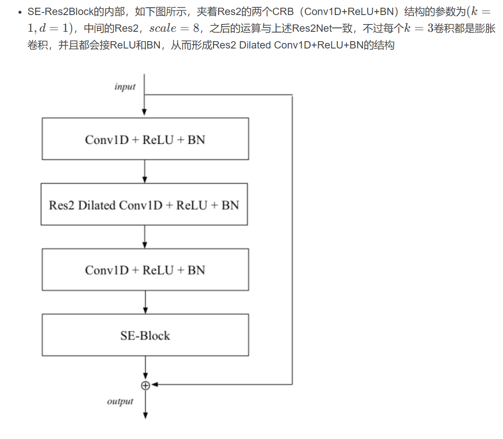
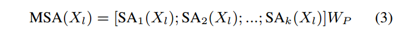
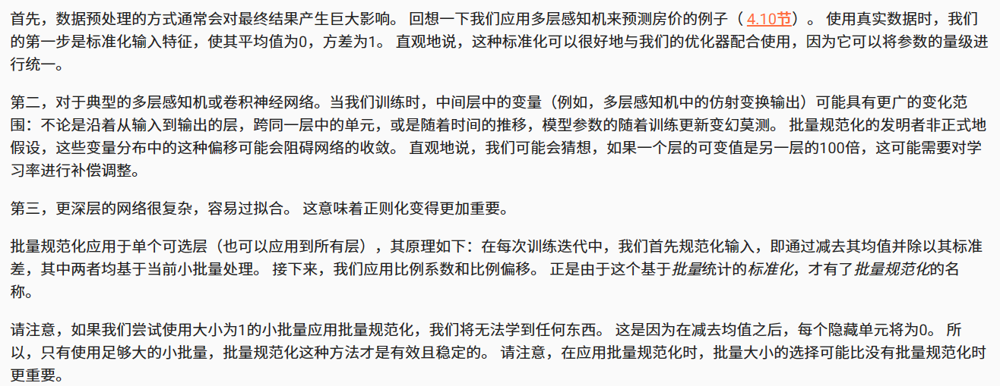

# 语音关键词检测算法
***
>以下内容来自《基于神经网络的语音关键词检索方法研究》（电子科技大学硕士毕业论文）

运用声学知识和机器学习等方法在海量音频数据库中检索关键词文件的技术被称为**口语内容检测** (Spoken Content Retrieval, **SCR**)。按应用场景SCR技术分为三个类别：**关键词检测** (Keyword Spotting, **KWS**)、口语词检测 (Spoken Term Detection,STD) 以及唤醒词检测 (Wake Up Word Detection,WUW)。

Keyword Spotting 指的是语音设备控制这一类应用，一般来说它的关键词是固定的，关注的是低内存占用，低计算复杂度，低功耗下的高准确率。  
***关键词检测+关键词定位***

## 研究发展
- 基于模板匹配 (Template Matching) 的语音关键词检测方法
- 基于声学词 (Acoustic KeywordDetection) 模型的语音关键词检测方法
- ***基于端到端神经网络的关键词检测方法***

## 性能评价指标
### 1.Term Weighted Value (TWV)（好像并不是特别普及）

- 命中(Hit):若系统检出的关键词 (黄色线条) 的中间位置处于待检测音频中关键词真实位置 (蓝色线条)左右 0.5s 的时间范围内，称检出关键词为命中。
- 误报(FalseAlarm):对于每个待检测音频中的关键词，系统有且只有一个检出，若检出关键词的中间位置处于待检测音频中关键词真实位置左右 0.5s 范围之外，称为误报。
- 漏检(Miss):若待检测音频中关键词真实位置左右 0.5s范围之内无检出关键词，称为漏检。
### 2.最小标准化交叉熵 (Minimum Normalized Cross Entropy Cost) 
语音关键词检
测领域中的重要指标之一，用于衡量系统评分的准确性。相较于传统的精确度分数，涵盖了更多的信息，最理想的系统得到标准化交叉熵的值应趋近于 0，若值趋近于 1 表示系统性能较差。
### 3.ATWV 与 MTWV
### 4.交并比
交并比是目标检测的评价体系中最为基础的评价指标之一，用于衡量模型生成的目标窗口与真实标记窗口之间的交叠程度。
***
>以下内容来自López-Espejo I, Tan Z H, Hansen J H L, et al. Deep spoken keyword spotting: An overview[J]. IEEE Access, 2021, 10: 4169-4199.

语音助手的一个显著特征是，为了使用，它们首先必须通过说出的唤醒词或关键字来激活，从而避免在不需要时运行计算成本高得多的自动语音识别（ASR）

基于大词汇连续语音识别(LVCSR)的KWS系统的优点之一是可以灵活地处理不断变化/未预定义的关键字（尽管当关键字不在词汇表中时，性能通常会下降）。主要缺点可能存在于计算复杂性维度：这些系统需要生成丰富的晶格，这需要高计算资源，还引入了延迟。虽然这对于离线音频搜索等一些应用程序来说不应该是一个问题，但LVCSR系统不适合用于可穿戴设备，其特点是显著的记忆、计算和功率限制.

使用关键字/填充隐藏马尔可夫模型（HMM）方法关键字/填充隐藏马尔可夫模型（HMM）方法的KWS系统相当紧凑且性能良好，但它仍然需要维特比解码

因为第一个深度口语KWS系统的发布，2014年是KWS技术的一个里程碑。在这种范式中，DNN产生的单词后验概率序列被直接处理，以确定关键词的可能存在，而无需任何HMM的干预。
#### 深度口语KWS系统优点
- 它不需要复杂的序列搜索算法（即Viterbi解码）
- 产生后验（声学模型）的DNN的复杂性可以很容易地调整以适应计算资源约束
- 在干净和有噪声的条件下，在小内存足迹（即低内存和低计算复杂度）的场景中，它比关键字/填充HMM方法带来了一致的显著改进

## 深度口语KWS系统(Deep Spoken Keyword Spotting Approach)

>后验概率是指通过调查或其它方式获取新的附加信息，利用贝叶斯公式对先验概率进行修正，而后得到的概率。先验概率和后验概率的区别：先验概率不是根据有关自然状态的全部资料测定的，而只是利用现有的材料(主要是历史资料)计算的；后验概率使用了有关自然状态更加全面的资料，既有先验概率资料，也有补充资料；


#### 系统由三个主要块组成
- 语音特征提取器将输入信号转换为**紧凑**的语音表示(紧凑是为了限制计算复杂度)
- 基于深度学习的声学模型根据语音特征在不同的关键字和填充（非关键字）类上产生后验
- 后验处理程序处理后验的时间序列，以确定输入信号中可能存在关键字

.png)

语音特征为K维T个时间步：  


是否重叠分割窗口结果可能不同：  
  


使用Softmax激活的全连接层作为输出层

## 语音特征提取
### 1.Mel-scale-related features（MFCC之类的）
### 2.RNN特征
递归神经网络（RNN）有助于将可变长度的数据序列总结为固定长度的紧凑特征向量，也称为嵌入。由于这一事实，RNN非常适合于模板匹配问题。
### 3.低精度特征
目的是为了减小内存与算力开销，使用2位或8位表示的log-Mel频谱特征性能下降微不足道。
### 4.可学习的FBank(LEARNABLE FILTERBANK FEATURES)

## 声学模型
### 1.全连接前馈神经网络
单值分解滤波器（SVDF）和尖峰神经网络（SNN）是前馈神经网络的低计算资源替代品，通过低秩近似来近似全连接层，SVDF实现了将第一个深度KWS系统的FFNN声学模型大小减少75%，而性能没有下降（SVDF神经网络是堆叠的一维卷积神经网络的特殊情况）。SNN是受人脑启发的神经网络,可以产生与等效人工神经网络类似的KWS性能，同时分别提供超过80%和数十倍的计算成本降低和节能。
### 2.CNN
CNN的一个吸引人的特征是，通过调整不同的超参数，如滤波器跨步、内核和池大小，可以很容易地限制模型的乘法次数，以满足计算约束。  
TC ResNet、CNNs、CRNNs、AdderNet、深度可分离神经网络（DS-CNNs）

理想的基于CNN的现代声学模型应该包括以下三个方面：
- 利用长时间-频率相关性的机制，例如使用时间卷积或扩展卷积
- 深度可分离卷积，在不牺牲性能的情况下显著减少模型的内存占用和计算
- 残差链接，可快速有效地训练更深层次的模型，从而增强KWS性能
### 3.RNN，TDNN
TDNN（Time Delay Neural Network，时延神经网络）用于处理序列数据。  
LSTM神经网络克服了标准RNN遇到的爆炸和消失梯度问题，双向LSTM（BiLSTM）可以捕获因果和反因果依赖关系，以提高KWS性能，GRU比LSTM需要更少的内存，训练速度更快，同时执行类似甚至更好。  
CRNN，卷积层对语音的局部频谱-时间相关性进行建模，然后，递归层通过对语音信号中的长期时间依赖性进行建模来效仿。卷积层对语音的局部频谱-时间相关性进行建模，然后，递归层通过对语音信号中的长期时间依赖性进行建模来效仿。

- #### CTC
    CTC让模型在训练时无监督地定位和对齐语音单元标签。换句话说，训练不需要目标标签序列的帧级对准。
- ####  SEQUENCE-TO-SEQUENCE MODELS
    由于CTC的条件独立性假设，所以一般配合外部语言模型使用。Seq2Seq更加方便，后续还有RNN-T等。

- #### 注意力机制
    在Seq2Seq模型中，无论输入序列的（可变）长度如何，编码器都必须将所有需要的信息压缩成一个固定维向量，这可能具有挑战性。与人类的听力注意力类似，注意力机制可能通过关注更有可能包含关键词的语音部分来帮助解决这一问题。结合注意力可以提高KWS的性能。

### 4.声学模型训练
#### 损失函数
- 交叉熵损失函数（CE）
- 最大池化损失函数（max-pooling loss）
#### 优化器
- SGD
- Adam
## 后验处理
### 非流式模式
非流模式是指独立输入段的标准多类分类，每个独立输入段包括单个单词（即孤立单词分类）。为了覆盖整个单词的持续时间，输入段必须足够长，例如大约1秒长。在这种模式中，通常，给定输入段X{i}，这被分配给具有最高后验概率的类。由于经验告诉非流化深度KWS系统倾向于产生非常峰值的后验分布，因此这种方法优于选择产生高于要设置的灵敏度（决策）阈值的后验的类。这可能归因于这样一个事实，即非流式系统不必像动态情况下那样处理类间转换数据，而是使用定义良好的隔离类实现。*(明明每个字都认识，但放一起就完全看不懂了。。。)*
### 流式模式
流模式指对输入音频流的连续处理（通常是实时的），其中关键字不被隔离/分割。因此，在这种模式下，任何给定的片段都可能包含也可能不包含关键字（部分）。在这种情况下，声学模型产生（原始）后验的时间序列具有强的局部相关性。
## 鲁棒性
### 前端方法
前端方法是指在语音信号被馈送到深度模型之前修改语音信号的那些技术。
#### 1.远场增益控制
距离衰减，背景噪声和混响可能特别有害。
自动增益控制（Automatic Gain Control，AGC）背后的原理是基于根据语音是否存在来选择性地放大音频信号，这种类型的选择性放大能够在远场场景中显著减少漏检。  
每通道能量归一化(Per-Channel Energy Normalization，PCEN)，PCEN的一个吸引人的方面是它的所有运算都是可微分的。因此，PCEN可以集成在DNN声学模型中，以便在声学模型训练期间舒适地调整其参数集。
#### 2.DNN特征增强
- 增强掩模估计
- 噪声估计
- 干净语音估计
- 滤波器参数估计
#### 3.自适应噪声抵消
考虑到语音助手的使用情况，谷歌开发了一系列基于双麦克风自适应噪声消除（ANC）的噪声鲁棒KWS方法，以特别处理语音干扰
#### 4.波束成形(BEAMFORMING)
空间滤波，也称为波束成形，除了时间和频率信息外，还可以利用空间线索来提高语音增强质量。类似于上述DNN特征增强的情况，KWS在波束成形的集成方面落后于ASR几步。
### 后端方法
后端方法是指在声学模型中应用的技术，主要提高其对各种声学条件的泛化能力。本小节的其余部分专门讨论以下问题：多风格和对抗性训练、对关键字数据稀缺的鲁棒性、类不平衡问题和其他后端方法。
#### 1.多风格训练
KWS声学模型的多风格训练是处理背景噪声和混响的最流行和有效的后端方法之一，多风格训练具有一定的正则化效果，可以防止过拟合。
#### 2.对抗性训练
通过平滑声学模型的分布来提高鲁棒性。
#### 3.对关键字数据稀缺性的鲁棒性
就是TTS生成训练语料.......
#### 4.类平衡问题
类不平衡问题指的是这样一个事实，即通常可用于KWS声学模型训练的非关键字样本比关键字样本多得多。
- 生成产生未命中检测的对抗性示例，例如通过FGSM，以类平衡的方式重新训练声学模型
- 通过文本到语音技术，生成额外的合成关键词样本
## 数据集

自然噪声语音：表1中的一些数据集（例如，[17]、[31]、[45]、[56]、[59]、[122]、[152]、[202]）部分或全部是由智能扬声器、智能手机和平板电脑等电子设备在远场条件下多次记录的自然噪声语音创建的。通常，录制场景由带有背景音乐或电视声音的家庭环境组成，因为这是许多KWS系统的目标场景。  
模拟有噪声语音：为KWS设想的其他一些有噪声数据集，例如[15]、[22]、[28]、[31]、[42]、[58]、[93]，部分或全部是通过一种称为数据增强的过程人为扭曲干净语音信号而生成的。通常，在给定一个干净的语音信号的情况下，通过添加不同类型的背景噪声（例如，日常生活噪声，如牙牙学语、咖啡馆、汽车、音乐和街道噪声）来创建它的噪声副本，从而控制产生的信噪比水平（通常在[-5，20]dB范围内）。  
***公开可用的谷歌语音命令数据集[153]，[154]已成为事实上KWS的开放基准***
## 评价指标
- ### 准确率
- ### 接收机工作特性和检测误差折衷曲线（RECEIVER OPERATING CHARACTERISTIC AND DETECTION ERROR TRADE-OFF CURVES）
- ### 精确度-召回率和F-SCORE曲线
## 性能比较

## 视听关键词识别
人类的语音感知是双峰的，因为它依赖于听觉和视觉信息。类似地，语音处理系统（如ASR系统）可以受益于利用视觉信息和音频信息来提高其性能。 
  
首先，提取语音和视觉特征。如今，使用深度学习模型来提取视觉特征似乎是首选的方法，然后，对提取的视听信息进行融合，以便做出关于关键字的存在与否的决定。  
通常，在实践中会考虑以下两种融合策略之一：
- 特征级融合：语音和视觉特征在使用神经网络模型进行联合分类之前以某种方式进行组合（例如，连接）
- 决策级融合：最终决策是由独立的语音和视觉神经网络分类器的决策组合而成。（与特征级融合方案相比，这种性能良好的方法似乎更受青睐，并且比特征级融合更不需要数据。）
视听数据集：Lip Reading in the Wild (LRW)、Lip Reading Sentences 2 (LRS2)、3 (LRS3)
## 未来展望
- 近期的工作将继续专注于同时朝着两个目标推进声学建模：（1）提高真实声学条件下的KWS性能，以及（2）降低计算复杂度。考虑到这两个目标，声学模型研究肯定会主要集中在开发新颖高效的卷积块上。
声学模型压缩具有三个主要优点：（1）减少了内存占用，（2）减少了推理延迟，（3）减少了能耗。所有这些对于例如实现基于鲁棒性目的的设备上声学模型重新训练或个性化关键字包含来说都是至关重要的。声学模型压缩研究无疑将包括模型参数量化、神经网络修剪和知识提取等方法。
- 另一个可能在短期内经历显著增长的研究领域可能是KWS的半监督学习。
- 我们预计KWS个性化在不久的将来将变得更加重要。这意味着我们可以期待新的研究深入到有效的开放词汇（个性化）KWS以及KWS和说话者联合验证等主题。
- 多麦克风进一步提高KWS在现实生活（即噪声）条件下的性能。
***

>以下内容来自Hou J, Zhang L, Fu Y, et al. The npu system for the 2020 personalized voice trigger challenge[J]. arXiv preprint arXiv:2102.13552, 2021.  
## MDTC
多尺度扩张时间卷积(multi-scale dilated temporal convolutional，MDTC)。  
端到端KWS模型MDTC采用T帧FBank（每帧80个Bank）X＝（x1，x2，…，xT）特征作为输入，并输出T个唤醒词(weak-up word,WuW)后验概率Y＝（y1，y2，…，yT）。对于每个时间帧t，一旦其WuW后验概率yt≥γ，唤醒字就被判断为发生了。γ∈（0,1）是一个阈值。

  

### DTC-Block
一个DTC-Block如图(a)所示：
- 首先，使用扩展深度1d卷积网络（***扩展深度TCN***）来获得滤波器大小为（5*1）的时间上下文，并且可以相应地设置扩展率。
- 在扩展深度TCN之后，使用两层 ***逐点卷积（Point Conv）*** 来集成来自不同通道的特征。
- 我们在不同的卷积层之间插入批量归一化（BN）和ReLU激活函数。
- 此外，我们在最后一个Point Conv层之后添加了一个***压缩与激励（seqeeze and exception，SE）模块***(不懂，只查到squeeze and excitation)，以学习不同通道之间的注意力信息。
- 输入和最后一个ReLU激活函数之间的残差连接也被采用，以防止梯度消失和梯度爆炸。
### DTC-Stack
将四个DTC块堆叠成一个DTC堆栈。四个DTC块的膨胀率分别设置为1、2、4和8。每个DTC堆栈的感受野是60帧。
### 模型
- 使用4个DTC堆栈作为特征提取器。特征提取器的接收场为4*60=240帧，其大到足以对WuW进行建模。
- 我们从具有不同感受野的DTC堆栈中提取特征图，并将它们汇总为关键字分类器的输入。
- 对于关键字分类器，使用了一个简单的全连接层.
- 然后是sigmoid输出层

### 训练样本设置
对于正训练话语，我们在WuW区域的中间帧周围选择多达40个帧作为正训练样本，并为它们分配1。正训练话语中的其他帧被丢弃为歧义，并且不在训练中使用。对于负训练话语，所有帧都被视为负训练样本并分配给0。因此，我们的KWS系统被建模为序列二进制分类问题。
### 损失函数
二元交叉熵（binary cross entropy，BCE）损失。


### 计算感受野
下面的公式没有考虑扩张卷积

### 何为DS卷积？
[知乎详解Depthwise Separable Convolution](https://zhuanlan.zhihu.com/p/80041030)
  
  
  
  
这样做的意义是减少参数量，这对KSW来说至关重要！

***
>以下内容来自Lv S, Wang X, Sun S, et al. DCCRN-KWS: an audio bias based model for noise robust small-footprint keyword spotting[J]. arXiv preprint arXiv:2305.12331, 2023.
## DCCRN-KWS
### 摘要
>现实世界中复杂的声学环境，特别是低信噪比的声学环境将给关键词识别系统带来巨大的挑战。受神经语音增强和语音识别中上下文偏差的最新进展的启发，我们提出了一种基于音频上下文偏差的DCCRN-KWS模型来应对这一挑战。我们将整个架构形成为用于去噪和关键字发现的多任务学习框架，其中DCCRN编码器与KWS模型相连接。在去噪任务的帮助下，我们进一步引入了一个音频上下文偏差模块，以利用真实的关键词样本，并对网络进行偏差，从而在噪声条件下更好地区分关键词。特征合并和复杂上下文线性模块也分别被引入以加强这种区分并有效地利用上下文信息。在内部挑战数据集和HIMIYA公共数据集上的实验表明，我们的DCCRN-KWS系统是优越的
### Method
#### 整体架构


#### KWS Module  
DTC  

#### DCCRN
使用复数操作的CRN，见语音增强笔记  
#### 使用ECAPA-TDNN提取keyword的Audio Context Bias  
实际上只是把ECAPA-TDNN作为embedding extractor, 直接使用SpeechBrain实现即可，不用过多考虑。
#### Feature Merge  
具体来说，我们首先初始化一组特征合并比率wi，其中最后一层的比率为1，其他层的比率为0。然后，由于前一编码器层的维数是最后一层的两倍，我们对这两层的输出进行下采样。最后，对编码器各层的输出进行加权平均，得到特征合并输出E′。其中wi是训练期间的可学习权值，在推理期间是固定的。  

(相信自己，能写明白！)  
可以看出，特征合并后的关键字段更加明显，而非关键字段几乎没有变化。


#### Complex Context Linear
首先将编码器的输出分别拆分为实/虚部分，然后分别将实/虚部分与偏差嵌入连接起来。最后，将当前帧(t)和之前帧(t−1,t−2)的上下文特征组合在一起作为全连接层的输入。  
  
这部分也是试着写吧
### Loss  
  

### Experiment  
#### Dataset  
HIMIA 实时加噪声。
### 知识补充  
#### ECAPA-TDNN  
ECAPA-TDNN是说话人识别中基于TDNN的神经网络，是目前最好的单体模型之一  
  
  
  
  

SpeechBrain


***
## Towards On-device Domain Adaptation for Noise-Robust Keyword Spotting  
AICAS 没进CCF分区，简单看。
>Cioflan C, Cavigelli L, Rusci M, et al. Towards on-device domain adaptation for noise-robust keyword spotting[C]//2022 IEEE 4th International Conference on Artificial Intelligence Circuits and Systems (AICAS). IEEE, 2022: 82-85. （苏黎世联邦理工，华为） 
### Abstract
The accuracy of a keyword spotting model deployed on embedded devices often degrades when the system is exposed to real environments with significant noise. In this paper, we explore a methodology for tailoring a model to on-site noises through on-device domain adaptation, while accounting for the edge computing-associated costs. We show that accuracy improvements by up to 18% can be obtained by specialising on difficult, previously unseen noise types, on embedded devices with a power budget in the Watt range, with a storage requirement of 1.1 GB. We also demonstrate an accuracy improvement of 1.43% on an ultra-low power platform consuming few-10 mW, requiring only 1.47 MB of memory for the adaptation stage, at a one-time energy cost of 5.81 J.

当系统暴露在具有显著噪声的真实环境中时，部署在嵌入式设备上的关键词识别模型的准确性通常会降低。在本文中，我们探索了一种通过设备上的域自适应来定制模型以适应现场噪声的方法，同时考虑了边缘计算相关的成本。我们的研究表明，在功耗预算在瓦级、存储需求为1.1 GB的嵌入式设备上，通过专门处理困难的、之前未发现的噪声类型，精度可以提高18%。我们还证明，在功耗仅为-10 mW的超低功耗平台上，精度提高了1.43%，自适应阶段仅需要1.47 MB的内存，一次性能耗为5.81 J。

### Methods
部署后现场采集噪音，加进数据里进行微调以提高目标域的准确度。
### Result


***
## Efficient Execution of Temporal Convolutional Networks for Embedded Keyword Spotting
比较偏向硬件，只有级联神经网络那里有点启发。
> Giraldo J S P, Jain V, Verhelst M. Efficient execution of temporal convolutional networks for embedded keyword spotting[J]. IEEE Transactions on Very Large Scale Integration (VLSI) Systems, 2021, 29(12): 2220-2228.
### Abstract
Recently, the use of keyword spotting (KWS) has become prevalent in mobile devices. State-of-the-art deep learning algorithms such as temporal convolutional networks (TCNs) have been applied to this task achieving superior accuracy results. These models can, however, be mapped in multiple ways onto embedded devices, ranging from real-time streaming inference with or without computational sprinting to delayed batched inference. Although functionally equivalent, these deployment settings, however, strongly impacts average power consumption and latency of this real time task, hence requiring a thorough optimization. This work analyzes the challenges, benefits, and drawbacks of the different execution modes available for TCN-based KWS inference on dedicated hardware. With this objective, this research contributes to: 1) presenting a complete deep learning accelerator optimized for TCN inference; 2) evaluating the impact on performance and power of the different deployment options for TCN inference applied to KWS obtaining up to 8 µW for real-time operation; and 3) optimizing real-time power consumption for KWS inference by exploiting the use of cascaded neural networks (NNs), achieving up to 35% additional power savings

*Index Terms: Artificial neural networks (NNs), automatic speech recognition, digital circuits/digital integrated circuits*

最近，关键字定位(KWS)的使用在移动设备中变得流行。时态卷积网络(TCNs)等最先进的深度学习算法已经应用于这项任务，实现了卓越的准确性结果。然而，这些模型可以以多种方式映射到嵌入式设备上，从有或没有计算冲刺的实时流推理到延迟的批量推理。尽管这些部署设置在功能上是等效的，但是它们会严重影响这个实时任务的平均功耗和延迟，因此需要进行彻底的优化。这项工作分析了在专用硬件上基于TCN的KWS推理可用的不同执行模式的挑战、优点和缺点。以此为目标，本研究有助于:1)提出一个针对TCN推理优化的完整的深度学习加速器；2)评估应用于KWS的TCN推理的不同部署选项对性能和功率的影响，获得高达8 W的实时操作；以及3)通过利用级联神经网络(NNs)来优化KWS推理的实时功耗，实现高达35%的额外节能。

### Method 
只看级联部分  
  
这里仅仅使用第一级检测是否是语音片段，说到底干的还是VAD的活。
### 启发  
想试一下可不可以先用一个简单的计算量少的模型对语音进行二分类，判断是否为关键词，如果为关键词，再进一步判断是哪一个关键词。

***
## Two-stage Strategy for Small-footprint Wake-up-word Speech Recognition System


***
## Keyword transformer: A self-attention model for keyword spotting
>Berg A, O'Connor M, Cruz M T. Keyword Transformer: A Self-Attention Model for Keyword Spotting[C]//Interspeech 2021. ISCA, 2021: 4249-4253.

### Abstract
The Transformer architecture has been successful across many domains, including natural language processing, computer vision and speech recognition. In keyword spotting, self-attention has primarily been used on top of convolutional or recurrent encoders. We investigate a range of ways to adapt the Transformer architecture to keyword spotting and introduce the Keyword Transformer (KWT), a fully self-attentional architecture that exceeds state-of-the-art performance across multiple tasks without any pre-training or additional data. Surprisingly, this simple architecture outperforms more complex models that mix convolutional, recurrent and attentive layers. KWT can be used as a drop-in replacement for these models, setting two new benchmark records on the Google Speech Commands dataset with 98.6% and 97.7% accuracy on the 12 and 35-command tasks respectively

*Index Terms: speech recognition, keyword spotting, Transformers*

Transformer架构在许多领域都取得了成功，包括自然语言处理、计算机视觉和语音识别。在关键字识别中，自注意主要用于卷积或循环编码器之上。我们研究了一系列使Transformer架构适应关键字识别的方法，并介绍了关键字转换器(KWT)，这是一种完全自关注的架构，在没有任何预训练或额外数据的情况下，在多个任务中超越了最先进的性能。令人惊讶的是，这种简单的架构优于混合了卷积层、循环层和关注层的更复杂的模型。KWT可以作为这些模型的临时替代品，在谷歌语音命令数据集上设置了两个新的基准记录，分别在12个和35个命令的任务上具有98.6%和97.7%的准确率.

### 源码
地址：[ARM-Software-github](https://github.com/ARM-software/keywordtransformer)
### Method
此模型和ViT较为接近。  

transformer的输入如下。  
  
其中Xclass和Xpos均为可学习参数。
   
缩放点积注意力，此处与原始transformer一致  

多头注意力输出的连接与原始transformer一致  
  
后面消融实验会谈论这两个区别   
  
残差连接写成两个公式，显得论文更学术一点  
**最后的分类器的输入是类嵌入。**
  


### Result  


### 知识补充  
#### learned position embedding  

***  
## Speech densely connected convolutional networks for small-footprint keyword spotting
参数相对大，效果一般，时间比较新，可以作为对比。嘿嘿
> Tsai T H, Lin X H. Speech densely connected convolutional networks for small-footprint keyword spotting[J]. Multimedia Tools and Applications, 2023: 1-19.(台湾国立中央大学)

### Abstract  
Keyword spotting is an important task for human-computer interaction (HCI). For high privacy, the identification task needs to be performed at the edge, so the purpose of this task is to improve the accuracy as much as possible within the limited cost. This paper proposes a new keyword spotting technique by the convolutional neural network (CNN) method. It is based on the application of densely connected convolutional networks (DenseNet). To make the model smaller, we replace the normal convolution with group convolution and depthwise separable convolution. We add squeeze-and-excitation networks (SENet) to enhance the weight of important features to increase the accuracy. To investigate the effect of different convolutions on DenseNet, we built two models: SpDenseNet and SpDenseNet-L. we validated the network using the Google speech commands dataset. Our proposed network had better accuracy than the other networks even with a fewer number of parameters and floating-point operations (FLOPs).SpDenseNet could achieve an accuracy of 96.3% with 122.63 K trainable parameters and 142.7 M FLOPs. Compared to the benchmark works, only about 52% of the number of parameters and about 12% of the FLOPs are used. In addition, we varied the depth and width of the network to build a compact variant. It also outperforms other compact variants, where SpDenseNet-L-narrow could achieve an accuracy of 93.6% withiri: An On-device DNN-powere 9.27 K trainable parameters and 3.47 M FLOPs. Compared to the benchmark works, the accuracy on SpDenseNet-L-narrow is improved by 3.5%. It only uses only about 47% of the number of parameters and about 48% of the FLOPS.  

*Index Terms: Keyword spotting . DenseNet . Group convolution . Depthwise separable convolution . SENet*

关键词识别是人机交互(HCI)的重要任务。对于高隐私性，识别任务需要在边缘执行，因此该任务的目的是在有限的成本范围内尽可能地提高准确率。本文提出了一种基于卷积神经网络(CNN)的关键词识别技术。它基于密集连接卷积网络(DenseNet)的应用。为了使模型更小，我们用群卷积和深度可分离卷积代替正态卷积。我们增加了挤压激励网络(SENet)来增强重要特征的权重，以提高精度。为了研究不同卷积对DenseNet的影响，我们建立了两个模型:SpDenseNet和SpDenseNet- l。我们使用谷歌语音命令数据集验证了网络。我们提出的网络在参数和浮点运算(FLOPs)数量较少的情况下也比其他网络具有更好的精度。SpDenseNet在122.63 K可训练参数和142.7 M FLOPs的情况下，准确率达到96.3%。与基准工作相比，仅使用了约52%的参数数量和约12%的flop。此外，我们改变了网络的深度和宽度，以建立一个紧凑的变体。它也优于其他紧凑型变体，其中SpDenseNet-L-narrow可以实现93.6%的精度:器件上dnn驱动的9.27 K可训练参数和3.47 M FLOPs。与基准作品相比，SpDenseNet-L-narrow的精度提高了3.5%。它只使用了大约47%的参数数量和大约48%的FLOPS。

### Method  
  
DenseNet通常由一个DenseBlock和一个过渡层组成。过渡层用于压缩两个块层之间的参数，但我们使用池化层而不是过渡层。  
DenseBlock第一层是一个1*1的卷积用来减少通道数，以此来减少模型参数数量。  

  


### Result  


***
## Condensenet An efficient densenet using learned group convolutions
可学习分组卷积的CondenseNet 
> Huang G, Liu S, Van der Maaten L, et al. Condensenet: An efficient densenet using learned group convolutions[C]//Proceedings of the IEEE conference on computer vision and pattern recognition. 2018: 2752-2761.(康奈尔大学。清华大学，Facebook AI LAB)
 
### Abstract  
Deep neural networks are increasingly used on mobile devices, where computational resources are limited. In this paper we develop CondenseNet, a novel network architecture with unprecedented efficiency. It combines dense connectivity with a novel module called learned group convolution. The dense connectivity facilitates feature re-use in the network, whereas learned group convolutions remove connections between layers for which this feature re-use is superfluous. At test time, our model can be implemented using standard group convolutions, allowing for efficient computation in practice. Our experiments show that CondenseNets are far more efficient than state-of-the-art compact convolutional networks such as ShuffleNets.

深度神经网络越来越多地应用于计算资源有限的移动设备。在本文中，我们开发了一种新的网络结构，具有前所未有的效率。它将密集连接与一种称为学习群卷积的新模块相结合。密集的连通性促进了网络中的特征重用，而学习的群卷积则去除了层之间的连接，因为这种特征重用是多余的。在测试时，我们的模型可以使用标准群卷积来实现，从而在实践中实现高效的计算。我们的实验表明，consenets比最先进的紧凑卷积网络(如ShuffleNets)要高效得多。
### Method
densenet 各个层之间稠密连接，可以实现特征复用，可学习组卷积移除了层之间多余的特征连接。通过把一个层内的filters分成好多组，在训练过程中逐步删除每个组中不重要的特征连接。每个组输入的特征不是人工设计的，也是通过学习得到的。
  

  
  
  
  
  


## Broadcasted Residual Learning for Efficient Keyword Spotting
> Cite as: Kim, B., Chang, S., Lee, J., Sung, D. (2021) Broadcasted Residual Learning for Efficient Keyword Spotting. Proc. Interspeech 2021, 4538-4542, doi: 10.21437/Interspeech.2021-383(高通)

对语谱图做卷积？
对MLPMixer感兴趣

### Abstract  
Keyword spotting is an important research field because it plays a key role in device wake-up and user interaction on smart devices. However, it is challenging to minimize errors while operating efficiently in devices with limited resources such as mobile phones. We present a broadcasted residual learning method to achieve high accuracy with small model size and computational load. Our method configures most of the residual functions as 1D temporal convolution while still allows 2D convolution together using a broadcasted-residual connection that expands temporal output to frequency-temporal dimension. This residual mapping enables the network to effectively represent useful audio features with much less computation than conventional convolutional neural networks. We also propose a novel network architecture, Broadcasting-residual network (BC-ResNet), based on broadcasted residual learning and describe how to scale up the model according to the target device’s resources. BC-ResNets achieve state-of-the-art 98.0% and 98.7% top-1 accuracy on Google speech command datasets v1 and v2, respectively, and consistently outperform previous approaches, using fewer computations and parameters.

***Index Terms: keyword spotting, speech command recognition, deep neural network, efficient neural network, residual learning***

关键词识别是一个重要的研究领域，因为它在智能设备上的设备唤醒和用户交互中起着关键作用。然而，在移动电话等资源有限的设备中高效运行的同时最大限度地减少错误是一项挑战。我们提出了一种广播残差学习方法，以小的模型规模和计算量实现高精度。我们的方法将大多数残差函数配置为1D时间卷积，同时仍然允许使用广播残差连接将时间输出扩展到频率-时间维度的2D卷积。这种剩余映射使得网络能够以比传统卷积神经网络少得多的计算来有效地表示有用的音频特征。我们还提出了一种基于广播残差学习的新型网络架构，广播残差网络(BC-ResNet ),并描述了如何根据目标设备的资源来扩展该模型。BC-ResNets在Google语音命令数据集v1和v2上分别实现了98.0%和98.7%的顶级准确率，并且始终优于以前的方法，使用了更少的计算和参数。

### Method  
  
  
频域上先做卷积，然后频域通道压缩到一个维度，之后在时域上做卷积，残差连接（这个过程会广播）。

### Experiment  
40-dimensional log Mel spectrograms(Batch_size, 1, 40, T)  
SSN:S=5  
#### Data  
12分类['yes', 'no', 'up', 'down', 'left', 'right', 'on', 'off', 'stop', 'go', 'unknown', 'silence']。“未知单词”类别包含剩余的二十个类中随机抽样的单词。“静音”类别包含从背景噪音音频文件中随机提取的一秒钟的剪辑。（此处我将Unknow Word和Silence数量设置为4000，与其他关键词数量大概一致，8:1:1划分数据）  
40维 log Mel spectrograms, 窗口大小30ms, 帧移10ms, 偏移[-100, 100], 背景噪声概率0.8（只在训练集加噪音？）, SpecAugment两个时间和两个频率掩码, 最小的模型BC-ResNet-1不使用SpecAugment，而BCResNet-{1.5，2，3，6，8}使用具有{1，3，5，7，7}个频率掩码参数的SpecAugment，分别具有固定的时间掩码参数20。(两个时间掩码，两个频率掩码，可以在特征提取结束之后进行，比较随机)
#### Implementation Details  
使用具有五个子带的SSN, 随机梯度下降(SGD)优化器对所有模型进行200个时期的训练，momentum为0.9，weight decay为0.001，小批量大小为100。学习率在前五个时期从零线性增加到0.1，作为预热，然后使用cosine annealing衰减到零.


### Result  
  


### 知识补充  
#### SSN  
没找到相关解释，只有一篇论文，暂时不想看。

## MatchboxNet: 1D Time-Channel Separable Convolutional Neural Network Architecture for Speech Commands Recognition
模型简单，不是很大，结果很不错。
> Cite as: Majumdar, S., Ginsburg, B. (2020) MatchboxNet: 1D Time-Channel Separable Convolutional Neural Network Architecture for Speech Commands Recognition. Proc. Interspeech 2020, 3356-3360, doi: 10.21437/Interspeech.2020-1058(英伟达)

### Abstract  
We present MatchboxNet - an end-to-end neural network for speech command recognition. MatchboxNet is a deep residual network composed from blocks of 1D time-channel separable convolution, batch-normalization, ReLU and dropout layers. MatchboxNet reaches state-of-the art accuracy on the Google Speech Commands dataset while having significantly fewer parameters than similar models. The small footprint of MatchboxNet makes it an attractive candidate for devices with limited computational resources. The model is highly scalable, so model accuracy can be improved with modest additional memory and compute. Finally, we show how intensive data augmentation using an auxiliary noise dataset improves robustness in the presence of background noise.

***Index Terms: key word spotting, speech commands recognition, deep neural networks, depth-wise separable convolution***

我们提出了MatchboxNet -一个用于语音命令识别的端到端神经网络。MatchboxNet是一个深度残差网络，由1D时间-通道可分离卷积、批量归一化、ReLU和丢失层块组成。MatchboxNet在Google Speech Commands数据集上达到了最先进的精度，同时拥有比类似模型少得多的参数。MatchboxNet的小尺寸使其成为计算资源有限的设备的一个有吸引力的候选。该模型是高度可扩展的，因此可以通过适度的额外内存和计算来提高模型的准确性。最后，我们展示了使用辅助噪声数据集的密集数据增强如何在存在背景噪声的情况下提高稳健性。

### Method  
  
  
时域上做卷积，频域放在通道上。 
### Experiment   
时间填充到128.特征是64维的。  
正负5ms时移，加白噪，使用spacAugment.  
也使用了***specCutout***  
  
使用NovoGrad优化器 
- NovoGrad是一种用于深度学习中的优化算法，旨在改进梯度下降的训练过程。它于2019年由Uber AI Labs的研究人员提出，并在计算机视觉任务中展示出了良好的性能。

    NovoGrad的设计灵感来自于传统的动量优化算法和自适应学习率算法，如Adam。它的目标是在梯度更新过程中同时提供动量和自适应的学习率调整。

    与传统的动量方法不同，NovoGrad采用了一种基于梯度的自适应学习率调整策略。在计算梯度的过程中，NovoGrad会估计梯度的二阶矩（即梯度的平方的期望值）并将其用于学习率的调整。

    具体而言，NovoGrad的更新规则如下：

    计算梯度：对于每个参数，计算其关于损失函数的梯度。

    估计梯度的二阶矩：对于每个参数，计算梯度的平方的期望值。

    计算自适应学习率：根据梯度的二阶矩和事先定义的学习率调整参数，计算自适应学习率。

    计算动量：使用计算得到的梯度和自适应学习率，计算梯度下降的动量。

    更新参数：根据计算得到的动量更新参数。

    通过结合动量和自适应学习率调整，NovoGrad可以在训练过程中更好地平衡学习速度和稳定性。它在某些情况下可以提供更快的收敛速度和更好的泛化性能。
    在PyTorch中，NovoGrad算法的参数主要与学习率调整和优化器的配置相关。以下是NovoGrad算法中的一些重要参数：

    lr（学习率）：学习率控制每次参数更新的步长。在NovoGrad中，学习率可以自适应地调整，但初始学习率仍然是一个重要的参数。

    betas：这是一个包含两个浮点数的元组，用于配置动量的衰减率。通常，第一个元素是动量衰减的初始值，第二个元素是用于计算梯度平方的二阶矩的衰减率。

    weight_decay（权重衰减）：权重衰减是一种正则化方法，它通过对模型参数的更新进行惩罚来避免过拟合。在NovoGrad中，可以通过设置weight_decay参数来控制权重衰减的程度。

    eps：用于数值稳定性的小常数。在计算梯度的二阶矩时，为了避免除以零的情况，通常会添加一个很小的常数（如eps）。  
    
使用Warmup-HoldDecay学习率调度


### Result  
v1-30, v2-35  
  
v2-12  
*很好的结果*  
  
参数增加模型精度在上升  


通过噪声增强数据进行训练后，在干净的测试集上的精度也会增加。
  

上图是用噪音增强关键词数据  
下图是增加了两个分类“背景噪音”和“背景声音”
  
参数越多抗噪性也越好  


## SUBSPECTRAL NORMALIZATION FOR NEURAL AUDIO DATA PROCESSING  

> Chang S, Park H, Cho J, et al. Subspectral normalization for neural audio data processing[C]//ICASSP 2021-2021 IEEE International Conference on Acoustics, Speech and Signal Processing (ICASSP). IEEE, 2021: 850-854. (高通)

### Abstract  
Convolutional Neural Networks are widely used in various machine learning domains. In image processing, the features can be obtained by applying 2D convolution to all spatial dimensions of the input. However, in the audio case, frequency domain input like Mel-Spectrogram has different and unique characteristics in the frequency dimension. Thus, there is a need for a method that allows the 2D convolution layer to handle the frequency dimension differently. In this work, we introduce SubSpectral Normalization (SSN), which splits the input frequency dimension into several groups (sub-bands) and performs a different normalization for each group. SSN also includes an affine transformation that can be applied to each group. Our method removes the inter-frequency deflection while the network learns a frequency-aware characteristic. In the experiments with audio data, we observed that SSN can efficiently improve the network’s performance.

***Index Trerms: SubSpectral Normalization, CNNs, Audio***

卷积神经网络广泛应用于各种机器学习领域。在图像处理中，可以通过对输入的所有空间维度应用2D卷积来获得特征。然而，在音频情况下，像Mel频谱图这样的频域输入在频率维度上具有不同且独特的特征。因此，需要一种允许2D卷积层不同地处理频率维度的方法。在这项工作中，我们引入了子频谱归一化(SSN)，它将输入频率维度分成几个组(子带)，并对每个组执行不同的归一化。SSN还包括一个仿射变换，可以应用于每个组。我们的方法消除了频率间偏差，同时网络学习频率感知特性。在对音频数据的实验中，我们观察到SSN可以有效地提高网络的性能。

### Introduction  
  
卷积平等的处理水平和垂直方向上的数据，比较适合图像，但是语音特征在垂直方向上，不同的频率维度具有不同的特征。所以普通卷积和归一化可能不是特别适合。  
对不同的频带进行不同的卷积，参数量和计算量太大，使用SSN来解决这个问题。
###  SUBSPECTRAL NORMALIZATION(子频谱归一化，SSN)  
配合Mel-Spectrogram(梅尔频谱图)特征(也可以不配合)
- 将频率维度分成多个子带，并对每个组进行归一化。
- SSN可以归一化每个子频带，并且允许卷积滤波器表现得像仅具有小的附加参数的多个滤波器一样。
- SSN可以通过仅替换模型的归一化层来提高性能。  
  
***公式***  
  
***代码***  
  
并且为了有效的计算，频率组被均等地划分。  
如果后面接卷积层，可以达到模拟对不同的频带进行不同的卷积操作的效果  
  
>   

### Experiment  
dataset: GSC V1(MFCC-40)  
 
平均有1%的提升，res-15多训练几轮有1.7%提升   

  
随机初始化BN参数和训练得到的BN参数效果差别不大，并且在频带上分布不均匀。使用SSN的数据在频带上分布更均匀，每个子频带分别进行仿射变换，还可以使频率信息嵌入子带。

### 知识补充  

#### Batch Normalization  
可以很好的比较不同batch间的差距

  
  

#### Layer Normalization  
可以很好的比较不同通道间的差距
batch normalization 的局限：   
-   
  
在layer方向上做Normalization
  
  
LN和BN对比  
- 理解上  
    
- 应用场景上  
    
- 训练和测试时有无区别  
  
#### Instance Normalization  
聚焦于每个batch每个通道不同维度之间的差距（主要用于风格迁移，在风格迁移中，每个像素点都很重要。）  
Instance Normalization（IN），一种更适合对单个像素有更高要求的场景的归一化算法（IST，GAN等）。IN的算法非常简单，计算归一化统计量时考虑单个样本，单个通道的所有元素。IN（右）和BN（中）以及LN（左）的不同从图1中可以非常明显的看出。 

  

**两个不要使用IN的场景：**
- MLP或者RNN中：因为在MLP或者RNN中，每个通道上只有一个数据，这时会自然不能使用IN；
- Feature Map比较小时：因为此时IN的采样数据非常少，得到的归一化统计量将不再具有代表性。
#### Group Normalization   
> 吴育昕-何恺明  针对batchsize小的情况下BN效果不好，提出了Group Normalization，四两拨千斤。  
> 
  


```python
由此可以看出，GN和BN是有很多相似之处的，代码相比较BN改动只有一两行而已，论文给出的代码实现如下：
def GroupNorm(x, gamma, beta, G, eps=1e-5):
    # x: input features with shape [N,C,H,W]
    # gamma, beta: scale and offset, with shape [1,C,1,1]
    # G: number of groups for GN
    N, C, H, W = x.shape
    x = tf.reshape(x, [N, G, C // G, H, W])
    mean, var = tf.nn.moments(x, [2, 3, 4], keep dims=True)
    x = (x - mean) / tf.sqrt(var + eps)
    x = tf.reshape(x, [N, C, H, W])
    return x * gamma + beta
```  
 


## UniKW-AT: Unified Keyword Spotting and Audio Tagging
> Dinkel, H., Wang, Y., Yan, Z., Zhang, J., Wang, Y. (2022) UniKW-AT: Unified Keyword Spotting and Audio Tagging. Proc. Interspeech 2022, 3238-3242, doi: 10.21437/Interspeech.2022-607(小米)  

没有提出具体模型，提出了一种训练方法？
### Abstract  
Within the audio research community and the industry, keyword spotting (KWS) and audio tagging (AT) are seen as two distinct tasks and research fields. However, from a technical point of view, both of these tasks are identical: they predict a label (keyword in KWS, sound event in AT) for some fixed-sized input audio segment. This work proposes UniKW-AT: An initial approach for jointly training both KWS and AT. UniKW-AT enhances the noise-robustness for KWS, while also being able to predict specific sound events and enabling conditional wakeups on sound events. Our approach extends the AT pipeline with additional labels describing the presence of a keyword. Experiments are conducted on the Google Speech Commands V1 (GSCV1) and the balanced Audioset (AS) datasets. The proposed MobileNetV2 model achieves an accuracy of 97.53% on the GSCV1 dataset and an mAP of 33.4 on the AS evaluation set. Further, we show that significant noise-robustness gains can be observed on a real-world KWS dataset, greatly outperforming standard KWS approaches. Our study shows that KWS and AT can be merged into a single framework without significant performance degradation.

***Index Terms: key-word spotting, audio tagging, convolutional neural networks, weakly supervised learning***

在音频研究社区和行业内，关键词识别(KWS)和音频标记(AT)被视为两个不同的任务和研究领域。然而，从技术的角度来看，这两个任务是相同的:它们预测某个固定大小的输入音频片段的标签(KWS中的关键字，AT中的声音事件)。这项工作提出了UniKW-AT:联合训练KWS和AT的初步方法。UniKW-AT增强了KWS的噪声鲁棒性，同时还能够预测特定的声音事件，并实现对声音事件的条件唤醒。我们的方法使用描述关键字存在的附加标签来扩展AT管道。实验在谷歌语音命令V1 (GSCV1)和平衡音频集(AS)数据集上进行。提出的MobileNetV2模型在GSCV1数据集上实现了97.53%的准确率，在AS评估集上实现了33.4的mAP。此外，我们表明，在真实世界的KWS数据集上可以观察到显著的噪声鲁棒性增益，大大优于标准的KWS方法。我们的研究表明，KWS和at可以合并到一个框架中，而不会显著降低性能。

### Introduction  
**动机：**  
从技术角度来看，KWS和AT在实现上是相同的。具体来说，给定某个特定长度(例如1秒)的输入样本，这两个任务的目标都是提供一个输出标签，表示关键字(KWS)或声音事件(AT)的存在。   

文章提出了***统一关键词音频标记(UniKW-AT)***，它能够使用单个模型联合建模这两个任务。  

UniKW-AT的潜在好处是提高了KWS模型对真实世界噪声(如音乐)的稳健性，并有可能向用户提供声音事件信息。额外的好处是能够将不同类型的语音合并到KWS后处理中，例如耳语或儿童语音。  

**存在问题：**  
1. 训练大规模AT模型利用弱监督训练，KWS模型通常在强监督下训练.  
2. 用多标签目标来训练AT模型，因为多个声音事件可以在某个时间段内同时发生，例如，当人们在说话时背景中播放音乐。相反，标准KWS模型通常使用单标签目标(如分类交叉熵)来训练。  

**核心贡献：**  
首次尝试联合KWS和at建模，重点是抗噪声KWS性能和声音事件检测能力。

### Method  
我们的方法通过将KWS标签视为标准AT训练框架内的额外目标事件来联合模拟KWS和AT。给定具有K个关键字的目标KWS标签集LKWS和具有C个声音事件的AT标签集LAT，我们的目标是通过合并两个标签集来建模这两个任务，获得L = LKWS ∪ LAT。具体来说，我们的方法使用Audioset (AS) [15] as LAT的C = 527个声音事件标签。为KWS训练的模型通常在其标签集中包含非目标标签，也称为“噪声”。在UniKW-AT的情况下，不需要这个额外的“噪声”标签，因为大多数类型的噪声已经包含在LAT标签集中。我们的方法首先将所有K个目标关键词附加到作为标签可用的C = 527，产生C + K个目标标签。包含在KWS数据集中的所有非目标关键词被映射到LAT中的“语音”标签。  
将KWS数据集和AT数据集（弱监督数据，通过预训练模型生成估计软标签）裁剪到相同长度 ，527+10=537个分类 
使用BCE损失（多分类是怎么用的？）。

  


### 知识补充  
#### Audio Tagging(音频标记)  
音频标记（Audio Tagging）是指通过分析音频数据，将其与特定的标签或类别关联起来的任务。音频标记的目标是自动识别和分类音频中的声音内容，例如音乐、语音、环境声等。

音频标记在许多应用领域都具有重要的应用价值，例如音乐信息检索、语音识别、音频分类和标签推荐等。以下是音频标记的一些常见应用：  
1. 音乐分类：音频标记可以用于对音乐进行分类，例如将音乐分为不同的流派（摇滚、流行、古典等）或情绪（快乐、悲伤、激动等）。音乐分类：音频标记可以用于对音乐进行分类，例如将音乐分为不同的流派（摇滚、流行、古典等）或情绪（快乐、悲伤、激动等）。  
2. 语音识别：音频标记可用于语音识别任务，通过将音频标记为不同的语音类别（例如字母、单词、短语）来识别和转录音频中的语音内容。  
3. 环境声识别：音频标记可以用于识别和分类环境声音，例如车辆噪音、自然声音（鸟鸣、风声）或人类活动声音（笑声、尖叫声）等。  
4. 声音事件检测：音频标记可用于检测特定声音事件的出现和发生，例如爆炸声、狗吠声、汽车喇叭声等。  
   
AT模型的当前应用之一是帮助听力受损的人，以通知用户发生了用户听不到的一些事件，例如敲门。


## Latency Control for Keyword Spotting
> Jose, C., Wang, J., Strimel, G., Khursheed, M.O., Mishchenko, Y., Kulis, B. (2022) Latency Control for Keyword Spotting. Proc. Interspeech 2022, 1891-1895, doi: 10.21437/Interspeech.2022-10608(亚马逊)

### Abstract  
Conversational agents commonly utilize keyword spotting (KWS) to initiate voice interaction with the user. For user experience and privacy considerations, existing approaches to KWS largely focus on accuracy, which can often come at the expense of introduced latency. To address this tradeoff, we propose a novel approach to control KWS model latency and which generalizes to any loss function without explicit knowledge of the keyword endpoint. Through a single, tunable hyperparameter, our approach enables one to balance detection latency and accuracy for the targeted application. Empirically, we show that our approach gives superior performance under latency constraints when compared to existing methods. Namely, we make a substantial 25% relative false accepts improvement for a fixed latency target when compared to the baseline state-of-the-art. We also show that when our approach is used in conjunction with a max-pooling loss, we are able to improve relative false accepts by 25% at a fixed latency when compared to cross entropy loss.  

***Index Terms: keyword spotting, speech recognition, wake
word detection, convolutional neural network***

对话代理通常利用关键词识别(KWS)来启动与用户的语音交互。出于用户体验和隐私考虑，现有的KWS方法主要关注准确性，这通常会以引入延迟为代价。为了解决这个权衡，我们提出了一种新的方法来控制KWS模型的延迟，并推广到任何损失函数没有明确的知识的关键字端点。通过单个可调超参数，我们的方法可以平衡目标应用的检测延迟和精度。根据经验，我们表明，与现有方法相比，我们的方法在延迟约束下提供了更好的性能。也就是说，与基线最先进水平相比，我们在固定延迟目标下实现了25%的相对错误接受率改善。我们还表明，当我们的方法与最大池损失结合使用时，与交叉熵损失相比，我们能够在固定延迟下将相对错误接受率改善25%
### Introduction  
**动机：**  
为了降低延迟  
### Method  
介绍了一种使用损失函数来训练KWS模型的方法，该方法允许延迟控制，而无需标记关键字的精确对齐。所提出的损失函数是最大汇集损失的一般化，其基于概率将为正例选择的比对移动到更早的帧，迫使模型发出更早的检测峰值。通过改变这种概率，可以容易地调整KWS模型准确性和等待时间之间的平衡，而无需准确了解关键词端点。

#### MaxPooling Loss  
  
**优点：**  
1. 训练数据所需的对齐信息显著减少，因为仅需要使用位置的噪声估计来裁剪包含(但不精确对齐)关键词的音频片段。这可以显著减少数据准备/注释开销，并避免由不良对齐(如关键字的剪切)引入的错误。  
2. 与预先选择的比对相比，允许模型选择最大后验概率导致经验性能的改善。  

  
虽然在绿色框结尾处就已经找到了最大峰值，但在整个语音全部结束后才判断并输出结果(从延迟控制的角度来说并不好)。

改进后的MaxPooling Loss  
   
 对于正例，对于概率b，损失不是在最大类后验帧上计算的，而是在前一帧生成的后验帧上计算的。直观地，通过随机评估模型在更早后验概率上的损失，我们预期峰值检测之前的后验概率也将是高的，从而允许更早的检测。随着用户增加参数b，越来越多的重点放在先验后验上。通过改变该参数，用户可以在检测精度和检测延迟之间取得平衡。

注意，在该应用中，模型后验步幅相对较大，因此通过使用伯努利分布值β来推动模型使用先验后验足以减少等待时间；然而，对于具有较小后验间隔时间的检测模型或者需要较大等待时间减少的检测模型，可以使用正分布，例如泊松分布。  

可以推广到任何损失函数。  
经验发现交叉熵对于KWS任务非常有效

### Experiments  
20000h数据，HMM粗略对齐。  
我们使用的延迟指标是相对于关键字结束索引的检测时间，单位为毫秒(ms)。负延迟表示关键字在其完成之前被检测到。  
为了研究检测的准确性，我们使用相对错误接受和相对错误拒绝计数来绘制分析中关键词的检测误差权衡(DET)曲线。

我们使用所提出的方法训练了6个模型，参数值为b ∈ {0.0，0.1，0.2，0.33，0.5，1.0}，其中b = 0相当于标准的最大汇集损失。另外还训练了一个只用交叉熵损失的模型。
  
越接近MaxPooling Loss 效果越好。  


## Max-pooling loss training of long short-term memory networks for small-footprint keyword spotting  
>Sun M, Raju A, Tucker G, et al. Max-pooling loss training of long short-term memory networks for small-footprint keyword spotting[C]//2016 IEEE Spoken Language Technology Workshop (SLT). IEEE, 2016: 474-480.(亚马逊)

### Abstract  
We propose a max-pooling based loss function for training Long Short-Term Memory (LSTM) networks for smallfootprint keyword spotting (KWS), with low CPU, memory, and latency requirements. The max-pooling loss training can be further guided by initializing with a cross-entropy loss trained network. A posterior smoothing based evaluation approach is employed to measure keyword spotting performance. Our experimental results show that LSTM models trained using cross-entropy loss or max-pooling loss outperform a cross-entropy loss trained baseline feed-forward Deep Neural Network (DNN). In addition, max-pooling loss trained LSTM with randomly initialized network performs better compared to cross-entropy loss trained LSTM. Finally, the max-pooling loss trained LSTM initialized with a crossentropy pre-trained network shows the best performance, which yields 67.6% relative reduction compared to baseline feed-forward DNN in Area Under the Curve (AUC) measure.  

***Index Terms: LSTM, keyword spotting, max-pooling loss, small-footprint***

我们提出了一种基于最大池的损失函数，用于训练长短期记忆(LSTM)网络，用于小足迹关键词识别(KWS)，具有低CPU、存储器和延迟要求。可以通过用交叉熵损失训练网络初始化来进一步指导最大汇集损失训练。采用基于后验平滑的评估方法来测量关键词识别性能。我们的实验结果表明，使用交叉熵损失或最大池损失训练的LSTM模型优于交叉熵损失训练的基线前馈深度神经网络(DNN)。此外，与交叉熵损失训练的LSTM相比，具有随机初始化网络的最大池损失训练的LSTM表现更好。最后，用交叉熵预训练网络初始化的最大汇集损失训练的LSTM显示出最佳性能，与曲线下面积(AUC)测量的基线前馈DNN相比，其产生67.6%的相对减少。

  


## Attention-Free Keyword Spotting  
不想看transformer了。都没有KWT98.5%好，但是KWT太大了。
> Morshed M M, Ahsan A O. Attention-free keyword spotting[J]. arXiv preprint arXiv:2110.07749, 2021.(ICLR2022, 伊斯兰技术大学)  
### Abstract  
Till now, attention-based models have been used with great success in the keyword spotting problem domain. However, in light of recent advances in deep learning, the question arises whether self-attention is truly irreplaceable for recognizing speech keywords. We thus explore the usage of gated MLPs—previously shown to be alternatives to transformers in vision tasks—for the keyword spotting task. We provide a family of highly efficient MLP-based models for keyword spotting, with less than 0.5 million parameters. We show that our approach achieves competitive performance on Google Speech Commands V2-12 and V2-35 benchmarks with much fewer parameters than self-attention-based methods.  

到目前为止，基于注意力的模型已经在关键词识别问题领域获得了巨大的成功。然而，鉴于深度学习的最新进展，问题出现了，对于识别语音关键词来说，自我注意是否真的不可替代。因此，我们探索了门控MLP的使用——以前显示为视觉任务中变形金刚的替代物——用于关键字识别任务。我们提供了一系列高效的基于MLP的关键字识别模型，参数不到50万。我们表明，我们的方法在谷歌语音命令V2-12和V2-35基准上取得了有竞争力的性能，比基于自我注意的方法具有更少的参数。

## Advancing Vision Transformers with Group-Mix Attention  
代码开源
> Ge C, Ding X, Tong Z, et al. Advancing Vision Transformers with Group-Mix Attention[J]. arXiv preprint arXiv:2311.15157, 2023.(香港大学， 腾讯AI Lab，蚂蚁，北京大学，香港中文大学，复旦人工智能研究所)  

### Abstract
Vision Transformers (ViTs) have been shown to enhance visual recognition through modeling long-range dependencies with multi-head self-attention (MHSA), which is typically formulated as Query-Key-Value computation. However, the attention map generated from the Query and Key captures only token-to-token correlations at one single granularity. In this paper, we argue that self-attention should have a more comprehensive mechanism to capture correlations among tokens and groups (i.e., multiple adjacent tokens) for higher representational capacity. Thereby, we propose Group-Mix Attention (GMA) as an advanced replacement for traditional self-attention, which can simultaneously capture token-to-token, token-to-group, and group-to-group correlations with various group sizes. To this end, GMA splits the Query, Key, and Value into segments uniformly and performs different group aggregations to generate group proxies. The attention map is computed based on the mixtures of tokens and group proxies and used to re-combine the tokens and groups in Value. Based on GMA, we introduce a powerful backbone, namely GroupMixFormer, which achieves state-of-the-art performance in image classification, object detection, and semantic segmentation with fewer parameters than existing models. For instance, GroupMixFormer-L (with 70.3M parameters and 3842 input) attains 86.2% Top1 accuracy on ImageNet-1K without external data, while GroupMixFormer-B (with 45.8M parameters) attains 51.2% mIoU on ADE20K. Codes and trained models are released in https://github.com/AILab-CVC/GroupMixFormer.  

视觉变压器(vit)已被证明可以通过模拟多头自我注意(MHSA)的远程依赖性来增强视觉识别，多头自我注意通常被公式化为查询键值计算。然而，从查询和关键字生成的注意力图仅在一个单一的粒度上捕获标记到标记的相关性。在本文中，我们认为自我注意应该有一个更全面的机制来捕捉表征和组(即多个相邻的表征)之间的相关性，以获得更高的表征能力。因此，我们提出群组混合注意(GMA)作为传统自我注意的高级替代，它可以同时捕捉不同群组大小的令牌对令牌、令牌对群组以及群组对群组的相关性。为此，GMA将查询、键和值统一分割成段，并执行不同的组聚合来生成组代理。注意力图是基于令牌和组代理的混合来计算的，并用于在值上重新组合令牌和组。基于GMA，我们引入了一个强大的主干，即GroupMixFormer，它以比现有模型更少的参数在图像分类、对象检测和语义分割方面实现了最先进的性能。例如，在没有外部数据的情况下，GroupMixFormer-L(具有70.3M参数和3842个输入)在ImageNet-1K上达到86.2%的Top1准确度，而GroupMixFormer-B(具有45.8M参数)在ADE20K上达到51.2%的mIoU。代码和经过训练的模型在[代码地址](https://github.com/AILab-CVC/GroupMixFormer)发布


### 动机  
In this paper, we argue that self-attention should have a more comprehensive mechanism to capture correlations among tokens and groups (i.e., multiple adjacent tokens) for higher representational capacity. Thereby, we propose Group-Mix Attention (GMA) as an advanced replacement for traditional self-attention, which can simultaneously capture token-to-token, token-to-group, and group-to-group correlations with various group sizes.   


### GroupMixAttention  
  

  
 


## Neighborhood Attention Transformer  
>Hassani A, Walton S, Li J, et al. Neighborhood attention transformer[C]//Proceedings of the IEEE/CVF Conference on Computer Vision and Pattern Recognition. 2023: 6185-6194.(Meta)

### Abstract  
We present Neighborhood Attention (NA), the first efficient and scalable sliding window attention mechanism for vision. NA is a pixel-wise operation, localizing self attention (SA) to the nearest neighboring pixels, and therefore enjoys a linear time and space complexity compared to the quadratic complexity of SA. The sliding window pattern allows NA’s receptive field to grow without needing extra pixel shifts, and preserves translational equivariance, unlike Swin Transformer’s Window Self Attention (WSA). We develop N AT T EN (Neighborhood Attention Extension), a Python package with efficient C++ and CUDA kernels, which allows NA to run up to 40% faster than Swin’s WSA while using up to 25% less memory. We further present Neighborhood Attention Transformer (NAT), a new hierarchical transformer design based on NA that boosts image classification and downstream vision performance. Experimental results on NAT are competitive; NAT-Tiny reaches 83.2% top-1 accuracy on ImageNet, 51.4% mAP on MSCOCO and 48.4% mIoU on ADE20K, which is 1.9% ImageNet accuracy, 1.0% COCO mAP, and 2.6% ADE20K mIoU improvement over a Swin model with similar size. To support more research based on sliding window attention, we open source our project and release our checkpoints.  


我们提出了邻域注意(NA)，第一个有效的和可扩展的视觉滑动窗口注意机制。NA是一种基于像素的操作，将自我关注定位到最近的相邻像素，因此与自我关注的二次复杂度相比，具有线性的时间和空间复杂度。与Swin Transformer的窗口自关注(WSA)不同，滑动窗口模式允许NA的感受野在不需要额外像素移位的情况下增长，并保持平移等方差。我们开发了N AT T EN(Neighborhood Attention Extension)，这是一个具有高效C++和CUDA内核的Python包，它允许NA的运行速度比Swin的WSA快40%,同时使用的内存少25%。我们还提出了邻域注意力转换器(NAT)，这是一种基于NA的新的分层转换器设计，可以提高图像分类和下游视觉性能。NAT上的实验结果是有竞争力的；NAT-Tiny在ImageNet上达到83.2%的顶级准确性，在MSCOCO上达到51.4%的mAP，在ADE20K上达到48.4%的mIoU，与类似大小的Swin模型相比，其ImageNet准确性提高了1.9%，COCO mAP提高了1.0%，ADE20K mIoU提高了2.6%。为了支持更多基于滑动窗口注意力的研究，我们开源了我们的项目并发布了我们的检查点。


### 动机  
ViT二次复杂度，token越多，复杂度越大，并且失去了卷积的归纳偏置。  

### Method  


## DyConvMixer: Dynamic Convolution Mixer Architecture for Open-Vocabulary Keyword Spotting  
>Gharbieh W, Huang J, Wan Q, et al. DyConvMixer: Dynamic convolution mixer architecture for open-vocabulary keyword spotting[C]//Proc. Interspeech. 2022: 5205-5209.(LG)
### Abstract  
User-defined keyword spotting research has been gaining popularity in recent years. An open-vocabulary keyword spotting system with high accuracy and low power consumption remains a challenging problem. In this paper, we propose the DyConvMixer model for tackling the problem. By leveraging dynamic convolution alongside a convolutional equivalent of the MLPMixer architecture, we obtain an efficient and effective model that has less than 200K parameters and uses less than 11M MACs. Despite the fact that our model is less than half the size of state-of-the-art RNN and CNN models, it shows competitive results on the publicly available Hey-Snips and HeySnapdragon datasets. In addition, we discuss the importance of designing an effective evaluation system and detail our evaluation pipeline for comparison with future work.  

***Index Terms:Dynamic Convolution, Open-vocabulary Keyword Spotting, User-defined Keyword Spotting, Query-byExample, ConvMixer***

近年来，用户定义的关键词识别研究越来越受欢迎。具有高准确度和低功耗的开放词汇关键词识别系统仍然是一个具有挑战性的问题。在本文中，我们提出了DyConvMixer模型来解决这个问题。通过利用动态卷积以及MLPMixer架构的卷积等价物，我们获得了一个高效且有效的模型，该模型具有少于200K的参数，并且使用少于11M的MAC。尽管我们的模型不到最先进的RNN和CNN模型的一半，但它在公开可用的Hey-Snips和HeySnapdragon数据集上显示了竞争结果。此外，我们讨论了设计一个有效的评估系统的重要性，并详细说明了我们的评估管道，以便与未来的工作进行比较

### Method  
  

### Extrement  
**Data:** 128个Mel滤波器，81维度MFCC， 帧长25ms,帧移12.5ms，特征形状玩为(通道，频率，时间)(1，81，81)（音频长度为1s），使用CMVN进行归一化。  
CMVN: (Cepstral Mean Variance Normalization) 倒谱均值归一化是一种音频信号处理。它的目的是对音频信号的倒谱系数进行归一化，以减小不同说话人、不同录音条件下的变化，并提高特征的可比性和鲁棒性


## SCConv: Spatial and Channel Reconstruction Convolution for Feature Redundancy 
>Li J, Wen Y, He L. SCConv: Spatial and Channel Reconstruction Convolution for Feature Redundancy[C]//Proceedings of the IEEE/CVF Conference on Computer Vision and Pattern Recognition. 2023: 6153-6162.(华师，同济)  

### Abstract  
Convolutional Neural Networks (CNNs) have achieved remarkable performance in various computer vision tasks but this comes at the cost of tremendous computational resources, partly due to convolutional layers extracting redundant features. Recent works either compress well-trained large-scale models or explore well-designed lightweight models. In this paper, we make an attempt to exploit spatial and channel redundancy among features for CNN compression and propose an efficient convolution module, called SCConv (Spatial and Channel reconstruction Convolution), to decrease redundant computing and facilitate representative feature learning. The proposed SCConv consists of two units: spatial reconstruction unit (SRU) and channel reconstruction unit (CRU). SRU utilizes a separate-and-reconstruct method to suppress the spatial redundancy while CRU uses a split-transform-andfuse strategy to diminish the channel redundancy. In addition, SCConv is a plug-and-play architectural unit that can be used to replace standard convolution in various convolutional neural networks directly. Experimental results show that SCConv-embedded models are able to achieve better performance by reducing redundant features with significantly lower complexity and computational costs.

卷积神经网络(CNN)在各种计算机视觉任务中取得了显著的性能，但这是以巨大的计算资源为代价的，部分原因是卷积层提取了冗余特征。最近的作品要么压缩训练有素的大规模模型，要么探索设计良好的轻量级模型。本文尝试利用特征间的空间和信道冗余进行CNN压缩，并提出了一种有效的卷积模块，称为SCConv(空间和信道重构卷积),以减少冗余计算并促进典型特征学习。提出的SCConv包括两个单元:空间重构单元(SRU)和信道重构单元(CRU)。SRU使用分离-重构方法来抑制空间冗余，而CRU使用分离-变换-融合策略来减少通道冗余。此外，SCConv是一个即插即用的架构单元，可用于直接取代各种卷积神经网络中的标准卷积。实验结果表明，SCConv嵌入式模型能够通过减少冗余特征来实现更好的性能，同时显著降低复杂度和计算成本。  
### Method  


### 文章中提到的卷积  
#### ResNeXt(2017)
[ResNeXt--知乎](https://zhuanlan.zhihu.com/p/32913695)  
  
  
  

#### Xception(2017)  
[Xception--知乎](https://zhuanlan.zhihu.com/p/50897945)
  

#### MobileNet(2018)   
[MobileNet--知乎](https://zhuanlan.zhihu.com/p/261110039)  
基本上就是深度可分离卷积  

#### ShuffleNet(2017)    
动机：上面那些采用深度卷积的网络势必会用到点状卷积，但是点状卷积计算量太大了  
[ShuffleNet--知乎](https://zhuanlan.zhihu.com/p/32304419)  
  
  

#### ShuffleNet_v2(2018)  
  

#### HetConv(2019)  
[HetConv--知乎](https://zhuanlan.zhihu.com/p/59075508)  
动机：  
  
  

#### TiedBlockConv(2020)  
[Tied Block Convolution--知乎](https://zhuanlan.zhihu.com/p/297801114)  
  
  
  
  

******
未汇报
#### SPConv(参数小一点，性能提升非常有限，简单看一看)  
卧槽，华师上边23年那一篇SCConv岂不是照着抄。。。。。。  


#### Ghostnet(相对MobileNet少许提升,0.5%)(这篇文章讲故事的能力值得学习)
卷积神经网络的特征冗余是指在卷积神经网络中，由于卷积层的滤波器数量较多，每个滤波器又会生成一个特征图，这些特征图之间可能存在冗余信息，即某些特征图提取的信息与其他特征图提取的信息重复或高度相关  
   
 因为卷积中存在特征图冗余,所以想法就是使用线性操作用一部分特征图生成另一部分特征图,减少了卷积的使用,就减少了参数量和计算量.
 把常规卷积分成两步进行,第一步进行一半的卷积,第二部分进行深度卷积一对一生成另一半featuremap(就是所谓的线性操作),(其实和原始卷积得到的输出并不是特别一致)  
   
 效果  
 

#### SilmConv(没啥用,唯一的用处是写论文的时候写进综述那部分里)
#### OctConv(提升很有限,不太行 )


## MicroNet: Improving Image Recognition with Extremely Low FLOPs
>Y. Li et al., "MicroNet: Improving Image Recognition with Extremely Low FLOPs," 2021 IEEE/CVF International Conference on Computer Vision (ICCV), Montreal, QC, Canada, 2021, pp. 458-467, doi: 10.1109/ICCV48922.2021.00052.

[MicroNet--知乎](https://zhuanlan.zhihu.com/p/337107958)  
代码: git clone https://github.com/liyunsheng13/micronet.git
 

## SHViT Single-Head Vision Transformer with Memory Efficient Macro Design  
> Yun S, Ro Y. SHViT: Single-Head Vision Transformer with Memory Efficient Macro Design[J]. arxiv preprint arxiv:2401.16456, 2024.

### Abstract  
Recently, efficient Vision Transformers have shown great performance with low latency on resource-constrained devices. Conventionally, they use 4×4 patch embeddings and a 4-stage structure at the macro level, while utilizing sophisticated attention with multi-head configuration at the micro level. This paper aims to address computational redundancy at all design levels in a memory-efficient manner. We discover that using larger-stride patchify stem not only reduces memory access costs but also achieves competitive performance by leveraging token representations with reduced spatial redundancy from the early stages. Furthermore, our preliminary analyses suggest that attention layers in the early stages can be substituted with convolutions, and several attention heads in the latter stages are computationally redundant. To handle this, we introduce a single-head attention module that inherently prevents head redundancy and simultaneously boosts accuracy by parallelly combining global and local information. Building upon our solutions, we introduce SHViT, a SingleHead Vision Transformer that obtains the state-of-the-art speed-accuracy tradeoff. For example, on ImageNet-1k, our SHViT-S4 is 3.3×, 8.1×, and 2.4× faster than MobileViTv2 ×1.0 on GPU, CPU, and iPhone12 mobile device, respectively, while being 1.3% more accurate. For object detection and instance segmentation on MS COCO using MaskRCNN head, our model achieves performance comparable to FastViT-SA12 while exhibiting 3.8× and 2.0× lower backbone latency on GPU and mobile device, respectively.

近期，高效的视觉 Transformer 在资源受限的设备上展现出优异的低延迟性能。传统上，它们在宏观层面上采用4×4的块嵌入和4阶段结构，同时在微观层面上使用具有多头配置的复杂注意力机制。

本文旨在以节省内存的方式解决所有设计层面的计算冗余问题。作者发现，使用更大步长的块状处理初始部分不仅能降低内存访问成本，还通过利用早期阶段减少空间冗余的 Token 表示来达到具有竞争力的性能。此外，作者初步分析表明，早期阶段的注意力层可以用卷积替代，且后期阶段有许多注意力头在计算上是冗余的。为了处理这个问题，作者引入了一个单头注意力模块，它内在地防止了头冗余，并通过并行组合全局和局部信息同时提高准确性。

基于作者的解决方案，作者提出了SHViT，一个单头视觉 Transformer ，它获得了最佳的速率-精度权衡。例如，在ImageNet-1k上，SHViT-S4在GPU、CPU和iPhone12移动设备上分别比MobileViTv2 ×1.0快3.3倍、8.1倍和2.4倍，同时精度高出1.3%。

对于在MS COCO上进行目标检测和实例分割，使用Mask-RCNN Head ，SHViT在GPU和移动设备上的 Backbone 延迟分别比FastViT-SA12低3.8倍和2.0倍，同时表现出与之相当的性能。

### Introduction  
动机： 
- 早期阶段存在大量空间冗余。（即patch片可以取得更大而不影响性能）
- 多头机制中存在明显冗余，特别是在后期阶段。（通道层面）  

思路：  
作者提出了一种新颖的单头自注意力（SHSA）作为竞争性替代方案，以减少计算冗余。在SHSA中，单头自注意力仅应用于输入通道的一个子集，而其余通道保持不变。SHSA层不仅消除了由多头机制产生的计算冗余，还通过处理部分通道降低了内存访问成本。此外，这些效率使得可以在不增加计算预算的情况下堆叠更多块并扩大宽度，从而在同一计算预算内提高性能。  

基于这些发现，作者引入了一种基于内存高效设计原则的单头视觉 Transformer （SHViT），作为在多种设备上运行速度极快的新一类网络。实验证明，SHViT在速度和准确性方面为分类、检测和分割任务达到了最先进的表现

贡献：  
- 作者对大部分现有研究中被忽视的冗余进行了系统分析，并提出了内存高效的设计原则来解决这个问题。
- 作者引入了单头Vision Transformer（SHViT），它在各种设备（如GPU、CPU和iPhone移动设备）上都能取得良好的准确度与速度的平衡。
- 作者针对各种任务进行了广泛的实验，并验证了SHViT在高速和有效性方面的高性能。

### Analysis  
其实取大patch块对于语音来说意义不大，之前KWT证明了每个时间步所有频率特征作为一个token是很合适的。

MHSA层在多个子空间（头）中独立计算并应用注意力图，这已一致显示出性能的增强。然而，尽管注意力图在计算上要求较高，但最近的研究表明，其中许多并不是至关重要。  

首先，在早期阶段（图3（a）），作者观察到表现最佳的头（heads）倾向于以卷积方式操作，而在移除后对性能影响最小的头通常更全局地处理信息。

此外，如图2（b）所示，与在第一阶段使用深度卷积层的模型相比，在第一阶段使用注意力层的模型在速度-准确度权衡上表现较差。因此，为了效率，作者在初始阶段使用带有空间归纳偏置的卷积作为Token混合器（token mixer）。

在后期阶段，作者发现特性和预测层面上都存在很多冗余。例如，DeiT-T（图3（b））的后阶段显示出平均 Head 相似度为78.3%（6个 Head 的相似度为64.8%），Swin-T也表现出显著的高值（图4左侧）。在移除一个 Head 的实验中，作者观察到大部分 Head 可以被移除，而不会与原始准确度偏离太远。

先前的方法通常首先完全训练网络，然后剪除不必要的 Head 以解决 Head 冗余问题。尽管这些方法有效，但它们在训练过程中以增加计算资源和内存占用为代价。为了高效地解决上述问题，作者设计了一个单头注意模块，从本质上避免 Head 冗余。这种方法确保训练和推理过程都得到简化和高效

### Method  
  

好反直觉↓    
  


  
### Experiments  


要注意其中提到的高效ViT↓  


## Automatic Audio Feature Extraction for Keyword Spotting
>Vitolo P, Liguori R, Di Benedetto L, et al. Automatic Audio Feature Extraction for Keyword Spotting[J]. IEEE Signal Processing Letters, 2023.  

### Abstract  
The accuracy and computational complexity of keyword spotting (KWS) systems are heavily influenced by the choice of audio features in speech signals. This letter introduces a novel approach for audio feature extraction in KWS by leveraging a convolutional autoencoder, which has not been explored in the existing literature. Strengths of the proposed approach are in the ability to automate the extraction of the audio features, keep its computational complexity low, and allow accuracy values of the overall KWS systems comparable with the state of the art. To evaluate the effectiveness of our proposal, we compared it with the widely-used Mel Frequency Cepstrum (MFC) method in terms of classification metrics in noisy conditions and the number of required operators, using the public Google speech command dataset. Results demonstrate that the proposed audio feature extractor achieves an average classification accuracy on 12 classes ranging from 81.84% to 90.36% when the signal-to-noise ratio spans from 0 to 40 dB, outperforming the MFC up to 5.2%. Furthermore, the required number of operations is one order of magnitude lower than that of the MFC, resulting in a reduction in computational complexity and processing time, which makes it well-suited for integration with KWS systems in resource-constrained edge devices.  


关键词识别（KWS）系统的准确性和计算复杂性受到语音信号中音频特征选择的严重影响。这封信介绍了一种利用卷积自动编码器在KWS进行音频特征提取的新方法，这在现有文献中尚未探索。所提出的方法的优势在于能够自动提取音频特征，保持其计算复杂性较低，并允许整个KWS系统的精度值与最先进的水平相当。为了评估我们的建议的有效性，我们使用公共谷歌语音命令数据集，在噪声条件下的分类度量和所需操作数方面将其与广泛使用的梅尔频率倒谱（MFC）方法进行了比较。结果表明，当信噪比从0到40 dB时，所提出的音频特征提取器在12个类别上的平均分类准确率从81.84%到90.36%不等，优于MFC高达5.2%。此外，所需的操作数量比MFC低一个数量级，从而降低了计算复杂性和处理时间，这使其非常适合与资源受限的边缘设备中的KWS系统集成。

### Introduction  
mfcc等需要进行傅里叶变换的特征计算量太大，文章提出一个基于卷积的特征提取器，输入是信号，输出是特征，需要单独训练。在信噪比40时，略低于MFCC效果，但信噪比低于30db时，效果比MFCC好。

### Method  
由编码器和解码器组成，训练完成后单独使用编码器。
  
模型结构以及参数↓  
  


### Result  
  
  
  


