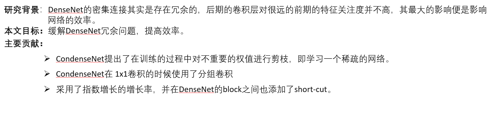

# 语音关键词检测算法
***
>以下内容来自《基于神经网络的语音关键词检索方法研究》（电子科技大学硕士毕业论文）

运用声学知识和机器学习等方法在海量音频数据库中检索关键词文件的技术被称为**口语内容检测** (Spoken Content Retrieval, **SCR**)。按应用场景SCR技术分为三个类别：**关键词检测** (Keyword Spotting, **KWS**)、口语词检测 (Spoken Term Detection,STD) 以及唤醒词检测 (Wake Up Word Detection,WUW)。

Keyword Spotting 指的是语音设备控制这一类应用，一般来说它的关键词是固定的，关注的是低内存占用，低计算复杂度，低功耗下的高准确率。  
***关键词检测+关键词定位***

## 研究发展
- 基于模板匹配 (Template Matching) 的语音关键词检测方法
- 基于声学词 (Acoustic KeywordDetection) 模型的语音关键词检测方法
- ***基于端到端神经网络的关键词检测方法***

## 性能评价指标
### 1.Term Weighted Value (TWV)（好像并不是特别普及）

- 命中(Hit):若系统检出的关键词 (黄色线条) 的中间位置处于待检测音频中关键词真实位置 (蓝色线条)左右 0.5s 的时间范围内，称检出关键词为命中。
- 误报(FalseAlarm):对于每个待检测音频中的关键词，系统有且只有一个检出，若检出关键词的中间位置处于待检测音频中关键词真实位置左右 0.5s 范围之外，称为误报。
- 漏检(Miss):若待检测音频中关键词真实位置左右 0.5s范围之内无检出关键词，称为漏检。
### 2.最小标准化交叉熵 (Minimum Normalized Cross Entropy Cost) 
语音关键词检
测领域中的重要指标之一，用于衡量系统评分的准确性。相较于传统的精确度分数，涵盖了更多的信息，最理想的系统得到标准化交叉熵的值应趋近于 0，若值趋近于 1 表示系统性能较差。
### 3.ATWV 与 MTWV
### 4.交并比
交并比是目标检测的评价体系中最为基础的评价指标之一，用于衡量模型生成的目标窗口与真实标记窗口之间的交叠程度。
***
>以下内容来自López-Espejo I, Tan Z H, Hansen J H L, et al. Deep spoken keyword spotting: An overview[J]. IEEE Access, 2021, 10: 4169-4199.

语音助手的一个显著特征是，为了使用，它们首先必须通过说出的唤醒词或关键字来激活，从而避免在不需要时运行计算成本高得多的自动语音识别（ASR）

基于大词汇连续语音识别(LVCSR)的KWS系统的优点之一是可以灵活地处理不断变化/未预定义的关键字（尽管当关键字不在词汇表中时，性能通常会下降）。主要缺点可能存在于计算复杂性维度：这些系统需要生成丰富的晶格，这需要高计算资源，还引入了延迟。虽然这对于离线音频搜索等一些应用程序来说不应该是一个问题，但LVCSR系统不适合用于可穿戴设备，其特点是显著的记忆、计算和功率限制.

使用关键字/填充隐藏马尔可夫模型（HMM）方法关键字/填充隐藏马尔可夫模型（HMM）方法的KWS系统相当紧凑且性能良好，但它仍然需要维特比解码

因为第一个深度口语KWS系统的发布，2014年是KWS技术的一个里程碑。在这种范式中，DNN产生的单词后验概率序列被直接处理，以确定关键词的可能存在，而无需任何HMM的干预。
#### 深度口语KWS系统优点
- 它不需要复杂的序列搜索算法（即Viterbi解码）
- 产生后验（声学模型）的DNN的复杂性可以很容易地调整以适应计算资源约束
- 在干净和有噪声的条件下，在小内存足迹（即低内存和低计算复杂度）的场景中，它比关键字/填充HMM方法带来了一致的显著改进

## 深度口语KWS系统(Deep Spoken Keyword Spotting Approach)

>后验概率是指通过调查或其它方式获取新的附加信息，利用贝叶斯公式对先验概率进行修正，而后得到的概率。先验概率和后验概率的区别：先验概率不是根据有关自然状态的全部资料测定的，而只是利用现有的材料(主要是历史资料)计算的；后验概率使用了有关自然状态更加全面的资料，既有先验概率资料，也有补充资料；

#### 系统由三个主要块组成
- 语音特征提取器将输入信号转换为**紧凑**的语音表示(紧凑是为了限制计算复杂度)
- 基于深度学习的声学模型根据语音特征在不同的关键字和填充（非关键字）类上产生后验
- 后验处理程序处理后验的时间序列，以确定输入信号中可能存在关键字

.png)

语音特征为K维T个时间步：  

是否重叠分割窗口结果可能不同：  
  

使用Softmax激活的全连接层作为输出层

## 语音特征提取
### 1.Mel-scale-related features（MFCC之类的）
### 2.RNN特征
递归神经网络（RNN）有助于将可变长度的数据序列总结为固定长度的紧凑特征向量，也称为嵌入。由于这一事实，RNN非常适合于模板匹配问题。
### 3.低精度特征
目的是为了减小内存与算力开销，使用2位或8位表示的log-Mel频谱特征性能下降微不足道。
### 4.可学习的FBank(LEARNABLE FILTERBANK FEATURES)

## 声学模型
### 1.全连接前馈神经网络
单值分解滤波器（SVDF）和尖峰神经网络（SNN）是前馈神经网络的低计算资源替代品，通过低秩近似来近似全连接层，SVDF实现了将第一个深度KWS系统的FFNN声学模型大小减少75%，而性能没有下降（SVDF神经网络是堆叠的一维卷积神经网络的特殊情况）。SNN是受人脑启发的神经网络,可以产生与等效人工神经网络类似的KWS性能，同时分别提供超过80%和数十倍的计算成本降低和节能。
### 2.CNN
CNN的一个吸引人的特征是，通过调整不同的超参数，如滤波器跨步、内核和池大小，可以很容易地限制模型的乘法次数，以满足计算约束。  
TC ResNet、CNNs、CRNNs、AdderNet、深度可分离神经网络（DS-CNNs）

理想的基于CNN的现代声学模型应该包括以下三个方面：
- 利用长时间-频率相关性的机制，例如使用时间卷积或扩展卷积
- 深度可分离卷积，在不牺牲性能的情况下显著减少模型的内存占用和计算
- 残差链接，可快速有效地训练更深层次的模型，从而增强KWS性能
### 3.RNN，TDNN
TDNN（Time Delay Neural Network，时延神经网络）用于处理序列数据。  
LSTM神经网络克服了标准RNN遇到的爆炸和消失梯度问题，双向LSTM（BiLSTM）可以捕获因果和反因果依赖关系，以提高KWS性能，GRU比LSTM需要更少的内存，训练速度更快，同时执行类似甚至更好。  
CRNN，卷积层对语音的局部频谱-时间相关性进行建模，然后，递归层通过对语音信号中的长期时间依赖性进行建模来效仿。卷积层对语音的局部频谱-时间相关性进行建模，然后，递归层通过对语音信号中的长期时间依赖性进行建模来效仿。

- #### CTC
    CTC让模型在训练时无监督地定位和对齐语音单元标签。换句话说，训练不需要目标标签序列的帧级对准。
- ####  SEQUENCE-TO-SEQUENCE MODELS
    由于CTC的条件独立性假设，所以一般配合外部语言模型使用。Seq2Seq更加方便，后续还有RNN-T等。

- #### 注意力机制
    在Seq2Seq模型中，无论输入序列的（可变）长度如何，编码器都必须将所有需要的信息压缩成一个固定维向量，这可能具有挑战性。与人类的听力注意力类似，注意力机制可能通过关注更有可能包含关键词的语音部分来帮助解决这一问题。结合注意力可以提高KWS的性能。

### 4.声学模型训练
#### 损失函数
- 交叉熵损失函数（CE）
- 最大池化损失函数（max-pooling loss）
#### 优化器
- SGD
- Adam
## 后验处理
### 非流式模式
非流模式是指独立输入段的标准多类分类，每个独立输入段包括单个单词（即孤立单词分类）。为了覆盖整个单词的持续时间，输入段必须足够长，例如大约1秒长。在这种模式中，通常，给定输入段X{i}，这被分配给具有最高后验概率的类。由于经验告诉非流化深度KWS系统倾向于产生非常峰值的后验分布，因此这种方法优于选择产生高于要设置的灵敏度（决策）阈值的后验的类。这可能归因于这样一个事实，即非流式系统不必像动态情况下那样处理类间转换数据，而是使用定义良好的隔离类实现。*(明明每个字都认识，但放一起就完全看不懂了。。。)*
### 流式模式
流模式指对输入音频流的连续处理（通常是实时的），其中关键字不被隔离/分割。因此，在这种模式下，任何给定的片段都可能包含也可能不包含关键字（部分）。在这种情况下，声学模型产生（原始）后验的时间序列具有强的局部相关性。
## 鲁棒性
### 前端方法
前端方法是指在语音信号被馈送到深度模型之前修改语音信号的那些技术。
#### 1.远场增益控制
距离衰减，背景噪声和混响可能特别有害。
自动增益控制（Automatic Gain Control，AGC）背后的原理是基于根据语音是否存在来选择性地放大音频信号，这种类型的选择性放大能够在远场场景中显著减少漏检。  
每通道能量归一化(Per-Channel Energy Normalization，PCEN)，PCEN的一个吸引人的方面是它的所有运算都是可微分的。因此，PCEN可以集成在DNN声学模型中，以便在声学模型训练期间舒适地调整其参数集。
#### 2.DNN特征增强
- 增强掩模估计
- 噪声估计
- 干净语音估计
- 滤波器参数估计
#### 3.自适应噪声抵消
考虑到语音助手的使用情况，谷歌开发了一系列基于双麦克风自适应噪声消除（ANC）的噪声鲁棒KWS方法，以特别处理语音干扰
#### 4.波束成形(BEAMFORMING)
空间滤波，也称为波束成形，除了时间和频率信息外，还可以利用空间线索来提高语音增强质量。类似于上述DNN特征增强的情况，KWS在波束成形的集成方面落后于ASR几步。
### 后端方法
后端方法是指在声学模型中应用的技术，主要提高其对各种声学条件的泛化能力。本小节的其余部分专门讨论以下问题：多风格和对抗性训练、对关键字数据稀缺的鲁棒性、类不平衡问题和其他后端方法。
#### 1.多风格训练
KWS声学模型的多风格训练是处理背景噪声和混响的最流行和有效的后端方法之一，多风格训练具有一定的正则化效果，可以防止过拟合。
#### 2.对抗性训练
通过平滑声学模型的分布来提高鲁棒性。
#### 3.对关键字数据稀缺性的鲁棒性
就是TTS生成训练语料.......
#### 4.类平衡问题
类不平衡问题指的是这样一个事实，即通常可用于KWS声学模型训练的非关键字样本比关键字样本多得多。
- 生成产生未命中检测的对抗性示例，例如通过FGSM，以类平衡的方式重新训练声学模型
- 通过文本到语音技术，生成额外的合成关键词样本
## 数据集

自然噪声语音：表1中的一些数据集（例如，[17]、[31]、[45]、[56]、[59]、[122]、[152]、[202]）部分或全部是由智能扬声器、智能手机和平板电脑等电子设备在远场条件下多次记录的自然噪声语音创建的。通常，录制场景由带有背景音乐或电视声音的家庭环境组成，因为这是许多KWS系统的目标场景。  
模拟有噪声语音：为KWS设想的其他一些有噪声数据集，例如[15]、[22]、[28]、[31]、[42]、[58]、[93]，部分或全部是通过一种称为数据增强的过程人为扭曲干净语音信号而生成的。通常，在给定一个干净的语音信号的情况下，通过添加不同类型的背景噪声（例如，日常生活噪声，如牙牙学语、咖啡馆、汽车、音乐和街道噪声）来创建它的噪声副本，从而控制产生的信噪比水平（通常在[-5，20]dB范围内）。  
***公开可用的谷歌语音命令数据集[153]，[154]已成为事实上KWS的开放基准***
## 评价指标
- ### 准确率
- ### 接收机工作特性和检测误差折衷曲线（RECEIVER OPERATING CHARACTERISTIC AND DETECTION ERROR TRADE-OFF CURVES）
- ### 精确度-召回率和F-SCORE曲线
## 性能比较

## 视听关键词识别
人类的语音感知是双峰的，因为它依赖于听觉和视觉信息。类似地，语音处理系统（如ASR系统）可以受益于利用视觉信息和音频信息来提高其性能。 
  
首先，提取语音和视觉特征。如今，使用深度学习模型来提取视觉特征似乎是首选的方法，然后，对提取的视听信息进行融合，以便做出关于关键字的存在与否的决定。  
通常，在实践中会考虑以下两种融合策略之一：
- 特征级融合：语音和视觉特征在使用神经网络模型进行联合分类之前以某种方式进行组合（例如，连接）
- 决策级融合：最终决策是由独立的语音和视觉神经网络分类器的决策组合而成。（与特征级融合方案相比，这种性能良好的方法似乎更受青睐，并且比特征级融合更不需要数据。）
视听数据集：Lip Reading in the Wild (LRW)、Lip Reading Sentences 2 (LRS2)、3 (LRS3)
## 未来展望
- 近期的工作将继续专注于同时朝着两个目标推进声学建模：（1）提高真实声学条件下的KWS性能，以及（2）降低计算复杂度。考虑到这两个目标，声学模型研究肯定会主要集中在开发新颖高效的卷积块上。
声学模型压缩具有三个主要优点：（1）减少了内存占用，（2）减少了推理延迟，（3）减少了能耗。所有这些对于例如实现基于鲁棒性目的的设备上声学模型重新训练或个性化关键字包含来说都是至关重要的。声学模型压缩研究无疑将包括模型参数量化、神经网络修剪和知识提取等方法。
- 另一个可能在短期内经历显著增长的研究领域可能是KWS的半监督学习。
- 我们预计KWS个性化在不久的将来将变得更加重要。这意味着我们可以期待新的研究深入到有效的开放词汇（个性化）KWS以及KWS和说话者联合验证等主题。
- 多麦克风进一步提高KWS在现实生活（即噪声）条件下的性能。
***

>以下内容来自Hou J, Zhang L, Fu Y, et al. The npu system for the 2020 personalized voice trigger challenge[J]. arXiv preprint arXiv:2102.13552, 2021.  
## MDTC
多尺度扩张时间卷积(multi-scale dilated temporal convolutional，MDTC)。  
端到端KWS模型MDTC采用T帧FBank（每帧80个Bank）X＝（x1，x2，…，xT）特征作为输入，并输出T个唤醒词(weak-up word,WuW)后验概率Y＝（y1，y2，…，yT）。对于每个时间帧t，一旦其WuW后验概率yt≥γ，唤醒字就被判断为发生了。γ∈（0,1）是一个阈值。

  

### DTC-Block
一个DTC-Block如图(a)所示：
- 首先，使用扩展深度1d卷积网络（***扩展深度TCN***）来获得滤波器大小为（5*1）的时间上下文，并且可以相应地设置扩展率。
- 在扩展深度TCN之后，使用两层 ***逐点卷积（Point Conv）*** 来集成来自不同通道的特征。
- 我们在不同的卷积层之间插入批量归一化（BN）和ReLU激活函数。
- 此外，我们在最后一个Point Conv层之后添加了一个***压缩与激励（seqeeze and exception，SE）模块***(不懂，只查到squeeze and excitation)，以学习不同通道之间的注意力信息。
- 输入和最后一个ReLU激活函数之间的残差连接也被采用，以防止梯度消失和梯度爆炸。
### DTC-Stack
将四个DTC块堆叠成一个DTC堆栈。四个DTC块的膨胀率分别设置为1、2、4和8。每个DTC堆栈的感受野是60帧。
### 模型
- 使用4个DTC堆栈作为特征提取器。特征提取器的接收场为4*60=240帧，其大到足以对WuW进行建模。
- 我们从具有不同感受野的DTC堆栈中提取特征图，并将它们汇总为关键字分类器的输入。
- 对于关键字分类器，使用了一个简单的全连接层.
- 然后是sigmoid输出层

### 训练样本设置
对于正训练话语，我们在WuW区域的中间帧周围选择多达40个帧作为正训练样本，并为它们分配1。正训练话语中的其他帧被丢弃为歧义，并且不在训练中使用。对于负训练话语，所有帧都被视为负训练样本并分配给0。因此，我们的KWS系统被建模为序列二进制分类问题。
### 损失函数
二元交叉熵（binary cross entropy，BCE）损失。

### 计算感受野
下面的公式没有考虑扩张卷积

### 何为DS卷积？
[知乎详解Depthwise Separable Convolution](https://zhuanlan.zhihu.com/p/80041030)
  
  
  
  
这样做的意义是减少参数量，这对KSW来说至关重要！

***
>以下内容来自Lv S, Wang X, Sun S, et al. DCCRN-KWS: an audio bias based model for noise robust small-footprint keyword spotting[J]. arXiv preprint arXiv:2305.12331, 2023.
## DCCRN-KWS
### 摘要
>现实世界中复杂的声学环境，特别是低信噪比的声学环境将给关键词识别系统带来巨大的挑战。受神经语音增强和语音识别中上下文偏差的最新进展的启发，我们提出了一种基于音频上下文偏差的DCCRN-KWS模型来应对这一挑战。我们将整个架构形成为用于去噪和关键字发现的多任务学习框架，其中DCCRN编码器与KWS模型相连接。在去噪任务的帮助下，我们进一步引入了一个音频上下文偏差模块，以利用真实的关键词样本，并对网络进行偏差，从而在噪声条件下更好地区分关键词。特征合并和复杂上下文线性模块也分别被引入以加强这种区分并有效地利用上下文信息。在内部挑战数据集和HIMIYA公共数据集上的实验表明，我们的DCCRN-KWS系统是优越的
### Method
#### 整体架构

#### KWS Module  
DTC  

#### DCCRN
使用复数操作的CRN，见语音增强笔记  
#### 使用ECAPA-TDNN提取keyword的Audio Context Bias  
实际上只是把ECAPA-TDNN作为embedding extractor, 直接使用SpeechBrain实现即可，不用过多考虑。
#### Feature Merge  
具体来说，我们首先初始化一组特征合并比率wi，其中最后一层的比率为1，其他层的比率为0。然后，由于前一编码器层的维数是最后一层的两倍，我们对这两层的输出进行下采样。最后，对编码器各层的输出进行加权平均，得到特征合并输出E′。其中wi是训练期间的可学习权值，在推理期间是固定的。  

(相信自己，能写明白！)  
可以看出，特征合并后的关键字段更加明显，而非关键字段几乎没有变化。

#### Complex Context Linear
首先将编码器的输出分别拆分为实/虚部分，然后分别将实/虚部分与偏差嵌入连接起来。最后，将当前帧(t)和之前帧(t−1,t−2)的上下文特征组合在一起作为全连接层的输入。  
  
这部分也是试着写吧
### Loss  
  

### Experiment  
#### Dataset  
HIMIA 实时加噪声。
### 知识补充  
#### ECAPA-TDNN  
ECAPA-TDNN是说话人识别中基于TDNN的神经网络，是目前最好的单体模型之一  
  
  
  
  

SpeechBrain

***
## Towards On-device Domain Adaptation for Noise-Robust Keyword Spotting  
AICAS 没进CCF分区，简单看。
>Cioflan C, Cavigelli L, Rusci M, et al. Towards on-device domain adaptation for noise-robust keyword spotting[C]//2022 IEEE 4th International Conference on Artificial Intelligence Circuits and Systems (AICAS). IEEE, 2022: 82-85. （苏黎世联邦理工，华为） 
### Abstract
The accuracy of a keyword spotting model deployed on embedded devices often degrades when the system is exposed to real environments with significant noise. In this paper, we explore a methodology for tailoring a model to on-site noises through on-device domain adaptation, while accounting for the edge computing-associated costs. We show that accuracy improvements by up to 18% can be obtained by specialising on difficult, previously unseen noise types, on embedded devices with a power budget in the Watt range, with a storage requirement of 1.1 GB. We also demonstrate an accuracy improvement of 1.43% on an ultra-low power platform consuming few-10 mW, requiring only 1.47 MB of memory for the adaptation stage, at a one-time energy cost of 5.81 J.

当系统暴露在具有显著噪声的真实环境中时，部署在嵌入式设备上的关键词识别模型的准确性通常会降低。在本文中，我们探索了一种通过设备上的域自适应来定制模型以适应现场噪声的方法，同时考虑了边缘计算相关的成本。我们的研究表明，在功耗预算在瓦级、存储需求为1.1 GB的嵌入式设备上，通过专门处理困难的、之前未发现的噪声类型，精度可以提高18%。我们还证明，在功耗仅为-10 mW的超低功耗平台上，精度提高了1.43%，自适应阶段仅需要1.47 MB的内存，一次性能耗为5.81 J。

### Methods
部署后现场采集噪音，加进数据里进行微调以提高目标域的准确度。
### Result

***
## Efficient Execution of Temporal Convolutional Networks for Embedded Keyword Spotting
比较偏向硬件，只有级联神经网络那里有点启发。
> Giraldo J S P, Jain V, Verhelst M. Efficient execution of temporal convolutional networks for embedded keyword spotting[J]. IEEE Transactions on Very Large Scale Integration (VLSI) Systems, 2021, 29(12): 2220-2228.
### Abstract
Recently, the use of keyword spotting (KWS) has become prevalent in mobile devices. State-of-the-art deep learning algorithms such as temporal convolutional networks (TCNs) have been applied to this task achieving superior accuracy results. These models can, however, be mapped in multiple ways onto embedded devices, ranging from real-time streaming inference with or without computational sprinting to delayed batched inference. Although functionally equivalent, these deployment settings, however, strongly impacts average power consumption and latency of this real time task, hence requiring a thorough optimization. This work analyzes the challenges, benefits, and drawbacks of the different execution modes available for TCN-based KWS inference on dedicated hardware. With this objective, this research contributes to: 1) presenting a complete deep learning accelerator optimized for TCN inference; 2) evaluating the impact on performance and power of the different deployment options for TCN inference applied to KWS obtaining up to 8 µW for real-time operation; and 3) optimizing real-time power consumption for KWS inference by exploiting the use of cascaded neural networks (NNs), achieving up to 35% additional power savings

*Index Terms: Artificial neural networks (NNs), automatic speech recognition, digital circuits/digital integrated circuits*

最近，关键字定位(KWS)的使用在移动设备中变得流行。时态卷积网络(TCNs)等最先进的深度学习算法已经应用于这项任务，实现了卓越的准确性结果。然而，这些模型可以以多种方式映射到嵌入式设备上，从有或没有计算冲刺的实时流推理到延迟的批量推理。尽管这些部署设置在功能上是等效的，但是它们会严重影响这个实时任务的平均功耗和延迟，因此需要进行彻底的优化。这项工作分析了在专用硬件上基于TCN的KWS推理可用的不同执行模式的挑战、优点和缺点。以此为目标，本研究有助于:1)提出一个针对TCN推理优化的完整的深度学习加速器；2)评估应用于KWS的TCN推理的不同部署选项对性能和功率的影响，获得高达8 W的实时操作；以及3)通过利用级联神经网络(NNs)来优化KWS推理的实时功耗，实现高达35%的额外节能。

### Method 
只看级联部分  
  
这里仅仅使用第一级检测是否是语音片段，说到底干的还是VAD的活。
### 启发  
想试一下可不可以先用一个简单的计算量少的模型对语音进行二分类，判断是否为关键词，如果为关键词，再进一步判断是哪一个关键词。

***
## Two-stage Strategy for Small-footprint Wake-up-word Speech Recognition System

***
## Keyword transformer: A self-attention model for keyword spotting
>Berg A, O'Connor M, Cruz M T. Keyword Transformer: A Self-Attention Model for Keyword Spotting[C]//Interspeech 2021. ISCA, 2021: 4249-4253.

### Abstract
The Transformer architecture has been successful across many domains, including natural language processing, computer vision and speech recognition. In keyword spotting, self-attention has primarily been used on top of convolutional or recurrent encoders. We investigate a range of ways to adapt the Transformer architecture to keyword spotting and introduce the Keyword Transformer (KWT), a fully self-attentional architecture that exceeds state-of-the-art performance across multiple tasks without any pre-training or additional data. Surprisingly, this simple architecture outperforms more complex models that mix convolutional, recurrent and attentive layers. KWT can be used as a drop-in replacement for these models, setting two new benchmark records on the Google Speech Commands dataset with 98.6% and 97.7% accuracy on the 12 and 35-command tasks respectively

*Index Terms: speech recognition, keyword spotting, Transformers*

Transformer架构在许多领域都取得了成功，包括自然语言处理、计算机视觉和语音识别。在关键字识别中，自注意主要用于卷积或循环编码器之上。我们研究了一系列使Transformer架构适应关键字识别的方法，并介绍了关键字转换器(KWT)，这是一种完全自关注的架构，在没有任何预训练或额外数据的情况下，在多个任务中超越了最先进的性能。令人惊讶的是，这种简单的架构优于混合了卷积层、循环层和关注层的更复杂的模型。KWT可以作为这些模型的临时替代品，在谷歌语音命令数据集上设置了两个新的基准记录，分别在12个和35个命令的任务上具有98.6%和97.7%的准确率.

### 源码
地址：[ARM-Software-github](https://github.com/ARM-software/keywordtransformer)
### Method
此模型和ViT较为接近。  

transformer的输入如下。  
  
其中Xclass和Xpos均为可学习参数。
   
缩放点积注意力，此处与原始transformer一致  

多头注意力输出的连接与原始transformer一致  
  
后面消融实验会谈论这两个区别   
  
残差连接写成两个公式，显得论文更学术一点  
**最后的分类器的输入是类嵌入。**
  

### 知识补充  
#### learned position embedding  

***  
## Speech densely connected convolutional networks for small-footprint keyword spotting
> Tsai T H, Lin X H. Speech densely connected convolutional networks for small-footprint keyword spotting[J]. Multimedia Tools and Applications, 2023: 1-19.(台湾国立中央大学)

### Abstract  
Keyword spotting is an important task for human-computer interaction (HCI). For high privacy, the identification task needs to be performed at the edge, so the purpose of this task is to improve the accuracy as much as possible within the limited cost. This paper proposes a new keyword spotting technique by the convolutional neural network (CNN) method. It is based on the application of densely connected convolutional networks (DenseNet). To make the model smaller, we replace the normal convolution with group convolution and depthwise separable convolution. We add squeeze-and-excitation networks (SENet) to enhance the weight of important features to increase the accuracy. To investigate the effect of different convolutions on DenseNet, we built two models: SpDenseNet and SpDenseNet-L. we validated the network using the Google speech commands dataset. Our proposed network had better accuracy than the other networks even with a fewer number of parameters and floating-point operations (FLOPs).SpDenseNet could achieve an accuracy of 96.3% with 122.63 K trainable parameters and 142.7 M FLOPs. Compared to the benchmark works, only about 52% of the number of parameters and about 12% of the FLOPs are used. In addition, we varied the depth and width of the network to build a compact variant. It also outperforms other compact variants, where SpDenseNet-L-narrow could achieve an accuracy of 93.6% withiri: An On-device DNN-powere 9.27 K trainable parameters and 3.47 M FLOPs. Compared to the benchmark works, the accuracy on SpDenseNet-L-narrow is improved by 3.5%. It only uses only about 47% of the number of parameters and about 48% of the FLOPS.  

*Index Terms: Keyword spotting . DenseNet . Group convolution . Depthwise separable convolution . SENet*

关键词识别是人机交互(HCI)的重要任务。对于高隐私性，识别任务需要在边缘执行，因此该任务的目的是在有限的成本范围内尽可能地提高准确率。本文提出了一种基于卷积神经网络(CNN)的关键词识别技术。它基于密集连接卷积网络(DenseNet)的应用。为了使模型更小，我们用群卷积和深度可分离卷积代替正态卷积。我们增加了挤压激励网络(SENet)来增强重要特征的权重，以提高精度。为了研究不同卷积对DenseNet的影响，我们建立了两个模型:SpDenseNet和SpDenseNet- l。我们使用谷歌语音命令数据集验证了网络。我们提出的网络在参数和浮点运算(FLOPs)数量较少的情况下也比其他网络具有更好的精度。SpDenseNet在122.63 K可训练参数和142.7 M FLOPs的情况下，准确率达到96.3%。与基准工作相比，仅使用了约52%的参数数量和约12%的flop。此外，我们改变了网络的深度和宽度，以建立一个紧凑的变体。它也优于其他紧凑型变体，其中SpDenseNet-L-narrow可以实现93.6%的精度:器件上dnn驱动的9.27 K可训练参数和3.47 M FLOPs。与基准作品相比，SpDenseNet-L-narrow的精度提高了3.5%。它只使用了大约47%的参数数量和大约48%的FLOPS。

### Method  
  
DenseNet通常由一个DenseBlock和一个过渡层组成。过渡层用于压缩两个块层之间的参数，但我们使用池化层而不是过渡层。  
DenseBlock第一层是一个1*1的卷积用来减少通道数，以此来减少模型参数数量。

***
## Condensenet An efficient densenet using learned group convolutions
可学习分组卷积的CondenseNet 
> Huang G, Liu S, Van der Maaten L, et al. Condensenet: An efficient densenet using learned group convolutions[C]//Proceedings of the IEEE conference on computer vision and pattern recognition. 2018: 2752-2761.(康奈尔大学。清华大学，Facebook AI LAB)
 
### Abstract  
Deep neural networks are increasingly used on mobile devices, where computational resources are limited. In this paper we develop CondenseNet, a novel network architecture with unprecedented efficiency. It combines dense connectivity with a novel module called learned group convolution. The dense connectivity facilitates feature re-use in the network, whereas learned group convolutions remove connections between layers for which this feature re-use is superfluous. At test time, our model can be implemented using standard group convolutions, allowing for efficient computation in practice. Our experiments show that CondenseNets are far more efficient than state-of-the-art compact convolutional networks such as ShuffleNets.

深度神经网络越来越多地应用于计算资源有限的移动设备。在本文中，我们开发了一种新的网络结构，具有前所未有的效率。它将密集连接与一种称为学习群卷积的新模块相结合。密集的连通性促进了网络中的特征重用，而学习的群卷积则去除了层之间的连接，因为这种特征重用是多余的。在测试时，我们的模型可以使用标准群卷积来实现，从而在实践中实现高效的计算。我们的实验表明，consenets比最先进的紧凑卷积网络(如ShuffleNets)要高效得多。
### Method
densenet 各个层之间稠密连接，可以实现特征复用，可学习组卷积移除了层之间多余的特征连接。通过把一个层内的filters分成好多组，在训练过程中逐步删除每个组中不重要的特征连接。每个组输入的特征不是人工设计的，也是通过学习得到的。
  

  
  
  
  
  

## Broadcasted Residual Learning for Efficient Keyword Spotting
> Cite as: Kim, B., Chang, S., Lee, J., Sung, D. (2021) Broadcasted Residual Learning for Efficient Keyword Spotting. Proc. Interspeech 2021, 4538-4542, doi: 10.21437/Interspeech.2021-383

对语谱图做卷积？
对MLPMixer感兴趣

### Abstract  
Keyword spotting is an important research field because it plays a key role in device wake-up and user interaction on smart devices. However, it is challenging to minimize errors while operating efficiently in devices with limited resources such as mobile phones. We present a broadcasted residual learning method to achieve high accuracy with small model size and computational load. Our method configures most of the residual functions as 1D temporal convolution while still allows 2D convolution together using a broadcasted-residual connection that expands temporal output to frequency-temporal dimension. This residual mapping enables the network to effectively represent useful audio features with much less computation than conventional convolutional neural networks. We also propose a novel network architecture, Broadcasting-residual network (BC-ResNet), based on broadcasted residual learning and describe how to scale up the model according to the target device’s resources. BC-ResNets achieve state-of-the-art 98.0% and 98.7% top-1 accuracy on Google speech command datasets v1 and v2, respectively, and consistently outperform previous approaches, using fewer computations and parameters.

***Index Terms: keyword spotting, speech command recognition, deep neural network, efficient neural network, residual learning***

关键词识别是一个重要的研究领域，因为它在智能设备上的设备唤醒和用户交互中起着关键作用。然而，在移动电话等资源有限的设备中高效运行的同时最大限度地减少错误是一项挑战。我们提出了一种广播残差学习方法，以小的模型规模和计算量实现高精度。我们的方法将大多数残差函数配置为1D时间卷积，同时仍然允许使用广播残差连接将时间输出扩展到频率-时间维度的2D卷积。这种剩余映射使得网络能够以比传统卷积神经网络少得多的计算来有效地表示有用的音频特征。我们还提出了一种基于广播残差学习的新型网络架构，广播残差网络(BC-ResNet ),并描述了如何根据目标设备的资源来扩展该模型。BC-ResNets在Google语音命令数据集v1和v2上分别实现了98.0%和98.7%的顶级准确率，并且始终优于以前的方法，使用了更少的计算和参数。

### 知识补充  
#### SSN  

