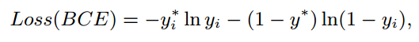
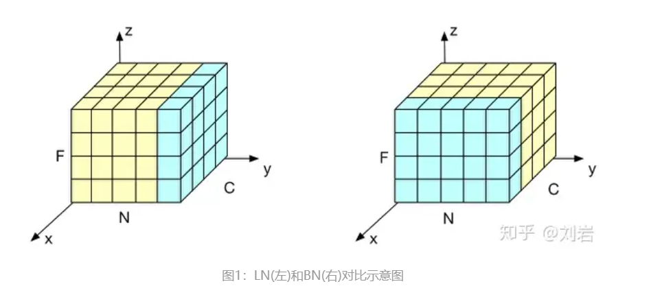
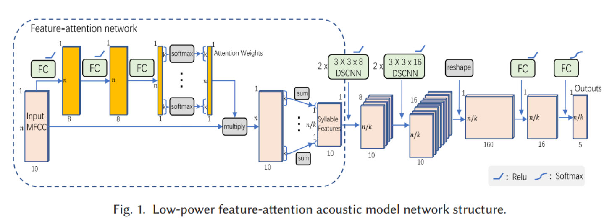
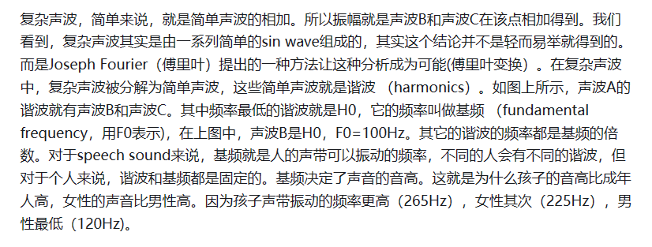
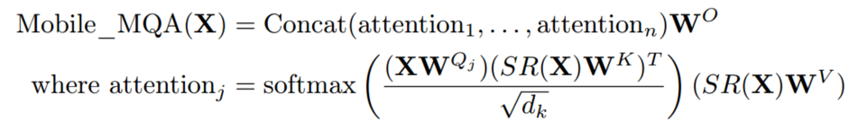
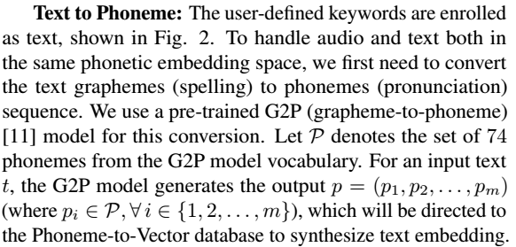

***
<style>
    img {
        width: 50%; /* 图片宽度 */
        border: 1px solid #ccc; /* 边框样式 */
        border-radius: 5px; /* 边框圆角 */
        box-shadow: 2px 2px 5px rgba(0, 0, 0, 0.3); /* 阴影效果 */
        /* 图片居中显示 */
        display: block;
        margin-left: auto;
        margin-right: auto;
    }
</style>

### WAVELET2VEC: A FILTER BANK MASKED AUTOENCODER FOR EEG-BASED SEIZURE SUBTYPE CLASSIFICATIO

**任务**：癫痫亚型分类

**思路**：

提出Wavelet2Vec结构（DWPT滤波 + ViT + MAE）

**方法**：

1. DWPT滤波
先使用DWPT滤波器对EEG的原始信号进行滤波，提取出多个频带
Raw Data: `(B, C, 1, T) --> (B, 6, C, 1, T)`
>DWPT原本是用于运动想象任务的一种滤波器

2. 划分patch：
随后在`C * T`上通过一维卷积划分patch：`(B, 6, C, 1, T) --> (B, 6, 1, C * T) --> (B, 6, dim_embed, num_patch)`

1. MAE
然后随机掩码10%的patch，预训练Encoder

1. 情感分类（微调Encoder）
全连接层

整体结构：
<figure>
< img style="width: 80%" src="image-7.png">
</figure>
******

# 语音关键词检测算法
***
>以下内容来自《基于神经网络的语音关键词检索方法研究》（电子科技大学硕士毕业论文）

运用声学知识和机器学习等方法在海量音频数据库中检索关键词文件的技术被称为**口语内容检测** (Spoken Content Retrieval, **SCR**)。按应用场景SCR技术分为三个类别：**关键词检测** (Keyword Spotting, **KWS**)、口语词检测 (Spoken Term Detection,STD) 以及唤醒词检测 (Wake Up Word Detection,WUW)。

Keyword Spotting 指的是语音设备控制这一类应用，一般来说它的关键词是固定的，关注的是低内存占用，低计算复杂度，低功耗下的高准确率。  
***关键词检测+关键词定位***

## 研究发展
- 基于模板匹配 (Template Matching) 的语音关键词检测方法
- 基于声学词 (Acoustic KeywordDetection) 模型的语音关键词检测方法
- ***基于端到端神经网络的关键词检测方法***

## 性能评价指标
### 1.Term Weighted Value (TWV)（好像并不是特别普及）b

- 命中(Hit):若系统检出的关键词 (黄色线条) 的中间位置处于待检测音频中关键词真实位置 (蓝色线条)左右 0.5s 的时间范围内，称检出关键词为命中。
- 误报(FalseAlarm):对于每个待检测音频中的关键词，系统有且只有一个检出，若检出关键词的中间位置处于待检测音频中关键词真实位置左右 0.5s 范围之外，称为误报。
- 漏检(Miss):若待检测音频中关键词真实位置左右 0.5s范围之内无检出关键词，称为漏检。
### 2.最小标准化交叉熵 (Minimum Normalized Cross Entropy Cost) 
语音关键词检
测领域中的重要指标之一，用于衡量系统评分的准确性。相较于传统的精确度分数，涵盖了更多的信息，最理想的系统得到标准化交叉熵的值应趋近于 0，若值趋近于 1 表示系统性能较差。
### 3.ATWV 与 MTWV
### 4.交并比
交并比是目标检测的评价体系中最为基础的评价指标之一，用于衡量模型生成的目标窗口与真实标记窗口之间的交叠程度。
***
>以下内容来自López-Espejo I, Tan Z H, Hansen J H L, et al. Deep spoken keyword spotting: An overview[J]. IEEE Access, 2021, 10: 4169-4199.

语音助手的一个显著特征是，为了使用，它们首先必须通过说出的唤醒词或关键字来激活，从而避免在不需要时运行计算成本高得多的自动语音识别（ASR）

基于大词汇连续语音识别(LVCSR)的KWS系统的优点之一是可以灵活地处理不断变化/未预定义的关键字（尽管当关键字不在词汇表中时，性能通常会下降）。主要缺点可能存在于计算复杂性维度：这些系统需要生成丰富的晶格，这需要高计算资源，还引入了延迟。虽然这对于离线音频搜索等一些应用程序来说不应该是一个问题，但LVCSR系统不适合用于可穿戴设备，其特点是显著的记忆、计算和功率限制.

使用关键字/填充隐藏马尔可夫模型（HMM）方法关键字/填充隐藏马尔可夫模型（HMM）方法的KWS系统相当紧凑且性能良好，但它仍然需要维特比解码

因为第一个深度口语KWS系统的发布，2014年是KWS技术的一个里程碑。在这种范式中，DNN产生的单词后验概率序列被直接处理，以确定关键词的可能存在，而无需任何HMM的干预。
#### 深度口语KWS系统优点
- 它不需要复杂的序列搜索算法（即Viterbi解码）
- 产生后验（声学模型）的DNN的复杂性可以很容易地调整以适应计算资源约束
- 在干净和有噪声的条件下，在小内存足迹（即低内存和低计算复杂度）的场景中，它比关键字/填充HMM方法带来了一致的显著改进

## 深度口语KWS系统(Deep Spoken Keyword Spotting Approach)

>后验概率是指通过调查或其它方式获取新的附加信息，利用贝叶斯公式对先验概率进行修正，而后得到的概率。先验概率和后验概率的区别：先验概率不是根据有关自然状态的全部资料测定的，而只是利用现有的材料(主要是历史资料)计算的；后验概率使用了有关自然状态更加全面的资料，既有先验概率资料，也有补充资料；


#### 系统由三个主要块组成
- 语音特征提取器将输入信号转换为**紧凑**的语音表示(紧凑是为了限制计算复杂度)
- 基于深度学习的声学模型根据语音特征在不同的关键字和填充（非关键字）类上产生后验
- 后验处理程序处理后验的时间序列，以确定输入信号中可能存在关键字

.png)

语音特征为K维T个时间步：  


是否重叠分割窗口结果可能不同：  
  


使用Softmax激活的全连接层作为输出层

## 语音特征提取
### 1.Mel-scale-related features（MFCC之类的）
### 2.RNN特征
递归神经网络（RNN）有助于将可变长度的数据序列总结为固定长度的紧凑特征向量，也称为嵌入。由于这一事实，RNN非常适合于模板匹配问题。
### 3.低精度特征
目的是为了减小内存与算力开销，使用2位或8位表示的log-Mel频谱特征性能下降微不足道。
### 4.可学习的FBank(LEARNABLE FILTERBANK FEATURES)

## 声学模型
### 1.全连接前馈神经网络
单值分解滤波器（SVDF）和尖峰神经网络（SNN）是前馈神经网络的低计算资源替代品，通过低秩近似来近似全连接层，SVDF实现了将第一个深度KWS系统的FFNN声学模型大小减少75%，而性能没有下降（SVDF神经网络是堆叠的一维卷积神经网络的特殊情况）。SNN是受人脑启发的神经网络,可以产生与等效人工神经网络类似的KWS性能，同时分别提供超过80%和数十倍的计算成本降低和节能。
### 2.CNN
CNN的一个吸引人的特征是，通过调整不同的超参数，如滤波器跨步、内核和池大小，可以很容易地限制模型的乘法次数，以满足计算约束。  
TC ResNet、CNNs、CRNNs、AdderNet、深度可分离神经网络（DS-CNNs）

理想的基于CNN的现代声学模型应该包括以下三个方面：
- 利用长时间-频率相关性的机制，例如使用时间卷积或扩展卷积
- 深度可分离卷积，在不牺牲性能的情况下显著减少模型的内存占用和计算
- 残差链接，可快速有效地训练更深层次的模型，从而增强KWS性能
### 3.RNN，TDNN
TDNN（Time Delay Neural Network，时延神经网络）用于处理序列数据。  
LSTM神经网络克服了标准RNN遇到的爆炸和消失梯度问题，双向LSTM（BiLSTM）可以捕获因果和反因果依赖关系，以提高KWS性能，GRU比LSTM需要更少的内存，训练速度更快，同时执行类似甚至更好。  
CRNN，卷积层对语音的局部频谱-时间相关性进行建模，然后，递归层通过对语音信号中的长期时间依赖性进行建模来效仿。卷积层对语音的局部频谱-时间相关性进行建模，然后，递归层通过对语音信号中的长期时间依赖性进行建模来效仿。

- #### CTC
    CTC让模型在训练时无监督地定位和对齐语音单元标签。换句话说，训练不需要目标标签序列的帧级对准。
- ####  SEQUENCE-TO-SEQUENCE MODELS
    由于CTC的条件独立性假设，所以一般配合外部语言模型使用。Seq2Seq更加方便，后续还有RNN-T等。

- #### 注意力机制
    在Seq2Seq模型中，无论输入序列的（可变）长度如何，编码器都必须将所有需要的信息压缩成一个固定维向量，这可能具有挑战性。与人类的听力注意力类似，注意力机制可能通过关注更有可能包含关键词的语音部分来帮助解决这一问题。结合注意力可以提高KWS的性能。

### 4.声学模型训练
#### 损失函数
- 交叉熵损失函数（CE）
- 最大池化损失函数（max-pooling loss）
#### 优化器
- SGD
- Adam
## 后验处理
### 非流式模式
非流模式是指独立输入段的标准多类分类，每个独立输入段包括单个单词（即孤立单词分类）。为了覆盖整个单词的持续时间，输入段必须足够长，例如大约1秒长。在这种模式中，通常，给定输入段X{i}，这被分配给具有最高后验概率的类。由于经验告诉非流化深度KWS系统倾向于产生非常峰值的后验分布，因此这种方法优于选择产生高于要设置的灵敏度（决策）阈值的后验的类。这可能归因于这样一个事实，即非流式系统不必像动态情况下那样处理类间转换数据，而是使用定义良好的隔离类实现。*(明明每个字都认识，但放一起就完全看不懂了。。。)*
### 流式模式
流模式指对输入音频流的连续处理（通常是实时的），其中关键字不被隔离/分割。因此，在这种模式下，任何给定的片段都可能包含也可能不包含关键字（部分）。在这种情况下，声学模型产生（原始）后验的时间序列具有强的局部相关性。
## 鲁棒性
### 前端方法
前端方法是指在语音信号被馈送到深度模型之前修改语音信号的那些技术。
#### 1.远场增益控制
距离衰减，背景噪声和混响可能特别有害。
自动增益控制（Automatic Gain Control，AGC）背后的原理是基于根据语音是否存在来选择性地放大音频信号，这种类型的选择性放大能够在远场场景中显著减少漏检。  
每通道能量归一化(Per-Channel Energy Normalization，PCEN)，PCEN的一个吸引人的方面是它的所有运算都是可微分的。因此，PCEN可以集成在DNN声学模型中，以便在声学模型训练期间舒适地调整其参数集。
#### 2.DNN特征增强
- 增强掩模估计
- 噪声估计
- 干净语音估计
- 滤波器参数估计
#### 3.自适应噪声抵消
考虑到语音助手的使用情况，谷歌开发了一系列基于双麦克风自适应噪声消除（ANC）的噪声鲁棒KWS方法，以特别处理语音干扰
#### 4.波束成形(BEAMFORMING)
空间滤波，也称为波束成形，除了时间和频率信息外，还可以利用空间线索来提高语音增强质量。类似于上述DNN特征增强的情况，KWS在波束成形的集成方面落后于ASR几步。
### 后端方法
后端方法是指在声学模型中应用的技术，主要提高其对各种声学条件的泛化能力。本小节的其余部分专门讨论以下问题：多风格和对抗性训练、对关键字数据稀缺的鲁棒性、类不平衡问题和其他后端方法。
#### 1.多风格训练
KWS声学模型的多风格训练是处理背景噪声和混响的最流行和有效的后端方法之一，多风格训练具有一定的正则化效果，可以防止过拟合。
#### 2.对抗性训练
通过平滑声学模型的分布来提高鲁棒性。
#### 3.对关键字数据稀缺性的鲁棒性
就是TTS生成训练语料.......
#### 4.类平衡问题
类不平衡问题指的是这样一个事实，即通常可用于KWS声学模型训练的非关键字样本比关键字样本多得多。
- 生成产生未命中检测的对抗性示例，例如通过FGSM，以类平衡的方式重新训练声学模型
- 通过文本到语音技术，生成额外的合成关键词样本
## 数据集

自然噪声语音：表1中的一些数据集（例如，[17]、[31]、[45]、[56]、[59]、[122]、[152]、[202]）部分或全部是由智能扬声器、智能手机和平板电脑等电子设备在远场条件下多次记录的自然噪声语音创建的。通常，录制场景由带有背景音乐或电视声音的家庭环境组成，因为这是许多KWS系统的目标场景。  
模拟有噪声语音：为KWS设想的其他一些有噪声数据集，例如[15]、[22]、[28]、[31]、[42]、[58]、[93]，部分或全部是通过一种称为数据增强的过程人为扭曲干净语音信号而生成的。通常，在给定一个干净的语音信号的情况下，通过添加不同类型的背景噪声（例如，日常生活噪声，如牙牙学语、咖啡馆、汽车、音乐和街道噪声）来创建它的噪声副本，从而控制产生的信噪比水平（通常在[-5，20]dB范围内）。  
***公开可用的谷歌语音命令数据集[153]，[154]已成为事实上KWS的开放基准***
## 评价指标
- ### 准确率
- ### 接收机工作特性和检测误差折衷曲线（RECEIVER OPERATING CHARACTERISTIC AND DETECTION ERROR TRADE-OFF CURVES）
- ### 精确度-召回率和F-SCORE曲线
## 性能比较

## 视听关键词识别
人类的语音感知是双峰的，因为它依赖于听觉和视觉信息。类似地，语音处理系统（如ASR系统）可以受益于利用视觉信息和音频信息来提高其性能。 
  
首先，提取语音和视觉特征。如今，使用深度学习模型来提取视觉特征似乎是首选的方法，然后，对提取的视听信息进行融合，以便做出关于关键字的存在与否的决定。  
通常，在实践中会考虑以下两种融合策略之一：
- 特征级融合：语音和视觉特征在使用神经网络模型进行联合分类之前以某种方式进行组合（例如，连接）
- 决策级融合：最终决策是由独立的语音和视觉神经网络分类器的决策组合而成。（与特征级融合方案相比，这种性能良好的方法似乎更受青睐，并且比特征级融合更不需要数据。）
视听数据集：Lip Reading in the Wild (LRW)、Lip Reading Sentences 2 (LRS2)、3 (LRS3)
## 未来展望
- 近期的工作将继续专注于同时朝着两个目标推进声学建模：（1）提高真实声学条件下的KWS性能，以及（2）降低计算复杂度。考虑到这两个目标，声学模型研究肯定会主要集中在开发新颖高效的卷积块上。
声学模型压缩具有三个主要优点：（1）减少了内存占用，（2）减少了推理延迟，（3）减少了能耗。所有这些对于例如实现基于鲁棒性目的的设备上声学模型重新训练或个性化关键字包含来说都是至关重要的。声学模型压缩研究无疑将包括模型参数量化、神经网络修剪和知识提取等方法。
- 另一个可能在短期内经历显著增长的研究领域可能是KWS的半监督学习。
- 我们预计KWS个性化在不久的将来将变得更加重要。这意味着我们可以期待新的研究深入到有效的开放词汇（个性化）KWS以及KWS和说话者联合验证等主题。
- 多麦克风进一步提高KWS在现实生活（即噪声）条件下的性能。
***

>以下内容来自Hou J, Zhang L, Fu Y, et al. The npu system for the 2020 personalized voice trigger challenge[J]. arXiv preprint arXiv:2102.13552, 2021.  
## MDTC
多尺度扩张时间卷积(multi-scale dilated temporal convolutional，MDTC)。  
端到端KWS模型MDTC采用T帧FBank（每帧80个Bank）X＝（x1，x2，…，xT）特征作为输入，并输出T个唤醒词(weak-up word,WuW)后验概率Y＝（y1，y2，…，yT）。对于每个时间帧t，一旦其WuW后验概率yt≥γ，唤醒字就被判断为发生了。γ∈（0,1）是一个阈值。

  

### DTC-Block
一个DTC-Block如图(a)所示：
- 首先，使用扩展深度1d卷积网络（***扩展深度TCN***）来获得滤波器大小为（5*1）的时间上下文，并且可以相应地设置扩展率。
- 在扩展深度TCN之后，使用两层 ***逐点卷积（Point Conv）*** 来集成来自不同通道的特征。
- 我们在不同的卷积层之间插入批量归一化（BN）和ReLU激活函数。
- 此外，我们在最后一个Point Conv层之后添加了一个***压缩与激励（seqeeze and exception，SE）模块***(不懂，只查到squeeze and excitation)，以学习不同通道之间的注意力信息。
- 输入和最后一个ReLU激活函数之间的残差连接也被采用，以防止梯度消失和梯度爆炸。
### DTC-Stack
将四个DTC块堆叠成一个DTC堆栈。四个DTC块的膨胀率分别设置为1、2、4和8。每个DTC堆栈的感受野是60帧。
### 模型
- 使用4个DTC堆栈作为特征提取器。特征提取器的接收场为4*60=240帧，其大到足以对WuW进行建模。
- 我们从具有不同感受野的DTC堆栈中提取特征图，并将它们汇总为关键字分类器的输入。
- 对于关键字分类器，使用了一个简单的全连接层.
- 然后是sigmoid输出层

### 训练样本设置
对于正训练话语，我们在WuW区域的中间帧周围选择多达40个帧作为正训练样本，并为它们分配1。正训练话语中的其他帧被丢弃为歧义，并且不在训练中使用。对于负训练话语，所有帧都被视为负训练样本并分配给0。因此，我们的KWS系统被建模为序列二进制分类问题。
### 损失函数
二元交叉熵（binary cross entropy，BCE）损失。



### 计算感受野
下面的公式没有考虑扩张卷积

### 何为DS卷积？
[知乎详解Depthwise Separable Convolution](https://zhuanlan.zhihu.com/p/80041030)
  
  
  
  
这样做的意义是减少参数量，这对KSW来说至关重要！

***
>以下内容来自Lv S, Wang X, Sun S, et al. DCCRN-KWS: an audio bias based model for noise robust small-footprint keyword spotting[J]. arXiv preprint arXiv:2305.12331, 2023.
## DCCRN-KWS
### 摘要
>现实世界中复杂的声学环境，特别是低信噪比的声学环境将给关键词识别系统带来巨大的挑战。受神经语音增强和语音识别中上下文偏差的最新进展的启发，我们提出了一种基于音频上下文偏差的DCCRN-KWS模型来应对这一挑战。我们将整个架构形成为用于去噪和关键字发现的多任务学习框架，其中DCCRN编码器与KWS模型相连接。在去噪任务的帮助下，我们进一步引入了一个音频上下文偏差模块，以利用真实的关键词样本，并对网络进行偏差，从而在噪声条件下更好地区分关键词。特征合并和复杂上下文线性模块也分别被引入以加强这种区分并有效地利用上下文信息。在内部挑战数据集和HIMIYA公共数据集上的实验表明，我们的DCCRN-KWS系统是优越的
### Method
#### 整体架构


#### KWS Module  
DTC  

#### DCCRN
使用复数操作的CRN，见语音增强笔记  
#### 使用ECAPA-TDNN提取keyword的Audio Context Bias  
实际上只是把ECAPA-TDNN作为embedding extractor, 直接使用SpeechBrain实现即可，不用过多考虑。
#### Feature Merge  
具体来说，我们首先初始化一组特征合并比率wi，其中最后一层的比率为1，其他层的比率为0。然后，由于前一编码器层的维数是最后一层的两倍，我们对这两层的输出进行下采样。最后，对编码器各层的输出进行加权平均，得到特征合并输出E′。其中wi是训练期间的可学习权值，在推理期间是固定的。  

(相信自己，能写明白！)  
可以看出，特征合并后的关键字段更加明显，而非关键字段几乎没有变化。


#### Complex Context Linear
首先将编码器的输出分别拆分为实/虚部分，然后分别将实/虚部分与偏差嵌入连接起来。最后，将当前帧(t)和之前帧(t−1,t−2)的上下文特征组合在一起作为全连接层的输入。  
  
这部分也是试着写吧
### Loss  
  

### Experiment  
#### Dataset  
HIMIA 实时加噪声。
### 知识补充  
#### ECAPA-TDNN  
ECAPA-TDNN是说话人识别中基于TDNN的神经网络，是目前最好的单体模型之一  
  
  
  
  

SpeechBrain


***
## Towards On-device Domain Adaptation for Noise-Robust Keyword Spotting  
AICAS 没进CCF分区，简单看。
>Cioflan C, Cavigelli L, Rusci M, et al. Towards on-device domain adaptation for noise-robust keyword spotting[C]//2022 IEEE 4th International Conference on Artificial Intelligence Circuits and Systems (AICAS). IEEE, 2022: 82-85. （苏黎世联邦理工，华为） 
### Abstract
The accuracy of a keyword spotting model deployed on embedded devices often degrades when the system is exposed to real environments with significant noise. In this paper, we explore a methodology for tailoring a model to on-site noises through on-device domain adaptation, while accounting for the edge computing-associated costs. We show that accuracy improvements by up to 18% can be obtained by specialising on difficult, previously unseen noise types, on embedded devices with a power budget in the Watt range, with a storage requirement of 1.1 GB. We also demonstrate an accuracy improvement of 1.43% on an ultra-low power platform consuming few-10 mW, requiring only 1.47 MB of memory for the adaptation stage, at a one-time energy cost of 5.81 J.

当系统暴露在具有显著噪声的真实环境中时，部署在嵌入式设备上的关键词识别模型的准确性通常会降低。在本文中，我们探索了一种通过设备上的域自适应来定制模型以适应现场噪声的方法，同时考虑了边缘计算相关的成本。我们的研究表明，在功耗预算在瓦级、存储需求为1.1 GB的嵌入式设备上，通过专门处理困难的、之前未发现的噪声类型，精度可以提高18%。我们还证明，在功耗仅为-10 mW的超低功耗平台上，精度提高了1.43%，自适应阶段仅需要1.47 MB的内存，一次性能耗为5.81 J。

### Methods
部署后现场采集噪音，加进数据里进行微调以提高目标域的准确度。
### Result


***
## Efficient Execution of Temporal Convolutional Networks for Embedded Keyword Spotting
比较偏向硬件，只有级联神经网络那里有点启发。
> Giraldo J S P, Jain V, Verhelst M. Efficient execution of temporal convolutional networks for embedded keyword spotting[J]. IEEE Transactions on Very Large Scale Integration (VLSI) Systems, 2021, 29(12): 2220-2228.
### Abstract
Recently, the use of keyword spotting (KWS) has become prevalent in mobile devices. State-of-the-art deep learning algorithms such as temporal convolutional networks (TCNs) have been applied to this task achieving superior accuracy results. These models can, however, be mapped in multiple ways onto embedded devices, ranging from real-time streaming inference with or without computational sprinting to delayed batched inference. Although functionally equivalent, these deployment settings, however, strongly impacts average power consumption and latency of this real time task, hence requiring a thorough optimization. This work analyzes the challenges, benefits, and drawbacks of the different execution modes available for TCN-based KWS inference on dedicated hardware. With this objective, this research contributes to: 1) presenting a complete deep learning accelerator optimized for TCN inference; 2) evaluating the impact on performance and power of the different deployment options for TCN inference applied to KWS obtaining up to 8 µW for real-time operation; and 3) optimizing real-time power consumption for KWS inference by exploiting the use of cascaded neural networks (NNs), achieving up to 35% additional power savings

*Index Terms: Artificial neural networks (NNs), automatic speech recognition, digital circuits/digital integrated circuits*

最近，关键字定位(KWS)的使用在移动设备中变得流行。时态卷积网络(TCNs)等最先进的深度学习算法已经应用于这项任务，实现了卓越的准确性结果。然而，这些模型可以以多种方式映射到嵌入式设备上，从有或没有计算冲刺的实时流推理到延迟的批量推理。尽管这些部署设置在功能上是等效的，但是它们会严重影响这个实时任务的平均功耗和延迟，因此需要进行彻底的优化。这项工作分析了在专用硬件上基于TCN的KWS推理可用的不同执行模式的挑战、优点和缺点。以此为目标，本研究有助于:1)提出一个针对TCN推理优化的完整的深度学习加速器；2)评估应用于KWS的TCN推理的不同部署选项对性能和功率的影响，获得高达8 W的实时操作；以及3)通过利用级联神经网络(NNs)来优化KWS推理的实时功耗，实现高达35%的额外节能。

### Method 
只看级联部分  
  
这里仅仅使用第一级检测是否是语音片段，说到底干的还是VAD的活。
### 启发  
想试一下可不可以先用一个简单的计算量少的模型对语音进行二分类，判断是否为关键词，如果为关键词，再进一步判断是哪一个关键词。

***
## Two-stage Strategy for Small-footprint Wake-up-word Speech Recognition System


***
## Keyword transformer: A self-attention model for keyword spotting
>Berg A, O'Connor M, Cruz M T. Keyword Transformer: A Self-Attention Model for Keyword Spotting[C]//Interspeech 2021. ISCA, 2021: 4249-4253.

### Abstract
The Transformer architecture has been successful across many domains, including natural language processing, computer vision and speech recognition. In keyword spotting, self-attention has primarily been used on top of convolutional or recurrent encoders. We investigate a range of ways to adapt the Transformer architecture to keyword spotting and introduce the Keyword Transformer (KWT), a fully self-attentional architecture that exceeds state-of-the-art performance across multiple tasks without any pre-training or additional data. Surprisingly, this simple architecture outperforms more complex models that mix convolutional, recurrent and attentive layers. KWT can be used as a drop-in replacement for these models, setting two new benchmark records on the Google Speech Commands dataset with 98.6% and 97.7% accuracy on the 12 and 35-command tasks respectively

*Index Terms: speech recognition, keyword spotting, Transformers*

Transformer架构在许多领域都取得了成功，包括自然语言处理、计算机视觉和语音识别。在关键字识别中，自注意主要用于卷积或循环编码器之上。我们研究了一系列使Transformer架构适应关键字识别的方法，并介绍了关键字转换器(KWT)，这是一种完全自关注的架构，在没有任何预训练或额外数据的情况下，在多个任务中超越了最先进的性能。令人惊讶的是，这种简单的架构优于混合了卷积层、循环层和关注层的更复杂的模型。KWT可以作为这些模型的临时替代品，在谷歌语音命令数据集上设置了两个新的基准记录，分别在12个和35个命令的任务上具有98.6%和97.7%的准确率.

### 源码
地址：[ARM-Software-github](https://github.com/ARM-software/keywordtransformer)
### Method
此模型和ViT较为接近。  

transformer的输入如下。  
  
其中Xclass和Xpos均为可学习参数。
   
缩放点积注意力，此处与原始transformer一致  

多头注意力输出的连接与原始transformer一致  
  
后面消融实验会谈论这两个区别   
  
残差连接写成两个公式，显得论文更学术一点  
**最后的分类器的输入是类嵌入。**
  


### Result  


### 知识补充  
#### learned position embedding  

***  
## Speech densely connected convolutional networks for small-footprint keyword spotting
参数相对大，效果一般，时间比较新，可以作为对比。嘿嘿
> Tsai T H, Lin X H. Speech densely connected convolutional networks for small-footprint keyword spotting[J]. Multimedia Tools and Applications, 2023: 1-19.(台湾国立中央大学)

### Abstract  
Keyword spotting is an important task for human-computer interaction (HCI). For high privacy, the identification task needs to be performed at the edge, so the purpose of this task is to improve the accuracy as much as possible within the limited cost. This paper proposes a new keyword spotting technique by the convolutional neural network (CNN) method. It is based on the application of densely connected convolutional networks (DenseNet). To make the model smaller, we replace the normal convolution with group convolution and depthwise separable convolution. We add squeeze-and-excitation networks (SENet) to enhance the weight of important features to increase the accuracy. To investigate the effect of different convolutions on DenseNet, we built two models: SpDenseNet and SpDenseNet-L. we validated the network using the Google speech commands dataset. Our proposed network had better accuracy than the other networks even with a fewer number of parameters and floating-point operations (FLOPs).SpDenseNet could achieve an accuracy of 96.3% with 122.63 K trainable parameters and 142.7 M FLOPs. Compared to the benchmark works, only about 52% of the number of parameters and about 12% of the FLOPs are used. In addition, we varied the depth and width of the network to build a compact variant. It also outperforms other compact variants, where SpDenseNet-L-narrow could achieve an accuracy of 93.6% withiri: An On-device DNN-powere 9.27 K trainable parameters and 3.47 M FLOPs. Compared to the benchmark works, the accuracy on SpDenseNet-L-narrow is improved by 3.5%. It only uses only about 47% of the number of parameters and about 48% of the FLOPS.  

*Index Terms: Keyword spotting . DenseNet . Group convolution . Depthwise separable convolution . SENet*

关键词识别是人机交互(HCI)的重要任务。对于高隐私性，识别任务需要在边缘执行，因此该任务的目的是在有限的成本范围内尽可能地提高准确率。本文提出了一种基于卷积神经网络(CNN)的关键词识别技术。它基于密集连接卷积网络(DenseNet)的应用。为了使模型更小，我们用群卷积和深度可分离卷积代替正态卷积。我们增加了挤压激励网络(SENet)来增强重要特征的权重，以提高精度。为了研究不同卷积对DenseNet的影响，我们建立了两个模型:SpDenseNet和SpDenseNet- l。我们使用谷歌语音命令数据集验证了网络。我们提出的网络在参数和浮点运算(FLOPs)数量较少的情况下也比其他网络具有更好的精度。SpDenseNet在122.63 K可训练参数和142.7 M FLOPs的情况下，准确率达到96.3%。与基准工作相比，仅使用了约52%的参数数量和约12%的flop。此外，我们改变了网络的深度和宽度，以建立一个紧凑的变体。它也优于其他紧凑型变体，其中SpDenseNet-L-narrow可以实现93.6%的精度:器件上dnn驱动的9.27 K可训练参数和3.47 M FLOPs。与基准作品相比，SpDenseNet-L-narrow的精度提高了3.5%。它只使用了大约47%的参数数量和大约48%的FLOPS。

### Method  
  
DenseNet通常由一个DenseBlock和一个过渡层组成。过渡层用于压缩两个块层之间的参数，但我们使用池化层而不是过渡层。  
DenseBlock第一层是一个1*1的卷积用来减少通道数，以此来减少模型参数数量。  

  


### Result  


***
## Condensenet An efficient densenet using learned group convolutions
可学习分组卷积的CondenseNet 
> Huang G, Liu S, Van der Maaten L, et al. Condensenet: An efficient densenet using learned group convolutions[C]//Proceedings of the IEEE conference on computer vision and pattern recognition. 2018: 2752-2761.(康奈尔大学。清华大学，Facebook AI LAB)
 
### Abstract  
Deep neural networks are increasingly used on mobile devices, where computational resources are limited. In this paper we develop CondenseNet, a novel network architecture with unprecedented efficiency. It combines dense connectivity with a novel module called learned group convolution. The dense connectivity facilitates feature re-use in the network, whereas learned group convolutions remove connections between layers for which this feature re-use is superfluous. At test time, our model can be implemented using standard group convolutions, allowing for efficient computation in practice. Our experiments show that CondenseNets are far more efficient than state-of-the-art compact convolutional networks such as ShuffleNets.

深度神经网络越来越多地应用于计算资源有限的移动设备。在本文中，我们开发了一种新的网络结构，具有前所未有的效率。它将密集连接与一种称为学习群卷积的新模块相结合。密集的连通性促进了网络中的特征重用，而学习的群卷积则去除了层之间的连接，因为这种特征重用是多余的。在测试时，我们的模型可以使用标准群卷积来实现，从而在实践中实现高效的计算。我们的实验表明，consenets比最先进的紧凑卷积网络(如ShuffleNets)要高效得多。
### Method
densenet 各个层之间稠密连接，可以实现特征复用，可学习组卷积移除了层之间多余的特征连接。通过把一个层内的filters分成好多组，在训练过程中逐步删除每个组中不重要的特征连接。每个组输入的特征不是人工设计的，也是通过学习得到的。
  

  
  
  
  
  


## Broadcasted Residual Learning for Efficient Keyword Spotting
> Cite as: Kim, B., Chang, S., Lee, J., Sung, D. (2021) Broadcasted Residual Learning for Efficient Keyword Spotting. Proc. Interspeech 2021, 4538-4542, doi: 10.21437/Interspeech.2021-383(高通)

对语谱图做卷积？
对MLPMixer感兴趣

### Abstract  
Keyword spotting is an important research field because it plays a key role in device wake-up and user interaction on smart devices. However, it is challenging to minimize errors while operating efficiently in devices with limited resources such as mobile phones. We present a broadcasted residual learning method to achieve high accuracy with small model size and computational load. Our method configures most of the residual functions as 1D temporal convolution while still allows 2D convolution together using a broadcasted-residual connection that expands temporal output to frequency-temporal dimension. This residual mapping enables the network to effectively represent useful audio features with much less computation than conventional convolutional neural networks. We also propose a novel network architecture, Broadcasting-residual network (BC-ResNet), based on broadcasted residual learning and describe how to scale up the model according to the target device’s resources. BC-ResNets achieve state-of-the-art 98.0% and 98.7% top-1 accuracy on Google speech command datasets v1 and v2, respectively, and consistently outperform previous approaches, using fewer computations and parameters.

***Index Terms: keyword spotting, speech command recognition, deep neural network, efficient neural network, residual learning***

关键词识别是一个重要的研究领域，因为它在智能设备上的设备唤醒和用户交互中起着关键作用。然而，在移动电话等资源有限的设备中高效运行的同时最大限度地减少错误是一项挑战。我们提出了一种广播残差学习方法，以小的模型规模和计算量实现高精度。我们的方法将大多数残差函数配置为1D时间卷积，同时仍然允许使用广播残差连接将时间输出扩展到频率-时间维度的2D卷积。这种剩余映射使得网络能够以比传统卷积神经网络少得多的计算来有效地表示有用的音频特征。我们还提出了一种基于广播残差学习的新型网络架构，广播残差网络(BC-ResNet ),并描述了如何根据目标设备的资源来扩展该模型。BC-ResNets在Google语音命令数据集v1和v2上分别实现了98.0%和98.7%的顶级准确率，并且始终优于以前的方法，使用了更少的计算和参数。

### Method  
  
  
频域上先做卷积，然后频域通道压缩到一个维度，之后在时域上做卷积，残差连接（这个过程会广播）。

### Experiment  
40-dimensional log Mel spectrograms(Batch_size, 1, 40, T)  
SSN:S=5  
#### Data  
12分类['yes', 'no', 'up', 'down', 'left', 'right', 'on', 'off', 'stop', 'go', 'unknown', 'silence']。“未知单词”类别包含剩余的二十个类中随机抽样的单词。“静音”类别包含从背景噪音音频文件中随机提取的一秒钟的剪辑。（此处我将Unknow Word和Silence数量设置为4000，与其他关键词数量大概一致，8:1:1划分数据）  
40维 log Mel spectrograms, 窗口大小30ms, 帧移10ms, 偏移[-100, 100], 背景噪声概率0.8（只在训练集加噪音？）, SpecAugment两个时间和两个频率掩码, 最小的模型BC-ResNet-1不使用SpecAugment，而BCResNet-{1.5，2，3，6，8}使用具有{1，3，5，7，7}个频率掩码参数的SpecAugment，分别具有固定的时间掩码参数20。(两个时间掩码，两个频率掩码，可以在特征提取结束之后进行，比较随机)
#### Implementation Details  
使用具有五个子带的SSN, 随机梯度下降(SGD)优化器对所有模型进行200个时期的训练，momentum为0.9，weight decay为0.001，小批量大小为100。学习率在前五个时期从零线性增加到0.1，作为预热，然后使用cosine annealing衰减到零.


### Result  
  


### 知识补充  
#### SSN  
没找到相关解释，只有一篇论文，暂时不想看。

## MatchboxNet: 1D Time-Channel Separable Convolutional Neural Network Architecture for Speech Commands Recognition
模型简单，不是很大，结果很不错。
> Cite as: Majumdar, S., Ginsburg, B. (2020) MatchboxNet: 1D Time-Channel Separable Convolutional Neural Network Architecture for Speech Commands Recognition. Proc. Interspeech 2020, 3356-3360, doi: 10.21437/Interspeech.2020-1058(英伟达)

### Abstract  
We present MatchboxNet - an end-to-end neural network for speech command recognition. MatchboxNet is a deep residual network composed from blocks of 1D time-channel separable convolution, batch-normalization, ReLU and dropout layers. MatchboxNet reaches state-of-the art accuracy on the Google Speech Commands dataset while having significantly fewer parameters than similar models. The small footprint of MatchboxNet makes it an attractive candidate for devices with limited computational resources. The model is highly scalable, so model accuracy can be improved with modest additional memory and compute. Finally, we show how intensive data augmentation using an auxiliary noise dataset improves robustness in the presence of background noise.

***Index Terms: key word spotting, speech commands recognition, deep neural networks, depth-wise separable convolution***

我们提出了MatchboxNet -一个用于语音命令识别的端到端神经网络。MatchboxNet是一个深度残差网络，由1D时间-通道可分离卷积、批量归一化、ReLU和丢失层块组成。MatchboxNet在Google Speech Commands数据集上达到了最先进的精度，同时拥有比类似模型少得多的参数。MatchboxNet的小尺寸使其成为计算资源有限的设备的一个有吸引力的候选。该模型是高度可扩展的，因此可以通过适度的额外内存和计算来提高模型的准确性。最后，我们展示了使用辅助噪声数据集的密集数据增强如何在存在背景噪声的情况下提高稳健性。

### Method  
  
  
时域上做卷积，频域放在通道上。 
### Experiment   
时间填充到128.特征是64维的。  
正负5ms时移，加白噪，使用spacAugment.  
也使用了***specCutout***  
  
使用NovoGrad优化器 
- NovoGrad是一种用于深度学习中的优化算法，旨在改进梯度下降的训练过程。它于2019年由Uber AI Labs的研究人员提出，并在计算机视觉任务中展示出了良好的性能。

    NovoGrad的设计灵感来自于传统的动量优化算法和自适应学习率算法，如Adam。它的目标是在梯度更新过程中同时提供动量和自适应的学习率调整。

    与传统的动量方法不同，NovoGrad采用了一种基于梯度的自适应学习率调整策略。在计算梯度的过程中，NovoGrad会估计梯度的二阶矩（即梯度的平方的期望值）并将其用于学习率的调整。

    具体而言，NovoGrad的更新规则如下：

    计算梯度：对于每个参数，计算其关于损失函数的梯度。

    估计梯度的二阶矩：对于每个参数，计算梯度的平方的期望值。

    计算自适应学习率：根据梯度的二阶矩和事先定义的学习率调整参数，计算自适应学习率。

    计算动量：使用计算得到的梯度和自适应学习率，计算梯度下降的动量。

    更新参数：根据计算得到的动量更新参数。

    通过结合动量和自适应学习率调整，NovoGrad可以在训练过程中更好地平衡学习速度和稳定性。它在某些情况下可以提供更快的收敛速度和更好的泛化性能。
    在PyTorch中，NovoGrad算法的参数主要与学习率调整和优化器的配置相关。以下是NovoGrad算法中的一些重要参数：

    lr（学习率）：学习率控制每次参数更新的步长。在NovoGrad中，学习率可以自适应地调整，但初始学习率仍然是一个重要的参数。

    betas：这是一个包含两个浮点数的元组，用于配置动量的衰减率。通常，第一个元素是动量衰减的初始值，第二个元素是用于计算梯度平方的二阶矩的衰减率。

    weight_decay（权重衰减）：权重衰减是一种正则化方法，它通过对模型参数的更新进行惩罚来避免过拟合。在NovoGrad中，可以通过设置weight_decay参数来控制权重衰减的程度。

    eps：用于数值稳定性的小常数。在计算梯度的二阶矩时，为了避免除以零的情况，通常会添加一个很小的常数（如eps）。  
    
使用Warmup-HoldDecay学习率调度


### Result  
v1-30, v2-35  
  
v2-12  
*很好的结果*  
  
参数增加模型精度在上升  


通过噪声增强数据进行训练后，在干净的测试集上的精度也会增加。
  

上图是用噪音增强关键词数据  
下图是增加了两个分类“背景噪音”和“背景声音”
  
参数越多抗噪性也越好  


## SUBSPECTRAL NORMALIZATION FOR NEURAL AUDIO DATA PROCESSING  

> Chang S, Park H, Cho J, et al. Subspectral normalization for neural audio data processing[C]//ICASSP 2021-2021 IEEE International Conference on Acoustics, Speech and Signal Processing (ICASSP). IEEE, 2021: 850-854. (高通)

### Abstract  
Convolutional Neural Networks are widely used in various machine learning domains. In image processing, the features can be obtained by applying 2D convolution to all spatial dimensions of the input. However, in the audio case, frequency domain input like Mel-Spectrogram has different and unique characteristics in the frequency dimension. Thus, there is a need for a method that allows the 2D convolution layer to handle the frequency dimension differently. In this work, we introduce SubSpectral Normalization (SSN), which splits the input frequency dimension into several groups (sub-bands) and performs a different normalization for each group. SSN also includes an affine transformation that can be applied to each group. Our method removes the inter-frequency deflection while the network learns a frequency-aware characteristic. In the experiments with audio data, we observed that SSN can efficiently improve the network’s performance.

***Index Trerms: SubSpectral Normalization, CNNs, Audio***

卷积神经网络广泛应用于各种机器学习领域。在图像处理中，可以通过对输入的所有空间维度应用2D卷积来获得特征。然而，在音频情况下，像Mel频谱图这样的频域输入在频率维度上具有不同且独特的特征。因此，需要一种允许2D卷积层不同地处理频率维度的方法。在这项工作中，我们引入了子频谱归一化(SSN)，它将输入频率维度分成几个组(子带)，并对每个组执行不同的归一化。SSN还包括一个仿射变换，可以应用于每个组。我们的方法消除了频率间偏差，同时网络学习频率感知特性。在对音频数据的实验中，我们观察到SSN可以有效地提高网络的性能。

### Introduction  
  
卷积平等的处理水平和垂直方向上的数据，比较适合图像，但是语音特征在垂直方向上，不同的频率维度具有不同的特征。所以普通卷积和归一化可能不是特别适合。  
对不同的频带进行不同的卷积，参数量和计算量太大，使用SSN来解决这个问题。
###  SUBSPECTRAL NORMALIZATION(子频谱归一化，SSN)  
配合Mel-Spectrogram(梅尔频谱图)特征(也可以不配合)
- 将频率维度分成多个子带，并对每个组进行归一化。
- SSN可以归一化每个子频带，并且允许卷积滤波器表现得像仅具有小的附加参数的多个滤波器一样。
- SSN可以通过仅替换模型的归一化层来提高性能。  
  
***公式***  
  
***代码***  
  
并且为了有效的计算，频率组被均等地划分。  
如果后面接卷积层，可以达到模拟对不同的频带进行不同的卷积操作的效果  
  
>   

### Experiment  
dataset: GSC V1(MFCC-40)  
 
平均有1%的提升，res-15多训练几轮有1.7%提升   

  
随机初始化BN参数和训练得到的BN参数效果差别不大，并且在频带上分布不均匀。使用SSN的数据在频带上分布更均匀，每个子频带分别进行仿射变换，还可以使频率信息嵌入子带。

### 知识补充  

#### Batch Normalization  
可以很好的比较不同batch间的差距

  
  

#### Layer Normalization  
可以很好的比较不同通道间的差距
batch normalization 的局限：   
-   
  
在layer方向上做Normalization
  
  
LN和BN对比  
- 理解上  
    
- 应用场景上  
    
- 训练和测试时有无区别  
  
#### Instance Normalization  
聚焦于每个batch每个通道不同维度之间的差距（主要用于风格迁移，在风格迁移中，每个像素点都很重要。）  
Instance Normalization（IN），一种更适合对单个像素有更高要求的场景的归一化算法（IST，GAN等）。IN的算法非常简单，计算归一化统计量时考虑单个样本，单个通道的所有元素。IN（右）和BN（中）以及LN（左）的不同从图1中可以非常明显的看出。 

  

**两个不要使用IN的场景：**
- MLP或者RNN中：因为在MLP或者RNN中，每个通道上只有一个数据，这时会自然不能使用IN；
- Feature Map比较小时：因为此时IN的采样数据非常少，得到的归一化统计量将不再具有代表性。
#### Group Normalization   
> 吴育昕-何恺明  针对batchsize小的情况下BN效果不好，提出了Group Normalization，四两拨千斤。  
> 
  


```python
由此可以看出，GN和BN是有很多相似之处的，代码相比较BN改动只有一两行而已，论文给出的代码实现如下：
def GroupNorm(x, gamma, beta, G, eps=1e-5):
    # x: input features with shape [N,C,H,W]
    # gamma, beta: scale and offset, with shape [1,C,1,1]
    # G: number of groups for GN
    N, C, H, W = x.shape
    x = tf.reshape(x, [N, G, C // G, H, W])
    mean, var = tf.nn.moments(x, [2, 3, 4], keep dims=True)
    x = (x - mean) / tf.sqrt(var + eps)
    x = tf.reshape(x, [N, C, H, W])
    return x * gamma + beta
```  
 


## UniKW-AT: Unified Keyword Spotting and Audio Tagging
> Dinkel, H., Wang, Y., Yan, Z., Zhang, J., Wang, Y. (2022) UniKW-AT: Unified Keyword Spotting and Audio Tagging. Proc. Interspeech 2022, 3238-3242, doi: 10.21437/Interspeech.2022-607(小米)  

没有提出具体模型，提出了一种训练方法？
### Abstract  
Within the audio research community and the industry, keyword spotting (KWS) and audio tagging (AT) are seen as two distinct tasks and research fields. However, from a technical point of view, both of these tasks are identical: they predict a label (keyword in KWS, sound event in AT) for some fixed-sized input audio segment. This work proposes UniKW-AT: An initial approach for jointly training both KWS and AT. UniKW-AT enhances the noise-robustness for KWS, while also being able to predict specific sound events and enabling conditional wakeups on sound events. Our approach extends the AT pipeline with additional labels describing the presence of a keyword. Experiments are conducted on the Google Speech Commands V1 (GSCV1) and the balanced Audioset (AS) datasets. The proposed MobileNetV2 model achieves an accuracy of 97.53% on the GSCV1 dataset and an mAP of 33.4 on the AS evaluation set. Further, we show that significant noise-robustness gains can be observed on a real-world KWS dataset, greatly outperforming standard KWS approaches. Our study shows that KWS and AT can be merged into a single framework without significant performance degradation.

***Index Terms: key-word spotting, audio tagging, convolutional neural networks, weakly supervised learning***

在音频研究社区和行业内，关键词识别(KWS)和音频标记(AT)被视为两个不同的任务和研究领域。然而，从技术的角度来看，这两个任务是相同的:它们预测某个固定大小的输入音频片段的标签(KWS中的关键字，AT中的声音事件)。这项工作提出了UniKW-AT:联合训练KWS和AT的初步方法。UniKW-AT增强了KWS的噪声鲁棒性，同时还能够预测特定的声音事件，并实现对声音事件的条件唤醒。我们的方法使用描述关键字存在的附加标签来扩展AT管道。实验在谷歌语音命令V1 (GSCV1)和平衡音频集(AS)数据集上进行。提出的MobileNetV2模型在GSCV1数据集上实现了97.53%的准确率，在AS评估集上实现了33.4的mAP。此外，我们表明，在真实世界的KWS数据集上可以观察到显著的噪声鲁棒性增益，大大优于标准的KWS方法。我们的研究表明，KWS和at可以合并到一个框架中，而不会显著降低性能。

### Introduction  
**动机：**  
从技术角度来看，KWS和AT在实现上是相同的。具体来说，给定某个特定长度(例如1秒)的输入样本，这两个任务的目标都是提供一个输出标签，表示关键字(KWS)或声音事件(AT)的存在。   

文章提出了***统一关键词音频标记(UniKW-AT)***，它能够使用单个模型联合建模这两个任务。  

UniKW-AT的潜在好处是提高了KWS模型对真实世界噪声(如音乐)的稳健性，并有可能向用户提供声音事件信息。额外的好处是能够将不同类型的语音合并到KWS后处理中，例如耳语或儿童语音。  

**存在问题：**  
1. 训练大规模AT模型利用弱监督训练，KWS模型通常在强监督下训练.  
2. 用多标签目标来训练AT模型，因为多个声音事件可以在某个时间段内同时发生，例如，当人们在说话时背景中播放音乐。相反，标准KWS模型通常使用单标签目标(如分类交叉熵)来训练。  

**核心贡献：**  
首次尝试联合KWS和at建模，重点是抗噪声KWS性能和声音事件检测能力。

### Method  
我们的方法通过将KWS标签视为标准AT训练框架内的额外目标事件来联合模拟KWS和AT。给定具有K个关键字的目标KWS标签集LKWS和具有C个声音事件的AT标签集LAT，我们的目标是通过合并两个标签集来建模这两个任务，获得L = LKWS ∪ LAT。具体来说，我们的方法使用Audioset (AS) [15] as LAT的C = 527个声音事件标签。为KWS训练的模型通常在其标签集中包含非目标标签，也称为“噪声”。在UniKW-AT的情况下，不需要这个额外的“噪声”标签，因为大多数类型的噪声已经包含在LAT标签集中。我们的方法首先将所有K个目标关键词附加到作为标签可用的C = 527，产生C + K个目标标签。包含在KWS数据集中的所有非目标关键词被映射到LAT中的“语音”标签。  
将KWS数据集和AT数据集（弱监督数据，通过预训练模型生成估计软标签）裁剪到相同长度 ，527+10=537个分类 
使用BCE损失（多分类是怎么用的？）。

  


### 知识补充  
#### Audio Tagging(音频标记)  
音频标记（Audio Tagging）是指通过分析音频数据，将其与特定的标签或类别关联起来的任务。音频标记的目标是自动识别和分类音频中的声音内容，例如音乐、语音、环境声等。

音频标记在许多应用领域都具有重要的应用价值，例如音乐信息检索、语音识别、音频分类和标签推荐等。以下是音频标记的一些常见应用：  
1. 音乐分类：音频标记可以用于对音乐进行分类，例如将音乐分为不同的流派（摇滚、流行、古典等）或情绪（快乐、悲伤、激动等）。音乐分类：音频标记可以用于对音乐进行分类，例如将音乐分为不同的流派（摇滚、流行、古典等）或情绪（快乐、悲伤、激动等）。  
2. 语音识别：音频标记可用于语音识别任务，通过将音频标记为不同的语音类别（例如字母、单词、短语）来识别和转录音频中的语音内容。  
3. 环境声识别：音频标记可以用于识别和分类环境声音，例如车辆噪音、自然声音（鸟鸣、风声）或人类活动声音（笑声、尖叫声）等。  
4. 声音事件检测：音频标记可用于检测特定声音事件的出现和发生，例如爆炸声、狗吠声、汽车喇叭声等。  
   
AT模型的当前应用之一是帮助听力受损的人，以通知用户发生了用户听不到的一些事件，例如敲门。


## Latency Control for Keyword Spotting
> Jose, C., Wang, J., Strimel, G., Khursheed, M.O., Mishchenko, Y., Kulis, B. (2022) Latency Control for Keyword Spotting. Proc. Interspeech 2022, 1891-1895, doi: 10.21437/Interspeech.2022-10608(亚马逊)

### Abstract  
Conversational agents commonly utilize keyword spotting (KWS) to initiate voice interaction with the user. For user experience and privacy considerations, existing approaches to KWS largely focus on accuracy, which can often come at the expense of introduced latency. To address this tradeoff, we propose a novel approach to control KWS model latency and which generalizes to any loss function without explicit knowledge of the keyword endpoint. Through a single, tunable hyperparameter, our approach enables one to balance detection latency and accuracy for the targeted application. Empirically, we show that our approach gives superior performance under latency constraints when compared to existing methods. Namely, we make a substantial 25% relative false accepts improvement for a fixed latency target when compared to the baseline state-of-the-art. We also show that when our approach is used in conjunction with a max-pooling loss, we are able to improve relative false accepts by 25% at a fixed latency when compared to cross entropy loss.  

***Index Terms: keyword spotting, speech recognition, wake
word detection, convolutional neural network***

对话代理通常利用关键词识别(KWS)来启动与用户的语音交互。出于用户体验和隐私考虑，现有的KWS方法主要关注准确性，这通常会以引入延迟为代价。为了解决这个权衡，我们提出了一种新的方法来控制KWS模型的延迟，并推广到任何损失函数没有明确的知识的关键字端点。通过单个可调超参数，我们的方法可以平衡目标应用的检测延迟和精度。根据经验，我们表明，与现有方法相比，我们的方法在延迟约束下提供了更好的性能。也就是说，与基线最先进水平相比，我们在固定延迟目标下实现了25%的相对错误接受率改善。我们还表明，当我们的方法与最大池损失结合使用时，与交叉熵损失相比，我们能够在固定延迟下将相对错误接受率改善25%
### Introduction  
**动机：**  
为了降低延迟  
### Method  
介绍了一种使用损失函数来训练KWS模型的方法，该方法允许延迟控制，而无需标记关键字的精确对齐。所提出的损失函数是最大汇集损失的一般化，其基于概率将为正例选择的比对移动到更早的帧，迫使模型发出更早的检测峰值。通过改变这种概率，可以容易地调整KWS模型准确性和等待时间之间的平衡，而无需准确了解关键词端点。

#### MaxPooling Loss  
  
**优点：**  
1. 训练数据所需的对齐信息显著减少，因为仅需要使用位置的噪声估计来裁剪包含(但不精确对齐)关键词的音频片段。这可以显著减少数据准备/注释开销，并避免由不良对齐(如关键字的剪切)引入的错误。  
2. 与预先选择的比对相比，允许模型选择最大后验概率导致经验性能的改善。  

  
虽然在绿色框结尾处就已经找到了最大峰值，但在整个语音全部结束后才判断并输出结果(从延迟控制的角度来说并不好)。

改进后的MaxPooling Loss  
   
 对于正例，对于概率b，损失不是在最大类后验帧上计算的，而是在前一帧生成的后验帧上计算的。直观地，通过随机评估模型在更早后验概率上的损失，我们预期峰值检测之前的后验概率也将是高的，从而允许更早的检测。随着用户增加参数b，越来越多的重点放在先验后验上。通过改变该参数，用户可以在检测精度和检测延迟之间取得平衡。

注意，在该应用中，模型后验步幅相对较大，因此通过使用伯努利分布值β来推动模型使用先验后验足以减少等待时间；然而，对于具有较小后验间隔时间的检测模型或者需要较大等待时间减少的检测模型，可以使用正分布，例如泊松分布。  

可以推广到任何损失函数。  
经验发现交叉熵对于KWS任务非常有效

### Experiments  
20000h数据，HMM粗略对齐。  
我们使用的延迟指标是相对于关键字结束索引的检测时间，单位为毫秒(ms)。负延迟表示关键字在其完成之前被检测到。  
为了研究检测的准确性，我们使用相对错误接受和相对错误拒绝计数来绘制分析中关键词的检测误差权衡(DET)曲线。

我们使用所提出的方法训练了6个模型，参数值为b ∈ {0.0，0.1，0.2，0.33，0.5，1.0}，其中b = 0相当于标准的最大汇集损失。另外还训练了一个只用交叉熵损失的模型。
  
越接近MaxPooling Loss 效果越好。  


## Max-pooling loss training of long short-term memory networks for small-footprint keyword spotting  
>Sun M, Raju A, Tucker G, et al. Max-pooling loss training of long short-term memory networks for small-footprint keyword spotting[C]//2016 IEEE Spoken Language Technology Workshop (SLT). IEEE, 2016: 474-480.(亚马逊)

### Abstract  
We propose a max-pooling based loss function for training Long Short-Term Memory (LSTM) networks for smallfootprint keyword spotting (KWS), with low CPU, memory, and latency requirements. The max-pooling loss training can be further guided by initializing with a cross-entropy loss trained network. A posterior smoothing based evaluation approach is employed to measure keyword spotting performance. Our experimental results show that LSTM models trained using cross-entropy loss or max-pooling loss outperform a cross-entropy loss trained baseline feed-forward Deep Neural Network (DNN). In addition, max-pooling loss trained LSTM with randomly initialized network performs better compared to cross-entropy loss trained LSTM. Finally, the max-pooling loss trained LSTM initialized with a crossentropy pre-trained network shows the best performance, which yields 67.6% relative reduction compared to baseline feed-forward DNN in Area Under the Curve (AUC) measure.  

***Index Terms: LSTM, keyword spotting, max-pooling loss, small-footprint***

我们提出了一种基于最大池的损失函数，用于训练长短期记忆(LSTM)网络，用于小足迹关键词识别(KWS)，具有低CPU、存储器和延迟要求。可以通过用交叉熵损失训练网络初始化来进一步指导最大汇集损失训练。采用基于后验平滑的评估方法来测量关键词识别性能。我们的实验结果表明，使用交叉熵损失或最大池损失训练的LSTM模型优于交叉熵损失训练的基线前馈深度神经网络(DNN)。此外，与交叉熵损失训练的LSTM相比，具有随机初始化网络的最大池损失训练的LSTM表现更好。最后，用交叉熵预训练网络初始化的最大汇集损失训练的LSTM显示出最佳性能，与曲线下面积(AUC)测量的基线前馈DNN相比，其产生67.6%的相对减少。

  


## Attention-Free Keyword Spotting  
不想看transformer了。都没有KWT98.5%好，但是KWT太大了。
> Morshed M M, Ahsan A O. Attention-free keyword spotting[J]. arXiv preprint arXiv:2110.07749, 2021.(ICLR2022, 伊斯兰技术大学)  
### Abstract  
Till now, attention-based models have been used with great success in the keyword spotting problem domain. However, in light of recent advances in deep learning, the question arises whether self-attention is truly irreplaceable for recognizing speech keywords. We thus explore the usage of gated MLPs—previously shown to be alternatives to transformers in vision tasks—for the keyword spotting task. We provide a family of highly efficient MLP-based models for keyword spotting, with less than 0.5 million parameters. We show that our approach achieves competitive performance on Google Speech Commands V2-12 and V2-35 benchmarks with much fewer parameters than self-attention-based methods.  

到目前为止，基于注意力的模型已经在关键词识别问题领域获得了巨大的成功。然而，鉴于深度学习的最新进展，问题出现了，对于识别语音关键词来说，自我注意是否真的不可替代。因此，我们探索了门控MLP的使用——以前显示为视觉任务中变形金刚的替代物——用于关键字识别任务。我们提供了一系列高效的基于MLP的关键字识别模型，参数不到50万。我们表明，我们的方法在谷歌语音命令V2-12和V2-35基准上取得了有竞争力的性能，比基于自我注意的方法具有更少的参数。

## Advancing Vision Transformers with Group-Mix Attention  
代码开源
> Ge C, Ding X, Tong Z, et al. Advancing Vision Transformers with Group-Mix Attention[J]. arXiv preprint arXiv:2311.15157, 2023.(香港大学， 腾讯AI Lab，蚂蚁，北京大学，香港中文大学，复旦人工智能研究所)  

### Abstract
Vision Transformers (ViTs) have been shown to enhance visual recognition through modeling long-range dependencies with multi-head self-attention (MHSA), which is typically formulated as Query-Key-Value computation. However, the attention map generated from the Query and Key captures only token-to-token correlations at one single granularity. In this paper, we argue that self-attention should have a more comprehensive mechanism to capture correlations among tokens and groups (i.e., multiple adjacent tokens) for higher representational capacity. Thereby, we propose Group-Mix Attention (GMA) as an advanced replacement for traditional self-attention, which can simultaneously capture token-to-token, token-to-group, and group-to-group correlations with various group sizes. To this end, GMA splits the Query, Key, and Value into segments uniformly and performs different group aggregations to generate group proxies. The attention map is computed based on the mixtures of tokens and group proxies and used to re-combine the tokens and groups in Value. Based on GMA, we introduce a powerful backbone, namely GroupMixFormer, which achieves state-of-the-art performance in image classification, object detection, and semantic segmentation with fewer parameters than existing models. For instance, GroupMixFormer-L (with 70.3M parameters and 3842 input) attains 86.2% Top1 accuracy on ImageNet-1K without external data, while GroupMixFormer-B (with 45.8M parameters) attains 51.2% mIoU on ADE20K. Codes and trained models are released in https://github.com/AILab-CVC/GroupMixFormer.  

视觉变压器(vit)已被证明可以通过模拟多头自我注意(MHSA)的远程依赖性来增强视觉识别，多头自我注意通常被公式化为查询键值计算。然而，从查询和关键字生成的注意力图仅在一个单一的粒度上捕获标记到标记的相关性。在本文中，我们认为自我注意应该有一个更全面的机制来捕捉表征和组(即多个相邻的表征)之间的相关性，以获得更高的表征能力。因此，我们提出群组混合注意(GMA)作为传统自我注意的高级替代，它可以同时捕捉不同群组大小的令牌对令牌、令牌对群组以及群组对群组的相关性。为此，GMA将查询、键和值统一分割成段，并执行不同的组聚合来生成组代理。注意力图是基于令牌和组代理的混合来计算的，并用于在值上重新组合令牌和组。基于GMA，我们引入了一个强大的主干，即GroupMixFormer，它以比现有模型更少的参数在图像分类、对象检测和语义分割方面实现了最先进的性能。例如，在没有外部数据的情况下，GroupMixFormer-L(具有70.3M参数和3842个输入)在ImageNet-1K上达到86.2%的Top1准确度，而GroupMixFormer-B(具有45.8M参数)在ADE20K上达到51.2%的mIoU。代码和经过训练的模型在[代码地址](https://github.com/AILab-CVC/GroupMixFormer)发布


### 动机  
In this paper, we argue that self-attention should have a more comprehensive mechanism to capture correlations among tokens and groups (i.e., multiple adjacent tokens) for higher representational capacity. Thereby, we propose Group-Mix Attention (GMA) as an advanced replacement for traditional self-attention, which can simultaneously capture token-to-token, token-to-group, and group-to-group correlations with various group sizes.   


### GroupMixAttention  
  

  
 


## Neighborhood Attention Transformer  
>Hassani A, Walton S, Li J, et al. Neighborhood attention transformer[C]//Proceedings of the IEEE/CVF Conference on Computer Vision and Pattern Recognition. 2023: 6185-6194.(Meta)

### Abstract  
We present Neighborhood Attention (NA), the first efficient and scalable sliding window attention mechanism for vision. NA is a pixel-wise operation, localizing self attention (SA) to the nearest neighboring pixels, and therefore enjoys a linear time and space complexity compared to the quadratic complexity of SA. The sliding window pattern allows NA’s receptive field to grow without needing extra pixel shifts, and preserves translational equivariance, unlike Swin Transformer’s Window Self Attention (WSA). We develop N AT T EN (Neighborhood Attention Extension), a Python package with efficient C++ and CUDA kernels, which allows NA to run up to 40% faster than Swin’s WSA while using up to 25% less memory. We further present Neighborhood Attention Transformer (NAT), a new hierarchical transformer design based on NA that boosts image classification and downstream vision performance. Experimental results on NAT are competitive; NAT-Tiny reaches 83.2% top-1 accuracy on ImageNet, 51.4% mAP on MSCOCO and 48.4% mIoU on ADE20K, which is 1.9% ImageNet accuracy, 1.0% COCO mAP, and 2.6% ADE20K mIoU improvement over a Swin model with similar size. To support more research based on sliding window attention, we open source our project and release our checkpoints.  


我们提出了邻域注意(NA)，第一个有效的和可扩展的视觉滑动窗口注意机制。NA是一种基于像素的操作，将自我关注定位到最近的相邻像素，因此与自我关注的二次复杂度相比，具有线性的时间和空间复杂度。与Swin Transformer的窗口自关注(WSA)不同，滑动窗口模式允许NA的感受野在不需要额外像素移位的情况下增长，并保持平移等方差。我们开发了N AT T EN(Neighborhood Attention Extension)，这是一个具有高效C++和CUDA内核的Python包，它允许NA的运行速度比Swin的WSA快40%,同时使用的内存少25%。我们还提出了邻域注意力转换器(NAT)，这是一种基于NA的新的分层转换器设计，可以提高图像分类和下游视觉性能。NAT上的实验结果是有竞争力的；NAT-Tiny在ImageNet上达到83.2%的顶级准确性，在MSCOCO上达到51.4%的mAP，在ADE20K上达到48.4%的mIoU，与类似大小的Swin模型相比，其ImageNet准确性提高了1.9%，COCO mAP提高了1.0%，ADE20K mIoU提高了2.6%。为了支持更多基于滑动窗口注意力的研究，我们开源了我们的项目并发布了我们的检查点。


### 动机  
ViT二次复杂度，token越多，复杂度越大，并且失去了卷积的归纳偏置。  

### Method  


## DyConvMixer: Dynamic Convolution Mixer Architecture for Open-Vocabulary Keyword Spotting  
>Gharbieh W, Huang J, Wan Q, et al. DyConvMixer: Dynamic convolution mixer architecture for open-vocabulary keyword spotting[C]//Proc. Interspeech. 2022: 5205-5209.(LG)
### Abstract  
User-defined keyword spotting research has been gaining popularity in recent years. An open-vocabulary keyword spotting system with high accuracy and low power consumption remains a challenging problem. In this paper, we propose the DyConvMixer model for tackling the problem. By leveraging dynamic convolution alongside a convolutional equivalent of the MLPMixer architecture, we obtain an efficient and effective model that has less than 200K parameters and uses less than 11M MACs. Despite the fact that our model is less than half the size of state-of-the-art RNN and CNN models, it shows competitive results on the publicly available Hey-Snips and HeySnapdragon datasets. In addition, we discuss the importance of designing an effective evaluation system and detail our evaluation pipeline for comparison with future work.  

***Index Terms:Dynamic Convolution, Open-vocabulary Keyword Spotting, User-defined Keyword Spotting, Query-byExample, ConvMixer***

近年来，用户定义的关键词识别研究越来越受欢迎。具有高准确度和低功耗的开放词汇关键词识别系统仍然是一个具有挑战性的问题。在本文中，我们提出了DyConvMixer模型来解决这个问题。通过利用动态卷积以及MLPMixer架构的卷积等价物，我们获得了一个高效且有效的模型，该模型具有少于200K的参数，并且使用少于11M的MAC。尽管我们的模型不到最先进的RNN和CNN模型的一半，但它在公开可用的Hey-Snips和HeySnapdragon数据集上显示了竞争结果。此外，我们讨论了设计一个有效的评估系统的重要性，并详细说明了我们的评估管道，以便与未来的工作进行比较

### Method  
  

### Extrement  
**Data:** 128个Mel滤波器，81维度MFCC， 帧长25ms,帧移12.5ms，特征形状玩为(通道，频率，时间)(1，81，81)（音频长度为1s），使用CMVN进行归一化。  
CMVN: (Cepstral Mean Variance Normalization) 倒谱均值归一化是一种音频信号处理。它的目的是对音频信号的倒谱系数进行归一化，以减小不同说话人、不同录音条件下的变化，并提高特征的可比性和鲁棒性


## SCConv: Spatial and Channel Reconstruction Convolution for Feature Redundancy 
>Li J, Wen Y, He L. SCConv: Spatial and Channel Reconstruction Convolution for Feature Redundancy[C]//Proceedings of the IEEE/CVF Conference on Computer Vision and Pattern Recognition. 2023: 6153-6162.(华师，同济)  

### Abstract  
Convolutional Neural Networks (CNNs) have achieved remarkable performance in various computer vision tasks but this comes at the cost of tremendous computational resources, partly due to convolutional layers extracting redundant features. Recent works either compress well-trained large-scale models or explore well-designed lightweight models. In this paper, we make an attempt to exploit spatial and channel redundancy among features for CNN compression and propose an efficient convolution module, called SCConv (Spatial and Channel reconstruction Convolution), to decrease redundant computing and facilitate representative feature learning. The proposed SCConv consists of two units: spatial reconstruction unit (SRU) and channel reconstruction unit (CRU). SRU utilizes a separate-and-reconstruct method to suppress the spatial redundancy while CRU uses a split-transform-andfuse strategy to diminish the channel redundancy. In addition, SCConv is a plug-and-play architectural unit that can be used to replace standard convolution in various convolutional neural networks directly. Experimental results show that SCConv-embedded models are able to achieve better performance by reducing redundant features with significantly lower complexity and computational costs.

卷积神经网络(CNN)在各种计算机视觉任务中取得了显著的性能，但这是以巨大的计算资源为代价的，部分原因是卷积层提取了冗余特征。最近的作品要么压缩训练有素的大规模模型，要么探索设计良好的轻量级模型。本文尝试利用特征间的空间和信道冗余进行CNN压缩，并提出了一种有效的卷积模块，称为SCConv(空间和信道重构卷积),以减少冗余计算并促进典型特征学习。提出的SCConv包括两个单元:空间重构单元(SRU)和信道重构单元(CRU)。SRU使用分离-重构方法来抑制空间冗余，而CRU使用分离-变换-融合策略来减少通道冗余。此外，SCConv是一个即插即用的架构单元，可用于直接取代各种卷积神经网络中的标准卷积。实验结果表明，SCConv嵌入式模型能够通过减少冗余特征来实现更好的性能，同时显著降低复杂度和计算成本。  
### Method  


### 文章中提到的卷积  
#### ResNeXt(2017)
[ResNeXt--知乎](https://zhuanlan.zhihu.com/p/32913695)  
  
  
  

#### Xception(2017)  
[Xception--知乎](https://zhuanlan.zhihu.com/p/50897945)
  

#### MobileNet(2018)   
[MobileNet--知乎](https://zhuanlan.zhihu.com/p/261110039)  
基本上就是深度可分离卷积  

#### ShuffleNet(2017)    
动机：上面那些采用深度卷积的网络势必会用到点状卷积，但是点状卷积计算量太大了  
[ShuffleNet--知乎](https://zhuanlan.zhihu.com/p/32304419)  
  
  

#### ShuffleNet_v2(2018)  
  

#### HetConv(2019)  
[HetConv--知乎](https://zhuanlan.zhihu.com/p/59075508)  
动机：  
  
  

#### TiedBlockConv(2020)  
[Tied Block Convolution--知乎](https://zhuanlan.zhihu.com/p/297801114)  
  
  
  
  

******
未汇报
#### SPConv(参数小一点，性能提升非常有限，简单看一看)  
卧槽，华师上边23年那一篇SCConv岂不是照着抄。。。。。。  


#### Ghostnet(相对MobileNet少许提升,0.5%)(这篇文章讲故事的能力值得学习)
卷积神经网络的特征冗余是指在卷积神经网络中，由于卷积层的滤波器数量较多，每个滤波器又会生成一个特征图，这些特征图之间可能存在冗余信息，即某些特征图提取的信息与其他特征图提取的信息重复或高度相关  
   
 因为卷积中存在特征图冗余,所以想法就是使用线性操作用一部分特征图生成另一部分特征图,减少了卷积的使用,就减少了参数量和计算量.
 把常规卷积分成两步进行,第一步进行一半的卷积,第二部分进行深度卷积一对一生成另一半featuremap(就是所谓的线性操作),(其实和原始卷积得到的输出并不是特别一致)  
   
 效果  
 

#### SilmConv(没啥用,唯一的用处是写论文的时候写进综述那部分里)
#### OctConv(提升很有限,不太行 )


## MicroNet: Improving Image Recognition with Extremely Low FLOPs
>Y. Li et al., "MicroNet: Improving Image Recognition with Extremely Low FLOPs," 2021 IEEE/CVF International Conference on Computer Vision (ICCV), Montreal, QC, Canada, 2021, pp. 458-467, doi: 10.1109/ICCV48922.2021.00052.

[MicroNet--知乎](https://zhuanlan.zhihu.com/p/337107958)  
代码: git clone https://github.com/liyunsheng13/micronet.git
 

## SHViT Single-Head Vision Transformer with Memory Efficient Macro Design  
> Yun S, Ro Y. SHViT: Single-Head Vision Transformer with Memory Efficient Macro Design[J]. arxiv preprint arxiv:2401.16456, 2024.

### Abstract  
Recently, efficient Vision Transformers have shown great performance with low latency on resource-constrained devices. Conventionally, they use 4×4 patch embeddings and a 4-stage structure at the macro level, while utilizing sophisticated attention with multi-head configuration at the micro level. This paper aims to address computational redundancy at all design levels in a memory-efficient manner. We discover that using larger-stride patchify stem not only reduces memory access costs but also achieves competitive performance by leveraging token representations with reduced spatial redundancy from the early stages. Furthermore, our preliminary analyses suggest that attention layers in the early stages can be substituted with convolutions, and several attention heads in the latter stages are computationally redundant. To handle this, we introduce a single-head attention module that inherently prevents head redundancy and simultaneously boosts accuracy by parallelly combining global and local information. Building upon our solutions, we introduce SHViT, a SingleHead Vision Transformer that obtains the state-of-the-art speed-accuracy tradeoff. For example, on ImageNet-1k, our SHViT-S4 is 3.3×, 8.1×, and 2.4× faster than MobileViTv2 ×1.0 on GPU, CPU, and iPhone12 mobile device, respectively, while being 1.3% more accurate. For object detection and instance segmentation on MS COCO using MaskRCNN head, our model achieves performance comparable to FastViT-SA12 while exhibiting 3.8× and 2.0× lower backbone latency on GPU and mobile device, respectively.

近期，高效的视觉 Transformer 在资源受限的设备上展现出优异的低延迟性能。传统上，它们在宏观层面上采用4×4的块嵌入和4阶段结构，同时在微观层面上使用具有多头配置的复杂注意力机制。

本文旨在以节省内存的方式解决所有设计层面的计算冗余问题。作者发现，使用更大步长的块状处理初始部分不仅能降低内存访问成本，还通过利用早期阶段减少空间冗余的 Token 表示来达到具有竞争力的性能。此外，作者初步分析表明，早期阶段的注意力层可以用卷积替代，且后期阶段有许多注意力头在计算上是冗余的。为了处理这个问题，作者引入了一个单头注意力模块，它内在地防止了头冗余，并通过并行组合全局和局部信息同时提高准确性。

基于作者的解决方案，作者提出了SHViT，一个单头视觉 Transformer ，它获得了最佳的速率-精度权衡。例如，在ImageNet-1k上，SHViT-S4在GPU、CPU和iPhone12移动设备上分别比MobileViTv2 ×1.0快3.3倍、8.1倍和2.4倍，同时精度高出1.3%。

对于在MS COCO上进行目标检测和实例分割，使用Mask-RCNN Head ，SHViT在GPU和移动设备上的 Backbone 延迟分别比FastViT-SA12低3.8倍和2.0倍，同时表现出与之相当的性能。

### Introduction  
动机： 
- 早期阶段存在大量空间冗余。（即patch片可以取得更大而不影响性能）
- 多头机制中存在明显冗余，特别是在后期阶段。（通道层面）  

思路：  
作者提出了一种新颖的单头自注意力（SHSA）作为竞争性替代方案，以减少计算冗余。在SHSA中，单头自注意力仅应用于输入通道的一个子集，而其余通道保持不变。SHSA层不仅消除了由多头机制产生的计算冗余，还通过处理部分通道降低了内存访问成本。此外，这些效率使得可以在不增加计算预算的情况下堆叠更多块并扩大宽度，从而在同一计算预算内提高性能。  

基于这些发现，作者引入了一种基于内存高效设计原则的单头视觉 Transformer （SHViT），作为在多种设备上运行速度极快的新一类网络。实验证明，SHViT在速度和准确性方面为分类、检测和分割任务达到了最先进的表现

贡献：  
- 作者对大部分现有研究中被忽视的冗余进行了系统分析，并提出了内存高效的设计原则来解决这个问题。
- 作者引入了单头Vision Transformer（SHViT），它在各种设备（如GPU、CPU和iPhone移动设备）上都能取得良好的准确度与速度的平衡。
- 作者针对各种任务进行了广泛的实验，并验证了SHViT在高速和有效性方面的高性能。

### Analysis  
其实取大patch块对于语音来说意义不大，之前KWT证明了每个时间步所有频率特征作为一个token是很合适的。

MHSA层在多个子空间（头）中独立计算并应用注意力图，这已一致显示出性能的增强。然而，尽管注意力图在计算上要求较高，但最近的研究表明，其中许多并不是至关重要。  

首先，在早期阶段（图3（a）），作者观察到表现最佳的头（heads）倾向于以卷积方式操作，而在移除后对性能影响最小的头通常更全局地处理信息。

此外，如图2（b）所示，与在第一阶段使用深度卷积层的模型相比，在第一阶段使用注意力层的模型在速度-准确度权衡上表现较差。因此，为了效率，作者在初始阶段使用带有空间归纳偏置的卷积作为Token混合器（token mixer）。

在后期阶段，作者发现特性和预测层面上都存在很多冗余。例如，DeiT-T（图3（b））的后阶段显示出平均 Head 相似度为78.3%（6个 Head 的相似度为64.8%），Swin-T也表现出显著的高值（图4左侧）。在移除一个 Head 的实验中，作者观察到大部分 Head 可以被移除，而不会与原始准确度偏离太远。

先前的方法通常首先完全训练网络，然后剪除不必要的 Head 以解决 Head 冗余问题。尽管这些方法有效，但它们在训练过程中以增加计算资源和内存占用为代价。为了高效地解决上述问题，作者设计了一个单头注意模块，从本质上避免 Head 冗余。这种方法确保训练和推理过程都得到简化和高效

### Method  
  

好反直觉↓    
  


  
### Experiments  


要注意其中提到的高效ViT↓  


## Automatic Audio Feature Extraction for Keyword Spotting
>Vitolo P, Liguori R, Di Benedetto L, et al. Automatic Audio Feature Extraction for Keyword Spotting[J]. IEEE Signal Processing Letters, 2023.  

### Abstract  
The accuracy and computational complexity of keyword spotting (KWS) systems are heavily influenced by the choice of audio features in speech signals. This letter introduces a novel approach for audio feature extraction in KWS by leveraging a convolutional autoencoder, which has not been explored in the existing literature. Strengths of the proposed approach are in the ability to automate the extraction of the audio features, keep its computational complexity low, and allow accuracy values of the overall KWS systems comparable with the state of the art. To evaluate the effectiveness of our proposal, we compared it with the widely-used Mel Frequency Cepstrum (MFC) method in terms of classification metrics in noisy conditions and the number of required operators, using the public Google speech command dataset. Results demonstrate that the proposed audio feature extractor achieves an average classification accuracy on 12 classes ranging from 81.84% to 90.36% when the signal-to-noise ratio spans from 0 to 40 dB, outperforming the MFC up to 5.2%. Furthermore, the required number of operations is one order of magnitude lower than that of the MFC, resulting in a reduction in computational complexity and processing time, which makes it well-suited for integration with KWS systems in resource-constrained edge devices.  


关键词识别（KWS）系统的准确性和计算复杂性受到语音信号中音频特征选择的严重影响。这封信介绍了一种利用卷积自动编码器在KWS进行音频特征提取的新方法，这在现有文献中尚未探索。所提出的方法的优势在于能够自动提取音频特征，保持其计算复杂性较低，并允许整个KWS系统的精度值与最先进的水平相当。为了评估我们的建议的有效性，我们使用公共谷歌语音命令数据集，在噪声条件下的分类度量和所需操作数方面将其与广泛使用的梅尔频率倒谱（MFC）方法进行了比较。结果表明，当信噪比从0到40 dB时，所提出的音频特征提取器在12个类别上的平均分类准确率从81.84%到90.36%不等，优于MFC高达5.2%。此外，所需的操作数量比MFC低一个数量级，从而降低了计算复杂性和处理时间，这使其非常适合与资源受限的边缘设备中的KWS系统集成。

### Introduction  
mfcc等需要进行傅里叶变换的特征计算量太大，文章提出一个基于卷积的特征提取器，输入是信号，输出是特征，需要单独训练。在信噪比40时，略低于MFCC效果，但信噪比低于30db时，效果比MFCC好。

### Method  
由编码器和解码器组成，训练完成后单独使用编码器。
  
模型结构以及参数↓  
  


### Result  
  
  
  

## Low-Power Feature-Attention Chinese Keyword Spotting Framework with Distillation Learning
>Lei L, Yuan G, Zhang T, et al. Low-Power Feature-Attention Chinese Keyword Spotting Framework with Distillation Learning[J]. ACM Transactions on Asian and Low-Resource Language Information Processing, 2022, 22(2): 1-14.  


### Abstract  
In this paper, we propose a novel Low-Power Feature-Attention Chinese Keyword Spotting Framework based on a depthwise separable convolution neural network (DSCNN) with distillation learning to recognize speech signals of Chinese wake-up words. The framework consists of a low-power feature-attention acoustic model and its learning methods. Different from the existing model, the proposed acoustic model based on connectionist temporal classification (CTC) focuses on the reduction of power consumption by reducing model network parameters and multiply-accumulate (MAC) operations through our designed featureattention network and DSCNN. In particular, the feature-attention network is specially designed to extract effective syllable features from a large number of MFCC features. This could refine MFCC features by selectively focusing on important speech signal features and removing invalid speech signal features to reduce the number of speech signal features, which helps to significantly reduce the parameters and MAC operations of the whole acoustic model. Moreover, DSCNN with fewer parameters and MAC operations compared with traditional convolution neural networks is adopted to extract effective high-dimensional features from syllable features. Furthermore, we apply a distillation learning algorithm to efficiently train the proposed lowpower acoustic model by utilizing the knowledge of the trained large acoustic model. Experimental results thoroughly verify the effectiveness of our model and show that the proposed acoustic model still has better accuracy than other acoustic models with the lowest power consumption and smallest latency measured by NVIDIA JETSON TX2. It has only 14.524KB parameters and consumes only 0.141J energy per query and 17.9ms latency on the platform, which is hardware-friendly.

本文提出了一种基于深度可分离卷积神经网络（DSCNN）和蒸馏学习的低功耗特征注意力中文关键词识别框架，用于识别中文唤醒词的语音信号。该框架由一个低功耗特征注意力声学模型及其学习方法组成。与现有模型不同，提出的基于连接主义时间分类（CTC）的声学模型通过我们设计的特征注意力网络和DSCNN，通过减少模型网络参数和乘累加（MAC）操作来降低功耗。特别地，特征注意力网络被专门设计用于从大量MFCC特征中提取有效的音节特征。这可以通过选择性地关注重要的语音信号特征并移除无效的语音信号特征以减少语音信号特征的数量来细化MFCC特征，这有助于显著减少整个声学模型的参数和MAC运算。此外，与传统卷积神经网络相比，DSCNN采用了更少的参数和MAC运算来从音节特征中提取有效的高维特征。此外，我们应用蒸馏学习算法通过利用经训练的大声学模型的知识来有效地训练所提出的低功率声学模型。实验结果彻底验证了我们模型的有效性，并表明所提出的声学模型仍然具有比NVIDIA JETSON TX2测量的最低功耗和最小延迟的其他声学模型更好的准确性。它只有14.524KB的参数，每个查询仅消耗0.141J的能量，平台上的延迟为17.9ms，这是硬件友好的。

### Method  
特征注意力机制（有点像SE模块）（这点也许可以借鉴），自动学习特征中有用的部分。  
卷积网络建模，输出五个音节的概率矩阵，CTC解码。
蒸馏训练。
  
  
  
特征提取和建模过程  
  


## Maximum-Entropy Adversarial Audio Augmentation for Keyword Spotting  
>Ye Z, Ciccarelli G, Kulis B. Maximum-Entropy Adversarial Audio Augmentation for Keyword Spotting[J]. arXiv preprint arXiv:2401.06897, 2024.  

### Abstract  
Data augmentation is a key tool for improving the performance of deep networks, particularly when there is limited labeled data. In some fields, such as computer vision, augmentation methods have been extensively studied; however, for speech and audio data, there are relatively fewer methods developed. Using adversarial learning as a starting point, we develop a simple and effective augmentation strategy based on taking the gradient of the entropy of the outputs with respect to the inputs and then creating new data points by moving in the direction of the gradient to maximize the entropy. We validate its efficacy on several keyword spotting tasks as well as standard audio benchmarks. Our method is straightforward to implement, offering greater computational efficiency than more complex adversarial schemes like GANs. Despite its simplicity, it proves robust and effective, especially when combined with the established SpecAugment technique, leading to enhanced performance.  


数据扩充是提高深度网络性能的关键工具，尤其是在标记数据有限的情况下。在一些领域，如计算机视觉，增强方法已被广泛研究；然而，对于语音和音频数据，开发的方法相对较少。使用对抗性学习作为起点，我们开发了一种简单有效的增强策略，该策略基于获取输出相对于输入的熵的梯度，然后通过沿梯度方向移动以最大化熵来创建新的数据点。我们在几个关键词识别任务和标准音频基准测试中验证了其功效。我们的方法易于实现，比更复杂的对抗方案（如GANs）提供更高的计算效率。尽管它很简单，但它被证明是稳健而有效的，尤其是在与已建立的SpecAugment技术结合使用时，从而提高了性能。  

### 语音常见数据增强方法  
In the raw audio domain, common methods include time shifting, time stretching, pitch scaling, noise addition, impulse response addition, filters, polarity inversion, and random gain. In the time-frequency domain with spectrograms, some similar ideas have been pursued (e.g., pitch shifting, time shifting, or time stretching), but the most widely adopted augmentation method is SpecAugment.  

在原始音频领域，常见的方法包括时移、时间拉伸、音高缩放、噪声添加、脉冲响应添加、滤波器、极性反转和随机增益。在频谱图的时频域中，已经采用了一些类似的想法（例如，音高移位、时移或时间拉伸），但最广泛采用的增强方法是SpecAugment。  

### Method  
提出了一种新颖的简单的音频增强技术，计算开销不大。  
计算softmax输出的熵，取熵相对于x的梯度，然后沿梯度方向移动x（梯度上升）以最大化熵。这产生了用于后续训练的新数据点。  
  
  
算法流程：
  
### Result  


---
24.3.8--24.3.14
## A Comprehensive Review of Spiking Neural Networks: Interpretation, Optimization, Efficiency, and Best Practices  
> Malcom K, Casco-Rodriguez J. A comprehensive review of spiking neural networks: Interpretation, optimization, efficiency, and best practices[J]. arXiv preprint arXiv:2303.10780, 2023.  

### Abstract  
Biological neural networks continue to inspire breakthroughs in neural network performance. And yet, one key area of neural computation that has been under-appreciated and underinvestigated is biologically plausible, energyefficient spiking neural networks, whose potential is especially attractive for low-power, mobile, or otherwise hardware-constrained settings. We present a literature review of recent developments in the interpretation, optimization, efficiency, and accuracy of spiking neural networks. Key contributions include identification, discussion, and comparison of cutting-edge methods in spiking neural network optimization, energy-efficiency, and evaluation, starting from first principles so as to be accessible to new practitioners.  

生物神经网络继续激发神经网络性能的突破。然而，神经计算的一个关键领域一直未得到充分重视和研究，这就是生物上看似合理的高能效脉冲神经网络，它的潜力对于低功耗、移动或其他硬件受限的设置尤其具有吸引力。我们对脉冲神经网络的解释、优化、效率和准确性的最新发展进行了文献综述。主要贡献包括识别、讨论和比较尖峰神经网络优化、能效和评估中的前沿方法，从基本原则开始，以便新从业者可以访问。  

### Introduce  
脉冲神经网络（SNNs）提供了一种不同于传统人工神经网络（ANNs）的机器学习视角:SNNs以一系列离散时间脉冲编码数据，模仿生物大脑中神经元产生的动作电位。  

### Foundational Neurobiology  
***神经元***是大脑的基本原子单位。在人类中，有三种主要类型的神经元:感觉神经元、运动神经元和中间神经元。由庞大的胞体（即细胞体）、分支树突（将从相邻细胞接收的刺激传播到胞体）和与相邻神经元树突形成突触连接的长轴突组成。

***突触***是轴突末梢和树突之间的空间，突触前神经元通过突触向突触后神经元发送生物信号。突触活动通常由化学信号或电信号组成。

***动作电位***（APs）是生物神经元进行交流的离散信号（尖峰信号）。每个AP都是一个连续的去极化事件链:轴突上的一个片段经历膜电位（跨膜电压）的上升和下降，这种上升和下降沿轴突传播。膜电位的急剧下降被称为超极化

*Important terminology borrowed from
biology includes the idea of a spike train (the time indices
at which spikes occurred for a given neuron) and firing (the
creation/propagation of an AP). Note that APs are synonymous with spikes for this discussion*

### Biological Plausibility and Interpretability
传统的人工神经网络使用浮点数来编码神经元之间的信息传输，而生物神经元通过动作电位进行通信。假设动作电位出现和衰减很快，它们可以近似为离散的二进制尖峰；当考虑到稀疏性时，信息可以通过高度稀疏的二进制向量来传输，而不是依赖于任意精确的浮点数。  

频率编码和延迟编码(延迟编码实现最大精度同时仍保持低能耗)  

***Leaky Integrate-and-Fire Modeling***
脉冲神经网络通常被建模和理解为泄漏积分和发射（LIF）神经元的网络
  

### Optimization  
*脉冲神经网络是离散的，不可微分。*  

*通过时间反向传播：*  
训练SNNs的两种最流行的方法是影子训练和时间反向传播（BPTT）。前者包括训练SNN作为预训练人工神经网络的近似；尽管这种方法有利于在静态任务（如图像分类）中达到有竞争力的性能，但由于其固有的低效率（需要训练两个网络）及其对SNNs的时间动态的利用不足。阴影训练将不是本次审查的重点。后一种方法（BPTT）源于递归神经网络（RNN）优化，并成为SNN训练的必要方法，因为每个神经元的膜电位随着时间的推移而衰减，这与人工神经网络神经元的激活不同
  

代理梯度。与人工神经网络不同，人工神经网络使用尖峰信号来执行计算。设s表示尖峰活动，梯度∂L ∂W的计算采用∂L ∂S乘以构成∂S ∂W.的附加项（通过链式法则）的形式。然而，由于作为突触权重w的函数的尖峰活动s涉及亥维赛德阶跃函数，导数∂S ∂W包含表现不佳的狄拉克-德尔塔函数。作为非平滑尖峰非线性的松弛，替代梯度被用作反向传播过程中亥维赛德阶跃函数导数的替代方法（Neftci等人，2019年）。SNN优化的代理梯度选择不是唯一的，但最近的工作表明，snn对代理梯度的选择是稳健的（曾克和沃格尔斯，2021年）。   
  

训练SNNs最常见的学习规则之一是反向传播，模拟为简单正向传递的反向。然而，反向传播方法，如通过时间的反向传播（BPTT），在生物学上是不合理的（洪斯伯格，埃里克，2018年），是内存密集型的，并且与神经形态硬件不完全兼容，而是需要在普通硬件上进行计算密集型训练。本节探讨反向传播的最新扩展或替代方案。  

Online Training Through Time.BPTT的另一个替代方案是锋电位时序相关可塑性（STDP），这是一个学习框架，其起源不是优化，而是对神经可塑性的实验观察。与事件驱动的优化不同，STDP是无监督的，不使用梯度下降或反向传播，而是单独根据突触前和突触后神经元尖峰之间的相对时序来确定每个神经元之间的突触连接强度（Eshraghian等人，2021年）。这种学习规则通常被称为Hebbian学习方法（Caporale & Dan，2008），其特征是一起放电的神经元连接在一起的原理（Eshraghian等人，2021）。  

Online Training Through Time.通过时间的传统反向传播的一个潜在替代方案是事件驱动优化，特别是关于尖峰时序的反向传播（Bohte等人，2002年）。

Online Training Through Time.线时间训练（OTTT），与传统的SNN优化不同，它没有使用代理梯度。相反，作者利用了尖峰活动梯度几乎在所有地方都自然为零的事实来逼近  

Implicit Differentiation. 作为通过训练的前馈SNNs的另一种替代方法，肖等人（2021）提出了反馈脉冲神经网络（FSNNs），这是一种具有递归连接的SNNs，并提出了平衡状态的隐式微分（IDE）作为训练它们的方法。

### Energy Efficiency  

***Low-Power Applications and Constraints***
只有在为利用SNNs固有优势而构建的硬件上运行时，才能从SNNs中受益。例如它们的稀疏性和对并行计算的倾向。神经形态处理器通过采用大规模并行性、异步事件驱动操作和更高分布、更易于访问的内存，偏离了当今通用CPU的传统冯·诺依曼架构

***Low-Power Applications and Constraints***  
与传统的人工神经网络实施相比，能耗已被证明减少了多达3个数量级，这主要归功于尖峰活动、稀疏性和静态数据抑制（事件驱动处理）

在人工神经网络中，对神经元的加权输入求和需要MAC运算（例如每个输入一次MAC运算），而对于SNNs，尖峰依赖于每个输入更便宜的AC运算。作为比较，一个保守的估计是三次AC操作相当于一次MAC操作（Liao等人，2022年）。请注意，SNNs需要在每个时间步更新其膜电位，这说明每个神经元有一个额外的MAC操作，这与每个神经元的每个输入都有一个MAC操作的ann相反。

读完了，好像没什么收获。。。。。。

## SpecAugment: A Simple Data Augmentation Method for Automatic Speech Recognition  
>Park D S, Chan W, Zhang Y, et al. Specaugment: A simple data augmentation method for automatic speech recognition[J]. arXiv preprint arXiv:1904.08779, 2019.  

### Abstract  
We present SpecAugment, a simple data augmentation method for speech recognition. SpecAugment is applied directly to the feature inputs of a neural network (i.e., filter bank coefficients). The augmentation policy consists of warping the features, masking blocks of frequency channels, and masking blocks of time steps. We apply SpecAugment on Listen, Attend and Spell networks for end-to-end speech recognition tasks. We achieve state-of-the-art performance on the LibriSpeech 960h and Swichboard 300h tasks, outperforming all prior work. On LibriSpeech, we achieve 6.8% WER on test-other without the use of a language model, and 5.8% WER with shallow fusion with a language model. This compares to the previous stateof-the-art hybrid system of 7.5% WER. For Switchboard, we achieve 7.2%/14.6% on the Switchboard/CallHome portion of the Hub5’00 test set without the use of a language model, and 6.8%/14.1% with shallow fusion, which compares to the previous state-of-the-art hybrid system at 8.3%/17.3% WER.  

我们提出SpecAugment，一种用于语音识别的简单数据扩充方法。SpecAugment直接应用于神经网络的特征输入（即滤波器组系数）。扩充策略包括扭曲特征、屏蔽频率信道块和屏蔽时间步长块。我们在Listen、Attend和Spell网络上应用SpecAugment进行端到端语音识别任务。我们在LibriSpeech 960h和Swichboard 300h任务上取得了一流的性能，超过了所有先前的工作。在LibriSpeech上，我们在不使用语言模型的情况下在test-other上实现了6.8%的WER，在使用语言模型的情况下实现了5.8%的WER。相比之下，以前最先进的混合动力系统的7.5% WER。对于Switchboard，我们在不使用语言模型的情况下在hub 5‘00测试集的Switchboard/CallHome部分取得了7.2%/14.6%的成绩，在使用浅层融合的情况下取得了6.8%/14.1%的成绩，而之前最先进的混合系统的WER为8.3%/17.3%。  


### 
需要关注的点：使用learning rate schedules,上升，保持，下降到最大点的百分之一，然后***保持不变***  
  
学习率保持阶段(高峰阶段)加噪声？  
  
  
三十二万轮卧槽，超乎想象

## Aware: intuitive device activation using prosody for natural voice interactions
>Zhang X, Su Z, Rekimoto J. Aware: intuitive device activation using prosody for natural voice interactions[C]//Proceedings of the 2022 CHI Conference on Human Factors in Computing Systems. 2022: 1-16.

### Abstract  
Voice interactive devices often use keyword spotting for device activation. However, this approach sufers from misrecognition of keywords and can respond to keywords not intended for calling the device (e.g., "You can ask Alexa about it."), causing accidental device activations. We propose a method that leverages prosodic features to diferentiate calling/not-calling voices (F1 score: 0.869), allowing devices to respond only when called upon to avoid misactivation. As a proof of concept, we built a prototype smart speaker called Aware that allows users to control the device activation by speaking the keyword in specifc prosody patterns. These patterns are chosen to represent people’s natural calling/not-calling voices, which are uncovered in a study to collect such voices and investigate their prosodic diference. A user study comparing Aware with Amazon Echo shows Aware can activate more correctly (F1 score 0.93 vs. 0.56 ) and is easy to learn and use.  


语音交互设备通常使用关键字识别来激活设备。然而，这种方法避免了对关键词的错误识别，并且可以对不是用于呼叫设备的关键词做出响应（例如，“你可以向Alexa询问此事。”），导致设备意外激活。我们提出了一种利用韵律特征区分呼叫/非呼叫语音的方法（F1得分:0.869），允许设备仅在被呼叫时做出响应以避免误激活。作为概念验证，我们构建了一个名为Aware的智能扬声器原型，允许用户通过以特定韵律模式说出关键词来控制设备激活。这些模式被选择来代表人们自然的呼唤/非呼唤声音，这是在一项收集这些声音并调查其韵律差异的研究中发现的。一项比较Aware和Amazon Echo的用户研究显示，Aware可以更正确地激活（F1得分为0.93比0.56），并且易于学习和使用。  

### Prosodic Features  
对于语调（在以下内容中可与音高或音高变化互换使用），我们使用在话语的不同时间点通过基频（F0）测量的音高来描述它。类似地测量话语的强度变化（通过在多个时间点采样）。对于话语的持续时间，我们使用语音识别获得的时间对齐来表示它（以毫秒为单位）。  
要找一下这部分的特征一般怎么提取  

CNN的架构基于EfNet【19】。我们保留输入特征的音高、HNR和强度序列的原始长度。批量填充后，持续时间在每个时间步长被连接为二进制指示符，以表示每个话语的原始长度。然后将四个特征向量连接成一个二维数组，以利用卷积架构进行高效学习。此外，我们应用了一个自适应全局池层来使网络处理这种可变长度的数据。请注意，与原始架构不同，我们修改了内核大小和步幅以适应我们的特性集，它具有4 × T（时间）的瘦形状


### references  
C Ishi, Hiroshi Ishiguro, and Norihiro Hagita. 2006. Using prosodic and voice quality features for paralinguistic information extraction. In Proc. of Speech Prosody. Citeseer, 883–886.

[33] Carlos Toshinori Ishi, Hiroshi Ishiguro, and Norihiro Hagita. 2008. Automatic extraction of paralinguistic information using prosodic features related to F0, duration and voice quality. Speech communication 50, 6 (2008), 531–543.  

Ailbhe Ní Chasaide, Irena Yanushevskaya, and Christer Gobl. 2017. Voice-toAfect Mapping: Inferences on Language Voice Baseline Settings.. In INTERSPEECH. 1258–1262.

## Automatic extraction of paralinguistic information using prosodic features related to F0, duration and voice quality  
>Ishi C T, Ishiguro H, Hagita N. Automatic extraction of paralinguistic information using prosodic features related to F0, duration and voice quality[J]. Speech communication, 2008, 50(6): 531-543.  

### Abstract  
The use of acoustic–prosodic features related to F0, duration and voice quality is proposed and evaluated for automatic extraction of paralinguistic information (intentions, attitudes, and emotions) in dialogue speech. Perceptual experiments and acoustic analyses were conducted for monosyllabic interjections spoken in several speaking styles, conveying a variety of paralinguistic information. Experimental results indicated that the classical prosodic features, i.e., F0 and duration, were effective for discriminating groups of paralinguistic information expressing intentions, such as affirm, deny, filler, and ask for repetition, and accounted for 57% of the global detection rate, in a task of discriminating seven groups of paralinguistic information. On the other hand, voice quality features were effective for identifying part of the paralinguistic information expressing emotions or attitudes, such as surprised, disgusted and admired, leading to a 12% improvement in the global detection rate  

提出并评估了使用与F0、持续时间和语音质量相关的声学韵律特征来自动提取对话语音中的副语言信息（意图、态度和情绪）。知觉实验和声学分析进行了单音节感叹词在几种说话风格，传达各种副语言信息。实验结果表明，在区分七组副语言信息的任务中，经典韵律特征，即F0和时长，可以有效区分表达意图的副语言信息组，如肯定、否定、填充和要求重复，并占全局检测率的57%。另一方面，声音质量特征对于识别表达情绪或态度的部分副语言信息是有效的，例如惊讶、厌恶和钦佩，导致全局检测率提高了12%  

### 知识  
#### F0
  
  
#### eGeMAPS  
[语音情感识别（五）语音特征集之eGeMAPS，ComParE，09IS，BoAW](https://www.cnblogs.com/liaohuiqiang/p/10161033.html)  


虽然本站主要在介绍如何使用Praat脚本，其实提取基频远不止使用Praat脚本这一条路，其它常用的工具或者工具包，有Straight, Reaper, Python，Matlab， R等。有的人经常会困于这样的纠结中，认为Praat脚本必须是比较低级的学习者才用的工具，而我的论文，我的课题要体现出优越感，要体现出高大上，随即转向去用其它办法来提取，我觉得大可不必有这样的胡思乱想，小编比较过使用Praat提取的基频和其它的方法提取的差异，这真的是可以忽略不计的，因为频率的计算自然就是通过对N个采样点使用数学公式，差别只是在于小数点后面几位的大小吧，而真正描述我们的语音现象，使用Praat提取的基频是足够有说服力的。

### Acoustic parameters representing classical and voice quality-related prosodic features  
与经典韵律特征相关的主要声学特征是**基频（F0）、功率和音段持续时间**。在目前的研究中，我们避免使用功率作为韵律特征，因为麦克风增益、麦克风类型的差异、嘴与麦克风之间的距离以及背景噪声会导致功率具有很大的可变性。  

这章介绍了一下使用F0的变化（F0move）来检测和表达音调的方法。  

## Voice-toAfect Mapping: Inferences on Language Voice Baseline Settings  
>Ailbhe Ní Chasaide, Irena Yanushevskaya, and Christer Gobl. 2017. Voice-toAfect Mapping: Inferences on Language Voice Baseline Settings.. In INTERSPEECH. 1258–1262.  

### Abstract  
Modulations of the voice convey affect, and the precise mapping of voice-to-affect may vary for different languages. However, affect-related modulations occur relative to the baseline affect-neutral voice, which tends to differ from language to language. Little is known about the characteristic long-term voice settings for different languages, and how they influence the use of voice quality to signal affect. In this paper, data from a voice-to-affect perception test involving Russian, English, Spanish and Japanese subjects is reexamined to glean insights concerning likely baseline settings in these languages. The test used synthetic stimuli with different voice qualities (modelled on a male voice), with or without extreme f0 contours as might be associated with affect. Cross-language differences in affect ratings for modal and tense voice suggest that the baseline in Spanish and Japanese is inherently tenser than in Russian and English, and that as a corollary, tense voice serves as a more potent cue to high-activation affects in the latter languages. A relatively tenser baseline in Japanese and Spanish is further suggested by the fact that tense voice can be associated with intimate, a low activation state, just as readily as with the high-activation state interested.  

声音的调制传递情感，对于不同的语言，声音到情感的精确映射可能有所不同。然而，与情感相关的调制是相对于基本的情感中性声音而言的，这往往因语言而异。对于不同语言的特征性长期语音设置，以及它们如何影响语音质量对信号影响的使用，知之甚少。在本文中，我们重新检查了一项涉及俄语、英语、西班牙语和日语受试者的声音对情感感知测试的数据，以收集关于这些语言中可能的基线设置的见解。该测试使用了不同声音质量的合成刺激（模仿男性声音），有或没有可能与情感相关的极端f0轮廓。语气和时态语态的跨语言情感评级差异表明，西班牙语和日语的基线天生就比俄语和英语更紧张，作为一个推论，时态语态在后一种语言中是高度激活情感的更有力线索。日语和西班牙语中相对紧张的基线进一步表明，紧张的声音可能与亲密的低激活状态相关联，就像与感兴趣的高激活状态相关联一样。  

只看关于F0和相关特征的部分  

F0轮廓

没什么收获  

## Prediction of Depression Severity Based on the Prosodic and Semantic Features with Bidirectional LSTM and Time Distributed CNN  
>Mao K, Zhang W, Wang D B, et al. Prediction of depression severity based on the prosodic and semantic features with bidirectional LSTM and time distributed CNN[J]. IEEE transactions on affective computing, 2022.  


Depression is increasingly impacting individuals both physically and psychologically worldwide. It has become a global major public health problem and attracts attention from various research fields. Traditionally, the diagnosis of depression is formulated through semi-structured interviews and supplementary questionnaires, which makes the diagnosis heavily relying on physicians’ experience and is subject to bias. However, since the pathogenic mechanism of depression is still under investigation, it is difficult for physicians to diagnose and treat, especially in the early clinical stage. As smart devices and artificial intelligence advance rapidly, understanding how depression associates with daily behaviors can be beneficial for the early stage depression diagnosis, which reduces labor costs and the likelihood of clinical mistakes as well as physicians bias. Furthermore, mental health monitoring and cloud-based remote diagnosis can be implemented through an automated depression diagnosis system. In this article, we propose an attention-based multimodality speech and text representation for depression prediction. Our model is trained to estimate the depression severity of participants using the Distress Analysis Interview Corpus-Wizard of Oz (DAIC-WOZ) dataset. For the audio modality, we use the collaborative voice analysis repository (COVAREP) features provided by the dataset and employ a Bidirectional Long Short-Term Memory Network (Bi-LSTM) followed by a Time-distributed Convolutional Neural Network (T-CNN). For the text modality, we use global vectors for word representation (GloVe) to perform word embeddings and the embeddings are fed into the Bi-LSTM network. Results show that both audio and text models perform well on the depression severity estimation task, with best sequence level F1 score of 0.9870 and patient-level F1 score of 0.9074 for the audio model over five classes (healthy, mild, moderate, moderately severe, and severe), as well as sequence level F1 score of 0.9709 and patient-level F1 score of 0.9245 for the text model over five classes. Results are similar for the multimodality fused model, with the highest F1 score of 0.9580 on the patient-level depression detection task over five classes. Experiments show statistically significant improvements over previous works.  


在世界范围内，抑郁症正日益影响着个人的身体和心理。它已成为一个全球性的重大公共卫生问题，引起了各个研究领域的关注。传统上，抑郁症的诊断是通过半结构化访谈和补充问卷进行的，这使得诊断严重依赖医生的经验并容易产生偏见。然而，由于抑郁症的致病机制仍在研究中，因此医生很难诊断和治疗，尤其是在临床早期阶段。随着智能设备和人工智能的快速发展，了解抑郁症与日常行为的关系有利于早期抑郁症诊断，从而减少劳动力成本和临床错误以及医生偏见的可能性。此外，心理健康监测和基于云的远程诊断可以通过自动化抑郁症诊断系统实施。在本文中，我们提出了一种基于注意力的多模态语音和文本表示方法用于抑郁症预测。我们的模型被训练为使用苦恼分析访谈语料库-绿野仙踪（DAIC-WOZ）数据集来估计参与者的抑郁严重程度。对于音频模态，我们使用数据集提供的协作语音分析库（COVAREP）功能，并采用双向长短期记忆网络（Bi-LSTM）和时间分布卷积神经网络（T-CNN）。对于文本模态，我们使用单词表示的全局向量（GloVe）来执行单词嵌入，并将嵌入结果输入到双LSTM网络中。结果显示，音频和文本模型在抑郁症严重程度估计任务上表现良好，音频模型在五个类别（健康、轻度、中度、中度严重和严重）上的最佳序列水平F1得分为0.9870，患者水平F1得分为0.9074，文本模型在五个类别上的序列水平F1得分为0.9709，患者水平F1得分为0.9245。多模态融合模型的结果相似，在五个类别的患者水平抑郁症检测任务中，F1最高得分为0.9580。实验表明，与以前的工作相比，在统计上有显著的改进。  


低级特征更倾向于韵律，高级特征更倾向于语义。
### Audio Feature and Models  
本文使用COVAREP提取音频特征，这些特征可分为三类:声门流特征（NAQ、QOQ、H1-H2、PSP、MDQ、峰值斜率、Rd）、语音质量特征（F0、VUV）和频谱特征（MCEP、HMPDM、HMPDD）。  
归一化振幅商（NAQ）通过从声门流及其一阶导数、准开商（QOQ）计算的振幅域测量来量化说话人的时基特征，准开商（QOQ）是开商（OQ）的关联，涉及基于声门相位的振幅推导准开相位、微分声门源频谱的前两个谐波的振幅差（h1 H2）、抛物线频谱参数（PSP）、 其基于说话者的频谱衰减的量化，以及最大离差商（MDQ），其被设计为量化由于发音类型向更有呼吸的发音移动而导致的最大离差。 频谱特征包括梅尔倒谱系数（MCEP0-24）、谐波模型和相位失真平均值（HMPDM0-24）和偏差（HMPDD0-12），梅尔倒谱系数代表声音的短期功率谱。因此，总共有74个音频特征。每个主题都用COVAREP特征表示，即Xi ∈ RT ×F，其中T表示时间维度，它与音频的持续时间成比例。每10毫秒的音频帧被转换成一个音频特征向量。f表示COVAREP为每帧提取的特征数量  
***The shape of the input tensor is thus (#samples, #frames, 73)***  

## COVAREP—A collaborative voice analysis repository for speech technologies  
代码用matlab写的，没啥用啊
>Degottex G, Kane J, Drugman T, et al. COVAREP—A collaborative voice analysis repository for speech technologies[C]//2014 ieee international conference on acoustics, speech and signal processing (icassp). IEEE, 2014: 960-964.  

### Abstract  
Speech processing algorithms are often developed demonstrating improvements over the state-of-the-art, but sometimes at the cost of high complexity. This makes algorithm reimplementations based on literature difficult, and thus reliable comparisons between published results and current work are hard to achieve. This paper presents a new collaborative and freely available repository for speech processing algorithms called COVAREP, which aims at fast and easy access to new speech processing algorithms and thus facilitating research in the field. We envisage that COVAREP will allow more reproducible research by strengthening complex implementations through shared contributions and openly available code which can be discussed, commented on and corrected by the community. Presently COVAREP contains contributions from five distinct laboratories and we encourage contributions from across the speech processing research field. In this paper, we provide an overview of the current offerings of COVAREP and also include a demonstration of the algorithms through an emotion classification experiment  

语音处理算法经常被开发出来，显示出对现有技术的改进，但有时是以高复杂性为代价的。这使得基于文献的算法重新实现变得困难，因此很难在已发表的结果和当前工作之间进行可靠的比较。本文介绍了一个新的协作和免费可用的语音处理算法库COVAREP，旨在快速方便地访问新的语音处理算法，从而促进该领域的研究。我们预计COVAREP将通过共享贡献和公开可用的代码（可由社区讨论、评论和更正）来加强复杂的实施，从而允许更多可重复的研究。目前COVAREP包含来自五个不同实验室的贡献，我们鼓励来自整个语音处理研究领域的贡献。在本文中，我们概述了COVAREP的当前产品，并通过情感分类实验演示了该算法  

### Pitch tracking  
基音跟踪是语音分析中最基本的问题之一。基频（F0）是音高的主要声学相关性，主要受声门处声带振动频率的影响，并用于表示语音信号的周期性。考虑到许多语音处理应用中所需的鲁棒性要求，从语音信号中估计F0是一项重要的任务。鉴于F0跟踪具有非常长的历史这一事实，存在大量不同的估计算法。在COVAREP中，包含了一种简单而稳健的基音跟踪算法:残余谐波求和（SRH）法。该方法利用线性预测（LP）残差信号的谐波结构来估计F0和发声边界。SRH已被证明对加性噪声非常稳健。不同F0估计算法的大量选择将为其他分析工具的开发提供更好的可能性

### speech polatity detection  
语音极性源于声门处产生的不对称激励信号，声门处声带的闭合造成波形的急剧不连续。如果语音极性为正，则这种不连续性（表示为微分声门流信号中的尖峰）具有负振幅。语音极性对人类没有感知上的相关影响，但它可能对各种分析和合成技术的性能产生巨大影响。这是大多数GCI估计或声门分析方法的情况。为此，COVAREP包括一种基于LP残差信号偏斜度的语音极性检测方法。  

### Glottal Closure Instant Detection  
声门闭合瞬间（GCIs）被定义为声源显著激发的伪周期瞬间。了解精确的GCI位置对于执行许多音高同步分析程序至关重要。COVAREP包括一种名为SEDREAMS（使用剩余激励和基于均值的信号进行语音事件检测）的最先进的GCI检测算法，该算法在中被证明是最准确和稳健的GCI检测方法之一。还包括一种GCI估计方法（SE-VQ），专门用于检测非模态发声的GCIs。COVAREP选择的GCI检测方法将有助于进一步研究音高同步分析。

### Sinusoidal Modeling  
声门激励产生的周期性转化为语音频谱中的谐波结构。因此，在有声语音信号的短时间窗口（⊪3个周期）的离散傅立叶变换（DFT）中，峰值出现在对应于基频的整数倍的振幅谱中。这些峰值承载了有声语音的感知上最重要的频谱内容，并且已经提出了许多模型来表示它们。正弦模型（SM）直接提取DFT频谱的振幅峰值；谐波模型（HM）利用时域最小二乘解；准调和模型假设了不完美的调和性；自适应准谐波模型、自适应谐波模型（aHM）和扩展的自适应准谐波模型允许在参数估计期间进行频率和幅度解调，这提供了精确的正弦参数估计和重构信号的高感知质量。在COVAREP中，简单统一的接口允许使用SM、HM或aHM模型表示语音信号。通过叠加或谐波合成也可以进行重新合成。最后，通过利用正弦和谐波模型参数，可以建立更抽象的模型，如频谱包络或声门流参数化。  

### Spectral Envelope Estimation and Formant Tracking  
振幅谱包络的估计是语音处理中反复出现的主题，用于近似声道滤波器响应。COVAREP包括一个所谓的“真包络”（TE）估计器。这个包络是直接在加窗语音信号的DFT频谱上计算的。如上所述，在相同的频谱上，还可以提取振幅峰值，提供正弦或谐波表示。然后，正弦和谐波表示可用于估计离散包络，如离散全极点（DAP）（也可在COVAREP中获得），它假设声道响应遵循自回归（AR）模型（见图2上图）。COVAREP中还包括时间加权LP方法，如WLP、SWLP和XLP，这些方法旨在对语音帧中最有可能对应于声道响应的部分进行时间强调，因此对附加噪声或激励谐波的干扰效应更具鲁棒性。
虽然上述频谱包络估计技术可用于确定共振峰轨迹，但COVAREP集成了专用的共振峰跟踪器，其性能已被证明优于最先进的技术。该算法基于处理线性调频z变换自变量的负导数（称为微分相位或群延迟频谱）。请注意，该程序中不包括建模，而仅包括群延迟频谱上的峰值拾取。由于其增强的分辨率，该方法在跟踪高阶共振峰时是有效的。 

## Cross Corpus Speech Emotion Recognition using transfer learning and attention-based fusion of Wav2Vec2 and prosody features  
主要看韵律特征和特征融合部分  

>Naderi N, Nasersharif B. Cross Corpus Speech Emotion Recognition using transfer learning and attention-based fusion of Wav2Vec2 and prosody features[J]. Knowledge-Based Systems, 2023, 277: 110814.  

### Abstract  
Speech Emotion Recognition (SER) performance degrades when their training and test conditions or corpora differ. Cross-corpus SER (CCSER) is a research branch that discusses adapting an SER system to identify speech emotions on a corpus that has different recording conditions or language from the training corpus. For CCSER, adaption can be performed in the feature extraction module or emotion classifier, which are the two main components of the SER system. In this paper, we propose AFTL method (attention-based feature fusion along with transfer learning), including methods in both feature extraction and classification for CCSER. In the feature extraction part, we use Wav2Vec 2.0 transformer blocks and prosody features, and we propose an attention method for fusing them. In the classifier part, we use transfer learning for transferring the knowledge of a model trained on source emotional speech corpus to recognize emotions on a target corpus. We performed experiments on numerous speech emotional datasets as target corpora, where we used IEMOCAP as the source corpus. For instance, we achieve 92.45% accuracy on the EmoDB dataset, where we only use 20% of speakers for adapting the source model. In addition, for other target corpora, we obtained admissible results.  

当训练和测试条件或语料库不同时，语音情感识别（SER）性能会下降。跨语料库SER（CCSER）是一个研究分支，它讨论了如何调整SER系统以识别语料库上的语音情绪，该语料库具有与训练语料库不同的记录条件或语言。对于CCSER，可以在特征提取模块或情感分类器中执行自适应，这是SER系统的两个主要组件。在本文中，我们提出了AFTL方法（基于注意力的特征融合和迁移学习），包括针对CCSER的特征提取和分类方法。在特征提取部分，我们使用了Wav2Vec 2.0 transformer块和韵律特征，并提出了一种融合它们的attention方法。在分类器部分，我们使用迁移学习来迁移在源情感语音语料库上训练的模型的知识，以识别目标语料库上的情感。我们使用IEMOCAP作为源语料库，在大量语音情感数据集上进行实验。例如，我们在EmoDB数据集上实现了92.45%的准确率，其中我们仅使用20%的说话人来调整源模型。此外，对于其他目标语料库，我们获得了可接受的结果。  

### 特征融合  
我们建议使用卷积层和注意力模块来融合两个输入块中的可用信息并降低输入特征的维度。图4示出了所提出的方法的总体框图。我们首先通过作为输入块输出的序列信道矩阵应用一个卷积层，该卷积层具有四个神经元，核大小为11×17，步长为5×2。这将融合输入中的可用信息。此外，具有8个头的多头注意力模块被应用于根据情感标签关注最相关的卷积特征图并降低其信道维度。维度为103的全局韵律特征（包括F0、能量、持续时间及其相关的统计测量值）【52，53】被用作MHA的查询输入，以帮助参与所提取的语音表示的最相关的特征映射。韵律特征通过2个非线性完全连接的层来拟合MHA输入。计算注意力输出的平均值和方差，这构建了大小为128的特征向量。为了对获得的嵌入进行分类，我们应用了AM-Softmax算法，该算法在标准Softmax损失函数中引入了附加余量。这提高了模型的辨别能力，并使其能够更好地将特征嵌入分成不同的情感类别。

我们部署了对比中心损失（CC）这一最先进的度量学习算法，以进一步增强模型的区分能力。通过最小化属于同一类别的特征嵌入之间的距离并最大化属于不同类别的特征嵌入之间的距离，  

## Hierarchical emotion recognition from speech using source, power spectral and prosodic features
>Haque A, Rao K S. Hierarchical emotion recognition from speech using source, power spectral and prosodic features[J]. Multimedia Tools and Applications, 2024, 83(7): 19629-19661.  


## Improving the performance of keyword spotting system for children‟s speech through prosody modification
>Pandey L, Hegde R M. Keyword spotting in continuous speech using spectral and prosodic information fusion[J]. Circuits, Systems, and Signal Processing, 2019, 38: 2767-2791.  

### Abstract  
Searching for words of interest from a speech sequence is referred to as keyword spotting (KWS). A myriad of techniques have been proposed over the years for effectively spotting keywords from adults‟ speech. However, not much work has been reported on KWS for children‟s speech. The speech data for adult and child speakers differs significantly due to physiological differences between the two groups of speakers. Consequently, the performance of a KWS system trained on adults‟ speech degrades severely when used by children due to the acoustic mismatch. In this paper, we present our efforts towards improving the performance of keyword spotting systems for children‟s speech under limited data scenario. In this regard, we have explored prosody modification in order to reduce the acoustic mismatch resulting from the differences in pitch and speaking-rate. The prosody modification technique explored in this paper is the one based on glottal closure instant (GCI) events. The approach based on zero-frequency filtering (ZFF) is used to compute the GCI locations. Further, we have presented two different ways for effectively applying prosody modification. In the first case, prosody modification is applied to the children‟s speech test set prior to the decoding step in order to improve the recognition performance. Alternatively, we have also applied prosody modification to the training data from adult speakers. The original as well as the prosody modified adults‟ speech data are then augmented together before learning the statistical parameters of the KWS system. The experimental evaluations presented in this paper show that, significantly improved performances for children‟s speech are obtained by both of the aforementioned approaches of applying prosody modification. Prosody-modification-based data augmentation helps in improving the performance with respect to adults‟ speech as well  

### supplement  
#### GCI  
声门闭合时刻（glottal closure instant,gci）是指每次声带振动中声门闭合的时刻，gci是每个周期的关键特征点，相邻gci之间的语音波形即构成一个完整周期。因此提取gci可用来将语音信号分割为多个单周期信号，即进行周期分割。

### Introduction  
区分成人和儿童语音的主要因素是基频。与成人相比，儿童的发声器官较小，因此儿童语音的特点是基频和共振峰频率较高。除此之外，儿童的整体语速较慢，他们的语速也表现出较大的可变性。第一个是成人和儿童声道几何形状的差异，这导致共振峰频率的缩放。第二个失配因素是两组扬声器之间的基频差异。儿童说话的音调范围从200赫兹到500赫兹，而成人说话的音调范围主要在70赫兹到250赫兹之间。第三个不匹配因素是语速的差异。对于儿童来说，平均音素持续时间更长。  
本文探讨的韵律修改技术是一种基于声门闭合瞬间（GCI）事件锚定的技术。基于零频率滤波（ZFF）的方法用于计算GCI位置。  

两种数据增强方式：  
- 儿童语音测试集的音高和持续时间在解码前被明确修改。这有助于使儿童说话的音高和时长值与成人说话者相似。因此，减少了声学失配，从而提高了系统的整体性能。  
- 我们已经明确修改了来自成人说话者的训练数据的音高和持续时间。然后，在学习关键词识别系统的统计参数之前，将原始语音数据和韵律修改后的语音数据混合在一起。这种方法有助于将更大的声学可变性结合到经过训练的声学模型中，从而提高系统性能。

### Modifying pitch and speaking-rate  
可以通过对给定数据进行重新采样来修改语音发音的音调。同时，重新采样会导致音频信号长度发生不希望的变化。这种不希望的长度变化可以通过通常称为时标修正（TSM）的过程进行最佳补偿。同时，TSM还可以用来改变说话速率。在时间上压缩音频信号会提高说话速率，而扩展信号会降低说话速率。TSM的几种算法是可用的，本文探索了一种基于声门闭合瞬间（GCI）事件的算法，  
改变给定语音信号的基音周期和持续时间的任务统称为韵律修改。使用基于ZFF-GCI的方法，通过根据期望的音高和持续时间生成新的GCI事件序列来进行韵律修改。

Spectral moment features augmented by low order cepstral coefficients for robust ASR 是更耐噪声的特征

## Keyword Spotting in Continuous Speech Using Spectral and Prosodic Information Fusion  
>Pandey L, Hegde R M. Keyword spotting in continuous speech using spectral and prosodic information fusion[J]. Circuits, Systems, and Signal Processing, 2019, 38: 2767-2791.  


本文提出了一种频谱和韵律信息的融合。频谱和韵律信息融合可以主要分为两大类，特征级的早期融合和模型级的晚期融合。  
在早期融合的情况下，频谱和韵律信息的特征被连接以形成融合的特征集，该特征集被直接传输到分类器进行识别。为了执行频谱和韵律信息的特征级融合，系统需要使用给定的韵律来预测缺失的韵律特征。为了开发这样一个系统，在数据集上学习了仿射变换模型，其代价函数优化了四个韵律的组合误差。  

频谱和韵律信息之间的不显著相关性  

语音信号中的信息可以大致分为两种形式，即频谱信息和韵律信息。频谱信息已被广泛接受为语音识别的首选方法。通过使用傅立叶变换将基于时间的信号转换到频域来获得频谱特征，如基频、频率分量、频谱质心、频谱通量、频谱密度、频谱衰减等。韵律信息是从语音信号的基音信息、能量轮廓和前五个共振峰轨迹中获得的。它代表语言功能，如语调、声调、重音和节奏。它不能与单个电话大小的片段相关联，而是与大于单个片段的语音单位相关联，因此被称为超片段信息。  

一般来说，根据音高的大小，韵律可以分为四个不同的块。数据库中四种不同韵律的变化，即V er y High（H）、High（H）、Low（L）、V er yLow（L），  

各种音节的计算CCA的分布。可以清楚地注意到，对于大多数情况，相关值非常小，这表明频谱特征和韵律特征中的信息是高度不相关的。因此，这两种特征的信息内容的排他性使它们非常适合信息融合  


## MobileNetV4 - Universal Models for the Mobile Ecosystem  
>Qin D, Leichner C, Delakis M, et al. MobileNetV4-Universal Models for the Mobile Ecosystem[J]. arXiv preprint arXiv:2404.10518, 2024.(Google)  

### Abstract  
We present the latest generation of MobileNets, known as MobileNetV4 (MNv4), featuring universally efficient architecture designs for mobile devices. At its core, we introduce the Universal Inverted Bottleneck (UIB) search block, a unified and flexible structure that merges Inverted Bottleneck (IB), ConvNext, Feed Forward Network (FFN), and a novel Extra Depthwise (ExtraDW) variant. Alongside UIB, we present Mobile MQA, an attention block tailored for mobile accelerators, delivering a significant 39% speedup. An optimized neural architecture search (NAS) recipe is also introduced which improves MNv4 search effectiveness. The integration of UIB, Mobile MQA and the refined NAS recipe results in a new suite of MNv4 models that are mostly Pareto optimal across mobile CPUs, DSPs, GPUs, as well as specialized accelerators like Apple Neural Engine and Google Pixel EdgeTPU - a characteristic not found in any other models tested. Finally, to further boost accuracy, we introduce a novel distillation technique. Enhanced by this technique, our MNv4-Hybrid-Large model delivers 87% ImageNet-1K accuracy, with a Pixel 8 EdgeTPU runtime of just 3.8ms.  

### Hardware-Independent Pareto Efficiency 
#### Roofline Model  
[Roofline Model与深度学习模型的性能分析 - Michael Yuan的文章 - 知乎](https://zhuanlan.zhihu.com/p/34204282)

### Universal Inverted Bottlenecks  
- Inverted Bottleneck (IB): 对扩展功能激活执行空间混合，以更高的成本提供更大的模型容量。  
- ConvNext: 通过在扩展之前执行空间混合，允许更便宜的空间混合和更大的内核大小。  
- ExtraDW: 是本文中介绍的一种新变体，它允许廉价地增加网络深度和感受野。它提供了ConvNext和IB的综合优势。  
- FFN: 两个1x1逐点卷积(PW)的堆栈，中间有激活层和规范化层。PW是对加速器最友好的操作之一，但在与其他块一起使用时效果最好。  

  

### Mobile MQA  
一种专门为加速器优化的新型注意力块，推理速度提高了39%以上。  
*Importance of Operational Intensity*:最近对视觉模型的研究主要集中在减少算术运算以提高效率。然而，移动加速器性能的真正瓶颈通常不是计算，而是内存访问。这是因为加速器提供的计算能力远远大于内存带宽。因此，简单地最小化MAC可能不会带来更好的性能。相反，我们必须考虑运算强度，即算术运算与内存访问的比率。  

*Importance of Operational Intensity*:MHSA将查询、键和值投影到多个空间中，以捕获不同方面的信息。多查询注意（MQA）通过在所有头部使用共享键和值来简化这一过程。虽然多个查询头是必不可少的，但大型语言模型可以有效地共享键和值的单个头，而不会牺牲准确性。当批量令牌的数量与特征维度相比相对较小时，密钥和值的一个共享头极大地减少了存储器访问需求，从而显著提高了操作强度。

*Importance of Operational Intensity*:受MQA（利用跨查询、键和值的非对称计算）的启发，我们将空间缩减注意力（SRA）融入到优化的MQA块中，以降低键和值的分辨率，同时保留高分辨率查询。我们的方法使用步长为2的3×3深度方向卷积代替AvgPooling进行空间缩减，提供了一种经济高效的方法来提高模型容量。

*Mobile MQA block*:

  
#### MQA(Multi-Query Attention)  

#### SRA(Spatial Reduction Attention)  
  

### Design of MNv4 Models  
为了有效地实例化UIB块，我们采用带有定制增强功能的TuNAS来提高性能。
我们的方法通过实现两阶段搜索减轻了TuNAS对较小过滤器和扩展因子的偏见，这归因于参数共享。该策略解决了UIB深度方向层和其他搜索选项之间参数计数的差异。

粗粒度搜索:最初，我们专注于确定最佳过滤器大小，同时保持固定参数:一个默认扩展因子为4的反向瓶颈块和一个3x3的深度方向内核。

细粒度搜索:在初始搜索结果的基础上，我们搜索UIB的两个深度层的配置（包括它们的存在以及3x3或5x5的内核大小），保持扩展因子恒定为4。

表3展示了与传统的单阶段搜索相比，通过我们的两阶段搜索实现的效率和模型质量的提高，在传统的单阶段搜索中，在单个TuNAS通道中探索统一的搜索空间。


具体来说，在每个可搜索阶段的开始，空间分辨率显著下降，ExtraDW成为首选。ExtraDW中的双深度层设计有助于扩大感受野，增强空间混合，并有效减轻分辨率损失。同样，出于类似的原因，在MNv4Conv车型的早期阶段也经常选择ExtraDW。对于前几层进行了大量空间混合的最后几层，选择FFN和ConvNext是因为通道混合提供了更大的增量增益。

  
  
 
  

### Result  
  


## A convnet for the 2020s
>Liu Z, Mao H, Wu C Y, et al. A convnet for the 2020s[C]//Proceedings of the IEEE/CVF conference on computer vision and pattern recognition. 2022: 11976-11986.

### Abstract 
The “Roaring 20s” of visual recognition began with the introduction of Vision Transformers (ViTs), which quickly superseded ConvNets as the state-of-the-art image classification model. A vanilla ViT, on the other hand, faces difficulties when applied to general computer vision tasks such as object detection and semantic segmentation. It is the hierarchical Transformers (e.g., Swin Transformers) that reintroduced several ConvNet priors, making Transformers practically viable as a generic vision backbone and demonstrating remarkable performance on a wide variety of vision tasks. However, the effectiveness of such hybrid approaches is still largely credited to the intrinsic superiority of Transformers, rather than the inherent inductive biases of convolutions. In this work, we reexamine the design spaces and test the limits of what a pure ConvNet can achieve. We gradually “modernize” a standard ResNet toward the design of a vision Transformer, and discover several key components that contribute to the performance difference along the way. The outcome of this exploration is a family of pure ConvNet models dubbed ConvNeXt. Constructed entirely from standard ConvNet modules, ConvNeXts compete favorably with Transformers in terms of accuracy and scalability, achieving 87.8% ImageNet top-1 accuracy and outperforming Swin Transformers on COCO detection and ADE20K segmentation, while maintaining the simplicity and efficiency of standard ConvNets.  

视觉识别的“咆哮的20年代”始于视觉变压器(vit)的引入，它迅速取代ConvNets成为最先进的图像分类模型。另一方面，普通的ViT在应用于一般的计算机视觉任务(如对象检测和语义分割)时面临困难。正是分级变形金刚(如Swin变形金刚)重新引入了几个ConvNet priors，使变形金刚作为通用视觉中枢实际可行，并在各种视觉任务中表现出卓越的性能。然而，这种混合方法的有效性仍然在很大程度上归功于变压器的内在优势，而不是卷积固有的电感偏差。在这项工作中，我们重新审视了设计空间，并测试了纯ConvNet所能达到的极限。我们逐渐将标准ResNet“现代化”,用于视觉转换器的设计，并在此过程中发现了影响性能差异的几个关键组件。这一探索的成果是一系列被称为ConvNeXt的纯ConvNet模型。ConvNeXts完全由标准ConvNet模块构建而成，在精度和可扩展性方面与变压器不相上下，实现了87.8%的ImageNet top-1精度，在COCO检测和ADE20K分段方面优于Swin变压器，同时保持了标准conv net的简单性和效率。  

### Introduction  
测试纯 ConvNet 所能实现的极限，为卷积正名！  

### Modernizing a ConvNet: a Roadmap  
  

#### Training Techniques  
- ResNet 的训练从原来的 90 个 epoch 扩展到 300 个 epoch。我们使用 AdamW 优化器、Mixup、Cutmix、RandAugment、随机擦除等数据增强技术，以及包括随机深度和标签平滑在内的正则化方案。
- 这种增强的训练方法将 ResNet-50 模型的性能从 76.1%提高到 78.8% (+2.7%)，这意味着传统 ConvNet 和视觉 Transformer 之间的性能差异很大一部分可能是由于训练技巧。我们将在整个“现代化”过程中使用具有相同超参数的固定训练方案。

#### Macro Design  
- 根据设计，我们将每个阶段的块数从 ResNet-50 中的 (3, 4, 6, 3) 调整为 (3, 3, 9, 3)。准确率从 78.8% 提高到 79.4%。  
- 我们用使用 4⇥4、步长 4 的卷积层实现的 patchify 层替换了 ResNet 风格的干细胞。准确率从 79.4% 变为 79.5%。这表明 ResNet 中的干细胞可以用 ViT 那样的更简单的“补丁”层替代，这将产生类似的性能。  

#### Depthwise Separable Conv  
- 使得网络性能提高到 80.5%
#### Inverted Bottleneck  
- 采用b，80.5% 到 80.6%
    

#### Large Kernel Size  
- 要探索大内核，先决条件之一是向上移动深度卷积层的位置（图 3 (b) 至 (c)）,这也是 Transformers 中的一个设计决策：MSA 块放置在 MLP 层之前。由于我们有一个反向瓶颈块，这是一个自然的设计选择 - 复杂/低效的模块（MSA、大内核卷积）将具有较少的通道，而高效、密集的 1⇥1 层将承担繁重的工作。此中间步骤将 FLOP 减少到 4.1G，导致性能暂时下降到 79.9%。
- 网络的性能从 79.9% (3⇥3) 增加到 80.6% (7⇥7)，而网络的 FLOP 保持大致相同。  

#### Micro Design  
- 我们发现在我们的 ConvNet 中 ReLU 也可以用 GELU 替代，尽管准确率保持不变（80.6%）。  
- 我们从残差块中消除了所有 GELU 层，除了两个 1 ⇥ 1 层之间的一层之外，复制了 Transformer 块的风格。该过程将结果提高了 0.7% 至 81.3%，
- 我们删除了两个 BatchNorm (BN) 层，只在 conv 1 ⇥ 1 层之前留下一个 BN 层。这进一步将性能提升至 81.4%，已经超过了 Swin-T 的结果。
- 在原始ResNet中直接用LN替代BN会导致性能不理想[83]。通过对网络架构和训练技术的所有修改，我们在这里重新审视使​​用 LN 代替 BN 的影响。我们观察到我们的 ConvNet 模型在使用 LN 进行训练时没有任何困难；事实上，性能稍好一些，准确率达到 81.5%。
  


## FLEXIBLE KEYWORD SPOTTING BASED ON HOMOGENEOUS AUDIO-TEXT EMBEDDING
>Nishu K, Cho M, Dixon P, et al. Flexible keyword spotting based on homogeneous audio-text embedding[C]//ICASSP 2024-2024 IEEE International Conference on Acoustics, Speech and Signal Processing (ICASSP). IEEE, 2024: 5050-5054.

### Abstract  
Spotting user-defined/flexible keywords represented in text frequently uses an expensive text encoder for joint analysis with an audio encoder in an embedding space, which can suffer from heterogeneous modality representation (i.e., large mismatch) and increased complexity. In this work, we propose a novel architecture to efficiently detect arbitrary keywords based on an audio-compliant text encoder which inherently has homogeneous representation with audio embedding, and it is also much smaller than a compatible text encoder. Our text encoder converts the text to phonemes using a graphemeto-phoneme (G2P) model, and then to an embedding using representative phoneme vectors, extracted from the paired audio encoder on rich speech datasets. We further augment our method with confusable keyword generation to develop an audio-text embedding verifier with strong discriminative power. Experimental results show that our scheme outperforms the state-of-the-art results on Libriphrase hard dataset, increasing Area Under the ROC Curve (AUC) metric from 84.21% to 92.7% and reducing Equal-Error-Rate (EER) metric from 23.36% to 14.4%.

发现文本中表示的用户定义/灵活关键字经常使用昂贵的文本编码器与嵌入空间中的音频编码器进行联合分析，这可能会受到异构模态表示（即大的不匹配）和增加的复杂性的影响。在这项工作中，我们提出了一种新颖的架构，可以基于音频兼容的文本编码器有效地检测任意关键字，该编码器本质上具有音频嵌入的同构表示，并且它也比兼容的文本编码器小得多。我们的文本编码器使用字形音素 (G2P) 模型将文本转换为音素，然后使用从丰富语音数据集上的配对音频编码器中提取的代表性音素向量进行嵌入。我们进一步通过可混淆的关键字生成来增强我们的方法，以开发具有强大辨别力的音频文本嵌入验证器。实验结果表明，我们的方案优于 Libriphrase 硬数据集上的最新结果，将 ROC 曲线下面积 (AUC) 指标从 84.21% 增加到 92.7%，并将等错误率 (EER) 指标从 23.36 减少% 至 14.4%。

### Introduction  
我们提出的技术使用音素到向量生成用户定义关键字的文本嵌入，该音素到向量也是由配对音频编码器构建的，从而使两个嵌入空间之间的不匹配很小，并提高了灵活 KWS 的性能，而无需额外的文本编码器。  

- 我们提出了一种非参数音频兼容文本编码器，以生成从音频编码器学习的语音嵌入空间派生的文本嵌入。
- 我们引入了一种易混淆的关键字生成方案，通过使灵活的 KWS 意识到真实单词的语音混淆性来减少错误触发。
- 我们制定了一个判别性设置来训练基于端到端音频文本的KWS 模型，该模型由音频编码器、音频兼容文本编码器和验证器组成。

### Method  
  
  
#### Audio Encoder  
使用小型Conformer作为音频编码器，捕获全局和局部音频上下文。具体来说，我们在第一步使用CTC损失训练音频编码器。然后，我们使用经过训练的音频编码器来构建音素到向量(P2V)数据库。最后，针对KWS任务对CED模型进行端到端判别训练。  
*训练数据是什么样子的，标签是什么？（回答：标签是音素序列，但是哪里来的？）*

#### Audio-compliant Text Encoder  
The key idea is to derive the text embedding from the learnt phonetic embedding space of the paired audio encoder with a much smaller model footprint.

  

音素到向量:音素到向量(Phoneme-to-Vector, P2V)将给定的音素转换成向量，再将这些向量串接起来形成文本嵌入，这种转换基于P2V数据库。因此，一个好的P2V数据库对于高性能的KWS至关重要。为了建立P2V数据库，***我们在评估模式下在libphrase训练数据集上运行训练好的音频编码器。***  


局部向量LV是一个音素对应的音频向量(计算方法是对应这个音素的audio embedding的几帧的平均值)
我们进一步定义一个全局向量GV(p)，作为先前定义的数据集d中所有样本中p的所有局部向量的平均值，然后将GV(p)存储在图2中的P2V数据库中。

下图显示了局部向量在语义上聚类的效果，实现了高的类内紧密性和类间分离。同时，如果我们观察图3左上小图中具有相同元音符号但具有不同词法重音标记的元音音素，如(OW0, OW1, OW2)，我们会发现它们的类间亲近度比其他音素高，但彼此之间仍然存在分离。这支持了我们的方法在为音频兼容的文本编码器生成有效音素向量方面的有效性。  
  

#### Verifier  
我们生成了e和f的余弦相似矩阵来度量音频和文本嵌入之间的相似度。由于两个嵌入都来自相同的嵌入空间，我们期望余弦矩阵中正音频和文本对的单调逐步对齐模式，其中一个音素可以与一个或多个连续音频帧相关联。我们借用中提出的动态序列划分(DSP)算法来获得这种对齐模式。对于进一步的处理，我们只关注沿着这种对齐模式的相似度权重，以强制音频和文本的顺序匹配。因此，除了对齐区域，我们屏蔽了余弦矩阵的其他部分。我们将这个掩码余弦矩阵与音频嵌入进行点积，得到最终的音文本一致矩阵，(不太懂为什么)其维数为m × d，其中m为音素序列长度，d为嵌入维数。该输出被传递到单个GRU层，然后传递到前馈层，该层为输入音频和文本对生成最终匹配分数。

#### 混淆关键字训练样本的生成  
由于用户定义关键字与发音相似的非预期关键字的语音混淆而导致的错误触发是KWS任务中的一个关键挑战。与固定的KWS不同，在灵活的KWS中，模型内部没有固定的用户定义关键字类，其中许多关键字甚至不包括在训练数据集中。因此，为了更好地处理任意用户定义的关键字，并赋予模型对语音易混淆性的判别理解能力，我们设计了一种新的方法来自动生成易混淆关键字，作为训练流程的一部分，如图4所示。生成方法在以下步骤中执行，其中输入是关键字，输出是关键字的易混淆变体。  
  

### Experimental Results
#### Dataset  
我们使用LibriSpeech构建Libriphrase训练和测试数据集，步骤来自。libphrase训练数据集由train-clean-100/360组成，测试数据集由train-others-500组成。Libriphrase测试数据集分为两部分:Libriphrase Easy (LE)和Libriphrase Hard (LH)。首先，我们对来自train-clean-100/360的较长音频训练音频编码器，并对来自libphrase的较短音频进行微调。然后，我们在libphrase训练数据集上对CED模型进行端到端训练。我们在LE和LH上对所提出的方法进行了评估。此外，我们在Google Speech commands V1测试数据集中的10个短命令上评估了我们的方法。我们使用带有NVIDIA V100 gpu的x86 Linux机器在PyTorch上进行实验。  

#### Training and Evaluation  
  

输入音频使用80通道滤波器组从25ms的窗口和10ms的步幅进行处理。共形超参数为{6个编码器层，编码器维数d=144，卷积核大小为3，注意头4}。我们使用Adam优化器[18]和变压器学习率计划[13]进行训练，热身步数为5k，共150次。  

对于端到端的CED模型训练，我们保持音频编码器冻结，并使用交叉熵损失训练验证器。我们的CED模型共有380万个参数。与[6]中使用的昂贵的文本编码器(DistilBERT[19]的66M)相比，我们的文本编码器除了G2P模型(0.83M)之外没有任何额外的参数。我们采用了详尽的数据批处理方案进行CED训练，如图4所示。在Libriphrase训练数据集的关键字上形成一个大小为32的训练批。对于在批中选择的每个关键字，有三个小批(每个大小为11):一个正集，一个负集和一个混淆集，其中音频样本与正集相同，但与可混淆的关键字配对。  

评估结果表明，我们提出的方法在ROC曲线下面积(AUC)和等错误率(EER)指标方面都优于[5]和[6]的基线，如表1中的our +conf *所示。在LH数据集上，它将最先进的结果提升了10.1%的AUC指标和38.3%的EER指标。

在LE数据集上，它将[6]的最先进基线结果在AUC指标上提高了2.05%，在EER指标上提高了76.9%。此外，我们在没有任何微调的情况下，在不同语音特征的数据集speech Commands V1上测量模型的泛化程度，并与基线[5]进行比较，基线已经在类似设置中进行了评估。我们发现在AUC指标上有15.9%的持续改善，在EER指标上有50.6%的持续改善。

  

## Learning Audio-Text Agreement for Open-vocabulary Keyword Spotting  
>Shin H K, Han H, Kim D, et al. Learning audio-text agreement for open-vocabulary keyword spotting[J]. arXiv preprint arXiv:2206.15400, 2022.  

### Abstract  
在本文中，我们提出了一种新的端到端用户自定义关键字识别方法，该方法利用语音和文本序列之间的语言对应模式。与以前需要注册语音关键字的方法不同，我们的方法将输入查询与注册的文本关键字序列进行比较。为了将音频和文本表示置于共同的潜在空间中，我们采用了基于注意力的跨模态匹配方法，该方法以端到端的方式进行训练，具有单调匹配损失和关键字分类损失。我们还利用去噪损失来提高声嵌入网络在噪声环境中的鲁棒性。此外，我们还引入了libphrase数据集，这是一个新的基于librisspeech的短短语数据集，用于有效地训练关键词识别模型。与其他单模态和跨模态基线相比，我们提出的方法在各种评估集上获得了具有竞争力的结果  

### Method  
将声学嵌入Ea作为键K和值V输入网络，将文本嵌入Et作为交叉关注的查询Q  
亲和矩阵A表示音频和文本嵌入之间的时间相关性。如果Q和K代表相同的语言内容，则A呈现单调模式;如果它们表示不同的内容，则A显示一个模糊的模式。模式提取器的输出是注意力矩阵Attn，其中包含有关音频和文本协议的信息。  
模式鉴别器决定音频和文本输入是否具有相同的关键字(正)或不具有(负)。一个m维的GRU层以注意力矩阵作为输入，最后一帧的输出被馈送到一个具有sigmoid函数的全连接层。

我们的训练目标包括去噪损失(LDN)、单调匹配损失(LMM)和检测损失(LD)。我们的训练目标包括去噪损失(LDN)、单调匹配损失(LMM)和检测损失(LD)。
其中λ1和λ2为权重因子，本文将其设为0.5、0.3。
 

## PhonMatchNet: Phoneme-Guided Zero-Shot Keyword Spotting for User-Defined Keywords
这篇有代码，很重要，可以看看这类文章这种结构代码是什么样子的
>Lee Y H, Cho N. Phonmatchnet: phoneme-guided zero-shot keyword spotting for user-defined keywords[J]. arXiv preprint arXiv:2308.16511, 2023.  


### Abstract  
本研究提出一种新颖的零射击自定义关键字识别模型，利用关键字的音素关系来提高性能。与之前的方法不同，我们同时使用了话语和音素层面的信息。我们提出的方法包括两流语音编码器架构、基于自注意的模式提取器和音素级检测损失，以在各种语音环境中实现高性能。基于实验结果，我们提出的模型优于基线模型，并且与全镜头关键词识别模型相比具有竞争力。我们提出的模型显著提高了所有数据集的EER和AUC，包括熟悉词、专有名词和难以区分的发音，平均相对提高分别为67%和80%。我们提出的模型的实现代码可在https://github.com/ncsoft/PhonMatchNet上获得。  

### Method  
我们提出的模型包括三个子模块:带有预训练嵌入器的音频和文本编码器、模式提取器和模式鉴别器。我们在训练准则中使用了两个基于交叉熵损失的损失函数，分别在语音(Lutt)和音素(Lphon)水平上计算。  
  
#### Audio Encoder  
音频编码器包括两个特征提取器:一个是预训练的语音嵌入器[6]，它在表示一般发音方面表现优异，另一个是完全可训练的特征提取器，它学习特殊发音的表示，如专有名词。预训练的语音嵌入器有775毫秒的窗口，每80毫秒计算96维特征向量。我们使用1-D转置卷积对特征和时间维度进行上采样，核大小为5，步幅为4，以及完全连接的层。完全可训练的特征提取器包括两个核大小为3的一维卷积、批处理归一化和ReLU层。第一个卷积层的步长为2，而其他的步长为1。作为输入的40维mel滤波器组系数每10 ms提取一次，窗口为25 ms。最后，将两个特征向量相加，计算每20ms提取的128维特征向量。我们将音频嵌入表示为ea∈R Ta×128，其中Ta和128分别是音频和嵌入维度的长度。  
#### Text Encoder  
文本编码器，类似于[5]，包括一个预训练的字素到音素(G2P)模型1，然后是一个完全连接的层和一个ReLU激活函数。我们从编码器的最后隐藏状态中提取G2P嵌入。我们用E t∈R Tt×128表示文本嵌入，这与音频编码器相同。  
#### Pattern extractor  
考虑到KWS任务需要保持较少模型参数的特点，我们的模式提取器基于自注意机制[7,15]，而不是交叉注意机制[16,19]。如[20]所示，在多模态融合过程中，与其他注意机制不同，自注意方法不需要其他模块。  
音频和文本嵌入直接concat ,计算自注意力，我们使用下三角矩阵作为注意掩膜，仅使用模态内的因果信息。  
#### Pattern discriminator  
我们的模式鉴别器确定两个概率，音频和关键词的匹配概率以及音频和音素的匹配概率。为了检测话语级匹配，我们使用一个128维的GRU层，将沿时间维的联合嵌入ej作为输入。最后一个隐藏状态的输出被输入到一个具有sigmoid函数的全连
同样，我们只从联合嵌入E j序列中提取音素序列，并将其通过sigmoid函数输入到完全连接层中，以检测音素级匹配同样，我们只从联合嵌入E j序列中提取音素序列，并将其通过sigmoid函数输入到完全连接层中，以检测音素级匹配
#### Training criterion
我们的训练准则(Ltotal)包括两个二值交叉熵(BCE)损失:一个是话语- (Lutt)，一个是音素级检测损失(Lphon)。
音素级检测丢失。在不使用语音和发音对齐信息的情况下，我们提出了语音水平检测损失来提高识别相似发音(例如，“friend”和“trend”)的性能。如果语音标签的音素序列与关键字标签的音素序列相同，则定义音素级基础真值y为1，否则定义为0

### Experiment
我们使用了三个数据集:LibriPhrase[5]、Google Speech Commands V1 (G)[8]和Qualcomm Keyword Speech dataset (Q)[9]进行训练和评估。在训练阶段，我们使用MS-SNSD数据集[22]中的LibriPhrase和babble noise训练集进行鲁棒检测。详细训练条件与[5]相似。在评估过程中，我们使用了数据集G、Q、LibriPhrase-easy (LPE)和LibriPhrase-hard (LPH)。LPE和LPH是在LibriPhrase的测试集中重新分类为容易和难以区分锚对和负对的数据集[5]。我们通过在这些数据集上测量样本水平上的EER和AUC来评估我们提出的模型。由于数据集G和Q不提供负对，我们将每个数据集候选关键词中除正对外的所有关键词视为负对来计算EER和AUC。表2提供了G和Q中的锚和否定的例子。  

## I3D: Transformer architectures with input-dependent dynamic depth for speech recognition  
>Peng Y, Lee J, Watanabe S. I3D: Transformer architectures with input-dependent dynamic depth for speech recognition[C]//ICASSP 2023-2023 IEEE International Conference on Acoustics, Speech and Signal Processing (ICASSP). IEEE, 2023: 1-5.

### Abstract  
基于变压器的端到端语音识别已经取得了巨大的成功。然而，巨大的占用空间和计算开销使得在一些实际应用程序中部署这些模型变得困难。模型压缩技术可以减小模型大小并加快推理速度，但压缩后的模型具有固定的体系结构，这可能是次优的。我们提出了一种具有输入相关动态深度(I3D)的新型变压器编码器，以实现强大的性能效率权衡。基于i3d的模型在推理时具有相似的层数，通过迭代层修剪优于普通的Transformer和静态修剪模型。我们还对门概率和输入依赖性进行了有趣的分析，这有助于我们更好地理解深度编码器。  

### Method  
波形首先通过前端转换为特征序列，然后通过CNN进一步处理和下采样，之后添加位置嵌入。随后，该序列通过一堆i3d编码器层进行处理，以产生高级特征。整个设计遵循了Transformer的设计思路。但是，Transformer总是使用固定的体系结构，而不管输入是什么。我们的I3D根据输入的话语选择MHA和FFN的不同组合。为了确定一个模块是否应该执行或跳过，为每个MHA或FFN模块引入一个二进制门。
  
这个训练目标的主要问题是二进制门是不可微的。为了解决这个问题，我们应用了GumbelSoftmax[30,31]技巧，它允许从离散分布中绘制硬(或软)样本。考虑一个离散随机变量Z，其概率P(Z = k)∝αk，对于任意k = 1，…， K.要从该分布中抽取样本，我们可以先从标准Gumbel分布中抽取K i.i.d个样本{gk} K K =1，然后选择扰动对数概率最大的指标:  

我们提出了两种门预测器，即局部门预测器和全局门预测器。我们在所有实验中都使用了一个多层感知器(MLP)，其隐藏层大小为32，计算开销很小。
#### 本地门预测器
本地门预测器(LocalGP或LGP)与特定的I3D编码器层相关联，如图1b所示。每一层都有自己的门预测器，其参数是独立的。  
#### 全局门预测器
全局门预测器(GlobalGP或GGP)是为整个I3D编码器定义的，如图1c所示。它根据编码器的输入，也就是第一层的输入，来预测各层的门分布:X = X(0)∈R T ×d。其中，通过平均池化将序列变换为单个向量x = x(0)∈R d。然后，将其分别映射为所有N个MHA和FFN门的两组概率分布

##  ON-DEVICE CONSTRAINED SELF-SUPERVISED LEARNING FOR KEYWORD SPOTTING VIA QUANTIZATION AWARE PRE-TRAINING AND FINE-TUNING  
>G. -P. Yang, Y. Gu, S. Macha, Q. Tang and Y. Liu, "On-Device Constrained Self-Supervised Learning for Keyword Spotting via Quantization Aware Pre-Training and Fine-Tuning," ICASSP 2024 - 2024 IEEE International Conference on Acoustics, Speech and Signal Processing (ICASSP), Seoul, Korea, Republic of, 2024, pp. 10951-10955, doi: 10.1109/ICASSP48485.2024.10447258. keywords: {Training;Representation learning;Performance evaluation;Quantization (signal);Computational modeling;Self-supervised learning;Speech enhancement;Self-supervised learning;keyword-spotting;on-device classification;quantization aware training;low-bit quantization},(爱丁堡大学)

### Abstract  
大型自监督模型在各种语音处理任务中表现出色，但是由于它们占用大量内存，在资源有限的设备上部署它们通常是不切实际的。以前的研究已经证明了自我监督预训练对关键词识别的有效性，即使模型容量有限。为了在最小化模型资源需求的同时保持高性能，我们研究了量化感知训练的实现，用于自监督预训练和微调，专门针对设备上模型预算的约束进行了定制。我们的实验强调了在模型训练和调优的两个阶段中选择和同步QAT方法的关键作用。我们在16.6k小时的内部关键字识别数据集上评估了我们的方法，并表明即使模型权重和激活的位大小减少了四倍，性能也没有下降。  

### QAT  
[量化感知训练Quantization-aware-training](https://zhuanlan.zhihu.com/p/548174416)
### ACR  
绝对余弦正则化(Absolute Cosine Regularization, ACR)[13]是一种应用于模型权重的量化感知训练(quantiization Aware Training, QAT)方法，它引入了一种正则化损失，促使权重接近特定的预定义量化值。它被设计为与线性量化方案(例如，int8表示)一起工作，其中量化值均匀分布。在这种情况下，绝对余弦函数用作评估每个模型权重与其中一个量化值的接近程度的手段。
其实还是不太懂  

### moving average quantization  
移动平均量化
除了模型权重量化外，以往的研究通常采用硬量化方法对激活进行量化。在硬量化中，每个激活被映射到一组预定义的量化值，例如在[-1，+1]或[0，+1]范围内的值。然而，这种方法可能有局限性，因为不同的层可能表现出不同的激活动态范围。为了解决这个限制，我们利用移动平均量化方案(MA)进行激活。该方案根据当前批次的值动态调整量化范围的最小值和最大值，提供了更大的灵活性。我们根据它们的用法对激活进行分类，例如查询、键、值或softmax操作，每个激活在不同的层中都有其独特的范围。该量化方案依赖于两个参数:(1)n:范围的最小值，(2)m:最大值。  
### Dynamic Quantization  
为了进一步减少对激活动态的限制，我们利用动态量化(Dyn)，根据当前训练迭代的激活分配n和m，并将每个激活划分为额外的组。对于形状(f, d)的隐藏激活，其中f表示帧索引，d表示特征维度，我们为每个f独立分配n, m个值，允许激活中的每个帧单独量化。  

## TDT-KWS: FAST AND ACCURATE KEYWORD SPOTTING USING TOKEN-AND-DURATION TRANSDUCER  
>Xi Y, Li H, Yang B, et al. TDT-KWS: Fast and Accurate Keyword Spotting Using Token-and-Duration Transducer[C]//ICASSP 2024-2024 IEEE International Conference on Acoustics, Speech and Signal Processing (ICASSP). IEEE, 2024: 11351-11355.(上海交大)  

### Abstract  
长期以来，在资源受限的边缘设备上设计高效的关键字定位(KWS)系统一直是一个备受关注的问题。现有的KWS搜索算法通常遵循帧同步方法，尽管大多数帧与关键字无关，但在每一帧重复进行搜索决策。在本文中，我们提出了TDT-KWS，它利用令牌和持续时间传感器(TDT)来完成KWS任务。我们还为基于换能器的模型提出了一种新的KWS任务特定解码算法，该算法支持流语音场景中高效的帧异步关键字搜索。通过对公开的Hey Snips和自建的LibriKWS-20数据集的评估，我们提出的kws解码算法比传统的ASR解码算法产生更准确的结果。此外，TDTKWS在实现显著推理加速的同时，实现了与RNN-T和传统TDT-ASR系统同等或更好的唤醒词检测性能。此外，实验表明，与RNN-T KWS相比，TDT-KWS对噪声环境的鲁棒性更强。  

### Introduction  
- 提出了一种动态检测连续流语音中换能器关键字开始的KWS解码算法。与传统的ASR译码算法相比，该算法可以获得更好的KWS性能。
- 我们提出了TDT-KWS，与传统的RNN-T KWS相比，它在开源KWS数据集“Hey Snips”[18]和我们自构建的LibriKWS-20数据集[19]上实现了相当或更好的性能，同时在推理过程中运行速度提高了2-4倍。
- TDT-KWS在低信噪比(SNR)环境中比传统的RNN-T系统表现出更强的鲁棒性，这对于KWS在极端环境中减少误报至关重要。

### Method  
RNNT预测当前音持续时间，因此可以跳步，加快推理速度。  

## Efficient Sequence Transduction by Jointly Predicting Tokens and Durations  
>Xu H, Jia F, Majumdar S, et al. Efficient sequence transduction by jointly predicting tokens and durations[C]//International Conference on Machine Learning. PMLR, 2023: 38462-38484.  

### Abstract  
本文介绍了一种用于序列到序列任务的新型token - duration换能器(TDT)架构。TDT通过联合预测令牌及其持续时间(即发射令牌所覆盖的输入帧数)来扩展传统的RNN-Transducer架构。这是通过使用具有两个输出的联合网络来实现的，这两个输出是独立规范化的，以生成token和持续时间的分布。在推理过程中，TDT模型可以根据预测的持续时间输出跳过输入帧，这使得它们比传统的换能器逐帧处理编码器输出要快得多。在不同的序列转导任务上，TDT模型比传统的换能器具有更高的精度和更快的推理速度。用于语音识别的TDT模型实现了比传统换能器更高的精度和高达2.82倍的推理速度。与传统的换能器相比，用于语音翻译的TDT模型在MUST-C测试中获得了超过1 BLEU的绝对增益，其推理速度提高了2.27倍。在语音意图分类和槽填充任务中，TDT模型比传统换能器的意图精度提高了1%以上(绝对)，同时运行速度提高了1.28倍。我们的TDT模型的实现将与NeMo (https: //github.com/NVIDIA/NeMo)工具包一起开源。  

### Introduction  
为了缓解自回归解码的推理计算成本高，提出预测token持续时间实现跳帧。  

### Method  
  
  

## ROBUST WAKE WORD SPOTTING WITH FRAME-LEVEL CROSS-MODAL ATTENTION BASED AUDIO-VISUAL CONFORMER  
>Wang H, Cheng M, Fu Q, et al. Robust Wake Word Spotting With Frame-Level Cross-Modal Attention Based Audio-Visual Conformer[C]//ICASSP 2024-2024 IEEE International Conference on Acoustics, Speech and Signal Processing (ICASSP). IEEE, 2024: 11556-11560.  

### Abstract  
近年来，基于神经网络的唤醒词识别在干净的音频样本上取得了良好的性能，但在嘈杂的环境下却表现不佳。视听唤醒词识别(AVWWS)由于视觉唇部运动信息不受复杂声场景的影响而备受关注。以往的作品多采用简单的加法或串联法进行多模态融合。对多模式相关性的研究相对较少。为了提高AVWWS系统的性能，本文提出了一种新的帧级跨模态注意(FLCMA)模块。该模块可以通过同步嘴唇运动和语音信号，在帧级对多模态信息进行建模。我们训练端到端基于FLCMA的视听共形器，并通过微调AVWWS任务的预训练单峰模型进一步提高性能。该系统在远场MISP数据集上获得了新的最先进的结果(4.57% WWS得分)  

### Method  
simple fusion(late)对模态之间的相关性建模不是很好。
  

FLCMA(Frame Level Cross Modal Attention), 音频特征(T, D)，视频特征(T, D)，多模态特征为(M, T, D)，其中M=2，是音频和视频特征在新维度的拼接。 
 

  
FLCMA注意力公式：
  

#### Front end 
对于视觉流，采用带三维卷积层的ResNet-18将输入视频帧转换为时间特征。视觉输入具有(T, H, W, C)的形状，然后使用全局平均池化沿空间维度压缩以获得(T, D)的形状。然后使用线性层将这些时间特征投影到共形编码器的维度。  
对于音频流，使用包含两个二维卷积层的子采样模块将提取的声学特征转换为时间特征。然后使用线性层将这些特征投影到编码器的尺寸上。由于视频的采样率普遍低于音频，在标准特征提取后，将音频特征在时间维度上降采样 

#### Encoder  
我们使用改进的变压器或整流器块作为我们的编码器层。基于FLCMA的变压器模块包括一个FLCMA模块、一个标准多头自注意(MHSA)模块和一个前馈(FFN)模块。基于FLCMA的Conformer模块包括一个FLCMA模块、一个MHSA模块、一个CONV模块和一对Macaron-Net风格的FFN模块。标准的共形块结合了CONV和MHSA，在单一模态中捕获局部和全局校正。与FLCMA模块一起，这个改进的共形模块可以进一步利用帧级的模态间信息  

#### Convolution fusion  
受[22]的启发，我们使用卷积融合模块来融合在共形编码器块之后的视听特征，而不是像以前的作品[7,16]那样通常使用平均或拼接。如图3所示，我们使用多层卷积模块来帮助减少多模态特征直接融合造成的损坏，该模块由一个通道为4,2,1的串联二维卷积模块组成。  
  

#### Attentive Pooling and classifier  
此外，我们结合了一个关注池化层，通常用于SV，以捕获每帧的重要性并提取更鲁棒的分类向量。然后将该向量通过一系列具有sigmoid函数的完全连接的线性层来输出唤醒词的概率。

### Experiment  
#### data  
我们在2021年第一次MISP挑战的AVWWS数据集上评估了我们提出的系统[13]。该数据集用于检测远场家庭场景中使用的唤醒词“小T，小T”。发布的数据库包含约125小时，有两个子集:训练集(47k+负样本和5K+正样本)和开发(Dev)集(2k+负样本和600+正样本)。音频样本包括单通道近场音频，2通道中场音频和6通道远场音频;视频样本包括单人高清中场视频和多人远场视频。此外，为参赛者提供了一个没有注释的评价集(8K +)，这只是远场的。我们从MISP委员会获得注释，以确保我们的结果与其他团队的结果进行公平比较。  
#### 其他实验设置
为了评估我们系统的性能，我们遵循竞赛委员会提供的指导方针。我们使用误拒率(FRR)、误报警率(FAR)和WWS评分。  
音频特征形状(256,80)fbank，视频形状(64,112,112,3)，每个像素值被归一化到[0,1]的范围内。  
数据增强:对于音频流，我们使用了各种受[13,15]启发的技术，包括负分段、速度扰动、轻微修剪和SpecAugment[27]。我们还在原始的近场音频上执行了几个额外的步骤来模拟中场和远场音频。热室声学工具用于产生房间脉冲响应。我们还纳入了官方来源提供的噪声，在-15至15 dB的范围内随机调整信噪比(SNR)。MVDR方法还用于在训练数据中添加波束形成增强音频。  
对于视觉流，我们还使用了与[15]相同的基于视频的数据增强方法，包括速度摄动、逐帧旋转、水平翻转、帧级裁剪、颜色抖动和灰度缩放。此外，我们采用随机直方图均衡化来进一步增强数据。  

#### 训练策略  
模型训练:对于基于FLCMA模块的变压器或整流器结构，我们使用6个自关注块，每个块有4个头，256维隐藏大小，前馈层1024维，这意味着D = 256, h = 4, N = 6。批量大小设置为48。学习率设置为0.001，并在前10,000步由Adam优化器预热。我们采用加权BinaryCrossEntropy (BCE) Loss(负:正=1:5)来解决正负样本之间的不平衡问题。对于Pretrain策略，我们首先使用上述设置训练由前端模块、单模态编码器、池层和分类器组成的两个单模态模型，然后使用单模态模型的参数初始化基于FLCMA的多模态模型，最后对多模态模型进行微调，学习率为0.0001。  

## OPEN-VOCABULARY KEYWORD-SPOTTING WITH ADAPTIVE INSTANCE NORMALIZATION  
>Navon A, Shamsian A, Glazer N, et al. Open-vocabulary keyword-spotting with adaptive instance normalization[C]//ICASSP 2024-2024 IEEE International Conference on Acoustics, Speech and Signal Processing (ICASSP). IEEE, 2024: 11656-11660.  

### Abstract 
在自动语音识别(ASR)中，开放词汇关键字识别是一项关键且具有挑战性的任务，其重点是检测语音话语中的用户定义关键字。关键字识别方法通常将语音和关键字映射到一个联合嵌入空间中，以获得一定的亲和力评分。在这项工作中，我们提出了AdaKWS，这是一种新的关键字识别方法，其中文本编码器被训练输出关键字条件的归一化参数。这些参数用于处理听觉输入。我们使用具有挑战性和多样化的多语言基准进行了广泛的评估，并显示出比最近的关键字发现和ASR基线有重大改进。此外，我们还研究了我们的方法在训练过程中未见过的低资源语言上的有效性。结果表明，与基线方法相比，性能有了实质性的提高。  

### Method  
audio encoder 是whisper的encoder，text encoder的输出是keyword adaptive moudule的adaptive instance norm的两个参数。


### negative sampling  
随机抽取负样例不足以训练一个能够准确分离声学相似词的KWS模型。直观上，随机采样的关键词在声学上与v中的关键词相距甚远。  
#### character substitution  
我们通过替换一个或多个字符来改变一个正关键字v +。新字符可以随机选择，也可以根据声学相似字符的先验映射(“s”→“z”，“p”→“b”等)。  
#### Keyword concatenation  
这里我们通过将一个随机关键字连接到一个正关键字来形成一个负关键字
#### Nearest keyword  
为了获得与参考关键字v +在声学上相似的负关键字v -，我们根据文本嵌入表示e(v)对v -进行采样。具体来说，我们使用h的最后一个隐藏层来形成嵌入表示。为了保证效率，我们在每个训练批中抽取负例样本，通过查询余弦距离最小的关键字，即v−= arg minv∈VB\v+ d(e(v +)， e(v))，其中VB表示批B中的关键字。


## Arbitrary style transfer in real-time with adaptive instance normalization  
>Huang X, Belongie S. Arbitrary style transfer in real-time with adaptive instance normalization[C]//Proceedings of the IEEE international conference on computer vision. 2017: 1501-1510.  

这篇主要看adaptive instance normalization  
仿射变化的两个参数是另一个模型给出的。

## CONTRASTIVE LEARNING WITH AUDIO DISCRIMINATION FOR CUSTOMIZABLE KEYWORD SPOTTING IN CONTINUOUS SPEECH  
>Y. Xi, B. Yang, H. Li, J. Guo and K. Yu, "Contrastive Learning with Audio Discrimination for Customizable Keyword Spotting in Continuous Speech," ICASSP 2024  
这篇可以关注一下，着眼解决连续语音中协同发音等造成关键词与孤立时发音有差别或误报。  
### Abstract  
连续语音中的可定制关键字识别(KWS)因其在现实世界中的应用潜力而受到越来越多的关注。虽然对比学习(CL)被广泛用于提取关键字表示，但以往的对比学习方法都是对预分割的孤立词进行操作，并且只采用音频-文本表示匹配策略。然而，对于连续语音中的KWS，协同发音和流式分词很容易为不同的文本产生相似的音频模式，从而可能触发假警报。为了解决这一问题，我们提出了一种新的带有音频识别的CL (CLAD)方法来学习关键字表示，同时具有音频-文本匹配和音频-音频识别能力。这里，对训练期间的每个滑动窗口使用考虑音频-音频和音频-文本CL数据对的InfoNCE损失。对开源libphrase数据集的评估表明，与以前的CL方法相比，使用滑动窗口级别的InfoNCE损失产生了相当的性能。此外，在连续语音数据集librisspeech上的实验表明，通过结合音频识别，CLAD比没有音频识别的CL获得了显著的性能提升。同时，与两阶段的KWS方法相比，端到端基于CLAD的KWS不仅具有更好的性能，而且具有显著的速度提升。  

### Introduction  
第二类可定制的KWS系统是基于表示匹配的端到端系统。它涉及两个输入:注册的关键字引用和需要检测的语音数据。其基本思想是确保关键字语音表示比非关键字语音更类似于登记的参考模式。这里不需要复杂的搜索方法，通过简单的表示特征匹配就可以做出KWS决策，因此称为端到端方法。经典的系统是使用预先登记的音频样本进行按例查询(QByE)。近年来，度量学习方法被提出。另一种近年来越来越流行的数据类型是文本格式。基于文本的注册的优点是用户友好且不受声注册环境的影响。然而，纯文本登记时，难以处理发音相似的语音，遇到混淆的关键词语音时容易被错误唤醒。以往基于表示学习的系统主要应用于预分割的孤立KWS。对于连续语音中的可定制KWS，流操作模式要求在连续滑动窗口中生成表示，这给有效的负样本生成带来了困难。此外，由于协同发音效应，表征学习更具挑战性。除了音频-文本匹配之外，混淆音频辨别也很重要。对音频混淆的忽视可能会导致连续语音中明显的虚警增加。为了解决这些问题，在本文中，我们提出了一种新的音频文本表示学习方法来实现连续语音中高效的端到端KWS。我们的核心贡献可以概括如下:
- 与以往的音频-文本匹配策略不同，本文提出了一种基于音频识别(CLAD)的对比学习(CL)方法来提高关键词的表示质量。此外，我们还设计了一种数据增强方案来生成大量相似和混淆的片段。实验表明，在连续语音场景下，额外的音频识别策略可以显著改善可定制的KWS。
- 我们建议对CLAD使用滑动窗口级别的InfoNCE。与Triplet或SoftTriple等其他CL丢失相比，InfoNCE可以适应丰富的正样例和负样例使用，这对于在具有音频-文本匹配和音频-音频区分标准的连续语音中有效执行CL特别有用。请注意，对于孤立的KWS，与其他经典的CL损失相比，InfoNCE显示出具有竞争力的性能。
- 通过来自CLAD的表示，我们构建了一个端到端可定制的KWS系统。与具有相同声学模型和多种搜索策略的两阶段方法相比，我们的系统可以获得更好的性能和显着的速度。不同关键词之间的标准差也较低，显示了其稳定性。  
- With representation from CLAD, we construct an end-to-end customizable KWS system. Compared to the two-stage approaches with the same acoustic model and various search strategies, our system can achieve both better performance and significant speed up. Also, the standard deviations among different keywords are lower, which shows its stability.  

### 使用音频辨别对比学习的端到端KWS  
  
#### The Frame-level AM Training  
首先，首先对帧级声学提取器进行预训练，为CLAD系统生成表征。这种情况下的建模单元是单声道，经过预处理以建立帧级训练目标的强制对齐。在此之后，声学模型基于交叉熵(CE)标准以监督学习的方式进行训练。在我们的初步实验中，我们发现在CLAD系统的训练过程中，声学模型(AM)冻结和解冻之间的性能差距是边际的。因此，我们在预训练后冻结AM，使其仅提供更高级别的表示。  
#### Training Pairs and Training Strategy  
对于可定制的关键字发现(KWS)任务，由于目标关键字在训练期间是未知的，因此不可能以与固定的KWS任务相当的规模收集特定关键字的数据。因此，有效地利用一般ASR数据成为训练一个健壮的、可定制的KWS模型的关键组成部分。我们通过设计一个简单的数据增强策略来解决这个问题，即使用关键字附近的语音滑动段来生成大量的训练对。在此基础上，我们开发了一种基于语义的训练策略，以有效地学习音频文本匹配和音频识别的细微差别。  

为了防止训练和推理之间的不匹配，我们利用一致的估计函数计算任意关键字的窗口长度，其定义如下:  
  
其中，Nphns表示关键字音素的个数，Tmean表示基于训练数据集计算的平均音素长度。Lmargin是一个超参数，用于为段提供额外的长度。  
我们在公式(1)中加入Lmargin有两个主要原因:(1)为了容纳超过平均发音时长的关键词。(2)封装与关键词相近的上下文信息，有助于考虑协同发音效应，在模型训练中区分混淆内容。在我们的实验中，Tmean是基于librisspeech数据集估计的，并设置为90ms。同时，我们将Lmargin设置为300ms，以便在关键字音素序列之外容纳大约三到四个额外的语音单位。  
为了有效地学习文本和音频表示之间的匹配相关性，在训练过程中必须构建大量的文本-音频配对。如图1所示，我们在这一轮中随机抽取任意单词作为给定话语的关键字。在每个minibatch中，我们表示第i个话语中的第j个采样文本关键字为$W_{i,j}$，所有N个对应的正音频片段为$A^{p1}_{i,j}$, $A^{p2}_{i,j}$,......$A^{pN}_{i,j}$，以及所有M个对应的负音频段为$A^{n1}_{i,j}$, $A^{n2}_{i,j}$,......$A^{nN}_{i,j}$, 正负样例的选取将在下方讨论。  
 每个正音频-文本对由音频段$A^{pk}_{i,j}$和对应的关键字$W_{i,j}$组成。正音频样本$A^{pk}_{i,j}$和小批量中的所有文本关键字W(不包括相关关键字$W_{i,j}$)被认为是负音频-文本配对。对于给定的小批量，音频-文本对的损失定义如下:
   
 （实际上就是交叉熵损失）  
 式中at为音频-文本对的缩写。Sim表示用于确定相似度的函数，而τ表示用于控制表征空间中特征浓度的温度超参数。  

 在流媒体场景中，仅仅考虑将文本表示与音频表示相匹配是不够的。这个问题源于这样一个事实，即在流滑动窗口推理过程中，在训练过程中没有遇到许多反例段。例如，某些片段除了包含唤醒词的部分外，还可能包含前一个词的部分。带音频文本的对比学习(CL)本身就很难区分这些具有挑战性的负面音频例子。为了解决这个问题，我们提出了带有音频识别的CL (CLAD)。  
我们根据估计窗口与基真关键字位置之间的重叠比例，从原始音频中为每个关键字切片正音频和负音频片段，任意两个$A^{pk}_{i,j}$和$A^{pl}_{i,j} (k \neq l)$被认为是正音频对。任意$A^{pk}_{i,j}$和$A^{nx}_{i,j}$被认为是负的一对。由于每个采样关键字有$C_n^2$个正对，因此音频对的数量是巨大的。对于小批量，音频音频对的损失定义如下:
  
其中aa是音频-音频对的缩写。Sim和τ与前面提到的相同。  
最终的CLAD表示损失标准定义如下:  
$$ \mathcal{ L = \alpha L_{aa} + L_{at} }$$  
这里，α是一个超参数，用来平衡匹配部分和区分部分的比例。  
通过实验，我们发现公式(2)中的温度τat = 0.12，公式(3)中的温度τaa = 0.2，公式(4)中的温度α = 0.15都能很好地应用于我们的实验。在接下来的讨论中，除非另有说明，否则这三个超参数将被设置为指定的值。  

#### End-to-end KWS with Keyword Representation Matching  
与其他基于嵌入的系统一样，通过音频片段的嵌入与注册文本关键字之间的相似性来评估关键字存在的置信度。然而，我们的操作是在连续的语音流上进行的，而不是孤立的片段。我们首先通过公式(1)估计音频段长度，并将测试音频轨道分割成片，确保相邻段之间有一半重叠。在此基础上，我们依次转发音频片段，计算与关键词表示的相似度。最高的相似度得分被认为是关键字得分。如果关键字得分超过阈值，我们将重置模型状态并引入1秒冷却期以防止重复激活。

### Experiment  
#### data  
我们在两种情况下评估我们的CLAD系统:(1)连续的KWS，其中关键字可以位于给定句子中的任何位置。为了执行这个评估，我们构建了librisspeech的kws版本。(2)分离的KWS，其中每个样本仅包含一个关键字或一个非关键字。由于以前基于表示学习的方法不是为连续模式设计的，我们将我们的方法与使用LibriPhrase的其他方法进行了比较。  

#### Implementation details  
所有实验中使用的声学模型包括5层Deep Feedforward Sequential Memory (DFSMN)，隐藏大小为512，投影大小为128。DFSMN模块的左侧上下文设置为10，而右侧上下文设置为1。

声学编码器和文本编码器都由三个128维的blstm和一个64维的投影组成。最后一层blstm的输出被权重预测层的输出加权求和，权重预测层将128维向量映射到一个标量。声学和语义加权和向量然后由两个不同的128维全连接层单独映射到对比嵌入空间。我们使用余弦相似度来获得两个对比嵌入的最终相似度得分。我们的系统中参数总数约为220万个，适用于设备上的KWS任务。我们使用SGD优化器，初始学习率为5e-6。迷你批大小设置为12,288帧。如果验证集上的损失没有减少，则学习率减半。此外，如果连续三轮验证集上的损失没有减少，则训练过程结束。  

### Result  
#### Performance on isolated KWS  
在这一部分中，我们比较了CLAD与其他表示学习方法对孤立KWS的性能，如表1所示。CMCD和CLAD的结果表明，尽管我们的方法是为连续语音流设计的，但与孤立KWS的主流化方法相比，我们可以获得相当甚至稍微更好的性能。第2、3和4行的结果表明，InfoNCE非常适合基于表示学习的可定制KWS任务，并且它比其他两种经典的对比学习损失获得了更好的性能。对第4行和第5行的比较表明，即使在孤立关键字的上下文无关环境中，我们提出的CLAD策略仍然获得了一些性能提升。  
  
#### Performance on continuous KWS  
实验结果见表2。当测试数据集简单时，基于图的基线在高频关键字上的性能较好，而在复杂声环境或相对较少的关键字上的性能急剧下降。与两个基线模型相比，除了test-clean数据集中相对较少的关键字(5,10,15)的基于图的结果外，我们的模型在简单的test-clean数据集和具有挑战性的test-other数据集上都可以获得5到50个单词的一致增益。  
  
当关键词的数量为5个或10个时，结果更多地反映了对高频词的建模能力。相反，当关键词数量比较多时，如40或50，结果更多地反映了模型的泛化，任意指定关键词。对于可定制的KWS系统，这两个方面对于研究人员或用户来说同样至关重要。在众多关键词上的好结果为用户提供了选择任意关键词的能力，在高频词上的好结果提供了确定关键字后进行进一步定制的可能性。  
#### The importance of audio discrimination  
为了探索所提出的CLAD的有效性，我们使用无音频区分的音频-文本CL进行了消融实验，结果如图2所示。性能的下降是惊人的。毫不奇怪，音频-音频对对于提高模型性能至关重要，因为它们引入了判别信息，用连续语音中的关键词区分局部相似的负样本，从而显著提高了性能。  
  

#### Inference Speed
在这一部分中，我们提出了相对速度加速度(RSA)来探索推理延迟。RSA定义为基准执行时间与模型执行时间之比。如表3所示，与其他基线相比，所提出的CLAD系统具有惊人的推理速度。这主要归因于我们的方法，它采用了端到端表示向量相似性匹配方法。这有效地消除了对耗时的搜索模块的需求。  
  

### Conclusions  
本文提出了一种基于对比学习(CL)的语音识别方法，用于连续语音中KWS的表示学习。与以往的语言学习方法都关注于音频-文本匹配不同，我们进一步引入了用于鲁棒表示学习的音频识别标准。在连续语音中，我们提出了一种高效的端到端可定制的KWS。实验表明，虽然本文提出的是针对连续语音，但在孤立语音的KWS情况下，与其他音频文本表示匹配方法相比，该方法可以取得相当或更好的性能。与目前广泛使用的两阶段方法相比，该方法在大多数测试配置下都具有最佳性能。此外，与两阶段方法相比，实现了显著的速度提升。  


## TACOS: LEARNING TEMPORALLY STRUCTURED EMBEDDINGS FOR FEW-SHOT KEYWORD SPOTTING WITH DYNAMIC TIME WARPING  
>Wilkinghoff K, Cornaggia-Urrigshardt A. TACos: Learning temporally structured embeddings for few-shot keyword spotting with dynamic time warping[C]//ICASSP 2024-2024 IEEE International Conference on Acoustics, Speech and Signal Processing (ICASSP). IEEE, 2024: 9941-9945.  

### Abstract  
为了将信号分割成待分析的块，少量关键字定位(KWS)系统通常使用固定大小的滑动窗口。由于不同关键字或其语音实例的长度不同，选择正确的窗口大小是一个问题:窗口应该足够长，以包含识别关键字所需的所有必要信息，但较长的窗口可能包含不相关的信息，如多个单词或噪声，从而使可靠地检测关键字的偏移量变得困难。我们提出了TACos，一种新的角度边缘损失，用于导出保留底层语音信号时间属性的二维嵌入。在KWS- dailytalk上进行的实验中，使用这些嵌入作为动态时间扭曲的模板显示优于使用其他表示或滑动窗口，并且在训练期间使用关键字的时间反转段可以提高性能。  


## FunAudioLLM: Voice Understanding and Generation Foundation Models for Natural Interaction Between Humans and LLMs  \


### Abstract  
本报告介绍了FunAudioLLM，这是一个模型族，旨在增强人类与大型语言模型(llm)之间的自然语音交互。其核心是两个创新模型:SenseVoice，处理多语言语音识别、情感识别和音频事件检测;和CosyVoice，它促进自然语音生成，控制多种语言，音色，说话风格和说话者身份。SenseVoice-Small提供5种语言的超低延迟ASR, SenseVoice-Large支持超过50种语言的高精度ASR，而CosyVoice在多语言语音生成，零拍摄上下文学习，跨语言语音克隆和指令遵循功能方面表现出色。SenseVoice和CosyVoice相关的模型已经在Modelscope和Huggingface上开源，相应的训练、推理和微调代码也在GitHub上发布。通过将这些模型与llm集成，FunAudioLLM实现了语音对语音翻译、情感语音聊天、交互式播客和富有表现力的有声书叙述等应用，从而突破了语音交互技术的界限。演示可以在https://fun-audio-llm.github.io上获得，代码可以在https://github.com/FunAudioLLM上访问。  

### Introduction  
FunAudioLLM的核心是我们的两个突破性模型:用于语音理解的SenseVoice和用于语音生成的CosyVoice。

SenseVoice: 多语言语音识别（自动检测）,情感识别，音频事件检测。标点符号，集成文本规范化。
CosyVoice：多语言情感TTS，音色克隆（跨语言，情感，韵律，风格）细粒度副语言特征，说话人认证，风格。

CosyVoice有三个开源模型:CosyVoice- base300m，专门用于准确表示说话者身份，零采样学习和跨语言语音克隆;CosyVoice-instruct-300M，它专注于生成具有情感表现力的声音，并允许通过教学文本进行细致的调整，将其功能扩展到对演讲者身份(Shimizu等人，2023)，说话风格(Ji等人，2024)和细粒度副语言特征(Kanda等人，2024)等各个方面的可控制性;以及CosyVoice-sft-300M，该系统已对7名多语种使用者进行了微调，准备立即部署。  


### FunAudioLLM Models  
#### Overview of FunAudioLLM  
FunAudioLLM由两个用于语音理解和生成的基础模型组成，分别名为SenseVoice和CosyVoice。SenseVoice支持多语言语音识别，训练时间超过30万小时。具体来说，SenseVoice-Small在推理方面非常高效，其识别延迟小于80ms，比WhisperSmall和whisperlarge分别快5倍和15倍以上，并且SenseVoice-Large支持50多种语言的高精度ASR。此外，SenseVoice支持丰富的转录，包括最先进的情感识别、音频事件检测、反向文本规范化(Pusateri et al .， 2017)和标点符号  

我们的语音生成模型CosyVoice可以生成多语种的演讲，该模型经过超过17万小时的训练，使用了5种语言，包括中文(ZH)、英语(EN)、日语(JP)、粤语(Yue)和韩语(KO)。CosyVoice生成的样本可以实现低于2%的WER和说话人相似度在75%以上，达到了人类同等的质量水平。CosyVoice支持零拍摄上下文学习，这使得语音克隆与提示语音甚至3秒。音色、情感、韵律和风格可以在语言内部或跨语言复制。我们还发布了一个指令模型，该模型可以用自然的纹理指令控制说话者身份、说话风格(如情绪)和其他细粒度的副语言特征。FunAudioLLM模型的概述如图1所示。  
   

看到这足够了  
  
  


