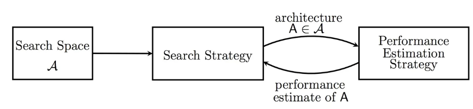
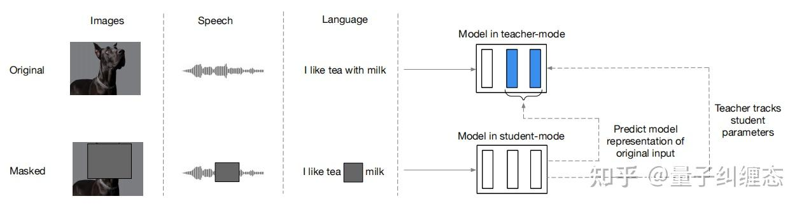
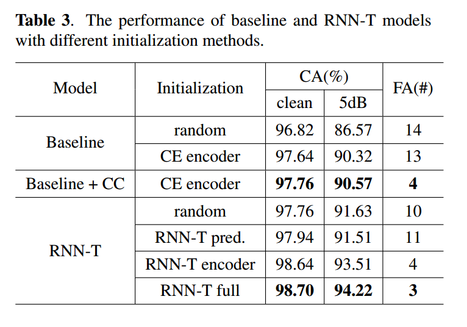
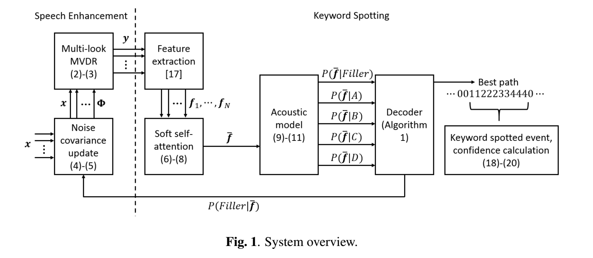
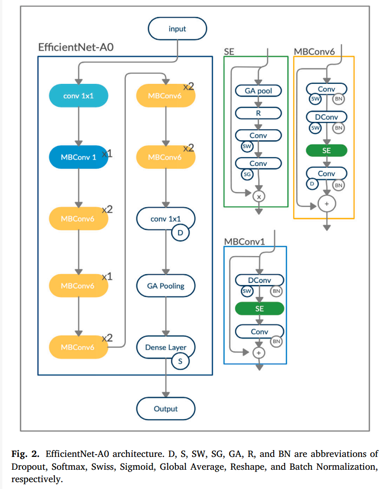

# KWS论文阅读笔记
> 为撰写综述做准备，内容来自2021-2023的ICASSP, SE, TASL
***
## 1. A LIGHTWEIGHT DYNAMIC FILTER FOR KEYWORD SPOTTING
> Kim D, Ko K, Kwak J, et al. A Lightweight Dynamic Filter For Keyword Spotting[C]//2023 IEEE International Conference on Acoustics, Speech, and Signal Processing Workshops (ICASSPW). IEEE, 2023: 1-5.  (韩国高丽大学，美国德雷塞尔大学) (这篇基本没看懂，不太明白像素级实例级动态滤波之类的)
### Abstract
Keyword Spotting (KWS) from speech signals is widely applied toperform fully hands-free speech recognition. The KWS network isdesigned as a small-footprint model so it can continuously be active.Recent efforts have explored dynamic filter-based models in deeplearning frameworks to enhance the system’s robustness or accuracy.However, as a dynamic filter framework requires high computational costs, the implementation is limited to the computational conditionof the device. In this paper, we propose a lightweight dynamic filterto improve the performance of KWS. Our proposed model dividesthe dynamic filter into two branches to reduce computational complexity: pixel level and instance level. The proposed lightweight dynamic filter is applied to the front end of KWS to enhance the separability of the input data. The experimental results show that our model is robustly working on unseen noise and small training data environments by using a small computational resource. 

*Index Terms: keyword spotting, dynamic filter, dynamic weight,computational cost*  

（语音信号关键字识别(KWS)被广泛应用于全免提语音识别。KWS网络被设计成一个小占用模型，因此它可以持续活动。最近的研究探索了深度学习框架中基于动态过滤器的模型，以提高系统的鲁棒性或准确性。然而，由于动态滤波器框架需要较高的计算成本，其实现受到设备计算条件的限制。在本文中，我们提出了一种轻量级的动态滤波器来提高KWS的性能。我们提出的模型将动态滤波分为两个分支:像素级和实例级，以降低计算复杂度。将所提出的轻量级动态滤波器应用于KWS前端，增强了输入数据的可分性。实验结果表明，该模型可以在不可见噪声和小型训练数据环境下稳健地工作）
### Method  
  
其实细节还不是特别懂，写综述的时候对照论文写吧
### Experiment and Result  
#### Exprtimental Setup  
- Dataset: [google speech command datasets v1 and v2](https://arxiv.org/abs/1804.03209)  
  we utilized 10 keywords with two extra classes (unknown or silent) for model training, injected background noise, and added random time-shifting.
- Noise Dataset: [DCASE](https://archive.nyu.edu/handle/2451/60751), [Urbansound8K](https://dl.acm.org/doi/abs/10.1145/2647868.2655045) and [WHAM](https://arxiv.org/abs/1907.01160) 
- Feature: MFCC, 30ms of windows with 10ms overlap, 16KHz,  40 MFCC coefficients, [40,98] (98怎么来的?)  
- BatchSize: 100, 30K iterations, Adam optimizer with a 0.001 initial learning rate, every 10K iteration, the learning rate is decreased by 0.1.  
- In the PDF and the dynamic convolution process, we used 3 × 3 CNN kernel (k = 3) dilated by (2,2) with a stride of 1. In the IDF, the first FC and second FC follow 40 × 40 and 40×k layer dimensions respectively. For DIN, two layers of FC which have 40 × 40 filter size respectively are utilized to produce α and β  
#### Result
  

### 知识补充
> 补充完相关知识后懂了一点  

[动态滤波器（动态卷积网络）](http://t.csdnimg.cn/4mE4E)  
[Dynamic Convolution: Attention over Convolution Kernels](https://arxiv.org/abs/1912.03458)  
- 动态感知器  
  
- 动态卷积  
   

  ***
## 2. A Novel Loss Function and Training Strategy for Noise-Robust Keyword Spotting  
> López-Espejo I, Tan Z H, Jensen J. A novel loss function and training strategy for noise-robust keyword spotting[J]. IEEE/ACM Transactions on Audio, Speech, and Language Processing, 2021, 29: 2254-2266.(丹麦奥尔堡大学)  

### Abstract  
The development of keyword spotting (KWS) systems that are accurate in noisy conditions remains a challenge. Towards this goal, in this paper we propose a novel training strategy relying on multi-condition training for noise-robust KWS. By this strategy,
we think of the state-of-the-art KWS models as the composition of a keyword embedding extractor and a linear classifier that are successively trained. To train the keyword embedding extractor, we also propose a new (CN,2 + 1)-pair loss function extending
the concept behind related loss functions like triplet and N-pair losses to reach larger inter-class and smaller intra-class variation. Experimental results on a noisy version of the Google Speech Commands Dataset show that our proposal achieves around 12% KWS accuracy relative improvement with respect to standard end-to-end multi-condition training when speech is distorted by unseen noises. This performance improvement is achieved without increasing the computational complexity of the KWS model.  

*Index Terms: Keyword spotting, noise robustness, multicondition training, deep metric learning, loss function, keyword embedding.*  

（开发在噪声条件下准确的关键字定位(KWS)系统仍然是一个挑战。为此，本文提出了一种基于多条件训练的噪声鲁棒KWS训练策略。通过这种策略，我们认为最先进的KWS模型是一个关键字嵌入提取器和一个连续训练的线性分类器的组合。为了训练关键字嵌入提取器，我们还提出了一个新的(CN,2 + 1)对损失函数，扩展了相关损失函数(如三元组和n对损失)背后的概念，以达到更大的类间和更小的类内变化。在谷歌语音命令数据集的噪声版本上的实验结果表明，当语音被看不见的噪声扭曲时，我们的建议相对于标准的端到端多条件训练实现了大约12%的KWS精度提高。在不增加KWS模型的计算复杂性的情况下实现了这种性能改进。）  

### Keyword Spotting Training Strategy  
简单来说就是把大家提出来的各种KWS模型分两部分来训练，一部分是特征提取部分（整个模型去掉最后带softmax的线性分类层），这部分用(CN,2 + 1)对损失函数训练，另一部分是带softmax的线性分类层，用交叉熵损失训练。  

- Training of the keyword embedding extractor: First, the keyword embedding extractor is multi-condition trained by considering a new (CN,2 + 1)-pair loss function。  
- Training of the linear classifier: Second, the linear classifier is trained using multi-condition keyword embeddings and cross-entropy loss.  
###  A New (CN,2 + 1)-Pair Loss Function  
  
比较底层，艰深， 晦涩，暂时不花时间。。。  
### Experiment and Result  
#### Exprtimental Setup  
- Dataset: [google speech command datasets](https://arxiv.org/abs/1804.03209) (进行了一些加噪声的处理)
- Noise Dataset:  [NOISEX-92](https://www.sciencedirect.com/science/article/abs/pii/0167639393900953), [CHiME-3](https://www.sciencedirect.com/science/article/pii/S088523081630122X)   
- Model: [来自Icassp2018](https://ieeexplore.ieee.org/abstract/document/8462688)  
#### Result
the best performance for unseen noises is clearly obtained by the proposed method (∼83.53% acc.) in a statistically significant manner. In particular, on average, our training strategy using the (CN,2 + 1)-pair loss function yields around 12% KWS accuracy relative improvement with respect to Baseline.  

***
## 3. Autokws: Keyword spotting with differentiable architecture search  
> Zhang B, Li W, Li Q, et al. Autokws: Keyword spotting with differentiable architecture search[C]//ICASSP 2021-2021 IEEE International Conference on Acoustics, Speech and Signal Processing (ICASSP). IEEE, 2021: 2830-2834.(小米AI实验室)  

### Abstract  
Smart audio devices are gated by an always-on lightweight keyword spotting program to reduce power consumption. It is however challenging to design models that have both high accuracy and low latency for accurate and fast responsiveness. Many efforts have been made to develop end-to-end neural networks, in which depthwise separable convolutions, temporal convolutions, and LSTMs are adopted as building units. Nonetheless, these networks designed with human expertise may not achieve an optimal trade-off in an expansive search space. In this paper, we propose to leverage recent advances in differentiable neural architecture search to discover more efficient networks. Our searched model attains 97.2% top-1 accuracy on Google Speech Command Dataset v1 with only nearly 100K parameters.

*Index Terms: Keyword spotting, neural architecture search*

(智能音频设备被一个持续运行的轻量的（以减少功耗）关键词检索程序控制。然而，设计具有高精度和低延迟的模型以实现准确和快速的响应是具有挑战性的。在开发端到端神经网络方面已经做出了许多努力，其中采用深度可分离卷积、时间卷积和lstm作为构建单元。尽管如此，这些由人类专业知识设计的网络可能无法在广阔的搜索空间中实现最佳权衡。在本文中，我们建议利用可微神经结构搜索的最新进展来发现更有效的网络。我们的搜索模型在Google Speech Command Dataset v1上获得了97.2%的top-1准确率，只有近10万个参数)

### Method
- ####  Search Space 
  我们在TC-ResNet之上设计我们的搜索空间，因为它具有出色的性能和较小的内存占用。我们还介绍了TC-ResNet块的挤压和激励(SE)模块。  
    
  具体来说，对于每个TC块，我们有{3,5,7,9}的内核大小选项，是否启用SE，以及一个额外的跳过连接。
- #### Searching Algorithm  
  放弃理解与总结，请阅读论文3.2节
    

### Experiment and Result  
#### Exprtimental Setup  
- Dataset: [google speech command datasets v1 and v2](https://arxiv.org/abs/1804.03209)  
- 其他实验设置就不记录了，复现这篇论文的可能性微乎其微。。。
#### Result
  

### 知识补充  
#### [TC-ResNet](https://zhuanlan.zhihu.com/p/80123284)  
[Temporal Convolution for Real-time Keyword Spotting on Mobile Devices](https://arxiv.org/abs/1904.03814)  
Temporal Convolution 即在MFCC‘通道’这个维度上做一维卷积，这个一维卷积会使用到扩张卷积以扩大感受野。  
TC-ResNet：  
  
#### SE  
[Squeeze-and-Excitation Networks](https://arxiv.org/abs/1709.01507)   

上图是我们提出的 SE 模块的示意图。给定一个输入 x，其特征通道数为 c_1，通过一系列卷积等一般变换后得到一个特征通道数为 c_2 的特征。与传统的 CNN 不一样的是，接下来我们通过三个操作来重标定前面得到的特征。

首先是 Squeeze 操作，我们顺着空间维度来进行特征压缩，将每个二维的特征通道变成一个实数，这个实数某种程度上具有全局的感受野，并且输出的维度和输入的特征通道数相匹配。它表征着在特征通道上响应的全局分布，而且使得靠近输入的层也可以获得全局的感受野，这一点在很多任务中都是非常有用的。

其次是 Excitation 操作，它是一个类似于循环神经网络中门的机制。通过参数 w 来为每个特征通道生成权重，其中参数 w 被学习用来显式地建模特征通道间的相关性。

最后是一个 Reweight 的操作，我们将 Excitation 的输出的权重看做是经过特征选择后的每个特征通道的重要性，然后通过乘法逐通道加权到先前的特征上，完成在通道维度上的对原始特征的重标定。  

SE在具体网络中的应用:  

#### [NAS](https://zhuanlan.zhihu.com/p/45133026)  
(⬆这个链接指向的知乎回答写的很易懂)  
[A Comprehensive Survey of Neural Architecture Search: Challenges and Solutions](https://dl.acm.org/doi/abs/10.1145/3447582)

让程序自动的搜索出一个不错的网络架构，这一领域被称为神经架构搜索（Neural Architecture Search）。NAS的意义在于解决深度学习模型的调参问题，是结合了优化和机器学习的交叉研究。

- **搜索空间（Search Space）**: 搜索空间定义了搜索的范围，其实就是在哪搜索。通过结合一些过去研究者架构设计方面的经验，可以通过减小搜索空间和简化搜索过程来提高搜索的性能。当然，这样同时也引入了人为的主观臆断，可能会妨碍寻找到超越当前人类知识的新的架构构建块（building blocks）  
  
- **搜索策略（Search strategy）**：搜索策略定义的则怎样去搜索。一方面，我们希望能快速找到性能良好的架构，另一方面，也应避免过早收敛到次优架构（suboptimal architeture）区域。   
  到现在，已经有许多不同的搜索策略用于 NAS，主要有如下这些： 随机搜索（random search），贝叶斯优化（Bayesian optimazation），进化方法（evolutionaray methods），强化学习（Reinforcement Learning, RL），梯度方法（gradient-based methods）。 
- **性能评估策略（Performace estimation strategy）**：NAS 的目标是希望能够自动的在给定的数据集上找到一个高性能的架构。性能评估则是指评估此性能的过程：最简单的方式是按照通常的方式对一个标准架构训练和验证来获得结果，但遗憾的是这样的计算成本太高了，并且同时限制了可以搜索的网络架构的数量。因此，最近的许多研究都集中在探索新的方法来降低这些性能评估的成本。  
  

#### [DARTS](https://zhuanlan.zhihu.com/p/156832334)
DARTS是第一个提出基于松弛连续化的，使用梯度下降进行搜索的神经网络架构搜索(neural architecture search， NAS)算法。

DARTS最大的贡献在于使用了Softmax对本来离散的搜索空间进行了连续化，并用类似于元学习中MAMAL的梯度近似，使得只在一个超网络上就可以完成整个模型的搜索，无需反复训练多个模型。（当然，之后基于演化算法和强化学习的NAS方法也迅速地借鉴了超网络这一特性）。  

DARTS通过以可微分的方式描述任务来解决架构搜索的可扩展性挑战。

与传统的在离散的、不可微的搜索空间上应用进化或强化学习的方法不同（这些方法需要再一堆离散的候选网络中间搜索），我们的方法基于连续松弛的结构表示，允许在验证集上使用梯度下降对结构进行高效搜索。

DARTS在大搜索空间中搜索有复杂拓扑结构的高效架构cell，而过去使用梯度下降更多是找滤波器形状，分支方式之类的低维超参数。
  
> 在CNN的DARTS中，可选的操作集合为：3×3深度可分离卷积，5×5深度可分离卷积，3×3空洞深度可分离卷积，5×5空洞深度可分离卷积，3×3极大值池化，3×3均值池化，恒等，0操作（两个节点直接无连接）

  
  
  

***
## 4. Convmixer: Feature interactive convolution with curriculum learning for small footprint and noisy far-field keyword spotting  
***留意此文***
> Ng D, Chen Y, Tian B, et al. Convmixer: Feature interactive convolution with curriculum learning for small footprint and noisy far-field keyword spotting[C]//ICASSP 2022-2022 IEEE International Conference on Acoustics, Speech and Signal Processing (ICASSP). IEEE, 2022: 3603-3607.(阿里巴巴，新加坡南洋理工)  

### Abstract  
Building efficient architecture in neural speech processing is paramount to success in keyword spotting deployment. However, it is very challenging for lightweight models to achieve noise robustness with concise neural operations. In a realworld application, the user environment is typically noisy and may contain reverberations. We proposed a novel feature interactive convolutional model with merely 100K parameters to tackle this under the noisy far-field condition. The interactive unit is proposed in place of the attention module that promotes the flow of information with more efficient computations. Moreover, curriculum-based multi-condition training is adopted to attain better noise robustness. Our model achieves 98.2% top-1 accuracy on Google Speech Command V2-12 and is competitive against large transformer models under the designed noise condition.  

*Index Terms: keyword spotting, small footprint, noisy far-field*  

(构建高效的神经语音处理体系结构是关键字识别部署成功的关键。然而，对于轻量级模型来说，用简洁的神经运算实现噪声鲁棒性是非常具有挑战性的。在实际应用程序中，用户环境通常是嘈杂的，并且可能包含混响。为了解决这一问题，我们提出了一种仅包含100K个参数的特征交互卷积模型。提出以交互单元代替注意力模块，以更高效的计算促进信息的流动。此外，采用基于课程的多条件训练，获得更好的噪声鲁棒性。我们的模型在Google Speech Command V2-12上达到了98.2%的top-1准确率，并且在设计噪声条件下与大型变压器模型具有竞争力。)  

### Method  
#### Model
  

ConvMixer网络由三个主要部分组成: 
- **pre-convolutional block**:  
  1D DS Convolution + BN + Swish
- **convolution-mixer block**:  
  ConvMixer块将前一个信道x时间特征传递给二维卷积子块进行频域提取。这创建了第三个维度，表达了来自频域的丰富信息。为了保持之前输入的形状，我们使用了一个逐点卷积，将其压缩回适合形状。然后，利用一维DWS块实现时域特征提取。这两种操作的乘积将产生频率和时间丰富的嵌入。接下来，我们构建了一个混频器层，以允许信息在全局特征通道上流动。最后，我们添加了先前输出的跳过连接和连接到块输出的2D特征。  
    
    
  利用两种类型的多层感知器(MLP)，即时间信道混合和频率信道混合，来诱导特征空间之间的相互作用。每个MLP混合涉及两个线性层和一个独立于每个时间和频率通道的GELU激活单元。  
    
  
- **postconvolutional block**:  
  1D DS Convolution + BN + Swish

####  Curriculum Based Multi-condition Training  
  

我们将训练过程分成五个难度逐渐加大的步骤。一开始，我们在没有噪声的干净样本上调节模型。在接下来的三个步骤中，将以-5dB的增量向固定的N个样本中引入噪声，并且N个样本中的所有条件均匀分布，即[clean, 0]， [clean, 0， -5]， [clean, 0， -5， -10]。最后，我们通过用房间脉冲响应(RIR)数据增加一半的数据集来包括远场音频。  

在每个阶段的每个时代，我们用验证精度和损失记录学习进度。接下来，将进度步距准则c定义为归一化验证精度与损失之间的差。归一化是基于之前时代的准确性和损失。下方公式描述了计算归一化精度和损失的第m个历元值的一般算法。注意，如果m等于零，则归一化结果为零。随后，如果c连续10个epoch不高于当前最佳准则，则加载最新最佳准则的模型，进入下一难度阶段进行训练。  
  

### Experiment and Result  
#### Exprtimental Setup  
- Dataset: [google speech command datasets v2](https://arxiv.org/abs/1804.03209)  
- Noise Dataset: [MUSAN](https://arxiv.org/abs/1510.08484)
- Far-field Dataset: [ BUT Speech@FIT Reverberation Database](https://ieeexplore.ieee.org/abstract/document/8717722)
- Features: FBank, 25ms of window, 10ms of overlop。我们将FBank的分辨率固定为98 × 64，相当于1s的语音。短于1s的命令将在右侧补零。在训练期间，使用-100到100ms范围内的时移来执行数据增强。采用最大长度为25的时间和频率掩蔽参数对频谱图进行掩蔽。我们使用从[0，-5，-10]dB列表中选择的信噪比生成噪声数据。然后，为了获得更强的学习正则化，对训练样本执行混合输入，混合比为0.5。
- batch size of 128,  initial learning rate of 6e-3 factored by 0.85 on every
four epoch intervals after the fifth epoch, Adam optimizer, binary cross-entropy loss, 200 epochs  
#### Result

### 知识补充  
#### Swish  
公式：*Swish(x)=x∗Sigmoid(x)*    

优点：  
- 有助于防止慢速训练期间，梯度逐渐接近0并导致饱和
- 导数恒大于0。
- 平滑度在优化和泛化中起了重要作用。

#### MLP Mixer  
[MLP-Mixer: An all-MLP Architecture for Vision](https://proceedings.neurips.cc/paper/2021/hash/cba0a4ee5ccd02fda0fe3f9a3e7b89fe-Abstract.html)  
MLP-Mixer将CNN这两个任务切割开来，用两个MLP网络来处理  

model overview:  

  

先将输入图片拆分成patches，然后通过Per-patch Fully-connected将每个patch转换成feature embedding，然后送入N个Mixer Layer，最后通过Fully-connected进行分类。

Mixer分为channel-mixing MLP和token-mixing MLP两类。channel-mixing MLP允许不同通道之间进行交流；token-mixing MLP允许不同空间位置(tokens)进行交流。这两种类型的layer是交替堆叠的，方便支持两个输入维度的交流。每个MLP由两层fully-connected和一个GELU构成。

mixer architecture:

Mixer结构如上图所示。每个Mixer结构由两个MLP blocks构成，其中红色框部分是token-mixing MLP，绿色框部分是channel-mixing MLP。

token-mixing MLP block作用在X的列上(即先对X进行转置)，并且所有列参数共享MLP1，得到的输出重新转置一下。

channel-mixing MLP block作用在行上，所有行参数共享MLP2。

#### [Curriculum Learning](https://zhuanlan.zhihu.com/p/362351969)  
[A Survey on Curriculum Learning](https://ieeexplore.ieee.org/abstract/document/9392296)  

课程学习 (Curriculum learning, CL) 是近几年逐渐热门的一个前沿方向。它是一种训练策略，模仿人类的学习过程，主张让模型先从容易的样本开始学习，并逐渐进阶到复杂的样本和知识。CL策略在计算机视觉和自然语言处理等多种场景下，在提高各种模型的泛化能力和收敛率方面表现出了强大的能力。

课程学习的核心问题是得到一个ranking function，该函数能够对每条数据/每个任务给出其learning priority (学习优先程度)。这个则由**难度测量器**（Difficulty Measurer）实现。另外，我们什么时候把 Hard data 输入训练 以及 每次放多少呢？ 这个则由**训练调度器** （Training Scheduler）决定。因此，目前大多数CL都是基于"难度测量器+训练调度器 "的框架设计。根据这两个**是否自动设计**可以将CL分成两个大类即 **Predefined CL** 和 **Automatic CL**。

Predifined CL 的难度测量器和训练调度器都是利用人类先验先验知识由人类专家去设计；  
Automatic CL 的至少其中一个是以数据驱动的方式自动设计。

  
  
  
  
#### [深度学习模型计算量评价指标FLOPs, MACs, MAdds关系](http://t.csdnimg.cn/0HPpL)

***
## 5. Dynamic curriculum learning via data parameters for noise robust keyword spotting
> Higuchi T, Saxena S, Souden M, et al. Dynamic curriculum learning via data parameters for noise robust keyword spotting[C]//ICASSP 2021-2021 IEEE International Conference on Acoustics, Speech and Signal Processing (ICASSP). IEEE, 2021: 6848-6852.(苹果)  

### Abstract  
We propose dynamic curriculum learning via data parameters for noise robust keyword spotting. Data parameter learning has recently been introduced for image processing,
where weight parameters, so-called data parameters, for target classes and instances are introduced and optimized along with model parameters. The data parameters scale logits and control importance over classes and instances during training, which enables automatic curriculum learning without additional annotations for training data. Similarly, in this paper, we propose using this curriculum learning approach
for acoustic modeling, and train an acoustic model on clean and noisy utterances with the data parameters. The proposed approach automatically learns the difficulty of the classes and instances, e.g. due to low speech to noise ratio (SNR), in the gradient descent optimization and performs curriculum learning. This curriculum learning leads to overall improvement of the accuracy of the acoustic model. We evaluate the effectiveness of the proposed approach on a keyword spotting task. Experimental results show 7.7% relative reduction in false reject ratio with the data parameters compared to a baseline model which is simply trained on the multiconditioned dataset.  

Index Terms: Noise robustness, acoustic modeling, keyword spotting, curriculum learning

（我们提出动态课程学习通过数据参数噪声鲁棒关键字发现。数据参数学习最近被引入到图像处理中，其中目标类和实例的权重参数，即所谓的数据参数，与模型参数一起被引入和优化。数据参数在训练过程中缩放逻辑并控制类和实例的重要性，从而实现自动课程学习，而无需对训练数据进行额外的注释。同样，在本文中，我们建议使用这种课程学习方法进行声学建模，并使用数据参数训练干净和有噪声的话语声学模型。该方法在梯度下降优化中自动学习类和实例的难度，例如由于语音噪声比(SNR)低，并进行课程学习。本课程的学习使声学模型的准确性得到全面提高。我们评估了所提出的方法在关键字发现任务上的有效性。实验结果表明，与在多条件数据集上简单训练的基线模型相比，该模型的误拒率相对降低了7.7%。）

这篇真的有点没太看懂，相关资料也少，今天也不是特别专注，啃不下去。

***
## 6. End-to-end keyword spotting using neural architecture search and quantization 
此文使用原始语音做输入 
> Peter D, Roth W, Pernkopf F. End-to-end keyword spotting using neural architecture search and quantization[C]//ICASSP 2022-2022 IEEE International Conference on Acoustics, Speech and Signal Processing (ICASSP). IEEE, 2022: 3423-3427.(奥地利格拉茨理工大学)

### Abstract
This paper introduces neural architecture search (NAS) for the automatic discovery of end-to-end keyword spotting (KWS) models for limited resource environments. We employ a differentiable NAS approach to optimize the structure of convolutional neural networks
(CNNs) operating on raw audio waveforms. After a suitable KWS model is found with NAS, we conduct quantization of weights and activations to reduce the memory footprint. We conduct extensive experiments on the Google speech commands dataset. In particular, we compare our end-to-end models to mel-frequency cepstral coefficient (MFCC) based CNNs. For quantization, we compare fixed bitwidth quantization and trained bit-width quantization. Using NAS only, we were able to obtain a highly efficient model with an accuracy of 95.55% using 75.7k parameters and 13.6M operations. Using trained bit-width quantization, the same model achieves a test accuracy of 93.76% while using on average only 2.91 bits per activation and 2.51 bits per weight.

*Index Terms: keyword spotting, neural architecture search, quantization*

（本文引入神经结构搜索(NAS)，用于有限资源环境下的端到端关键字识别(KWS)模型的自动发现。我们采用一种可微的NAS方法来优化卷积神经网络(cnn)在原始音频波形上的结构。在使用NAS找到合适的KWS模型后，我们对权重和激活进行量化以减少内存占用。我们在谷歌语音命令数据集上进行了大量的实验。特别地，我们将我们的端到端模型与基于mel频率倒谱系数(MFCC)的cnn进行了比较。对于量化，我们比较了固定位宽量化和训练位宽量化。仅使用NAS，我们就能够使用75.7k个参数和136m个操作获得准确率为95.55%的高效模型。使用经过训练的位宽量化，相同的模型在每次激活平均仅使用2.91比特和每个权重平均仅使用2.51比特的情况下，达到了93.76%的测试精度。）

### Method  
#### Neural Architecture Search

  
使用ProxylessNAS搜索最优模型。

#### Feature Extraction using SincConvs
使用SincNet对**原始音频**进行特征提取

#### Weight and Activation Quantization
使用固定位宽量化或训练位宽量化对模型进行压缩。

### Experiment and Result  
#### Exprtimental Setup  
- Dataset: [google speech command datasets v1](https://arxiv.org/abs/1804.03209)
#### Result

### 知识补充
#### [ProxyLessNAS](https://zhuanlan.zhihu.com/p/144318917)
[ProxylessNAS: Direct Neural Architecture Search on Target Task and Hardware](https://openreview.net/forum?id=HylVB3AqYm)  
[ProxyLessNAS Code](https://github.com/MIT-HAN-LAB/ProxylessNAS)  

暂时不深入细节了。。。。。

#### SincNet  
[Interpretable Convolutional Filters with SincNet](https://arxiv.org/abs/1811.09725)  
[Pytorch-SincNet Code](https://github.com/mravanelli/SincNet/)
  
  

#### Quantization  
模型量化是一种模型压缩方式
  

正如其它模型压缩方法一样，对模型的量化基于一个共识。那就是复杂的、高精度表示的模型在训练时是必要的，因为我们需要在优化时捕捉微小的梯度变化，然而在推理时并没有必要。也就是说，网络中存在很多不重要的参数，或者并不需要太细的精度来表示它们。另外，实验证明神经网络对噪声鲁棒，而量化其实也可看作是噪声。这就意味着我们在部署模型前可以将之化简，而表示精度降低就是化简的重要手段之一。我们知道，大多深度学习训练框架默认下模型的参数是32位浮点的，计算也是32位浮点的。模型量化的基本思想就是用更低精度（如8位整型）来代替原浮点精度。听起来似乎非常的简单，但是细看之下会发现这个坑比想象中大得多。从相关的文献可以看到各大巨头公司都或多或少地参于其中，似乎成为了兵家必争之地。量化最核心的挑战是如何在减少表示精度的同时不让模型的准确度掉下来，即在压缩率与准确率损失间作trade-off。这就衍生出很多有趣的子问题，比如量化对象是什么（weight，activation，gradient），量化到几位（8位，4位，2位，1位），量化参数（如step size，clipping value）如何选择，量化参数是否可以自动优化，不同层是否需要不同的量化参数，如何在量化后恢复准确率或者在训练时考虑量化，等等。。。  

  

pytorch对量化的支持：

#### Brevitas  
Brevitas是一个用于量化感知训练（QAT）的Pytorch库。  
[Brevitas Code](https://github.com/Xilinx/brevitas)  
布雷维塔斯目前正在积极开发中。文档、测试、示例和预训练模型将逐步发布。

请注意，Brevitas是一个研究项目，而不是Xilinx的官方产品。

***
## 7. End-to-end low resource keyword spotting through character recognition and beam-search re-scoring  
KWS模型不提参数量只比效果就是耍流氓
> Mekonnen E T, Brutti A, Falavigna D. End-to-end low resource keyword spotting through character recognition and beam-search re-scoring[C]//ICASSP 2022-2022 IEEE International Conference on Acoustics, Speech and Signal Processing (ICASSP). IEEE, 2022: 8182-8186.(意大利特伦托大学)

### Abstract  
This paper describes an end-to-end approach to perform keyword spotting with a pre-trained acoustic model that uses recurrent neural networks and connectionist temporal classification loss. Our approach is specifically designed for low-resource keyword spotting tasks where extremely small amounts of in-domain data are available to train the system. The pre-trained model, largely used in ASR tasks, is fine-tuned on in-domain audio recordings. In inference the model output is matched against the set of predefined keywords using a beam-search re-scoring based on the edit distance. We demonstrate that this approach significantly outperforms the best state-of-the art systems on a well known keyword spotting benchmark, namely ”google speech commands”. Moreover, compared against state-of-the-art methods, our proposed approach is extremely robust in case of limited in domain training material. We show that a very small performance reduction is observed when fine tuning with a very small fraction (around 5%) of the training set. We report an extensive set of experiments on two keyword spotting tasks, varying training sizes and correlating keyword classifi- cation accuracy with character error rates provided by the system. We also report an ablation study to assess on the contribution of the out-of-domain pre-training and of the beam-search re-scoring.

*Index Terms: keyword spotting, beam search, connectionist temporal classification, low resources, end-to-end recognition*  

（本文描述了一种端到端方法，通过使用循环神经网络和连接主义时间分类损失的预训练声学模型来执行关键字识别。我们的方法是专门为低资源关键字识别任务而设计的，在这些任务中，可以使用极少量的域内数据来训练系统。预先训练的模型主要用于ASR任务，对域内录音进行微调。在推理中，使用基于编辑距离的波束搜索重新评分，将模型输出与预定义的关键字集进行匹配。我们证明，这种方法明显优于最先进的系统在一个众所周知的关键字发现基准，即“谷歌语音命令”。此外，与最先进的方法相比，我们提出的方法在领域训练材料有限的情况下非常健壮。我们表明，当对训练集的很小一部分(大约5%)进行微调时，可以观察到非常小的性能下降。我们报告了一组关于两个关键字识别任务的广泛实验，不同的训练规模和将关键字分类精度与系统提供的字符错误率相关联。我们还报道了一项消融研究，以评估域外预训练和波束搜索重新评分的贡献。）

### Method  
  
预训练声学模型+CTC+束搜索 \
github address: [E2E-KWS](https://github.com/Ephrem-ETH/E2E-KWS) 
### Result  
  

## 8. Improving Label-Deficient Keyword Spotting Through Self-Supervised Pretraining  
> Bovbjerg H S, Tan Z H. Improving Label-Deficient Keyword Spotting Through Self-Supervised Pretraining[C]//2023 IEEE International Conference on Acoustics, Speech, and Signal Processing Workshops (ICASSPW). IEEE, 2023: 1-5.(丹麦奥尔堡大学)  

### Abstract  
Keyword Spotting (KWS) models are becoming increasingly integrated into various systems, e.g. voice assistants. To achieve satisfactory performance, these models typically rely on a large amount of labelled data, limiting their applications only to situations where such data is available. Selfsupervised Learning (SSL) methods can mitigate such a reliance by leveraging readily-available unlabelled data. Most SSL methods for speech have primarily been studied for large models, whereas this is not ideal, as compact KWS models are generally required. This paper explores the effectiveness of SSL on small models for KWS and establishes that SSL can enhance the performance of small KWS models when labelled data is scarce. We pretrain three compact transformerbased KWS models using Data2Vec, and fine-tune them on a label-deficient setup of the Google Speech Commands data set. It is found that Data2Vec pretraining leads to a significant increase in accuracy, with label-deficient scenarios showing
an improvement of 8.22 % to 11.18 % absolute accuracy.  

*Index Terms: Keyword Spotting, Self-Supervised, Speech Commands, Transformer*

（关键字识别(KWS)模型越来越多地集成到各种系统中，例如语音助手。为了获得令人满意的性能，这些模型通常依赖于大量的标记数据，将它们的应用限制在这些数据可用的情况下。自我监督学习(SSL)方法可以通过利用现成的未标记数据来减轻这种依赖。大多数用于语音的SSL方法主要针对大型模型进行了研究，然而这并不理想，因为通常需要紧凑的KWS模型。本文探讨了SSL在KWS小模型上的有效性，并建立了SSL可以在标记数据稀缺时提高KWS小模型的性能。我们使用Data2Vec预训练了三个基于紧凑转换器的KWS模型，并在缺乏标签的Google Speech Commands数据集上对它们进行了微调。研究发现，Data2Vec预训练导致准确率显著提高，在缺乏标签的情况下，绝对准确率提高了8.22%至11.18%。）  

### Method  
#### Keyword spotting model  
相关论文： [Keyword Transformer: A Self-Attention Model for Keyword Spotting](https://arxiv.org/abs/2104.00769)  
使用transformer encoder  

#### Data2Vec Pretraining  

github address: [data2vec-KWS](https://github.com/HolgerBovbjerg/data2vec-KWS)

### Experiment and Result  
#### Exprtimental Setup  
- Dataset: [google speech command datasets v2](https://arxiv.org/abs/1804.03209)  
    
  其中Pretrain部分标签
- [Librispeech](https://ieeexplore.ieee.org/abstract/document/7178964) 100h 无标签  
#### Result  

### 知识补充  
#### [全模态自监督算法——data2vec](https://zhuanlan.zhihu.com/p/471494010)  

#### [指数移动平均（EMA）](https://zhuanlan.zhihu.com/p/68748778)  

#### [知识蒸馏](https://zhuanlan.zhihu.com/p/442457531)
  
总觉得和文章里说的有点区别。

***
## 9. Improving RNN transducer modeling for small-footprint keyword spotting  

> Tian Y, Yao H, Cai M, et al. Improving RNN transducer modeling for small-footprint keyword spotting[C]//ICASSP 2021-2021 IEEE International Conference on Acoustics, Speech and Signal Processing (ICASSP). IEEE, 2021: 5624-5628.(字节)  

### Abstract  
The recurrent neural network transducer (RNN-T) model has been proved effective for keyword spotting (KWS) recently.However, compared with cross-entropy (CE) or connectionist temporal classification (CTC) based models, the additional prediction network in the RNN-T model increases the model size and computational cost. Besides, since the keyword training data usually only contain the keyword sequence, the prediction network might has over-fitting problems. In this paper, we improve the RNN-T modeling for small-footprint keyword spotting in three aspects. First, to address the overfitting issue, we explore multi-task training where a CTC loss is added to the encoder. The CTC loss is calculated with both KWS data and ASR data, while the RNN-T loss is calculated with ASR data so that only the encoder is augmented with KWS data. Second, we use the feed-forward neural network to replace the LSTM for prediction network modeling. Thus all possible prediction network outputs could be pre-computed for decoding. Third, we further improve the model with transfer learning, where a model trained with 160 thousand hours of ASR data is used to initialize the KWS model. On a self-collected far-field wake-word testset, the proposed RNN-T system greatly improves the performance comparing with a strong ”keyword-filler” baseline.  

*Index Trems: keyword spotting, RNN-T, CTC, multitask, transfer learning*

（近年来，递归神经网络换能器(RNN-T)模型被证明是一种有效的关键字识别方法。然而，与基于交叉熵(CE)或基于连接时间分类(CTC)的模型相比，RNN-T模型中额外的预测网络增加了模型的大小和计算成本。此外，由于关键字训练数据通常只包含关键字序列，预测网络可能存在过拟合问题。本文从三个方面对RNN-T模型进行了改进。首先，为了解决过拟合问题，我们探索了在编码器中添加CTC损失的多任务训练。CTC损耗是用KWS数据和ASR数据计算的，而RNN-T损耗是用ASR数据计算的，因此只有编码器用KWS数据增强。其次，用前馈神经网络代替LSTM进行预测网络建模。因此，所有可能的预测网络输出可以预先计算解码。第三，我们使用迁移学习进一步改进模型，其中使用经过16万小时ASR数据训练的模型初始化KWS模型。在自收集的远场尾迹测试集上，与强“关键字填充”基线相比，所提出的RNN-T系统的性能大大提高。）

### Method  
对RNN-T进行魔改  
- 首先，探索多任务训练，额外的CTC Loss被添加到编码器中。CTC Loss采用KWS数据和ASR数据计算，RNNT Loss采用ASR数据计算。这样，我们只用关键字特定数据来增强模型的编码器(声学部分)，避免了预测网络(语言部分)可能导致的过拟合问题。  
  
- 其次，使用无状态非循环前馈神经网络(FFNN)代替LSTM进行预测网络建模。因此，所有可能的预测网络输出都可以预先计算并保存解码，从而节省了存储和计算成本。无状态预测网络结构已经在ASR中进行了研究，并且表现出轻微的性能下降。  
- 最后，为了进一步减少过拟合问题并提高模型的泛化能力，文章进行迁移学习，使用经过近16万小时语音识别数据训练的RNNT模型初始化KWS模型。  

### Experiment and Result  
#### Exprtimental Setup  
- Dataset:字节自己的数据（大力大力？）  
#### Result  
  
  
  

***  
## 10. Joint ego-noise suppression and keyword spotting on sweeping robots  
> Na Y, Wang Z, Wang L, et al. Joint ego-noise suppression and keyword spotting on sweeping robots[C]//ICASSP 2022-2022 IEEE International Conference on Acoustics, Speech and Signal Processing (ICASSP). IEEE, 2022: 7547-7551.(阿里，中山大学)
### Abstract  
Keyword spotting is necessary for triggering human-machine speech interaction. It is a challenging task especially in low signal-to-noise ratio and moving scenarios, such as on a sweeping robot with strong ego-noise. This paper proposes a novel approach for joint ego-noise suppression and keyword detection. The keyword detection model accepts outputs from multi-look adaptive beamformers. The noise covariance matrix in the beamformer is in turn updated using the keyword absence probability given by the model, forming an end-to-end loop-back. The keyword model also adopts a multi-channel feature fusion using self-attention, and a hidden Markov model for online decoding. The performance of the proposed approach is verified on real-word datasets recorded on a sweeping robot.

*Index Terms: sweeping robot, ego-noise, beamforming, speech enhancement, keyword spotting*

（关键词识别是触发人机语音交互的必要条件。这是一项具有挑战性的任务，特别是在低信噪比和运动场景下，例如在具有强自我噪声的扫地机器人上。本文提出了一种新的自我噪声抑制和关键字检测方法。关键字检测模型接受来自多视自适应波束形成器的输出。然后利用模型给出的关键字不存在概率对波束形成器中的噪声协方差矩阵进行更新，形成端到端的回环。关键词模型还采用了基于自关注的多通道特征融合，以及用于在线解码的隐马尔可夫模型。在扫地机器人的实时数据集上验证了该方法的性能）

### Method  
  
- 语音增强子块  
  采用多个MVDR波束成形器  
- KWS声学模型  
    
    
- 使用HMM解码器  

该文章主要解决自噪音问题，所以训练数据以及测试数据均不同于一般数据集，结果没必要比较。  

### 知识补充
#### 波束成形  
和深度学习不相关，不具体展开了，放三个介绍链接。  
[一文读懂语音领域的波束形成Beamforming](https://zhuanlan.zhihu.com/p/632360932)  
[聊聊Beamforming](https://zhuanlan.zhihu.com/p/110251527)  
[波束成形(BeamForming) -- 提升信号强度](https://zhuanlan.zhihu.com/p/583424603)

***  
## 11. Keyword spotting in continuous speech using convolutional neural network  
> Rostami A M, Karimi A, Akhaee M A. Keyword spotting in continuous speech using convolutional neural network[J]. Speech Communication, 2022, 142: 15-21.(伊朗德黑兰阿米尔卡比尔理工大学计)  

### Abstract  
Keyword spotting is a process of finding some specific words or phrases in recorded speeches by computers. Deep neural network algorithms, as a powerful engine, can handle this problem if they are trained over an appropriate dataset. To this end, the football keyword dataset (FKD), as a new keyword spotting dataset in Persian, is collected with crowdsourcing. This dataset contains nearly 31 000 samples in 18 classes. The proposed continuous speech synthesis method allows the FKD dataset to be extended for practical use with applications that process continuous speeches. Besides, we proposed a lightweight architecture called EfficientNet-A0 (absolute zero) by applying the compound scaling method on EfficientNet-B0 for keyword spotting task. Finally, the proposed architecture is evaluated with various models. In our experimental results, the proposed EfficientNet-A0 and ResNet models outperform other models on the FKD dataset.  

*Index Terms*: Continuous speech synthesis method, Football keywords dataset, Keyword spotting

（关键词识别是指用计算机在演讲录音中找到一些特定的单词或短语的过程。深度神经网络算法作为一个强大的引擎，如果在适当的数据集上进行训练，可以处理这个问题。为此，采用众包的方式收集了足球关键字数据集(FKD)，作为一种新的波斯语关键字识别数据集。该数据集包含18个类别的近31000个样本。所提出的连续语音合成方法允许将FKD数据集扩展到处理连续语音的实际应用中。此外，我们提出了一种轻量级的架构，称为effentnet - a0(绝对零)，在effentnet - b0上应用复合缩放方法进行关键字定位任务。最后，用各种模型对所提出的体系结构进行了评估。在我们的实验结果中，我们提出的effentnet - a0和ResNet模型在FKD数据集上优于其他模型。）

### Method  
通过减少层和通道的数量将EfficientNet-B0参数从4032595降低到238250，得到本文提出的Efficient-A0。  

### Experiment and Result  
#### Exprtimental Setup  
- Dataset:作者自己整理的波斯语足球员语音数据（这也是他们主要工作） 
#### Result  

### 知识补充  
[EfficientNet网络详解](http://t.csdnimg.cn/Aw75b)(这篇博文写的很细，论文和code都有)  
  
  
  
EfficientNet B0-B7 参数：  

***  
## 12. LETR: A lightweight and efficient transformer for keyword spotting  
> Ding K, Zong M, Li J, et al. LETR: A lightweight and efficient transformer for keyword spotting[C]//ICASSP 2022-2022 IEEE International Conference on Acoustics, Speech and Signal Processing (ICASSP). IEEE, 2022: 7987-7991.(商汤)  

### Abstract
Transformer recently has achieved impressive success in a number of domains, including machine translation, image recognition, and speech recognition. Most of the previous work on Keyword Spotting (KWS) is built upon convolutional or recurrent neural networks. In this paper, we explore a family of Transformer architectures for keyword spotting, optimizing the trade-off between accuracy and efficiency in a high-speed regime. We also studied the effectiveness and summarized the principles of applying key components in vision Transformers to KWS, including patch embedding, position encoding, attention mechanism, and class token. On top of the findings, we propose the LeTR: a lightweight and highly efficient Transformer for KWS. We consider different efficiency measures on different edge devices so as to reflect a wide range of application scenarios best. Experimental results on two common benchmarks demonstrate that LeTR has achieved state-of-the-art results over competing methods with respect to the speed/accuracy trade-off.  

*Index Terms: Transformer, keyword spotting, latency*

（Transformer最近在许多领域取得了令人印象深刻的成功，包括机器翻译、图像识别和语音识别。以前关于关键词识别(KWS)的大部分工作都是建立在卷积或循环神经网络的基础上的。在本文中，我们探索了一系列用于关键字定位的Transformer架构，在高速状态下优化精度和效率之间的权衡。我们还研究了视觉变形器的有效性，并总结了将视觉变形器中的关键组件应用于KWS的原理，包括补丁嵌入、位置编码、注意机制和类别标记。在这些发现的基础上，我们提出了LeTR:一种用于KWS的轻质高效变压器。我们在不同的边缘设备上考虑不同的效率措施，以最好地反映广泛的应用场景。在两个常见基准上的实验结果表明，LeTR在速度/精度权衡方面取得了比竞争方法更先进的结果。）

### Method  

  
先通过卷积将输入卷小（包括通道），相对位置编码，MLP，序列池化。。。。  

通过以下操作逐层降低分辨率⬇
  

### Experiment and Result  
#### Exprtimental Setup  
- Dataset: [google speech command datasets v1 and v2](https://arxiv.org/abs/1804.03209)  
- Training Details: random time shifts, resampling, background noise, as well as augmenting the MFCC features using SpecAugment. choose the MhAtt-RNN as the teacher

#### Result  
  

### 知识补充  
#### Vision Transformer(ViT)  
[ViT（Vision Transformer）解析](https://zhuanlan.zhihu.com/p/445122996)

ViT是2020年Google团队提出的将Transformer应用在图像分类的模型，虽然不是第一篇将transformer应用在视觉任务的论文，但是因为其模型“简单”且效果好，可扩展性强（scalable，模型越大效果越好），成为了transformer在CV领域应用的里程碑著作，也引爆了后续相关研究

把最重要的说在最前面，ViT原论文中最核心的结论是，当拥有足够多的数据进行预训练的时候，ViT的表现就会超过CNN，突破transformer缺少归纳偏置的限制，可以在下游任务中获得较好的迁移效果

但是当训练数据集不够大的时候，ViT的表现通常比同等大小的ResNets要差一些，因为Transformer和CNN相比缺少归纳偏置（inductive bias），即一种先验知识，提前做好的假设。CNN具有两种归纳偏置，一种是局部性（locality/two-dimensional neighborhood structure），即图片上相邻的区域具有相似的特征；一种是平移不变形（translation equivariance）。当CNN具有以上两种归纳偏置，就有了很多先验信息，需要相对少的数据就可以学习一个比较好的模型

ViT将输入图片分为多个patch（16x16），再将每个patch投影为固定长度的向量送入Transformer，后续encoder的操作和原始Transformer中完全相同。但是因为对图片分类，因此在输入序列中加入一个特殊的token，该token对应的输出即为最后的类别预测

***  
## 13. Multilingual Customized Keyword Spotting Using Similar-Pair Contrastive Learning  
对比学习，定制化KWS，简单了解。
> Lei L, Yuan G, Yu H, et al. Multilingual Customized Keyword Spotting Using Similar-Pair Contrastive Learning[J]. IEEE/ACM Transactions on Audio, Speech, and Language Processing, 2023.  

### Abstract  
The goal of keyword spotting (KWS) is to find words and voice commands. KWS research has received a lot of attention recently. However, the majority of them emphasize predefined KWS. More often than not, customers wish to choose individualized unique keywords. In this work, we present a brandnew Similar-Pair Contrastive Learning (SPCL) training method called MCKWS-SPCL to address Multilingual Customized Keyword Spotting. The three key processes in our MCKWS-SPCL are acoustic feature extraction, embedding model, and similarity computation. By pushing similar-pair samples closer together in projection space, the SPCL training approach is specifically created to obtain similar features with noise existing. Additionally, multiple embedding neural network structures are carefully constructed to examine the trade-off between a limited number of parameters and excellent performance in order to reduce power consumption. For the first time, we complete an all-around multi-dimensional comparison to demonstrate the superior performance of our SPCL over conventional Contrastive Learning in KWS. Results from all trials, including metrics for average accuracy(96.84%), the detection error tradeoff curve, the false reject rate under 5% false alarm rate per hour(1.901%), and visualization using t-Stochastic Neighbor Embedding(same class is closer than CL), conclusively demonstrate our framework’s effectiveness and superiority to Contrastive Learning-based approaches. Additionally, the analysis of four distinct language datasets and implementation on the NVIDIA JETSON TX2 hardware platform demonstrates the versatility, affordability, and hardware-friendliness of our new approach.  

*Index Terms*: Customized keyword spotting, similar-pair contrastive learning (SPCL), query-by-example.

（关键词识别(KWS)的目标是找到单词和语音命令。最近，KWS研究备受关注。但是，它们中的大多数都强调预定义的KWS。通常情况下，客户希望选择个性化的唯一关键词。在这项工作中，我们提出了一种全新的相似对对比学习(SPCL)训练方法，称为MCKWS-SPCL，以解决多语言定制关键词识别问题。MCKWS-SPCL的三个关键过程是声学特征提取、嵌入模型和相似度计算。通过将相似对样本在投影空间中推得更近，SPCL训练方法专门用于在存在噪声的情况下获得相似特征。此外，还精心构建了多个嵌入神经网络结构，以检验有限数量的参数与优异性能之间的权衡，从而降低功耗。我们首次完成了一个全方位的多维比较，以证明我们的SPCL在KWS中优于传统的对比学习。所有试验的结果，包括平均准确率(96.84%)、检测误差权衡曲线、每小时5%误报率以下的误拒率(1.901%)，以及使用t随机邻居嵌入(同类比CL更接近)的可视化，最终证明了我们的框架比基于对比学习的方法的有效性和优越性。此外，对四种不同语言数据集的分析和在NVIDIA JETSON TX2硬件平台上的实现证明了我们的新方法的多功能性、可负担性和硬件友好性。）

### Method  
并不是太懂  

  
  

嵌入模型  
  

  

### Result  
  

### 知识补充
#### 对比学习  
[对比学习（Contrastive Learning）在CV与NLP领域中的研究进展](https://zhuanlan.zhihu.com/p/389064413)  

***  
## 14. Optimize what matters: Training dnn-hmm keyword spotting model using end metric  
苹果把DNN-HMM精度做到了很高
>Shrivastava A, Kundu A, Dhir C, et al. Optimize what matters: Training dnn-hmm keyword spotting model using end metric[C]//ICASSP 2021-2021 IEEE International Conference on Acoustics, Speech and Signal Processing (ICASSP). IEEE, 2021: 4000-4004.(苹果)

### Abstract  
Deep Neural Network–Hidden Markov Model (DNN-HMM) based methods have been successfully used for many alwayson keyword spotting algorithms that detect a wake word to trigger a device. The DNN predicts the state probabilities of a given speech frame, while HMM decoder combines the DNN predictions of multiple speech frames to compute the keyword detection score. The DNN, in prior methods, is trained independent of the HMM parameters to minimize the cross-entropy loss between the predicted and the ground-truth state probabilities. The mis-match between the DNN training loss (cross-entropy) and the end metric (detection score) is the main source of sub-optimal performance for the keyword spotting task. We address this loss-metric mismatch with a novel end-to-end training strategy that learns the DNN parameters by optimizing for the detection score. To this end, we make the HMM decoder (dynamic programming) differentiable and back-propagate through it to maximize the score for the keyword and minimize the scores for non-keyword speech segments. Our method does not require any change in the model architecture or the inference framework; therefore, there is no overhead in run-time memory or compute requirements. Moreover, we show significant reduction in false rejection rate (FRR) at the same false trigger experience (> 70% over independent DNN training). 

*Index Terms: DNN-HMM, speech recognition, keyword spotting, wake word detection*

（基于深度神经网络-隐马尔可夫模型(DNN-HMM)的方法已经成功地用于检测唤醒字以触发设备的许多始终存在的关键字定位算法。DNN预测给定语音帧的状态概率，HMM解码器结合多个语音帧的DNN预测来计算关键字检测分数。在之前的方法中，深度神经网络是独立于HMM参数进行训练的，以最小化预测和基态概率之间的交叉熵损失。DNN训练损失(交叉熵)与最终度量(检测分数)之间的不匹配是关键字识别任务性能次优的主要原因。我们通过一种新的端到端训练策略来解决这种损失度量不匹配的问题，该策略通过优化检测分数来学习DNN参数。为此，我们使HMM解码器(动态规划)可微，并通过它进行反向传播，以最大化关键字的分数，最小化非关键字语音片段的分数。我们的方法不需要对模型架构或推理框架进行任何更改;因此，在运行时内存或计算需求方面没有开销。此外，我们发现在相同的错误触发经验下，错误拒斥率(FRR)显著降低(比独立DNN训练> 70%)。）

### Method  
传统DNN-HMM模型训练DNN，HMM只在推理时使用，本文使HMM可微，然后对模型进行端到端的训练。  
  
剩下的什么窗口和铰链损失什么的就不太了解了。

### Result  

***  
## 15. Progressive continual learning for spoken keyword spotting  
> Huang Y, Hou N, Chen N F. Progressive continual learning for spoken keyword spotting[C]//ICASSP 2022-2022 IEEE International Conference on Acoustics, Speech and Signal Processing (ICASSP). IEEE, 2022: 7552-7556.(新加坡南洋理工)

### Abstract  
Catastrophic forgetting is a thorny challenge when updating keyword spotting (KWS) models after deployment. To tackle such challenges, we propose a progressive continual learning strategy for small-footprint spoken keyword spotting (PCLKWS). Specifically, the proposed PCL-KWS framework introduces a network instantiator to generate the task-specific sub-networks for remembering previously learned keywords. As a result, the PCL-KWS approach incrementally learns new keywords without forgetting prior knowledge. Besides, the proposed keyword-aware network scaling mechanism of PCL-KWS constrains the growth of model parameters while achieving high performance. Experimental results show that after learning five new tasks sequentially, our proposed PCLKWS approach archives the new state-of-the-art performance of 92.8% average accuracy for all the tasks on Google Speech Command dataset compared with other baselines.  

*Index Terms:Continual learning, Incremental learning, Keyword spotting*

（在部署后更新关键字定位(KWS)模型时，灾难性遗忘是一个棘手的挑战。为了解决这些挑战，我们提出了一种渐进的持续学习策略，用于小足迹语音关键字识别(PCLKWS)。具体而言，所提出的PCL-KWS框架引入了一个网络实例器来生成特定于任务的子网络，用于记忆先前学习的关键字。因此，PCL-KWS方法在不忘记先验知识的情况下增量学习新关键词。此外，所提出的PCL-KWS关键字感知网络扩展机制在实现高性能的同时约束了模型参数的增长。实验结果表明，在连续学习五个新任务后，我们提出的PCLKWS方法与其他基线相比，在Google Speech Command数据集上所有任务的平均准确率达到了92.8%。）

### Method  
实际上提出的是一种训练策略  
由子网络生成器和共享内存构成  
使用TC-ResNet-8作为我们的测试平台来探索各种持续学习策略。它包括三个残差块，四个时间卷积层，每层包含{16,24,32,48}个通道。

### Result

### 补充知识  
***灾难性遗忘，描述的是在一个任务上训练出来的模型，如果在一个新任务上进行训练，就会大大降低原任务上的泛化性能，即之前的知识被严重遗忘了。***

#### Continual Learning  
  
- EWC (Elastic Weight Consolidation)  
    
  
- SI
  与EWC计算Ω的方式不同（来自文章里，互联网上没查到）  
    
- GEM
    

***  
## 16. Query-by-example keyword spotting system using multi-head attention and soft-triple loss  
> Huang J, Gharbieh W, Shim H S, et al. Query-by-example keyword spotting system using multi-head attention and soft-triple loss[C]//ICASSP 2021-2021 IEEE International Conference on Acoustics, Speech and Signal Processing (ICASSP). IEEE, 2021: 6858-6862.(LG)

### Abstract  
This paper proposes a neural network architecture for tackling the query-by-example user-defined keyword spotting task. A multi-head attention module is added on top of a multi-layered GRU for effective feature extraction, and a normalized multi-head attention module is proposed for feature aggregation. We also adopt the softtriple loss - a combination of triplet loss and softmax loss - and showcase its effectiveness. We demonstrate the performance of our model on internal datasets with different languages and the public HeySnips dataset. We compare the performance of our model to a baseline system and conduct an ablation study to show the benefit of each component in our architecture. The proposed work shows solid performance while preserving simplicity.

*Index Terms:User-defined Keyword Spotting, Queryby-Example, Multi-head Attention, Softtriple, Deep Metric Learning*

（本文提出了一种神经网络架构来处理按例查询的用户自定义关键字识别任务。在多层GRU的基础上增加多头关注模块进行有效特征提取，并提出归一化多头关注模块进行特征聚合。我们还采用了softtriple loss, 即triplet loss 和 softmax loss 的组合-并展示了其有效性。我们在不同语言的内部数据集和公共HeySnips数据集上演示了我们的模型的性能。我们将模型的性能与基线系统进行比较，并进行消融研究，以显示架构中每个组件的好处。所提出的工作在保持简单性的同时表现出稳定的性能。）

### Method  
  

softtriple loss：  

### Result  

***  
## 17. RNN-T based open-vocabulary keyword spotting in Mandarin with multi-level detection  
开集
> Liu Z, Li T, Zhang P. RNN-T based open-vocabulary keyword spotting in Mandarin with multi-level detection[C]//ICASSP 2021-2021 IEEE International Conference on Acoustics, Speech and Signal Processing (ICASSP). IEEE, 2021: 5649-5653.(中国科学院大学)

### Abstract  
Despite the recent prevalence of keyword spotting (KWS) in smart-home, open-vocabulary KWS remains a keen but unmet need among the users. In this paper, we propose an RNN Transducer (RNN-T) based keyword spotting system with a constrained attention mechanism biasing module that biases the RNN-T model towards a specific keyword of interest. The atonal syllables are adopted as the modeling units, which addresses the out-ofvocabulary (OOV) problem. A multi-level detection is applied to the posterior probabilities for the judgement. Evaluating on the AISHELL-2 dataset shows our proposed method outperforms the RNN-T-based approach by 2.70% in false reject rate (FRR) at 1 false alarm (FA) per hour. We further provide insights into the role of each stage of the detection cascade, where most negative samples are filtered out by the first stage with high computational efficiency.  

*Index Terms:keyword spotting, RNN-T, constrained attention, multi-level detection*

（尽管近年来智能家居中流行的关键字识别(KWS)，开放词汇KWS仍然是用户的一个迫切但未满足的需求。在本文中，我们提出了一个基于RNN换能器(RNN- t)的关键字识别系统，该系统具有约束注意机制偏倚模块，该模块使RNN- t模型偏向于感兴趣的特定关键字。采用无调性音节作为建模单元，解决了词汇外(OOV)问题。对判断的后验概率进行多级检测。在AISHELL-2数据集上的评估表明，我们提出的方法在每小时1次误报(FA)时的误拒率(FRR)比基于rnn的方法高2.70%。我们进一步深入了解了检测级联的每个阶段的作用，其中大多数负样本被第一阶段以高计算效率过滤掉。）

### Method  
  
预测音素，束搜索。  
多层次检测：  
  

### Result  

***  
## 18. Text adaptive detection for customizable keyword spotting  
开集，将KWS直接表述为文本检测问题而不是分类问题
> Xi Y, Tan T, Zhang W, et al. Text adaptive detection for customizable keyword spotting[C]//ICASSP 2022-2022 IEEE International Conference on Acoustics, Speech and Signal Processing (ICASSP). IEEE, 2022: 6652-6656.(上海交大)

### Abstract  
Always-on keyword spotting (KWS), i.e., wake word detection, has been widely used in many voice assistant applications running on smart devices. Although fixed wakeup word detection trained on specifically collected data has reached high performance, it is still challenging to build an arbitrarily customizable detection system on general found data. A deep learning classifier, similar to the one in speech recognition, can be used, but the detection performance is usually significantly degraded. In this work, we propose a novel text adaptive detection framework to directly formulate KWS as a detection rather than a classification problem. Here, the text prompt is used as input to promote biased classification, and a series of frame and sequence level detection criteria are employed to replace the cross-entropy criterion and directly optimize detection performance. Experiments on a keyword spotting version of Wall Street Journal (WSJ) dataset show that the text adaptive detection framework can achieve an average relative improvement of 16.88% in the detection metric F1-score compared to the baseline model.

*Index Terms: streaming, wake word detection, arbitrary wake word, text prompt, raining detection criteria*  

（始终在线关键字识别(KWS)，即唤醒词检测，已广泛应用于许多智能设备上的语音助手应用。虽然在特定收集的数据上训练的固定唤醒词检测已经达到了很高的性能，但是在一般发现的数据上建立一个任意定制的检测系统仍然是一个挑战。可以使用深度学习分类器，类似于语音识别中的分类器，但检测性能通常会显著下降。在这项工作中，我们提出了一种新的文本自适应检测框架，将KWS直接表述为检测问题而不是分类问题。本文以文本提示作为输入，促进有偏差分类，并采用一系列帧级和序列级检测准则代替交叉熵准则，直接优化检测性能。在《华尔街日报》关键字识别版数据集上的实验表明，与基线模型相比，文本自适应检测框架在检测指标f1得分上的平均相对提高了16.88%）

### Method  
引入FSMN，计算复杂度更低。模型需要额外输入一个定制的关键词的编码（通过text prompt(其实不太懂)），然后计算相似度。

修正后的交叉熵损失： 
其中pt是对应标签在第t帧的预测概率。w是用于强调唤醒字的超参数，w表示与唤醒字对应的帧。修正后的交叉熵损失可以看作是对清醒词和非清醒词的区分。修正后的交叉熵损失可以看作是对清醒词和非清醒词的区分。

  
  
### Result  

### 知识补充  
#### FSMN

***  
## 19. Unified speculation, detection, and verification keyword spotting 
把KWS流程分成三个部分以降低延迟,值得关注下  
> Fu G S, Senechal T, Challenner A, et al. Unified speculation, detection, and verification keyword spotting[C]//ICASSP 2022-2022 IEEE International Conference on Acoustics, Speech and Signal Processing (ICASSP). IEEE, 2022: 7557-7561.(亚马逊)

### Absrtact  
Accurate and timely recognition of the trigger keyword is vital for a good customer experience on smart devices. In the traditional keyword spotting task, there is typically a trade-off needed between accuracy and latency, where higher accuracy can be achieved by waiting for more context. In this paper, we propose a deep learning model that separates the keyword spotting task into three phases in order to further optimize both accuracy and latency of the overall system. These three tasks are: Speculation, Detection, and Verification. Speculation makes an early decision, which can be used to give a head-start to downstream processes on the device such as local speech recognition. Next, Detection mimics the traditional keyword trigger task and gives a more accurate decision by observing the full keyword context. Finally, Verification verifies previous decision by observing even more audio after the keyword span. We propose a latency-aware maxpooling loss function that can train a unified model for these three tasks by tuning for different latency targets within the same model. In addition, we empirically show that the resultant unified model can accommodate these tasks with desirable performance and without requiring additional compute or memory resources.  

*Index Terms: keyword spotting, accuracy latency tradeoff, convolutional recurrent neural network, max-pooling loss, multi-task learning*

（准确及时地识别触发关键字对于在智能设备上获得良好的客户体验至关重要。在传统的关键字发现任务中，通常需要在准确性和延迟之间进行权衡，其中通过等待更多上下文可以实现更高的准确性。在本文中，我们提出了一个深度学习模型，将关键字识别任务分为三个阶段，以进一步优化整个系统的准确性和延迟。这三个任务是:推测、检测和验证。猜测可以做出早期决定，这可以用来为设备上的下游流程(如本地语音识别)提供一个开端。接下来，Detection模仿传统的关键字触发任务，并通过观察完整的关键字上下文给出更准确的决策。最后，Verification通过在关键字跨度之后观察更多音频来验证先前的决策。我们提出了一个延迟感知的maxpooling损失函数，它可以通过在同一模型中调整不同的延迟目标来为这三个任务训练一个统一的模型。此外，我们的经验表明，最终的统一模型可以以理想的性能适应这些任务，而不需要额外的计算或内存资源。）

### Method  

  
  
maxpool loss  

### Result 

