## Lessons Learned in ATCO2: 5000 hours of Air Traffic Control Communications for Robust Automatic Speech Recognition and Understanding  
>Zuluaga-Gomez J, Nigmatulina I, Prasad A, et al. Lessons Learned in ATCO2: 5000 hours of Air Traffic Control Communications for Robust Automatic Speech Recognition and Understanding[J]. arXiv preprint arXiv:2305.01155, 2023.  

### Abstract  
Voice communication between air traffic controllers (ATCos) and pilots is critical for ensuring safe and efficient air traffic control (ATC). This task requires high levels of awareness from ATCos and can be tedious and error-prone. Recent attempts have been made to integrate artificial intelligence (AI) into ATC in order to reduce the workload of ATCos. However, the development of data-driven AI systems for ATC demands large-scale annotated datasets, which are currently lacking in the field. This paper explores the lessons learned from the ATCO2 project, a project that aimed to develop a unique platform to collect and preprocess large amounts of ATC data from airspace in real time. Audio and surveillance data were collected from publicly accessible radio frequency channels with VHF receivers owned by a community of volunteers and later uploaded to Opensky Network servers, which can be considered an “unlimited source” of data. In addition, this paper reviews previous work from ATCO2 partners, including (i) robust automatic speech recognition, (ii) natural language processing, (iii) English language identification of ATC communications, and (iv) the integration of surveillance data such as ADS-B. We believe that the pipeline developed during the ATCO2 project, along with the open-sourcing of its data, will encourage research in the ATC field. A sample of the ATCO2 corpus is available on the following website: https://www.atco2.org/data, while the full corpus can be purchased through ELDA at http://catalog.elra.info/en-us/repository/browse/ELRA-S0484/. We demonstrated that ATCO2 is an appropriate dataset to develop ASR engines when little or near to no ATC in-domain data is available. For instance, with the CNN-TDNNf kaldi model, we reached the performance of as low as 17.9% and 24.9% WER on public ATC datasets which is 6.6% and 7.6% better than with "out-of-domain" but supervised CNN-TDNNf model, respectively. We hope that this paper will contribute to the advancement of datadriven AI systems in ATC and ultimately lead to safer and more efficient AI-tools for ATC.  

空中交通管制员（atco）和飞行员之间的语音通信对于确保安全高效的空中交通管制（ATC）至关重要。这项任务要求ATCos具有高度的意识，可能会很繁琐且容易出错。最近已尝试将人工智能（AI）集成到ATC中，以减少atco的工作量。然而，为空管开发数据驱动的人工智能系统需要大规模带注释的数据集，这是目前该领域所缺乏的。本文探讨了从ATCO2项目中获得的经验教训，该项目旨在开发一个独特的平台来实时收集和预处理来自空域的大量ATC数据。音频和监控数据是通过志愿者社区拥有的甚高频接收器从公共可访问的无线电频率频道收集的，后来上传到Opensky网络服务器，这可以被视为“无限”的数据来源。此外，本文还回顾了ATCO2合作伙伴之前的工作，包括（I）强大的自动语音识别，（ii）自然语言处理，（iii）ATC通信的英语识别，以及（iv）ADS-b等监视数据的集成。我们相信，ATCO2项目期间开发的管道及其数据的开源将鼓励ATC领域的研究。以下网站提供了《美国气候变化研究》二氧化碳文集的样本:https://www.atco2.org/data,，而完整文集可通过ELDA网站http://catalog . elra . info/en-us/repository/browse/ELRA-s 0484/购买。我们证明，当很少或几乎没有ATC域内数据可用时，ATCO2是开发ASR发动机的合适数据集。例如，使用CNN-TDNNf kaldi模型，我们在公共ATC数据集上实现了低至17.9%和24.9%的WER性能，分别比“域外”但受监督的CNN-TDNNf模型好6.6%和7.6%。我们希望本文将有助于空管数据驱动人工智能系统的发展，并最终为空管带来更安全、更高效的人工智能工具。

### noun  
*ATC*: air traffic control  
*ACTo*: air traffic controllers  

### ADS-B(Automatic Dependent Surveillance - Broadcast)  
[民航四大新技术之一——ADS-B](https://zhuanlan.zhihu.com/p/31663678)  
广播式自动相关监视，顾名思义，即无需人工操作或者像二次雷达一样去询问，飞机会自动地将自己的位置、高度、速度、航向、识别号等信息向其他飞机或地面站广播，以供管制员及飞行员对飞机状态进行监控。  
下图是ADS-B运行原理图。
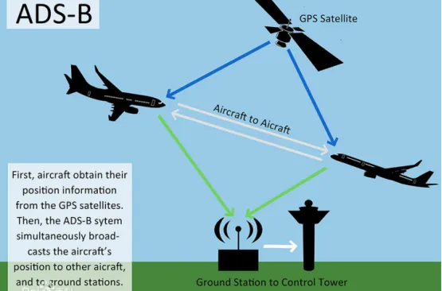  
ADS-B系统是一个集通信与监视于一体的信息系统，由信息源、信息传输通道和信息处理与显示三部分组成。上面我们已经讲了，ADS-B的主要信息有飞机的位置、高度、速度、航向、识别号等信息，而这些信息全部来源于机载设备，如飞机的位置信息从机上GPS设备获得、飞机的高度从机上气压高度表获得；信息传输通道目前运用得较多的有：VDL Mode4（甚高频数据链模式4）、UAT（万能电台数据链）、1090ES（1090MHz S模式扩展电文数据链），我们可以将它们类比为电信、联通、移动；信息通过信息传输通道自动地传到地面接收站或其他飞机，便可为相应用户所用了。  

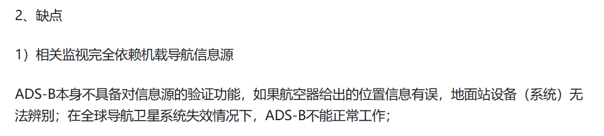
### Intorduction  
Automatic speech recognition and understanding在ATC中可以起到很大的作用，但是，先前的工作都只针对一个机场设计，一个机场收集的数据训练的模型通常不能迁移到另一个机场，通用的ATC ASR的瓶颈之一就是缺乏音频数据的收集和注释。需要至少八个小时的工时来注释一个小时的ATC speech.
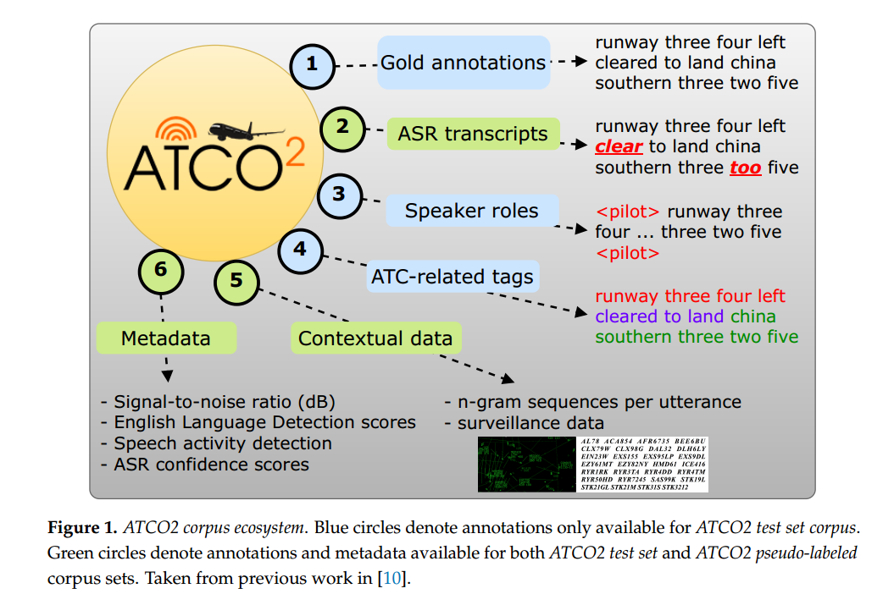  

### Early Work on ATC  
第二节倒数第一段介绍了当前开源数据库以及ATCO2关于数据库的工作。  
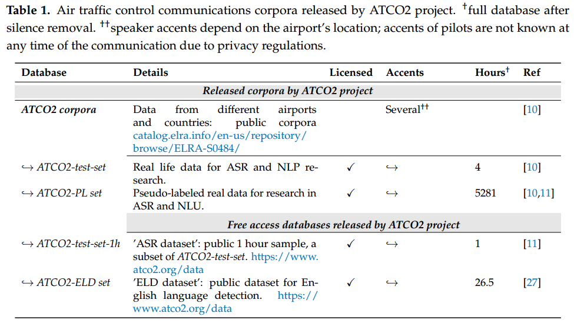

### ATCO2 corpora：  
#### ATCO2语料库旨在通过解决三大挑战来解决这一数据稀缺问题:  
- 当前与空中交通管制相关的语料库主要集中在自动语音识别上。然而，要在控制室中成功部署人工智能引擎，它不仅必须准确转录ATC通信，还必须理解它。这包括***检测发言人角色（SRD）以及提取和解析呼号和命令***的能力。ATCO2语料库为这一挑战提供了全面的解决方案，包括***SRD和呼号的详细标签以及命令提取***。这反过来将提高空管运行中基于人工智能的系统的准确性和效率。
- ***域外ASR和基于NLP的语料库向ATC域的迁移效果不佳***。ATC通信遵循独特的语法结构，并采用国际民航组织定义的特定词汇集，使其成为一种利基应用。这极大地限制了域外语料库的使用。因此，ATCO2项目***收集并公开发布了大量特定于ATC的数据***，以帮助开发ASR和理解ATC引擎。  
- 由于***严重缺乏公开可用的注释数据***，研究ATC的研究社区受到了阻碍。为了解决这个问题，***ATCO2项目发布了超过5000小时的自动注释数据（即ATCO2-PL集）以及4小时的手动注释数据（即ATCO2-test-set-4h）的庞大语料库***。（如上表一）  

#### ATCO2生态系统和概述：  
>OpenSky网络是一个非营利性的社区接收网络，自2013年以来一直在持续收集空中交通监控数据。与其他网络不同，OpenSky保留了完整的未经过滤的原始数据，并向学术和机构研究人员开放。

我们执行了几个文本标准化步骤，以便按照ICAO规则和著名的ATC通信本体统一gold和自动注释。下图描述了注释协议的概要。  
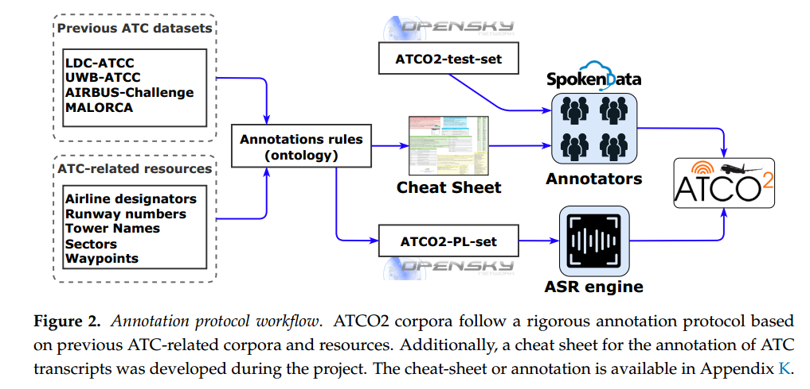  
ATCO2语料库由ATCO2-PL-set语料库和ATCO2-test-set语料库组成。  
- 首先，ATCO2-PL-set语料库是有史以来第一次发布针对ATC通信的大规模数据集。我们记录、预处理并自动转录了来自10个不同机场的5281小时的空管讲话，见表2。据作者所知，这是空管领域有史以来最大、最丰富的数据集，可用于研究和商业用途。更多信息和细节请访问(ATCO2 corpus: A Large-Scale Dataset for Research on Automatic Speech Recognition and Natural Language Understanding of Air Traffic Control Communications.)  
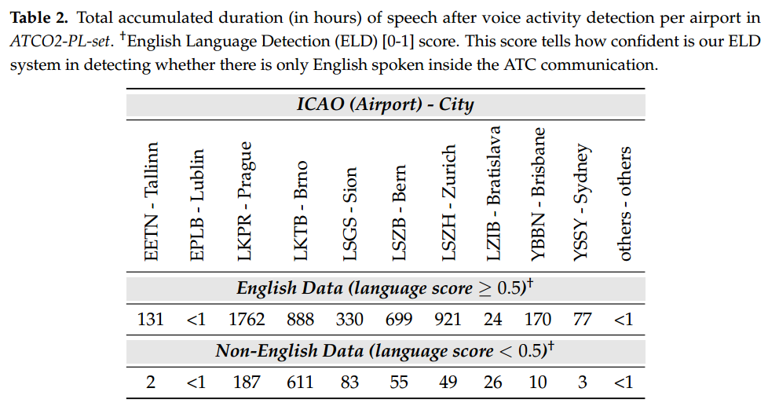  
- 其次，建立了ATCO2-test-set-4h语料库，用于评估和开发英语空管通信的自动语音识别和理解系统。这个数据集是由人类标注的。如表1所示，数据集有两个分区。ATCO2-test-set-1h语料库是一个时长为1小时的开源语料库，可以在https://www.atco2.org/data.免费访问。ATCO2test-set-4h语料库包含ATCO2-test-set-1h语料库，并增加了3小时的人工注释数据。全文可通过ELDA网站购买:http://catalog . elra . info/en-us/repository/browse/ELRA-s 0484  

#### Data Collection Pipeline部分略过  

####  Quality Estimation for Data Annotation
音频质量评估公式：
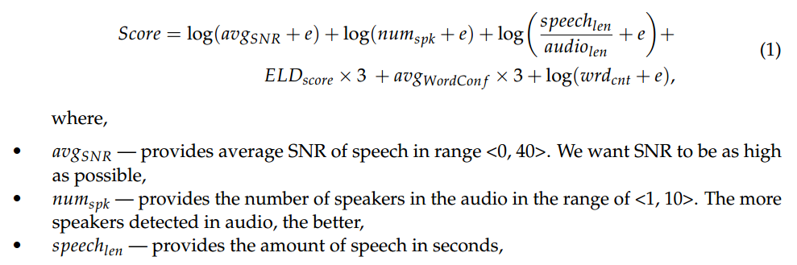  
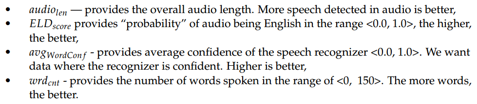  
数据筛选流程：  
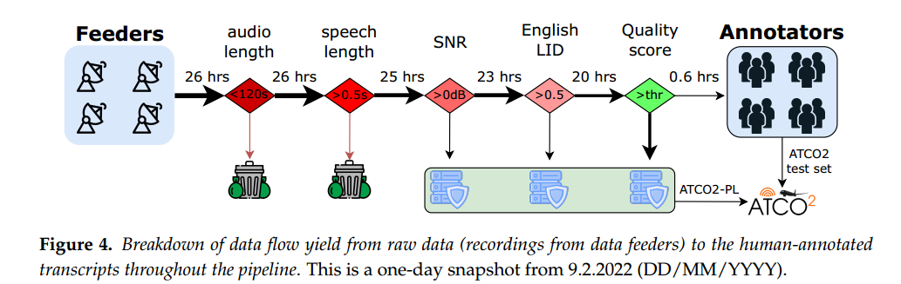

#### 平台和志愿者社区略过  
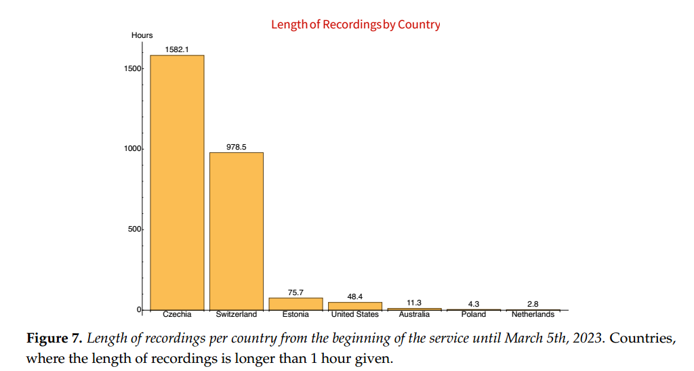  

### Technologies
#### ASR  
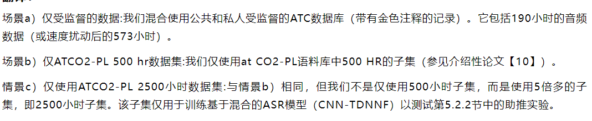  
使用两个ATCO2测试集进行ASR评估，ATCO2-test-set-1h（简称ATCO2-1h）和ATCO2-test-set-4h（简称ATCO2-4h）

使用雷达收集的呼号等上下文信息辅助解码(有点类似于语言模型)，使用n-grams偏置解码总是有助于实现更好的性能，尤其是对呼号而言。

与地面实况(GT)相比，偏向n-grams可用于现实场景和实时ASR:每次从雷达获得新数据时，都会即时生成新的上下文FST(Finite State Transducer)。
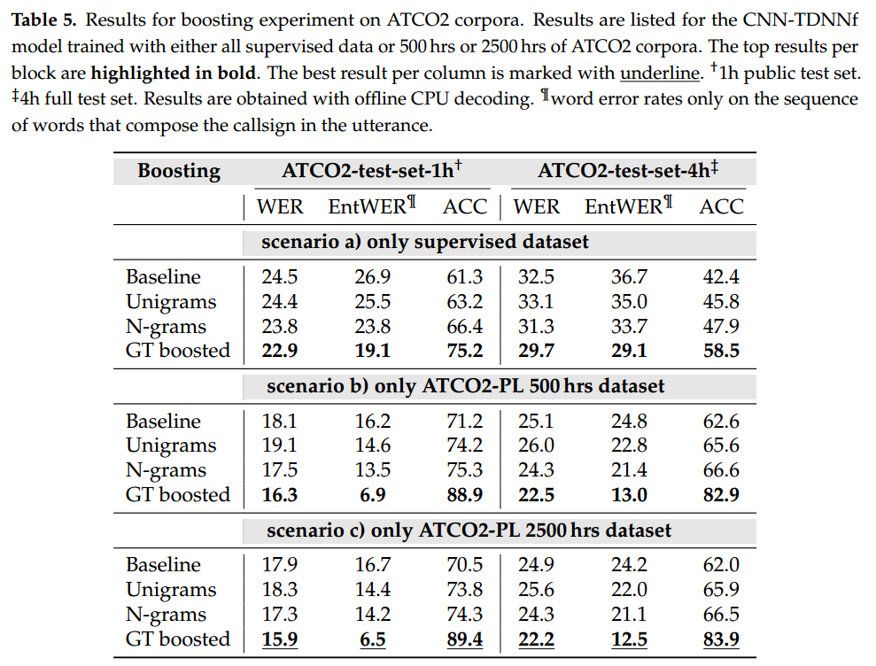

#### nature language understanding
自然语言理解（NLU）是自然语言处理的一个子领域，侧重于理解和解释人类语言的能力。NLU涉及算法和模型的开发，这些算法和模型可以从文本和/或口头交流中提取意义和意图。NLU涉及几个子任务，包括（I）命名实体识别，其目的是识别文本中的实体，例如人、地点和组织。（ii）词性标注（POS），识别句子中每个单词的语法角色，类似于序列分类。（iii）情感分析，识别一段文本的情感基调。(iv)关系提取，识别文本中实体之间的关系。（v）问答、理解和回答自然语言问题。
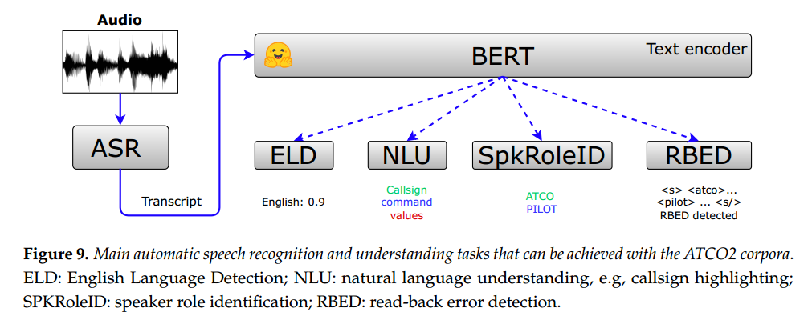  

Named Entity Recognition for Air Traffic Control Communications:  
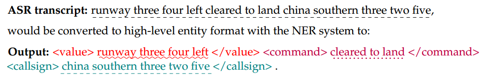
在NER任务中微调了预训练的BERT和RoBERTa模型

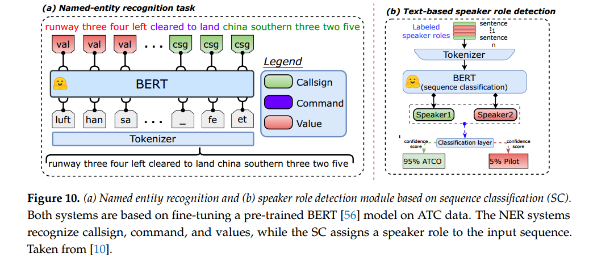

Text-based Speaker Role Detection:  
SRD和说话者二进制化（见第5.3.3节）任务可以利用空管对话遵循定义明确的词汇和字典以及简单语法的事实。国际民航组织（ICAO）定义了这一标准用语，以保证安全并减少空管人员和飞行员之间的沟通失误。  

Text-based Diarization:  
除了仅检测给定ATC通信中的角色（例如SRD）外，还存在多个片段出现在同一记录/通信中的情况。解决这个问题的任务被称为说话人二进制化（SD）。SD回答问题“谁在何时发言？”。在这里，系统接收音频信号或录音（在我们的例子中是文本），并检测说话人的变化或分段以及说话人的角色。SD系统的主要部分是（I）分割，（ii）嵌入提取，（iii）聚类，以及（iv）标记（类似于SRD）。  

Read-Back Error Detection:  

回读错误检测（RBED）是ATCos的一项重要职责，因为未检测到的错误会导致ATM出现危险情况。尽管空中交通管制（ATC）中的通信错误并不常见，但它们仍有可能导致重大安全问题，一些传输包含多个错误。先前的研究表明，每百次到每十六次ATC通信可能包含一次错误。

English Language Detection:  
目前，我们已经开发并部署了一个合适的英语语言检测系统（ELD），以丢弃新收集的数据中的非英语话语。我们用x向量提取器测试了一个最先进的声学系统。我们还想到了使用NLP方法来处理ASR输出的想法，该方法对ELD具有单词置信度。最后，我们的实验表明，基于NLP的ELD在检测精度和计算资源方面都优于声学方法。此外，NLP方法可以联合使用几个ASR系统的输出，这进一步改善了结果。对于处理管道，我们集成了在捷克语和英语ASR上运行的基于NLP的英语检测器。  
我们使用口语数字的语言作为经验法则来决定特定的副驾驶通信话语的语言。录音中的语言必须一致。包括实验结果在内的更详细信息在我们之前的工作中有所介绍【27】。

