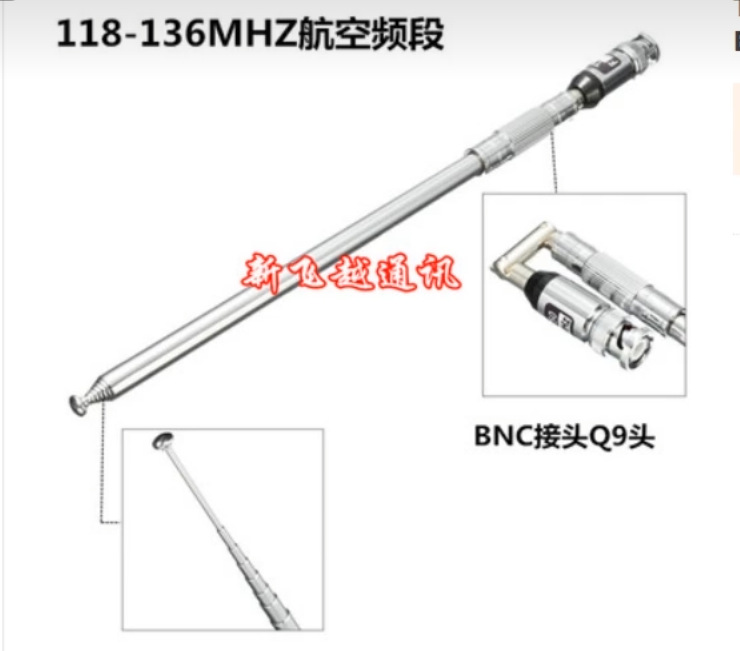
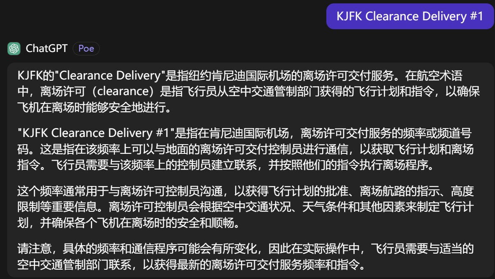

## 如何收听与录制航空波段 
对于爱好者而言，主要是守听117.975-137Mhz民航空管语音通讯，即管制员与飞行员之间的陆空通话。根据国内的现行法律，未禁止公众守听民航空管频率，但禁止擅自发射，爱好者应严格遵守相关法律要求。  

#### 航空波段收音机  
德生PL660(1100元)
50公里地面就比较难接收到了  
问了下淘宝客服，德生暂时没有同时支持航空波段和录音功能的收音机

#### 可接收航空波段的对讲机
欧讯KG-UV9D（Plus）(696元)不支持录音  
八重洲 FT5DR(3280元)支持录音  
  

#### SDR
（软件定义无线电）SDR硬件位于天线和数字信号处理之间，负责把无线电信号数字化，交由主机或者嵌入式系统（FPGA、DSP，MCU）处理。SDR硬件一般包含射频和数字两部分。  
除了航空波段广播，还能接收ADS-B信息，录音方便。  
SDR硬件（RTL2832u）(45元) + 天线和转接头(30元) + 电脑  + 开源软件
  
  

[LiveATC](https://www.liveatc.net/)  
网站，手机平板app，很清晰  
中国机场暂时都搜不到（ZBAA, ZBAD, ZSPD, ZGGG, ZSSS, VMMC）  
例子：JFK（纽约约翰肯尼迪国际机场）RJTT(东京羽田国际机场)  

机场信息，天气代码，ADS-B信息和轨迹图，机场摄像头  
  
  
  
  
  
进近可能更符合一点  

离场  
  
  
  
