# 语音增强
***
## 用于语音增强的CRN（卷积循环网络）
>来自Tan K, Wang D L. A convolutional recurrent neural network for real-time speech enhancement[C]//Interspeech. 2018, 2018: 3229-3233.  

### *预备知识*
### 因果卷积
>参考知乎回答：[因果卷积神经网络 —— 专为时间序列预测而设计的深度学习网络结构](https://zhuanlan.zhihu.com/p/422177151)  
>代码参考博客园：[TCN与因果卷积](https://www.cnblogs.com/PythonLearner/p/12925732.html)

output通过卷积考虑此前时刻的输入
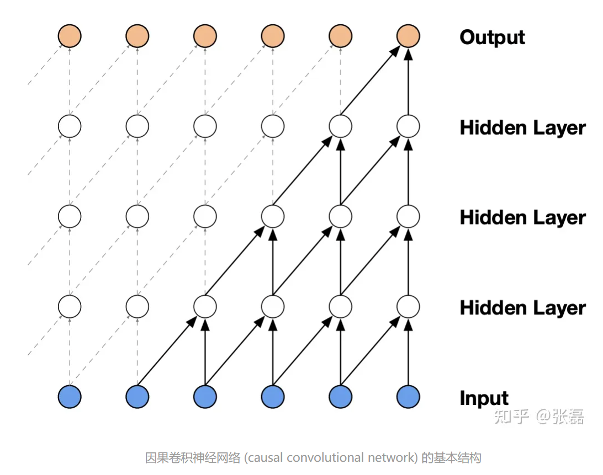
使用扩张卷积扩大感受野
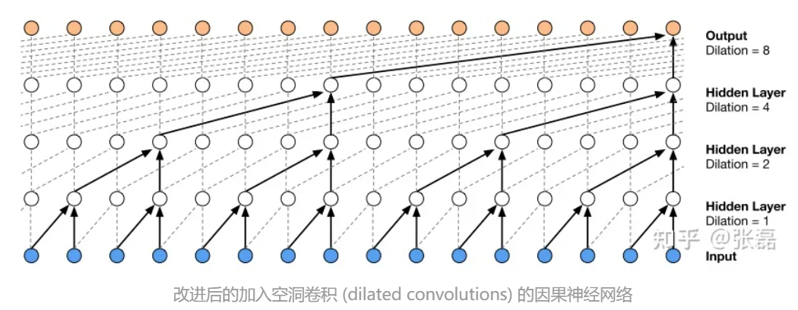
实现代码：D:\Code\KWS\SpeechEnhancement\CausalConvNet

### ELU（指数线性单元,激活函数的一种）
ELU 的提出也解决了ReLU 的问题。与ReLU相比，ELU有负值，这会使激活的平均值接近零。均值激活接近于零可以使学习更快，因为它们使梯度更接近自然梯度。
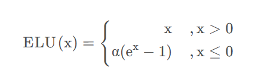  
ELU函数的特点:  
- 没有Dead ReLU问题，输出的平均值接近0，以0为中心。
- ELU 通过减少偏置偏移的影响，使正常梯度更接近于单位自然梯度，从而使均值向零加速学习。
- ELU函数在较小的输入下会饱和至负值，从而减少前向传播的变异和信息。
- ELU函数的计算强度更高。与Leaky ReLU类似，尽管理论上比ReLU要好，但目前在实践中没有充分的证据表明ELU总是比ReLU好。
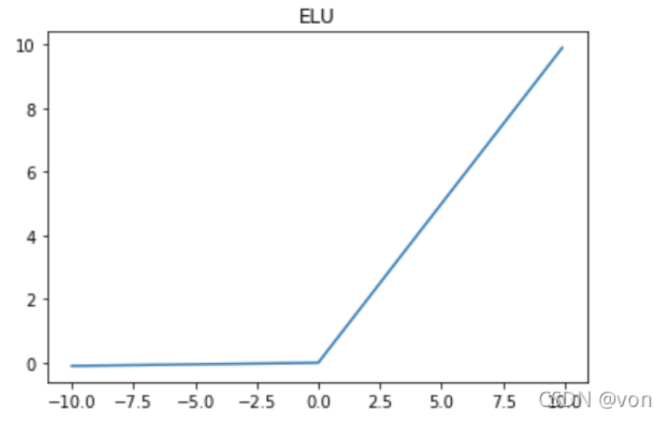
### STFT幅度谱
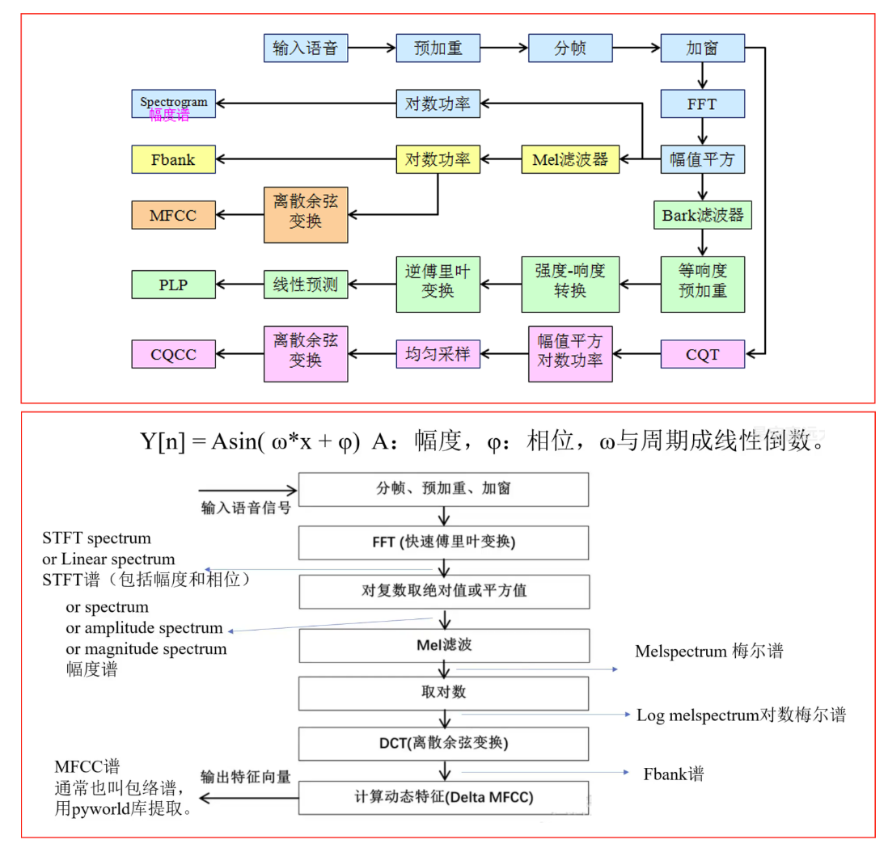

### *Method*
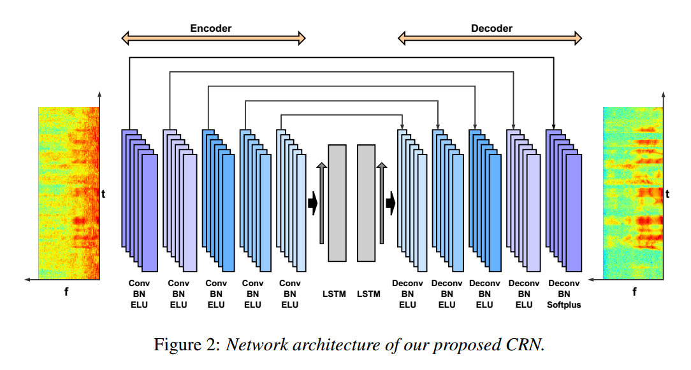  
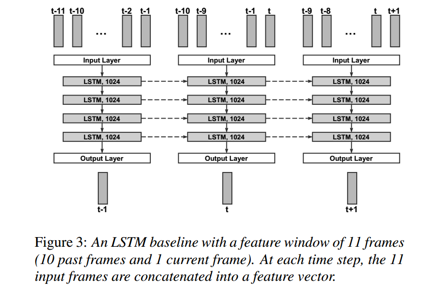  

***
## DCCRN
>内容来自Hu Y, Liu Y, Lv S, et al. DCCRN: Deep complex convolution recurrent network for phase-aware speech enhancement[J]. arXiv preprint arXiv:2008.00264, 2020.

### *预备知识*
### Deep Complex Networks
[深度学习：深度复数网络(Deep Complex Networks)-从论文到pytorch实现](http://t.csdnimg.cn/Nxptq)  
实数网络在图像领域取得极大成功，但在音频中，信号特征大多数是复数，如频谱等。简单分离实部虚部，或者考虑幅度和相位角都丢失了复数原本的关系。论文按照复数计算的定义，设计了深度复数网络，能对复数的输入数据进行卷积、激活、批规范化等操作。在音频信号的处理中，该网络应该有极大的优势。这里对论文提出的几种复数操作进行介绍，并给出简单的pytorch实现方法。  
#### Complex Convolution  
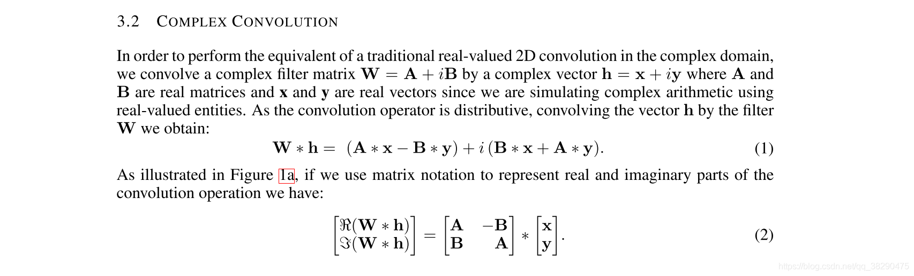  
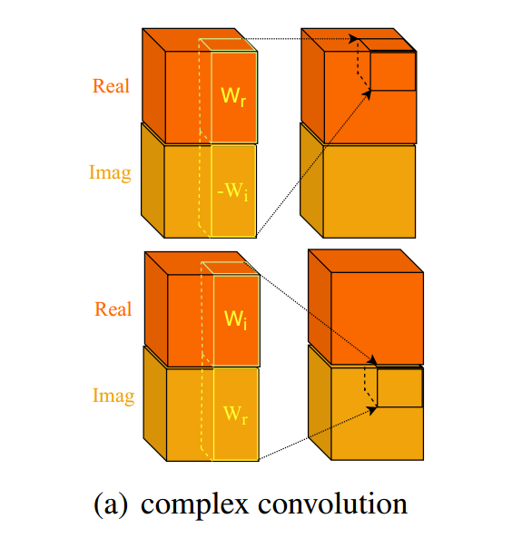  
其实这个一看代码就理解了，没那么复杂。  
~~~python  
class ComplexConv2d(Module):
    
    def __init__(self, input_channels, output_channels,
             kernel_sizes=3, stride=1, padding=0, dilation=0, groups=1, bias=True):
        super(ComplexConv2d, self).__init__()
        self.conv_real = Conv2d(input_channels, output_channels, kernel_size, stride, padding, dilation, groups, bias)
        self.conv_imag = Conv2d(input_channels, output_channels, kernel_size, stride, padding, dilation, groups, bias)
    
    def forward(self, input_real, input_imag):
        assert input_real.shape == input_imag.shape
        return self.conv_real(input_real) - self.conv_imag(input_imag), self.conv_imag(input_real) + self.conv_real(input_imag)

~~~

#### Complex Batch Normalization  
  
   
太数学了，根本看不懂，我选择直接复制粘贴。  
代码链接里有，D:\Code\KWS\SpeechEnhancement\DCCRN\DCCRN\complex_progress.py也有
#### Complex LSTM
同理，代码在D:\Code\KWS\SpeechEnhancement\DCCRN\DCCRN\complex_progress.py

### PReLU  
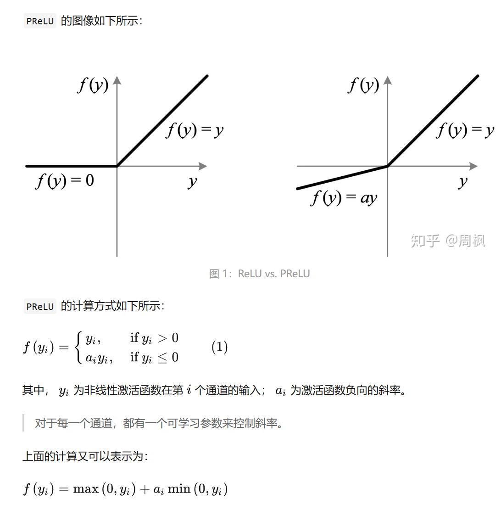

### *Method*  
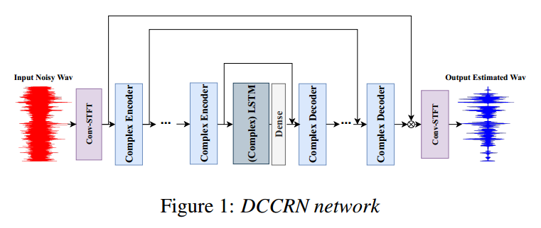

论文中的 Training target这部分，其实就完全没看懂。也不明白target这部分在训练中起什么作用。

### Loss  
这个弄懂啊，最起码看着公式能把代码写出来啊。
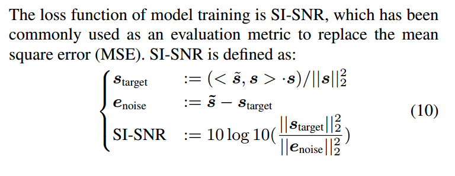  
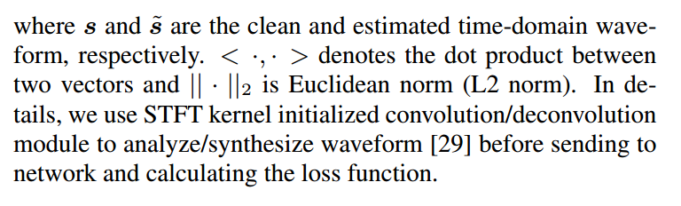
可能还是要结合代码，要不然根本不知道在说啥。

