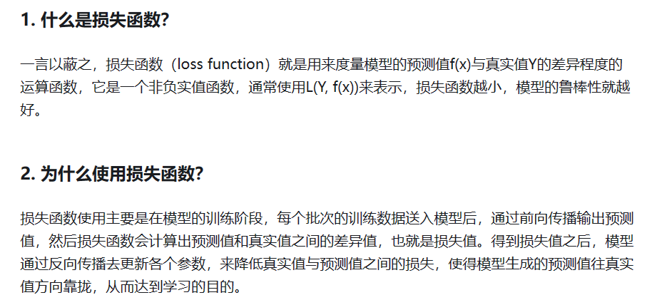
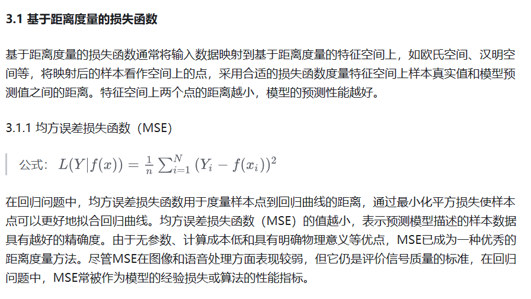
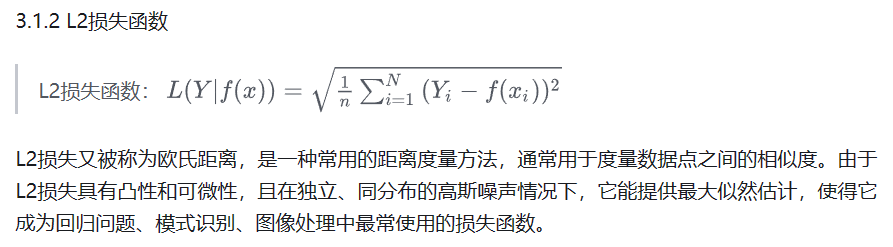
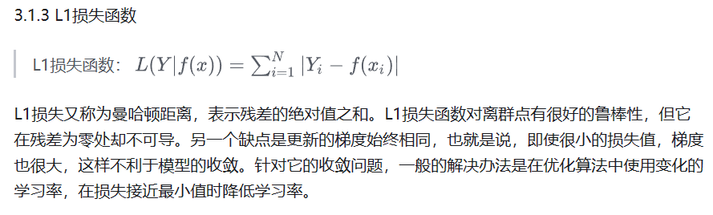
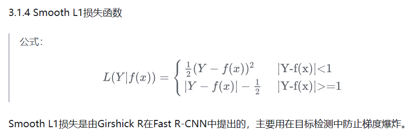
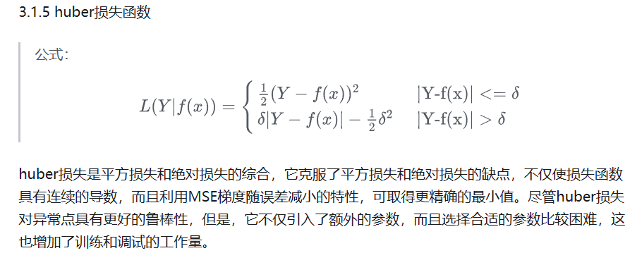
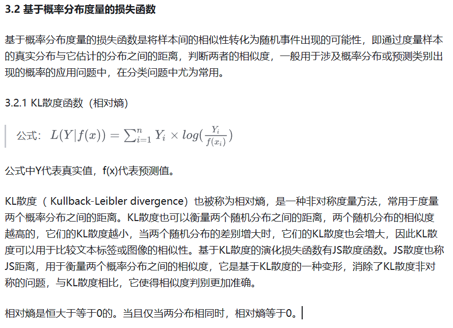
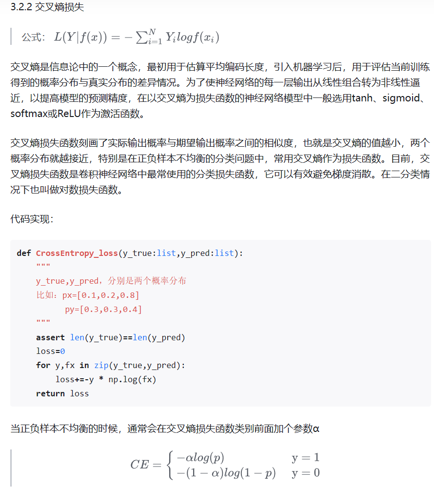
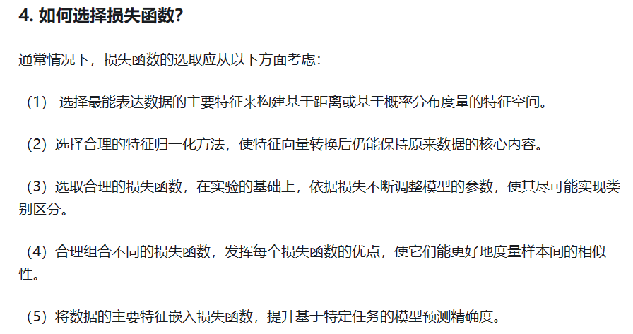

## FBank和MFCC特征代表的意义  
### FBank
在40通道的FBank特征中，每个通道代表了不同频率范围内的声学信息。通常情况下，这些频率范围是根据人类听觉系统对声音的感知特性而选择的。

具体而言，通道的意义可以通过梅尔滤波器组的设计来解释。梅尔滤波器组通常用于将语音信号从线性频率刻度转换为梅尔频率刻度，以更好地模拟人类听觉系统对声音频率的感知。梅尔滤波器组由一系列重叠的三角形滤波器组成，每个滤波器覆盖一定的频率范围。

在40通道的FBank特征中，每个通道对应于一个梅尔滤波器。通常，这些通道在频率上从低到高依次排列，覆盖了语音信号的整个频谱范围。低频通道对应较低的频率范围，而高频通道对应较高的频率范围。不同通道的宽度和形状可能会有所不同，以适应不同频率范围内的声学特性。

### MFCC
"python-speech-features"中的psf.mfcc函数的参数。
- psf.mfcc函数是该库中用于计算MFCC（Mel-Frequency Cepstral Coefficients）特征的函数之一。以下是该函数的常见参数：
- signal：输入的语音信号。通常是一个一维的时间域语音信号数组。
- samplerate：采样率，表示每秒采样的样本数。用于确定时间和频率的比例关系。
- winlen：窗口长度，以秒为单位。在语音信号上采用窗口函数进行分帧时，每个窗口的持续时间。
- winstep：窗口间隔，以秒为单位。在语音信号上采用窗口函数进行分帧时，相邻窗口之间的时间间隔。
- numcep：MFCC系数的数量。这决定了最终提取的MFCC特征的维度。
- nfnfilt：梅尔滤波器的数量。这决定了将语音信号转换到梅尔频率刻度的精度。
- nfft：FFT点数，表示进行快速傅里叶变换时使用的窗口长度。通常将其设置为大于等于窗口长度的最小2的幂。
- lowfreq：梅尔滤波器组的最低频率边界。
- highfreq：梅尔滤波器组的最高频率边界。
- preemph：预加重滤波器的系数。预加重用于增强高频部分，减少低频部分的能量损失。

## Loss Function  
[损失函数（Loss Function）](https://zhuanlan.zhihu.com/p/261059231)  

   
  
  
  
  
  
  
**重要⬇** 
  

## Pareto Optimality  
帕累托最优（Pareto Optimality），也称为帕累托效率（Pareto efficiency），是指资源分配的一种理想状态，假定固有的一群人和可分配的资源，从一种分配状态到另一种状态的变化中，在没有使任何人境况变坏的前提下，使得至少一个人变得更好，这就是帕累托改进或帕累托最优化。帕累托最优状态就是不可能再有更多的帕累托改进的余地；换句话说，帕累托改进是达到帕累托最优的路径和方法。 帕累托最优是公平与效率的“理想王国”。是由帕累托提出的。

## 进一步的研究表明，在空间分辨率发生变化的地方添加归一化层有助于稳定训练。

## 度量学习  
### Contrastive Loss
### triplet loss  
### Circle Loss 

### AUROC（Area Under the Receiver Operating Characteristic Curve） 
是一种常用的用于衡量二分类模型性能的评估指标。

在理解 AUROC 之前，我们先介绍一下 ROC 曲线。ROC 曲线是一种以真阳性率（True Positive Rate，TPR）为纵轴，假阳性率（False Positive Rate，FPR）为横轴的曲线。在二分类模型中，我们可以通过调整分类阈值来获得不同的 TPR 和 FPR 值，进而绘制出 ROC 曲线。ROC 曲线描述了在不同分类阈值下，模型的敏感性和特异性之间的权衡关系。

AUROC 是 ROC 曲线下方的面积，取值范围在 0 到 1 之间。AUROC 值越大，表示模型具有更好的分类能力。具体解释如下：

当 AUROC = 1 时，表示模型完美分类，能够将所有真实正例排在所有真实负例之前。
当 AUROC = 0.5 时，表示模型的分类能力等同于随机猜测，无法区分正例和负例。
当 AUROC < 0.5 时，表示模型分类能力比随机猜测还差，甚至完全相反。
AUROC 的优点在于它对于分类阈值的选择不敏感，能够综合考虑模型在不同阈值下的性能，并且对于不平衡数据集也具有较好的稳定性。它常用于评估医学诊断、机器学习分类模型等领域中的性能。

